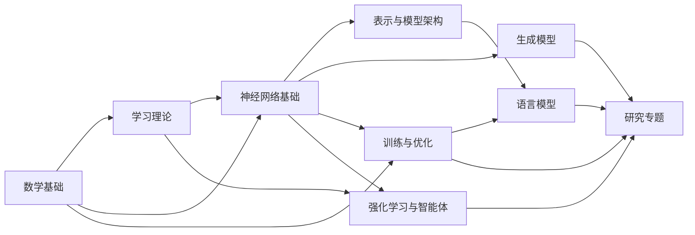
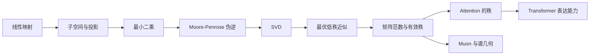
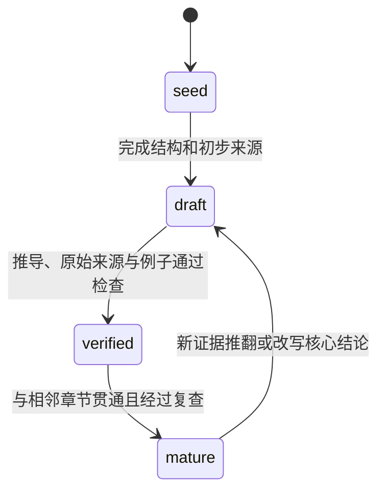

# AI 基础理论与模型知识库

> [!abstract] 定位
> 这是一个“研究型知识库”：最终节点必须能说明概念是什么、为什么成立、何时不成立、如何计算，以及它在模型中解决了什么问题。

## 全局知识地图

## 章节入口

| 章节 | 核心问题 | 入口 |
|---|---|---|
| 10 数学基础 | 模型推导所依赖的数学对象与计算工具是什么？ | [[数学基础 MOC]] · [[数学基础完整课程地图与掌握标准]] |
| 20 学习理论 | 从数据学习究竟意味着什么？ | [[学习理论 MOC]] |
| 30 神经网络基础 | 深层网络如何表达、传播和更新信息？ | [[神经网络基础 MOC]] |
| 40 表示与模型架构 | 不同架构如何组织计算和归纳偏置？ | [[表示与模型架构 MOC]] |
| 50 生成模型 | 如何学习并采样数据分布？ | [[生成模型 MOC]] |
| 60 训练与优化 | 为什么模型能被稳定、高效地训练？ | [[训练与优化 MOC]] |
| 70 语言模型 | 语言建模如何扩展为现代 LLM？ | [[语言模型 MOC]] |
| 80 强化学习与智能体 | 模型如何在环境中决策、学习和规划？ | [[强化学习与智能体 MOC]] |
| 90 研究专题 | 如何跨章节追踪一个研究问题？ | [[研究专题 MOC]] |

## 第一条主线：低秩到 Attention

选择这条主线，是因为它同时连接线性代数、数值计算、Attention、模型压缩和新型优化器，可以最快检验整套工作范式。

## 工作入口

- 所有课程、节点和实验首先遵守[[00-课程教学与研究总纲]]；它定义教材级严谨性、初学者教学、数值计算与 AI 前沿连接的最高标准。
- 旧节点按[[全库教学重写审计与迁移台账]]逐批迁移；台账区分源码正确、内容覆盖、教学顺序和真实掌握，当前从数学基础 10.1 开始。
- 数学基础按[[数学基础完整课程地图与掌握标准]]的十卷、150 节主干推进；新增专题不能绕过范围和完成度审计。
- 开始选题前先查[[02-科学空间 AI 知识范围审计]]，判断它属于 AI 核心、必要前置还是应当排除。
- 新发现的文章或问题先进入[[00-知识库管理/_inbox/收件箱说明|收件箱]]。
- 正式研读按[[01-研读与成稿工作流]]推进。
- 写作时从[[00-知识库管理/_templates/模板索引|模板索引]]选择节点类型。
- 准备提升状态前执行[[05-质量门槛与检查清单]]。
- 博客、论文、教材统一登记到[[00-知识库管理/_sources/来源索引|来源索引]]。
- 系统学习线性—矩阵—数值主线时按[[线性代数完整学习路线与掌握标准]]推进，并用[[练习与测验 MOC]]检查是否能独立计算、证明和迁移。

## 节点状态

