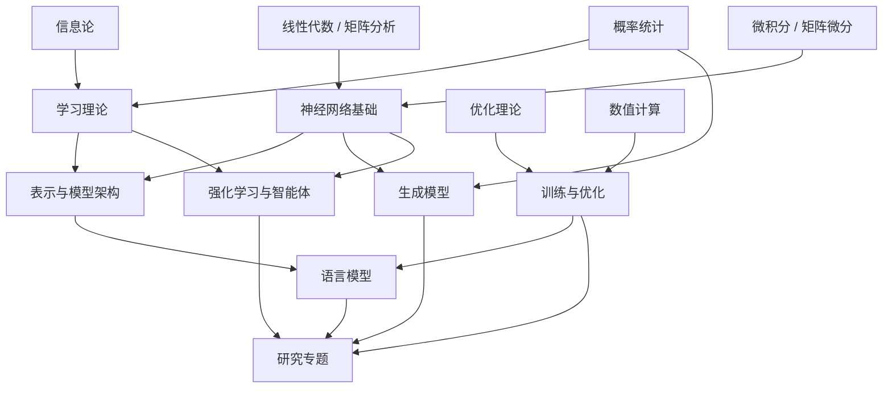

# 知识库范围与章节

> [!note] 两种范围
> 本文件定义的是“完整 AI 理论知识库”的章节范围，不等于科学空间的官方分类，也不受博客覆盖强弱限制。科学空间的 AI 主题、覆盖强项/缺口及纳入规则见[[02-科学空间 AI 知识范围审计]]。

## 一、总体范围

本知识库覆盖“理解现代人工智能模型所需的核心理论、典型模型、训练方法与研究问题”。重点是可迁移的原理，不以产品使用、框架 API、新闻追踪或模型榜单为主体。

纳入内容需要至少满足一项：

1. 是多个 AI 模型共同依赖的基础概念；
2. 能解释一种模型结构或训练方法为何有效；
3. 能揭示常见方法的限制、边界或失败机制；
4. 是科学空间长期讨论、且能连接到原论文或教材的研究主线；
5. 能通过推导、反例或实验形成可复查的知识。

不纳入的内容：与 AI 无关的站内文章、单纯的工具教程、Prompt 合集、未经验证的行业观点、短期排行榜、只描述接口而不解释原理的框架笔记。若以后能明确服务于一个 AI 理论问题，再作为新的候选来源重新判断。

科学空间来源按 `core / bridge / excluded` 三层处理。只有 `core` 和被核心节点实际调用的 `bridge` 进入知识库；`excluded` 不建来源笔记，也不保留在来源索引。

## 二、九个章节域

### 第 10 章：数学基础

目标：建立能独立阅读模型论文、检查推导和设计数值实验的数学语言。

- 10.1 [[数学语言、逻辑与证明 MOC|数学语言、逻辑与证明]]：集合、量词、证明、不等式、极限与渐近记号
- 10.2 线性代数：空间、映射、子空间、投影、谱分解、SVD、伪逆与张量接口
- 10.3 矩阵分析：范数、正定性、低秩、扰动、矩阵函数、非正规性与伪谱
- 10.4 多元微积分、矩阵微分与自动微分：局部线性化、Jacobian、Hessian、隐式微分与 AD
- 10.5 概率论与数理统计：条件概率、随机变量、极限定理、估计、采样与 Bayesian 推断
- 10.6 信息论与统计学习接口：熵、KL、互信息、编码、变分推断与信息瓶颈
- 10.7 优化与凸分析：凸性、对偶、一阶/二阶/随机方法、约束、近端与非凸优化
- 10.8 数值计算与数值线性代数：浮点误差、稳定性、矩阵分解、迭代法、Krylov 与随机算法
- 10.9 ODE、动力系统与 SDE：稳定性、数值求解、连续性方程、Fokker–Planck 与扩散反演
- 10.10 几何、泛函分析、核与算子基础：流形、对称性、Hilbert 空间、RKHS 与神经算子接口

十卷固定为 150 个核心节点；完整清单、先修关系、掌握标准与阶段测验见[[数学基础完整课程地图与掌握标准]]。

边界：本章只展开会在后续 AI 节点中被实际调用的数学；更一般的纯数学内容作为扩展链接外延，不计入核心节点，也不无限扩张。

### 第 20 章：学习理论

目标：解释“从有限数据学习规律”的统计含义和限制。

- 20.1 [[学习问题、决策与风险 MOC|学习问题、决策与风险]]：data law、sample、hypothesis、algorithm、loss、risk 与 evaluation
- 20.2 [[PAC 学习与有限假设类 MOC|PAC 学习与有限假设类]]：concentration、PAC、finite class、Occam、No-Free-Lunch 与下界
- 20.3 [[VC 维与一致收敛 MOC|VC 维与一致收敛]]：shattering、growth、Sauer–Shelah、fundamental theorem 与多类/实值推广
- 20.4 [[数据依赖复杂度、间隔与快率 MOC|数据依赖复杂度、间隔与快率]]：symmetrization、Rademacher、margin、covering 与 localization
- 20.5 [[稳定性、压缩、PAC-Bayes 与信息泛化 MOC|稳定性、压缩、PAC-Bayes 与信息泛化]]：algorithm/posterior/information-dependent guarantees
- 20.6 [[经典模型与模型选择 MOC|经典模型与模型选择]]：回归、分类、核、树、ensemble、PCA、聚类、EM 与 misspecification
- 20.7 [[表示学习、度量学习与自监督 MOC|表示学习、度量学习与自监督]]：contrastive、augmentation、collapse、masked prediction 与 transfer evaluation
- 20.8 [[校准、不确定性与分布偏移 MOC|校准、不确定性与分布偏移]]：proper scoring、conformal、shift、domain adaptation 与因果边界
- 20.9 [[在线学习、Boosting 与序列预测 MOC|在线学习、Boosting 与序列预测]]：regret、experts、OCO、perceptron、boosting 与 online-to-batch
- 20.10 [[深度泛化理论接口与开放边界 MOC|深度泛化理论接口与开放边界]]：interpolation、benign overfitting、implicit bias、norm bound、NTK 与 feature learning

十卷固定为 84 个核心节点；完整 ID、先修、边界、视觉和验收标准见[[学习理论完整课程地图与掌握标准]]。经典统计学习理论是主干，但不被扩大成现代深网泛化的唯一解释。

### 第 30 章：神经网络基础

目标：从计算图和动力学角度理解深层网络的基本部件。

- 30.1 感知机、线性层、MLP 与万能逼近
- 30.2 计算图、链式法则、反向传播与自动微分
- 30.3 激活函数及其梯度、平滑性和尺度性质
- 30.4 参数初始化与信号传播
- 30.5 Normalization：BatchNorm、LayerNorm、RMSNorm 等
- 30.6 残差连接、深度、梯度流与稳定性
- 30.7 Embedding、权重共享和输出参数化
- 30.8 Dropout、随机深度及其他网络级正则化

八卷固定为 64 个核心节点；完整 ID、先修、推导、视觉与验收标准见[[神经网络基础完整课程地图与掌握标准]]。本章负责跨架构复用的网络部件；CNN、RNN、GNN、Attention 等专属结构进入第 40 章，优化器和大规模训练系统进入第 60 章。

### 第 40 章：表示与模型架构

目标：比较不同计算结构的归纳偏置、表达能力和复杂度。

- 40.1 卷积、平移等变性与 CNN
- 40.2 循环网络、状态空间、LSTM/GRU
- 40.3 图神经网络与消息传递
- 40.4 Attention 的定义、几何、概率和核视角
- 40.5 Multi-Head Attention 与 Transformer Block
- 40.6 位置编码：绝对、相对、Sinusoidal、RoPE、ALiBi
- 40.7 稀疏、线性和状态空间 Attention
- 40.8 Encoder、Decoder、Encoder–Decoder 与掩码
- 40.9 MoE、路由、容量与负载均衡
- 40.10 模型宽度、深度、参数共享和架构扩展

### 第 50 章：生成模型

目标：统一理解生成模型的概率对象、训练目标、估计器、采样程序、数值误差、条件控制和评价证据。

固定范围：**9 卷、72 个核心节点（`GEN-01`—`GEN-72`）**；详见[[生成模型完整课程地图与掌握标准]]与[[科学空间 - 第五章生成模型专题来源地图]]。

- 50.1 生成建模对象、似然与自回归
- 50.2 自编码器、隐变量模型与 VAE
- 50.3 GAN、分布差异与对抗训练
- 50.4 能量模型、Score Matching 与 Langevin Dynamics
- 50.5 Normalizing Flow 与可逆密度变换
- 50.6 DDPM、DDIM 与离散时间扩散
- 50.7 SDE、概率流 ODE 与 Flow Matching
- 50.8 离散扩散、潜空间与多模态生成
- 50.9 采样器、条件控制、加速与评估

### 第 60 章：训练与优化

目标：解释训练目标、梯度估计、优化器状态、参数几何、尺度控制和数值系统之间的关系。

固定范围：**9 卷、72 个核心节点（`TRN-01`—`TRN-72`）**；详见[[训练与优化完整课程地图与掌握标准]]与[[科学空间 - 第六章训练与优化专题来源地图]]。

- 60.1 SGD、Momentum 与随机优化噪声
- 60.2 AdaGrad、RMSProp、Adam 与 AdamW
- 60.3 曲率、自然梯度与矩阵预条件
- 60.4 矩阵参数优化、谱最速下降与 Muon
- 60.5 学习率、Warmup、调度、梯度裁剪和权重衰减
- 60.6 参数化、μP 与尺度迁移
- 60.7 Scaling Law 与资源最优分配
- 60.8 低精度、量化与分布式训练
- 60.9 训练诊断、消融实验和因果归因

### 第 70 章：语言模型

目标：从概率语言建模走到现代 LLM 的结构、训练和推理理论。

- 70.1 语言建模、条件概率与困惑度
- 70.2 Tokenization、词表、Embedding 与输出层
- 70.3 N-gram、RNN LM、Masked LM 与 Causal LM
- 70.4 Decoder-only 架构与自回归生成
- 70.5 预训练数据、目标函数与数据混合
- 70.6 上下文学习、Prompting 与涌现现象
- 70.7 长上下文、位置外推、KV Cache 与推理复杂度
- 70.8 监督微调、参数高效微调与模型合并
- 70.9 检索增强、工具调用与记忆的基本机制
- 70.10 解码、采样、推测解码和推理时计算
- 70.11 评估、幻觉、校准和安全边界

### 第 80 章：强化学习与智能体

目标：理解序列决策、交互学习和基于偏好的对齐。

- 80.1 多臂老虎机、探索与利用
- 80.2 MDP、Bellman 方程和动态规划
- 80.3 Monte Carlo、Temporal Difference 与价值学习
- 80.4 Policy Gradient、Actor–Critic 与 PPO
- 80.5 Model-based RL、搜索与规划
- 80.6 模仿学习、逆强化学习和离线强化学习
- 80.7 偏好模型、奖励模型、RLHF 与直接偏好优化
- 80.8 Agent 的状态、记忆、工具、规划和反馈闭环
- 80.9 多智能体、博弈和协作

### 第 90 章：研究专题

目标：把跨越多个章节的问题组织成可持续更新的研究路线。

- 90.1 低秩近似、有效秩与模型表达能力
- 90.2 Attention 的秩、稀疏性和线性化
- 90.3 位置编码与长度外推
- 90.4 Normalization、Residual 与深度稳定性
- 90.5 Muon、矩阵流形与谱几何
- 90.6 模型扩展、参数迁移和函数保持
- 90.7 扩散模型统一视角
- 90.8 Scaling Law 与最优资源分配
- 90.9 MoE、条件计算和路由几何
- 90.10 研究中的反例、负结果和开放问题

## 三、章节依赖关系

依赖表示“学习时最好先掌握”，不是目录从属关系。一篇节点可以同时属于多个 MOC，但只保存一份正文。

## 四、三条建议学习路径

### 路径 A：基础到 Transformer

线性代数 → 矩阵微分 → 反向传播 → 初始化/归一化/残差 → Attention → Transformer → 位置编码 → Decoder-only → LLM。

### 路径 B：概率到生成模型

概率分布 → 最大似然 → KL/熵 → 隐变量与变分推断 → VAE/GAN/能量模型 → DDPM → Score/SDE/ODE/Flow Matching。

### 路径 C：优化到大模型训练

凸优化 → SGD/Momentum → Adam/AdamW → 矩阵范数 → Muon → 参数化与 μP → Scaling Law → 混合精度与训练稳定性。

第一阶段执行路径 A 中的“线性代数—低秩—Attention”子路径。
