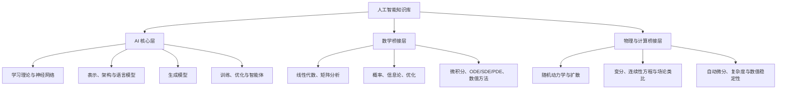
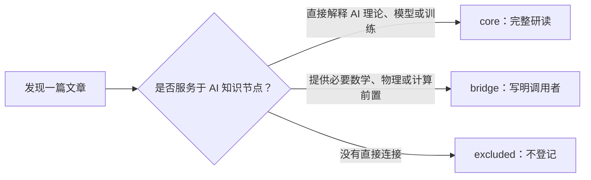

# 科学空间 AI 知识范围审计

> [!summary] 最终边界
> 本库只整理人工智能，以及理解人工智能节点时确实会被调用的数学、物理和计算前置。科学空间中的天文观测、摄影、生活记录、一般生物科普、科学新闻和无关资源不登记、不建来源笔记，也不进入知识图谱。

## 一、“范围完整”的准确含义

| 层级 | 要回答的问题 | 当前状态 |
|---|---|---|
| AI 知识域完整 | 现代 AI 需要覆盖哪些理论、模型与训练问题？ | 已建立九章结构 |
| 站内 AI 主题完整 | 科学空间有哪些与 AI 直接或间接相关的长期主题？ | 已建立第一版闭包 |
| 核心系列完整 | 每个重点系列的文章顺序、依赖和勘误是否齐全？ | 待逐系列登记 |
| 文章级完整 | 每篇 AI 相关文章是否均已登记和研读？ | 长期增量任务 |

科学空间从 2009 年持续更新，作者归档已有百余页且仍在增长。因此这里承诺的是“AI 知识域不漏大类、站内主要 AI 系列不漏主线”，不提前声称已经读完所有文章。来源发现依据[作者文章页](https://spaces.ac.cn/author/1/)、[全站归档](https://spaces.ac.cn/content.html)、标签、系列前后文和 RSS；正式结论仍回到原文、原论文或教材核验。

## 二、只保留三层知识

### 2.1 AI 核心层

满足以下任一条件即可纳入：

1. 定义学习问题、损失、泛化、推断或决策；
2. 解释神经网络部件或模型架构；
3. 解释表示学习、NLP、Transformer、语言模型或生成模型；
4. 解释训练算法、参数尺度、稳定性或计算效率；
5. 能形成可验证的 AI 研究问题、反例或实验。

### 2.2 数学桥接层

数学内容只有在至少被一个 AI 核心节点直接调用时才展开：

- 线性映射、子空间、投影、最小二乘、伪逆；
- 特征分解、SVD、矩阵范数、谱、低秩与有效秩；
- 微积分、矩阵微分、Jacobian、Hessian、自动微分；
- 概率、统计、信息论、随机过程与采样；
- 凸优化、约束优化、流形优化和数值稳定性；
- ODE、SDE、PDE、连续性方程与 Fokker–Planck 方程。

纯代数、几何、数论或一般微分方程不因“数学上有趣”而进入本库。只有当它们解释 Muon、Attention、扩散模型等具体 AI 问题时才建立桥接节点。

### 2.3 物理与计算桥接层

只保留能够直接解释 AI 机制的部分：

- 扩散、Langevin Dynamics、随机动力系统；
- 最小作用量、变分法和梯度流；
- 连续性方程、Fokker–Planck 方程、Score 与概率流 ODE；
- 场论或引力对生成模型的构造性启发；
- 数值迭代、矩阵分解、浮点误差、训练复杂度和实现稳定性。

例如[生成扩散模型漫谈（十三）](https://spaces.ac.cn/archives/9305)把概率、ODE、SDE、PDE 与引力场连接到生成模型，因此属于 `bridge`；脱离 AI 问题的天体力学或理论物理文章则直接排除。

## 三、科学空间的 AI 来源入口

官网分类并不是本库目录，只作为发现来源时的过滤入口：

| 站内入口 | 纳入部分 | 排除部分 |
|---|---|---|
| 信息时代 Big-Data | 机器学习、NLP、深度学习、Transformer、生成模型、优化 | 一般网站建设、无关互联网资讯、纯 API 教程 |
| 数学研究 Mathematics | 被 AI 调用的线性代数、概率、优化、微分方程与数值方法 | 与 AI 无连接的纯数学问题 |
| 物理化学 Phy-chem | 扩散、随机动力学、变分、场论式生成模型 | 一般物理、化学和人物纪念 |
| 问题百科 Questions | AI、数学前置、论文和实现勘误 | 与目标无关的问答 |
| 资源共享 Resources | AI 教材、论文、代码和必要数学教材 | 无关书籍、图片、视频与软件下载 |

其他官方分类不进入本库。发现来源时先判断内容，不因文章被归入“数学研究”或“信息时代”就自动收录。

## 四、需要覆盖的 AI 知识范围

### 4.1 数学与统计基础

- 数学语言、证明、渐近分析；
- 线性代数、矩阵分析、低秩与张量基础；
- 微积分、矩阵微分和自动微分；
- 概率统计、随机过程、信息论；
- 优化理论、数值计算和连续动力系统。

### 4.2 学习理论与经典机器学习

- 风险最小化、最大似然、贝叶斯决策；
- 泛化、容量、稳定性、正则化和分布偏移；
- 线性模型、核方法、树、聚类、PCA、EM；
- 监督、无监督、自监督、半监督和对比学习。

### 4.3 神经网络基础

- 计算图、反向传播、激活和初始化；
- 信号传播、归一化、残差与深度稳定性；
- Embedding、参数共享、正则化与表达能力。

### 4.4 表示与模型架构

- CNN、RNN、状态空间模型和 GNN；
- Attention 的几何、概率、核和低秩视角；
- Transformer、位置编码、RoPE、线性/稀疏 Attention；
- Encoder/Decoder、MoE、路由和条件计算。

### 4.5 生成模型

- 自回归、VAE、GAN、能量模型和 Normalizing Flow；
- Score Matching、Langevin Dynamics、DDPM；
- SDE/ODE、概率流、Flow Matching；
- 离散扩散、条件控制、Guidance、采样和评估。

### 4.6 训练与优化

- SGD、Momentum、Adam/AdamW 和学习率调度；
- 二阶方法、预条件、矩阵参数优化、Muon；
- 初始化尺度、更新尺度、μP 和 Scaling Law；
- 正则化、梯度惩罚、混合精度、量化与分布式稳定性。

### 4.7 语言模型

- Tokenization、Embedding 和语言建模目标；
- BERT、GPT、T5、MLM 与 Causal LM；
- Decoder-only、长上下文、位置外推与 KV Cache；
- 微调、检索增强、解码、推理时计算、评估与幻觉。

### 4.8 强化学习与智能体

- MDP、Bellman 方程、价值学习和策略优化；
- Model-based RL、搜索、规划和离线学习；
- 偏好优化、RLHF/DPO、奖励模型；
- 智能体的状态、记忆、工具、反馈和多智能体协作。

### 4.9 跨章节研究专题

- 低秩、有效秩与 Attention 表达能力；
- 位置编码与长度外推；
- Normalization、Residual 与深度稳定性；
- Muon、矩阵流形与谱几何；
- 扩散模型统一视角；
- 参数化、模型扩展、Scaling Law 与 MoE。

## 五、科学空间覆盖强弱

| AI 领域 | 站内覆盖 | 本库策略 | 章节 |
|---|---|---|---|
| 线性代数、矩阵分析、低秩 | 很强 | 以博客提出问题，以教材补定理体系 | 10、90 |
| 概率、随机过程、ODE/SDE/PDE | 强 | 与生成模型联合组织 | 10、50 |
| 优化、Muon、μP、模型尺度 | 很强且活跃 | 重点追踪原论文、假设和实验 | 10、60、90 |
| 传统统计学习理论 | 中等 | 以教材为主 | 20 |
| 神经网络基础部件 | 强但分散 | 按部件和训练动力学重新合成 | 30 |
| NLP 任务与表示学习 | 很强 | 保留方法演化，旧代码标记时效 | 20、40、70 |
| Attention、Transformer、位置编码 | 很强 | 核心研究主线 | 40、70、90 |
| BERT/GPT/T5 与语言模型 | 很强 | 与原论文交叉核验 | 70 |
| VAE/GAN/Flow/扩散 | 很强，扩散尤深 | 建立概率—动力系统统一视角 | 50、90 |
| 鲁棒性、谱约束、梯度惩罚 | 中强 | 与泛化、优化双向链接 | 20、60 |
| 蒸馏、低秩、MoE 与高效模型 | 中强 | 按机制整理 | 40、60、90 |
| 视觉与多模态 | 中等、选择性 | 用系统教材补全 | 40、50 |
| 工程实现与训练系统 | 中等且年代敏感 | 原理入库，旧 API 不成主节点 | 60、70 |
| 强化学习与智能体 | 弱 | 用教材和经典论文独立补全 | 80 |
| 因果、GNN、语音、机器人 | 弱或零散 | 站外补全 | 20、40、80 |

代表性强项包括[低秩近似之路（一）](https://spaces.ac.cn/archives/10366)、[矩阵的有效秩](https://spaces.ac.cn/archives/10847)、[Decoder-only 架构分析](https://spaces.ac.cn/archives/9529)和[生成扩散模型漫谈（一）](https://spaces.ac.cn/archives/9119)。本库目标是 AI 范围完整，因此站内薄弱项不能被删除。

## 六、来源纳入判定

| `scope_role` | 判定 | 产物 |
|---|---|---|
| `core` | 直接属于 AI 理论、模型、训练、推断或评估 | 来源笔记 + 独立知识节点 + 原始来源 |
| `bridge` | 是某个核心节点不可缺少的数学、物理或计算前置 | 桥接概念/推导，并链接调用它的核心节点 |
| `excluded` | 与 AI 主干没有直接、可说明的关系 | 不创建来源笔记，不进入索引 |

硬规则：`bridge` 必须至少被一个 `core` 节点调用；连续两层都没有 AI 消费者的前置分支停止展开。

## 七、主要系列到章节的落点

| 站内主题/系列族 | 主要落点 | 辅助落点 |
|---|---|---|
| 低秩近似、矩阵有效秩 | 10 数学基础 | 40、60、90 |
| 词向量、CRF、文本分类/匹配/抽取 | 20 学习理论、70 语言模型 | 30、40 |
| Attention、Transformer 升级之路、RoPE | 40 表示与模型架构 | 10、70、90 |
| BERT、GPT、T5、bert4keras | 70 语言模型 | 30、40、60 |
| VAE、GAN、Flow、生成扩散模型漫谈 | 50 生成模型 | 10、90 |
| SGD/Adam、梯度惩罚、学习率与 Batch Size | 60 训练与优化 | 20、30 |
| Muon、最速下降、流形优化 | 60 训练与优化 | 10、90 |
| 模型放大、μP、Scaling Law | 60 训练与优化 | 30、40、90 |
| MoE、条件计算 | 40 表示与模型架构 | 60、70、90 |
| 随机动力学、连续性方程、场论启发 | 10 数学桥接 | 50、90 |

## 八、时效标签

只对已纳入的 AI 来源记录年代角色：

- `foundational`：定义、证明或方法仍是基础；
- `historical`：用于解释 AI 方法演化；
- `active-research`：仍在快速发展，需要复查；
- `implementation-aged`：原理仍有价值，但代码或 API 已经过时。

## 九、下一步范围工作

1. 建立核心与桥接系列登记表，记录 URL、序号、前后文、年份、章节和状态；
2. 优先登记低秩近似、Transformer/RoPE、生成扩散模型、Muon/μP；
3. NLP 历史文章按任务和方法登记，不按旧框架版本扩张；
4. 为强化学习、智能体、因果、GNN 等站内薄弱项建立站外补全清单；
5. 非 AI 内容在收件阶段直接标记 `excluded` 并移出知识库。

