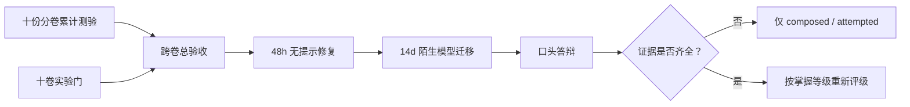

# 数学基础十卷完备性审计与学习状态总表

> [!abstract] 结论先行
> 截至 2026-08-28，固定主干的 **150 个 ID、150 篇唯一正文、150 份 A—E 习题、150 份独立解答、10 份分卷累计测验与 10 份测验详解均存在**。十卷现在都有专门的累计计算门，且十份分卷门都已把答案/输出隔离、scorer nonce、盲参数、48 小时换机制、14 天迁移与独立回归落实为材料 `regression-passed`；个人均为 `not-attempted`。十卷跨章总验收、独立详解与三轨计算门也已存在，但总出口仍是 `composed / not-attempted`。这里的“完备”只指课程 artifact 与验收工具完备，不能写成“已掌握”。

## 一、什么叫完备

本审计把容易混淆的六种完备性分开：

| 层 | 当前判据 | 当前结论 |
|---|---|---|
| 范围完备 | 十卷边界、ID、先修和 AI 接口明确 | 通过：150 个固定核心 ID |
| 正文完备 | 每个 ID 恰有一篇可定位正文 | 通过：150/150，无重名正文 |
| 教学闭环完备 | 正文有习题、独立解答与分卷入口 | 通过：150/150 习题与解答 |
| 验收工具完备 | 每卷有闭卷题、详解和计算门；另有跨卷总验收 | 通过：10+1 套验收链 |
| 学习证据完备 | 有真实原稿、评分、干预、重做和迁移 | **未通过：没有可审计学习记录** |
| 数学知识绝对完备 | 覆盖全部与 AI 有关的数学 | 不作此声明；150 节点是基础课程，不是数学全集 |

因此，“文件齐了”和“学习者达到了不错的理论水平”之间还隔着真实学习、闭卷重建、错题修复、计算复现与陌生问题迁移。

## 二、权威范围与机械核对结果

### 2.1 唯一权威清单

节点范围以[[数学基础完整课程地图与掌握标准]]第三节的 150 行 ID—标题表为唯一权威清单，而不是用文件夹数量或 MOC 中出现 ID 的次数推断。原因是：

- 一个 MOC 会调用其他卷节点，简单正则会重复计数；
- 部分 MOC 使用 `LA-01—24` 这种范围记法，而不是逐项重复 ID；
- 四篇正文的课程归属与物理文件夹暂不一致，但正文仍唯一；
- `定理 - 有限维谱定理`、`定理 - Eckart–Young–Mirsky` 的正文有 `定理 -` 前缀，配套习题/解答采用短标题。

规范化审计规则：ID 必须原样匹配；正文标题原样匹配；匹配习题/解答时允许只移除开头的 `定理 - `，不做其他模糊匹配。

### 2.2 核对数字

| 前缀 | 预期 | 权威表 ID | 唯一正文 | 习题 | 解答 |
|---|---:|---:|---:|---:|---:|
| MATH | 8 | 8 | 8 | 8 | 8 |
| LA | 24 | 24 | 24 | 24 | 24 |
| MA | 16 | 16 | 16 | 16 | 16 |
| CALC | 16 | 16 | 16 | 16 | 16 |
| PROB | 20 | 20 | 20 | 20 | 20 |
| INFO | 10 | 10 | 10 | 10 | 10 |
| OPT | 16 | 16 | 16 | 16 | 16 |
| NUM | 20 | 20 | 20 | 20 | 20 |
| DYN | 12 | 12 | 12 | 12 | 12 |
| GEO | 8 | 8 | 8 | 8 | 8 |
| **合计** | **150** | **150** | **150** | **150** | **150** |

2026-08-20 的机械核对结果：150 行、150 个 unique ID、150 个 unique title；正文缺失 0、重复正文 0。未做标题规范化时会误报上述两个定理节点的习题/解答缺失；规范化后缺失为 0。

## 三、十卷验收链总表

| 卷 | 卷级 ID | 题卷 / 详解 | 计算复现门 | artifact 状态 | 学习状态 |
|---|---|---|---|---|---|
| 10.1 | MATH-CUM-01 | [[阶段测验 - 数学语言、逻辑与证明（10.1）]] / [[阶段测验解答 - 数学语言、逻辑与证明（10.1）]] | [[实验 - 数学语言、逻辑与证明累计复现门]] / [[math_foundations_cumulative_contract_audit.py]] | regression-passed | not-attempted |
| 10.2 | LA-CUM-01 | [[阶段测验 - 线性代数（10.2）]] / [[阶段测验解答 - 线性代数（10.2）]] | [[实验 - 线性代数累计复现门]] | regression-passed | not-attempted |
| 10.3 | MA-CUM-01 | [[阶段测验 - 矩阵分析（10.3）]] / [[阶段测验解答 - 矩阵分析（10.3）]] | [[实验 - 矩阵分析累计复现门]] | regression-passed | not-attempted |
| 10.4 | CALC-CUM-01 | [[阶段测验 - 多元微积分、矩阵微分与自动微分（10.4）]] / [[阶段测验解答 - 多元微积分、矩阵微分与自动微分（10.4）]] | [[实验 - 微积分、矩阵微分与自动微分累计复现门]] / [[calculus_ad_cumulative_contract_audit.py]] | regression-passed | not-attempted |
| 10.5 | PROB-CUM-01 | [[阶段测验 - 概率论与数理统计（10.5）]] / [[阶段测验解答 - 概率论与数理统计（10.5）]] | [[实验 - 概率统计累计复现门]] / [[probability_cumulative_contract_audit.py]] | regression-passed | not-attempted |
| 10.6 | INFO-CUM-01 | [[阶段测验 - 信息论与统计学习接口（10.6）]] / [[阶段测验解答 - 信息论与统计学习接口（10.6）]] | [[实验 - 信息论累计复现门]] / [[information_cumulative_contract_audit.py]] | regression-passed | not-attempted |
| 10.7 | OPT-CUM-01 | [[阶段测验 - 优化与凸分析（10.7）]] / [[阶段测验解答 - 优化与凸分析（10.7）]] | [[实验 - 优化与凸分析累计复现门]] / [[optimization_cumulative_contract_audit.py]] | regression-passed | not-attempted |
| 10.8 | NLA-CUM-01 | [[阶段测验 - 数值计算与数值线性代数（10.8）]] / [[阶段测验解答 - 数值计算与数值线性代数（10.8）]] | [[实验 - 数值线性代数累计复现门]] / [[numerical_cumulative_contract_audit.py]] | regression-passed | not-attempted |
| 10.9 | DYN-CUM-01 | [[阶段测验 - ODE、动力系统与 SDE（10.9）]] / [[阶段测验解答 - ODE、动力系统与 SDE（10.9）]] | [[实验 - ODE、动力系统与 SDE 累计复现门]] / [[dynamics_cumulative_contract_audit.py]] | regression-passed | not-attempted |
| 10.10 | GEO-CUM-01 | [[阶段测验 - 几何、泛函分析、核与算子基础（10.10）]] / [[阶段测验解答 - 几何、泛函分析、核与算子基础（10.10）]] | [[实验 - 几何、泛函与算子累计复现门]] / [[geometry_functional_cumulative_contract_audit.py]] | regression-passed | not-attempted |
| 十卷总出口 | MATH-FND-CAP-01 | [[数学基础十卷总验收 - 跨卷理论与 AI 迁移]] / [[数学基础十卷总验收解答 - 跨卷理论与 AI 迁移]] | [[实验 - 数学基础十卷跨章累计复现门]] | composed | not-attempted |

### 3.1 10.8 如何从旧组合门升级为独立累计门

早期 NLA-CUM-01 从三个节点实验中随机抽取一项，只能局部检查 error/condition/stopping、reduction/accumulation 或 mixed-precision solve。现在[[实验 - 数值线性代数累计复现门]]已经成为独立卷级入口，并按 scorer nonce 指定以下一条深入轨，不由学习者自选：

1. A 轨：有限精度—前后向误差—条件放大—task-aware stopping；
2. B 轨：结构识别—CG/GMRES—非正规暂态—预条件；
3. C 轨：稀疏字节账—随机值域—截断误差—独立证书。

三轨共享五波解析校准，但正式证据必须另含 `attempt_id`、答案/输出隔离、两项手算、盲参数预测、新 output/SVG/hash、订正、48 小时换机制和 14 天陌生 AI 迁移。[[numerical_cumulative_contract_audit.py]]再独立复算三轨锚点，检查题—解与 100 分、canonical 双跑、固定盲参 hash 和六个状态入口。因此旧的三个节点实验可以保留为练习，但不再承担卷级状态入口。

## 四、跨卷总验收补了什么

十份分卷测验能回答“每一卷内部是否闭合”，却不能单独回答：

- 面对陌生模型，学习者能否自己判断该用哪一种数学语言；
- 同一个结论里 theorem、approximation、algorithm、floating computation 和 empirical result 是否被错误混合；
- linear/probability/information 与 optimization/dynamics/numerics 能否在一条推导里连续工作；
- finite kernel/mesh 证据是否被越界写成 infinite-dimensional operator theorem；
- AI 报告是否具有可失败的对象合同、证明合同和实验合同。

因此增加 `MATH-FND-CAP-01`：两个 180 分钟 session、100 分、A—E 分区、三条主证明不得为零、三个 AI 系统案例逐题设底线，并附计算门和口头答辩。它只考跨卷“接缝”，不替代 150 个节点的纵向分卷验收。



## 五、学习状态：为什么仍是 0 卷完成

当前仓库能证明的是**课程建设状态**，不能证明用户已经作答。每卷必须有以下真实证据，才可从 `not-attempted` 前进：

| 证据 | 必须保留什么 |
|---|---|
| 首次闭卷 | 原始答卷、开始/结束时间、未修改扫描或文本 |
| 独立评分 | 逐区得分、首个错误、缺失条件和评分者 |
| 计算复现 | 命令、environment、stdout、artifact/hash、手算 |
| 参数干预 | 运行前预测、冲突结果、新 artifact，不覆盖旧结果 |
| 48 小时重做 | 空白无提示重建，不能照抄旧答案 |
| 14 天迁移 | 换矩阵、分布、模型或 geometry 的同结构问题 |
| 口头解释 | 随机定理条件、反例和实验边界 |

状态语义：

```text
composed     = 教学与验收材料已建立
not-attempted= 没有真实作答证据
attempted    = 有冻结原稿但尚未全部达线
passed       = 当前闭卷与实验门达线
retained     = 间隔重做和迁移仍达线
verified     = 节点层证据、卷级证据与保留期证据共同成立
```

本审计生成、题卷成稿或脚本 hash 一致，都不会自动提升学习状态。

## 六、工程问题与处理决定

### 6.1 已修正或本轮应同步修正

1. 旧总图写“下一施工点为 10.2 累计验收”，已过时；应改为十卷总验收与真实学习证据；
2. 旧“6.4 五次阶段测验”是早期阶段规划，现有体系已经细化为十份分卷验收加一份总验收；
3. 10.8 的总入口必须指向独立[[实验 - 数值线性代数累计复现门]]与[[numerical_cumulative_contract_audit.py]]，旧三项实验只作节点练习；
4. 总入口应直接提供本审计、总验收与总实验门入口。

### 6.2 暂不移动的正文

以下是课程归属与物理文件夹不一致，不是内容重复：

- [[Schur 分解]]、[[矩阵函数与矩阵指数]]物理上在 10.2，课程归属为 10.3；
- [[奇异值分解]]、[[Moore-Penrose 伪逆]]物理上在 10.3，课程归属为 10.2。

在没有统一链接迁移器和回归检查前不移动，避免破坏已有双链。权威 ID 表负责课程归属，物理路径只负责存储。

### 6.3 图文一致性

新总实验图沿用当前累计卷的浅灰—靛蓝—绿色视觉语言、三面板 card、直接标注与“读图—边界”结构。图片只有在同时满足以下条件时才算教学 artifact：

- 图回答一个明确问题，而不是装饰；
- 正文给出公式、读图与不可推出的结论；
- 有代码入口、环境、确定参数、SVG/XML 检查和 hash；
- 颜色之外仍有文字/位置区分；
- 图中的 exact、discrete 与 empirical 曲线不会共用含糊图例。

## 七、这 150 节点是不是“所有 AI 数学”

不是。它们构成从零开始进入现代 AI 理论的**基础层**：读对象、重建推导、做可靠计算、识别边界并迁移到模型。完成并真正通过后，学习者应能进入论文阅读和专题课程；但要达到前沿理论研究水平，还需在下一层展开至少以下专题：

| 后续专题层 | 依赖本课程 | 为什么不塞回 150 节点 |
|---|---|---|
| 统计学习理论 | 概率、信息、优化、函数空间 | VC/Rademacher/PAC-Bayes、稳定性和 online learning 是独立课程主线 |
| 高维概率与随机矩阵 | 概率、矩阵分析、浓缩 | sub-Gaussian process、matrix concentration、universality 需要更强统一框架 |
| 逼近理论与深网表达 | 泛函、Sobolev、几何 | width/depth/rate/lower bound 应围绕函数类单独组织 |
| 现代训练动力学 | 优化、动力系统、随机过程 | mean-field、NTK、feature learning、scaling law 仍是活跃研究层 |
| 最优传输与生成理论 | 概率、信息、PDE、几何 | Wasserstein geometry、Schrödinger bridge 与 flow/diffusion 可形成专卷 |
| 因果、决策与博弈 | 概率、优化、图与动力系统 | identification、intervention、bandit/RL/game 需要新对象而非零散附录 |
| 图、离散与组合方法 | 逻辑、线代、概率 | 图谱、随机图、submodularity、离散优化尚未作为本基础卷主线展开 |

这些是**基础完成后的上层课程**，不是本轮正文漏写。若全部塞入数学基础，会破坏初学者的先修梯度和固定 150 节点的课程合同。

## 八、推荐的真实学习顺序

不建议先读完 150 篇再统一做题。按依赖分四段推进：

1. 10.1 → 10.2；完成两卷题、实验与第一次闭卷；
2. 10.3 + 10.4 → 10.8；重点连接 matrix sensitivity、derivative 与 finite precision；
3. 10.5 → 10.6，同时学习 10.7；重点连接 uncertainty、information 与 algorithm；
4. 10.9 → 10.10；再参加十卷跨章总验收。

每段都执行：正文主动回忆 → A—E 习题 → 随机实验门 → 分卷闭卷 → 错题路由 → 48 小时重做 → 14 天迁移。总验收只在十卷分卷门全部通过后用于认证。

## 九、下一次审计触发条件

发生以下任一情况必须重跑本表：

- 新增、删除或重编号核心 ID；
- 移动四篇跨文件夹正文；
- 修改累计测验 scope、通过线或实验门；
- 任何节点从 `draft` 升级为 `verified`；
- 增加后续专题并试图计入 150 节点；
- 图或脚本 hash 改变且结论发生实质变化。

下一轮审计不能只报文件数，还必须检查 wiki links、YAML、LaTeX delimiter、SVG XML、脚本 determinism 与学习证据是否真实存在。
