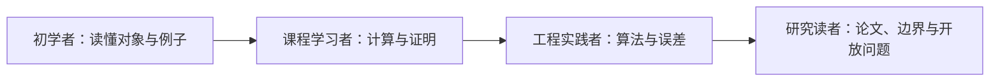

# 课程教学与研究总纲

> [!abstract] 最高定位
> 本知识库不是博客摘录集、公式手册或论文摘要库，而是一套面向现代 AI 的研究型课程与教材。它以顶尖大学核心课程的知识组织、证明标准和训练强度为基线，同时保持零基础读者可以逐级进入，并把经典理论、可靠计算和前沿 AI 问题连成一条可复查的学习路线。

## 一、课程使命

最终成果必须同时完成四件事：

1. **教会对象**：读者知道概念是什么、对象属于什么空间、符号和量词怎样读；
2. **教会理由**：读者能重建主要推导，指出假设在哪一步使用；
3. **教会计算**：读者能手算最小例子，并能区分数学公式、数值算法和浮点实现；
4. **教会迁移**：读者能在真实 AI 问题中识别同一结构，说明适用条件、收益、代价和失败模式。

课程的目标读者不是固定在一个水平，而是一条成长路径：

高水平不等于省略步骤。真正的难度应来自理论本身，而不是未定义符号、隐含前提、跳步和术语堆砌。

## 二、四层教学视角

每个核心基础节点必须贯通以下四层；允许篇幅不同，但不能只剩其中一层。

| 层次 | 必须回答的问题 | 合格产物 |
|---|---|---|
| 直觉与问题 | 为什么需要它？最小情形发生了什么？ | 普通语言、手算特例、必要图示 |
| 严谨理论 | 精确定义、量词、假设与结论是什么？ | 定理、逐步证明、等价条件、反例 |
| 数值计算 | 公式怎样可靠地算？误差和成本是什么？ | 算法比较、复杂度、条件数、残差/误差 |
| AI 与研究 | 它在模型中实际作用于什么对象？ | 张量形状、调用链、失败模式、前沿问题 |

四层必须互相映射。直觉要指出它对应定义中的哪个对象；AI 应用要明确调用了哪条数学结论；实验要说明支持或反驳哪个断言。

## 三、教材级章节骨架

一个完整核心节点优先按照以下认知顺序组织：

1. 学习目标与一句话结论；
2. 前置知识检查和必要桥接复习；
3. 一个可以手算的具体问题；
4. 问题背景和概念动机；
5. 正式定义、符号、维度和量词；
6. 直觉、几何或概率图景；
7. 定理、等价刻画和证明路线；
8. 逐步推导，并注明每一步依据；
9. 完整手算例子与结果检查；
10. 计算算法、复杂度、条件性和稳定性；
11. 反例、退化情形和常见误用；
12. AI 中的对象、形状、调用机制和失败模式；
13. 前沿延伸、已知限制与开放问题；
14. A–E 练习、独立解答、实验和来源。

节点可以把大型证明或实验拆到独立文件，但主节点必须保留问题、路线、关键结论和回链，不能让正文变成只有链接的目录。

## 四、数学严谨性契约

### 4.1 对象先于公式

首次使用一个公式时，必须说明：

- 标量、向量、矩阵、张量、函数或随机变量分别是什么；
- 它们所在的集合、向量空间或概率空间；
- 维度、定义域和值域；
- 实数、复数、离散或连续等约定；
- 等式是逐点、矩阵、分布、近似还是渐近意义。

### 4.2 证明先声明条件

- 定理必须把假设与结论分开写；
- 关键等号必须能指出定义、恒等式或定理依据；
- 使用上界或近似时必须说明方向、误差项和有效范围；
- 必须指出移除关键假设后证明在哪一步断裂；
- 一般结论至少检查标量、二维、单位阵、零值、秩亏或极限中的适用子集。

### 4.3 完备不等于百科

课程完备指认知依赖闭合：读者不需要靠猜测跨过主线所需的知识断点。与 AI 主线无实际联系、只增加术语数量的旁支可以不纳入；被省略的内容必须说明省略理由和适用边界。

### 4.4 公式必须成为一段论证

核心公式不能以“展示—结论”的两段式出现。第一次学习该公式时，正文必须依次交代：

1. **目的**：这条公式正在回答哪个具体问题；
2. **对象**：每个符号的类型、维度、索引范围与随机性；
3. **来路**：从哪条定义、假设或上一式出发；
4. **步骤**：每个关键等号、不等号或近似分别使用什么依据；
5. **读法**：公式整体在普通语言中表达什么关系；
6. **检查**：至少进行维度、符号、归一化、极限或最小数值中的两项检查；
7. **去路**：它将在后续算法、模型或研究判断中怎样被调用。

如果从一行到下一行同时发生求导、代入、换序、近似或归一化中的两个以上操作，必须拆成中间式。长推导允许单独成页，但主节点仍须保留完整路线和关键桥步。

### 4.5 逻辑脉络与过渡合同

每个核心节点都必须让读者回答“我为什么在这里学习它”。开头明确上一节点留下的问题、本页中心问题和下一节点将怎样使用答案；正文每个一级小节只推进一个主要认知台阶，并用过渡句说明上一节的结论为何不足、下一节为何必要。

章节 MOC 不只列主题，还应形成问题链；节点不只给结论，还应形成论证链。材料齐全、链接完整或公式数量充足都不能代替这两条链。

## 五、计算与实验契约

数学存在性不能代替可靠实现。涉及计算的节点至少区分：

1. **问题条件性**：真解对输入扰动有多敏感；
2. **算法稳定性**：计算结果是否等于邻近问题的精确答案；
3. **有限精度**：舍入、消去、溢出、低精度和容差怎样影响结果；
4. **资源成本**：时间、内存、稀疏性、并行性和矩阵—向量乘积；
5. **验证指标**：残差、前向误差、后向误差、正交性、条件数或统计不确定性。

实验必须可复现，并允许出现与预期不一致的结果。图表不得只展示漂亮趋势；要标明变量、单位、尺度、基线和结论边界。

## 六、AI 应用契约

“与 AI 相关”不能只在结尾列举名词。每个重要连接至少说明：

- **对象映射**：数学对象对应权重、激活、梯度、协方差、概率分布还是状态；
- **形状映射**：给出关键张量形状和运算方向；
- **调用位置**：发生在模型结构、损失、优化、训练、推理还是分析阶段；
- **获得什么**：表达力、稳定性、计算效率、统计解释或理论保证；
- **需要什么条件**：满秩、正定、独立、光滑、凸、谱间隙或分布假设；
- **怎样失败**：病态、退化、估计噪声、近似偏差、规模不可承受或理论外推。

AI 应用段落必须能回指正文中的定义或定理；若只是类比，应明确标记为直觉，不得写成数学等价。

## 七、前沿研究的证据分层

前沿内容必须标明知识地位：

| 地位 | 判断依据 | 写作方式 |
|---|---|---|
| 经典定理 | 正式教材或同行评审原始来源，条件明确 | 可作为课程结论，给出证明或准确引用 |
| 已建立方法 | 多来源和实验支持，适用范围较清楚 | 说明算法、基线、误差和限制 |
| 经验规律 | 特定模型、数据或规模上的观察 | 保留实验设置，不升级为普遍规律 |
| 解释或假说 | 有启发性但证据不足 | 使用 hypothesis/intuition 标记和可证伪表述 |
| 开放问题 | 当前没有充分答案 | 记录已知结果、缺口和可能验证路线 |

新近、流行或来自知名作者都不是提高证据等级的理由。博客用于发现问题和获得解释视角；教材确定课程骨架；原论文承担原创断言；独立推导、反例和复现实验负责校验。

## 八、初学者教学契约

- 不假设读者会自动补齐“显然”的中间步骤；
- 新抽象对象先给最小具体例子，再给一般定义；
- 一个公式中若同时引入多个新操作，应拆开；
- 同一个符号不能在相邻节点中无说明改变含义；
- 直觉必须服务于正式结论，不能用类比替代证明；
- 当断点属于独立概念时建立桥接节点，而不是在正文无限插入旁支；
- 手算例子必须从输入计算到结果，并做代回、维度或极端情况检查。

## 九、训练与掌握契约

阅读完成不等于掌握。每个核心基础节点最终必须有：

1. A 类：定义、对象、形状和条件识别；
2. B 类：可手算到底的最小题；
3. C 类：推导、证明或关键步骤补全；
4. D 类：反例、条件删除、算法失败或纠错；
5. E 类：带形状、假设和选择理由的 AI 迁移题；
6. 与题目分离的完整解答；
7. 间隔重做和阶段测验回链。

能顺着解答复述不算独立掌握；状态升级必须依据可观察的计算、证明、判断和迁移能力。

## 十、视觉表达原则

图文并茂不是每页强行放图，而是在视觉能显著降低理解成本时使用最合适的形式：

- 空间、投影、谱和优化几何使用示意图或可复现曲线；
- 依赖、算法和模型调用使用 Mermaid；
- 多个严格映射或算法差异使用表格；
- 数值现象必须由脚本生成图，并保留代码和环境；
- 图必须在正文中被解释，标明它验证的公式与不可外推范围。

## 十一、单节点交付标准

一次核心节点交付默认包含：

- 主理论节点；
- A–E 习题；
- 独立完整解答；
- 至少一个有意义的手算或可复现实验；
- MOC、前置与后继回链；
- 教材/原始来源及证据等级；
- 结构、公式、链接、代码和视觉校验记录。

若某项暂缺，节点保持 `seed` 或 `draft`，并明确记录缺口，不能用篇幅或引用数量代替完成度。

## 十二、禁止的低质量模式

- 按网页顺序改写，缺少自己的知识结构；
- 只有定义和结论，没有动机、证明、例子或边界；
- 只有直觉故事，无法对应正式对象；
- 公式大量跳步，并用“显然”掩盖知识断点；
- 把数学恒等式直接当作稳定算法；
- AI 应用只罗列模型名，不给形状、调用位置和条件；
- 把单次实验、单篇论文或作者猜测写成普遍规律；
- 用漂亮图片替代解释，或用长篇文字替代必要图示；
- 习题只能机械套公式，不能检验证明、边界和迁移。

## 十三、总体验收问题

一个章节在宣称“完成”前，必须能肯定回答：

1. 零基础读者能否沿前置链接进入，而不依赖隐含教材？
2. 认真学习者能否独立计算、证明和构造反例？
3. 实践者能否选择算法并解释误差、复杂度和失败模式？
4. 研究读者能否追溯原始证据，区分定理、经验与开放问题？
5. AI 连接是否具体到对象、形状、调用位置和适用条件？
6. 章节是否通过练习、实验和阶段测验形成真实掌握闭环？

任何一个答案是否定的，章节都仍有明确缺口。
