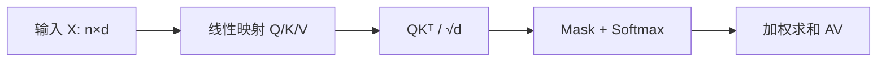

# 图示与资产规范

## 一、目标

“图文并茂”意味着视觉承担认知任务，而不是在笔记间插入装饰图片。一个图应该至少帮助完成以下一项：

- 展示结构或依赖；
- 展示信息流或时间过程；
- 对比多个定义、模型或复杂度；
- 让高维概念获得二维直觉；
- 暴露边界、反例或数值趋势；
- 标注张量形状和运算位置。

## 二、视觉选择

| 问题 | 首选视觉 |
|---|---|
| 概念之间如何依赖 | Mermaid flowchart |
| 算法如何逐步执行 | 流程图或时序图 |
| 模型由哪些模块构成 | 架构图，并标张量形状 |
| 多个定义如何对应 | 对比表或集合关系图 |
| 一个量随参数如何变化 | 可复现折线图/散点图 |
| 几何概念是什么 | 自绘 SVG、坐标图或小矩阵示意 |
| 训练状态如何变化 | 状态图、曲线和诊断面板 |
| 公式从哪里来 | 推导依赖图 + 分步公式 |

## 三、成熟节点的视觉目标

- `concept`：至少一个结构图、几何图、对比表或最小例子。
- `model`：至少一个架构/信息流图，复杂模型标注关键张量形状。
- `derivation`：当推导有三个以上阶段时，增加推导路线图。
- `experiment`：至少一张直接回答研究问题的图或表。
- `moc`：至少一张依赖图或学习路线图。

纯术语定义若图示没有增益，可以明确写“本节点无需图示”，不强行配图。

## 四、Mermaid 规范

- 节点标签使用简短名词，详细解释留在正文。
- 线条文字表达关系，如“依赖”“近似”“训练”“采样”。
- 同一图尽量不超过 12 个节点；更大图拆成总览和局部图。
- 方向优先 `LR` 表示过程，`TB` 表示层级。
- 不用颜色单独承载含义；文字或线型必须能独立解释。
- 包含括号、斜杠或标点的标签使用引号。

示例：



## 五、实验图规范

每张实验图必须能追溯到代码和数据：

- 图注写研究问题和一句话结论；
- 坐标轴写变量名、单位和尺度；
- 图例名称与正文术语一致；
- 多次随机实验显示均值和方差/置信区间；
- 对数坐标明确标注；
- 不截断坐标轴制造视觉夸张；
- 输出优先 SVG，其次高分辨率 PNG；
- 对应实验笔记记录脚本、参数、随机种子和生成日期。

## 六、模型架构图规范

架构图至少标出：

- 输入和输出对象；
- 关键张量形状；
- 参数化运算与无参数运算；
- 残差、归一化、掩码和共享参数；
- 训练专用路径与推理路径的差异；
- 循环、并行或自回归方向。

图后附一个“读图说明”，说明箭头究竟代表数据流、条件依赖还是梯度流。

## 七、外部图片与重绘

优先级：

1. 自绘 Mermaid；
2. 实验代码生成的 SVG/PNG；
3. 基于公开事实重新绘制的结构图；
4. 明确许可允许的外部图片；
5. 仅链接原始网页，不把文件纳入仓库。

重绘图必须在图注中写：`据 [来源] 重绘；结构与标注由本笔记重新组织。`

禁止移除水印、作者名或许可证信息。无法确认许可时不下载进仓库。

## 八、资产目录

```text
00-知识库管理/_assets/
  figures/<topic>/       手工图和模型结构图
  plots/<experiment>/    实验生成图
  images/<source-id>/    获得许可的来源图片
```

文件命名：`fig-主题-用途-v1.svg`、`plot-实验-指标-v1.svg`。

正文优先使用从仓库根目录解析的 Obsidian 嵌入，这样节点移动后链接仍然稳定：

```markdown
![[00-知识库管理/_assets/plots/effective-rank/plot-effective-rank-exponential-spectrum-v2.svg|880]]
```

图片下方紧跟图注、结论和来源；不要让读者自己猜图想表达什么。

## 九、页面排版与视觉节奏

视觉资产必须进入正文论证，而不是作为独立海报插入。一个成熟的图文单元按以下顺序组织：

1. **引图句**：先提出读图要回答的问题；
2. **图像**：只呈现回答问题所需的结构或数据；
3. **图注**：依次写“图中对象是什么—应读出什么结论—来源与改动”；
4. **回扣正文**：说明该结论将用于下一步哪条定义、证明或算法。

避免在同一屏幕上同时出现“长 callout + 图内大标题 + 长图注”。标题和完整论证优先留在 Markdown；图内只保留 panel 名、坐标轴、对象标签与必要的局部结论。

### 9.1 页面宽度

| 图像角色 | Obsidian 建议显示宽度 | 典型用途 |
|---|---:|---|
| 主图 | 760–900 px | 证明结构、完整实验图、模型架构 |
| 中图 | 480–680 px | 单个几何例子、历史原图、局部机制 |
| 小图 | 220–360 px | 对照样例、符号状态、局部放大 |

- 一张主图通常独占一行；连续两张主图之间应有解释文字或小节标题。
- gallery 每行至多两张小图；四张图采用两行，不把读者迫使到缩略图尺度。
- 外部原图若纵向很长，优先使用 420–560 px 宽度，并在图后解释读图位置；不要为了填满页面而放大低分辨率扫描件。
- 图注紧跟图像，不跨段放置；图注之后至少有一句正文解释，而不只留下来源信息。

### 9.2 信息密度

- 一张图只承担一个主问题；三个以上独立结论应拆成 panels 或多张图。
- panel 通常不超过 3 个；每个 panel 的正文级文字不超过 4 行。
- 证明图优先展示“对象—变换—结论”，不把整段 LaTeX 推导复制进 SVG。
- 若图在普通页面宽度下必须放大才能读字，说明信息密度已经过高，应拆图。

## 十、自绘图视觉语言

总风格采用**大学教材式科学插图**，而不是海报式、仪表盘式或统一的生成式插画。统一的是字体、颜色语义和线条；构图应随数学对象变化。

### 10.1 三个子风格

| 子风格 | 适用对象 | 视觉特征 |
|---|---|---|
| 纸面线稿 `paper-ink` | 定义、几何、反例、证明见证 | 暖白或透明底，深灰主线，通常只用一个强调色；像教材边栏插图 |
| 证明结构 `proof-map` | 对称化、递推、归纳、算法步骤 | 少量分区和箭头，步骤编号明确；颜色只表示逻辑角色，不做装饰卡片 |
| 科学绘图 `research-plot` | 数值实验、界、误差、谱与相变 | 白底、细网格、清楚坐标轴、直接标注关键曲线；不使用阴影、渐变和 3D 效果 |

模型架构图可在 `proof-map` 基础上采用 blueprint 变体：模块框保持扁平，箭头标明数据流，张量形状使用等宽字体。

### 10.2 颜色语义

默认 palette：

| 角色 | 色值 | 使用规则 |
|---|---|---|
| 正文墨色 | `#1F2937` | 文字、主轮廓、坐标轴 |
| 辅助灰 | `#64748B` / `#D7DEE8` | 次要文字、网格、分隔线 |
| 主对象蓝 | `#2563EB` | 当前研究对象、基准曲线、选中结构 |
| 推导绿 | `#0F766E` | 可行、保持、不变量、证明成功路径 |
| 放松琥珀 | `#B7791F` | 近似、上界、待比较项 |
| 反例红 | `#C24135` | 矛盾、不可实现、危险边界；不得大面积铺色 |
| 纸张底色 | `#FFFEFB` 或透明 | 手绘/证明图；实验图使用纯白 |

颜色不得独自承载结论：同时使用实心/空心、实线/虚线、符号或文字。单图通常不超过三个强调色。

### 10.3 字体、线条与留白

- 中文和说明文字：`Inter, PingFang SC, Noto Sans CJK SC, sans-serif`；数学对象可用 STIX/Times 或等宽字体，但同图最多两套字族。
- 1200 px 画布上，panel 标题 22–26 px，正文标注 17–20 px，辅助文字不小于 15 px；31–34 px 的大标题原则上移到 Markdown。
- 主轮廓 2.5–3 px，辅助线 1.5–2 px，强调线 3–4 px；避免圆角卡片堆叠、阴影、玻璃效果和渐变。
- 画布默认宽 1200 px；单概念图高 420–560 px，多 panel 图高 600–760 px。不得为了统一模板把所有图强制为 1200×720。
- 外边距建议 56–72 px；让对象之间的空白表达分组，不用每个区域都画边框。

### 10.4 图内标题原则

- 嵌入正文的 SVG 通常不再放完整大标题和解释性副标题，避免与小节标题、图注重复。
- 若资产需要脱离 Obsidian 独立传播，可保留一行短标题；独立版与正文版必要时分成两个文件。
- 图内公式只保留定位所需的最小形式；完整假设、量词和推导仍写在正文 LaTeX 中。

### 10.5 SVG 可访问性

每张自绘 SVG 顶部应包含 `<title>` 与 `<desc>`：前者给出图名，后者用一到三句说明图中关系和主要结论。它们不能替代正文图注，但能改善导出、检索和无障碍读取。

## 十一、无障碍与可维护性

- 图片 alt 文本说明它表达的内容，不写“图片”。
- 图中的字号在普通 Obsidian 页面上可读。
- 颜色在浅色和深色主题中都应有足够对比度。
- 原始绘图代码和数据保存在 `00-知识库管理/_labs`，不只保存结果图片。
- 修改结论时同步更新图、图注和版本号。

## 十二、本机 SVG 验收工具链

当前工作环境已经提供用户级命令：

```bash
svg-render INPUT.svg OUTPUT.png 1200
```

它位于 `/Users/tong/.local/bin/svg-render`，调用 Codex 随附的 Node.js 与 Sharp，把 SVG 按指定宽度渲染为保持纵横比的 PNG，不向仓库安装依赖，也不修改系统 Python。验收顺序固定为：

1. `xmllint --noout INPUT.svg`：检查 XML 结构；
2. `svg-render INPUT.svg /tmp/preview.png 1200`：按课程页面常用宽度渲染；
3. 视觉检查标题、数学符号、文字重叠、曲线方向、面板裁切和明暗主题对比；
4. 必要时再用 Chromium/Edge headless screenshot 交叉检查浏览器渲染；
5. 只提交 SVG 正式资产，临时 PNG 保留在 `/tmp`，除非该图本身需要位图交付。

> [!warning] 字体兼容
> SVG 内尽量不用冷僻 Unicode 上下标或组合字符承担关键公式；若 Sharp/Pango 与浏览器渲染不同，改用普通 ASCII、独立 `<tspan>` 或在正文 LaTeX 中呈现完整公式。浏览器看起来正常不等于批量导出链也正常。
