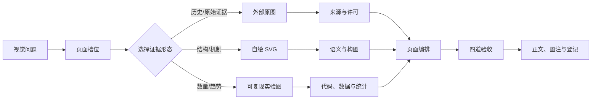

# 图文编排与制图工作流

> [!abstract] 工作流结论
> 先确定图要回答的问题和在页面中的位置，再决定使用外部原图、自绘解释图还是可复现实验图。任何正式视觉资产必须经过“语义正确—版面可读—技术可渲染—来源可追溯”四道检查；不得先生成一张好看的图，再寻找它能放进哪段正文。

## 一、固定产物

一个需要图示的成熟节点，按问题选取以下产物，而不是强制全部配齐：

| 产物 | 负责什么 | 保存位置 |
|---|---|---|
| 图示设计卡 | 视觉问题、页面位置、对象映射、许可与验收标准 | `00-知识库管理/_inbox` 或任务工作目录；使用[[模板 - 图示设计卡]] |
| 自绘解释图 | 定义、几何、证明机制、反例、模型结构 | `_assets/figures/<topic>/fig-*.svg` |
| 可复现实验图 | 数量关系、误差、界、谱、消融与随机性 | `_assets/plots/<topic>/plot-*.svg` |
| 外部原图 | 历史文献、经典教材示意、原论文结果 | `_assets/images/<source-id>/`，并登记到[[外部图像资产登记]] |
| 生成脚本与数据 | 重现自绘图或实验图 | `_labs/code/`、`_labs/experiments/` |

## 二、总流程



## 三、阶段 0：先写视觉问题

使用[[模板 - 图示设计卡]]，用一句可判定的话填写：

> 读者看完图后，应该能够指出、比较、预测或反驳什么？

合格示例：

- “读者能指出 Sauer 递推中为什么第二个子问题降一维。”
- “读者能比较精确 Sauer sum、解析上界和 trivial bound 的松紧。”
- “读者能区分 ghost sample 与随机交换 signs 的随机性来源。”

不合格示例：

- “画一张 VC 维的图。”
- “让页面更漂亮。”
- “总结本章全部内容。”

若无法写出视觉问题，本节点暂不制图。

## 四、阶段 1：先排页面槽位

在画图前决定它属于哪种槽位：

| 槽位 | 宽度 | 前后文要求 |
|---|---:|---|
| 主图 | 760–900 px | 前有引图句，后有完整图注和回扣正文 |
| 中图 | 480–680 px | 用于单个例子、历史图或局部机制 |
| 对照小图 | 220–360 px | 每行不超过两张；四张采用两行 |

同时画出页面节奏草图：

```text
小节标题
  解释 2–5 段
  引图问题 1 句
  [图像槽位]
  图注：对象 + 结论 + 来源
  回扣正文 1–3 段
```

如果同一屏出现两个大 callout、两张主图或图内外重复标题，先调整正文结构，再开始制图。

## 五、阶段 2：选择正确的视觉证据

按以下顺序判断：

1. **没有图是否更清楚？** 若一个公式或三行表格已经足够，不强行配图。
2. **需要保存原貌吗？** 历史文献、论文实验结果或具有引用价值的经典图，优先寻找许可明确的原图。
3. **核心是结构还是数值？** 结构、机制和反例用自绘 SVG；数值、趋势和误差用代码生成的 plot。
4. **需要两种图吗？** 原图负责证据与语境，自绘图负责中文解释；二者不得重复承担同一任务。

禁止用生成式插画替代精确几何关系、坐标曲线、矩阵结构或张量形状。生成式位图只适合不承担定理证据的章节引入、历史情境或概念隐喻，并必须与正式图分开。

## 六、阶段 3：建立对象—视觉编码表

在设计卡中逐项填写：

| 数学/模型对象 | 视觉编码 | 为什么这样编码 |
|---|---|---|
| 当前研究对象 | 蓝色实线/实心点 | 主对象 |
| 保持、可行、证明路径 | 绿色实线/对勾 | 正向逻辑角色 |
| 上界、近似、放松 | 琥珀色虚线/阴影带 | 与精确量区分 |
| 反例、矛盾、越界 | 红色叉号/空心点 | 只用于警示 |

颜色必须同时配合线型、填充、符号或文字。若一个颜色没有稳定的语义角色，应改回墨色或灰色。

## 七、阶段 4：按三类模板生产

### 7.1 `paper-ink`：定义、几何与反例

复制：

```bash
cp "00-知识库管理/_templates/svg/template-paper-ink.svg" \
   "00-知识库管理/_assets/figures/<topic>/fig-<topic>-<purpose>-v1.svg"
```

只保留对象、关系、panel 标签和最小局部结论；完整定义和证明写在正文。

### 7.2 `proof-map`：证明和算法机制

复制 `template-proof-map.svg`。每一阶段只回答：输入对象是什么、发生什么变换、输出什么结论。超过三个阶段时，优先拆成总览图和局部图。

### 7.3 `research-plot`：实验与数量关系

复制 `template-research-plot.svg` 只用于构图原型；正式数据必须由 `_labs/code/` 中的脚本重新生成。图中必须写轴名、尺度、单位和必要的不确定性，禁止手工移动数据点以改善外观。

三种模板说明与预览入口见[`_templates/svg/README.md`](../_templates/svg/README.md)。

## 八、阶段 5：四道验收

### 8.1 语义验收

- 图是否直接回答设计卡里的视觉问题？
- 箭头究竟表示数据流、蕴含、映射还是时间？正文和图内是否一致？
- lower-bound witness、counterexample 与 universal proof 的量词是否区分？
- 图中是否偷偷删除了定理假设、误差项或边界条件？

### 8.2 版面验收

- 在 Obsidian 常用页面宽度下无需放大即可读字；
- 图内没有与小节标题、图注重复的大标题；
- 每行小图不超过两张，图注紧跟图像；
- 相邻两张主图之间有解释文字；
- 深色与浅色主题下对象边界均可辨认。

### 8.3 技术验收

```bash
node "00-知识库管理/_labs/code/lib/validate-svg-figure.mjs" INPUT.svg
xmllint --noout INPUT.svg
svg-render INPUT.svg /tmp/figure-preview.png 1200
```

随后必须视觉检查渲染结果，确认无文字重叠、裁切、字体替换、线条方向错误或公式乱码。机械检查通过不等于语义正确。

改完一批图后，还必须在仓库根目录运行全库正文门：

```bash
node "00-知识库管理/_labs/code/audit-markdown-image-embeds.mjs" . \
  --fail-missing --fail-format
node "00-知识库管理/_labs/code/audit-markdown-figure-units.mjs" . --fail
```

第一条检查有效嵌入、根目录稳定路径、目标解析和数值显示宽度；第二条检查“视觉问题 → 图 → substantive figure callout 与来源 → 怎样读图 → 适用边界”的顺序和最低内容。两条命令通过后仍要查看实际渲染图；批量任务使用 contact sheets 全覆盖，再把密集图、外部图和任何疑似越界图按原尺寸放大复核。

### 8.4 来源验收

- 自绘图：图注写“独立绘制”或“据某来源重绘”；
- 外部图：作者、作品、原件链接、许可、改动和获取日期齐全；
- 实验图：脚本、数据、参数、种子和生成日期可追溯；
- 改编带 `SA` 的图时，派生资产使用相同或兼容许可。

## 九、阶段 6：写入正文

正文中的图文单元必须包含：

1. 一句引图问题；
2. 根目录稳定嵌入路径与明确显示宽度；
3. 图注中的对象、结论和来源；
4. 一段“怎样读图”；
5. 一段“图没有证明什么”——若图只是直觉、例子、有限实验或示意图。

外部图不直接叠加中文解释；中文讲解放在图后。确需在图上重绘标注时，另存派生版本并登记修改与许可。

## 十、阶段 7：版本与返工

- 语义、数据或构图改变：文件名升级 `v1 → v2`，保留生成脚本；
- 仅修正不改变读图结论的拼写：可原位更新，但同步更新日期和哈希；
- 不覆盖外部原始文件；显示版、裁切版和翻译版另存；
- 旧版本若仍被正文引用，不删除；迁移完成后再移入系统废纸篓。

## 十一、Definition of Done

只有同时满足以下条件，视觉任务才完成：

- [ ] 设计卡中的视觉问题已被图直接回答；
- [ ] 图在页面槽位中清楚可读，周围文字节奏合理；
- [ ] 颜色、线型、符号和文字的语义一致；
- [ ] `<title>`、`<desc>`、字体和字号通过检查；
- [ ] 嵌入使用根目录稳定路径和明确数值宽度，全库正文门没有失败项；
- [ ] XML、1200 px 渲染和人工视觉检查通过；
- [ ] 图注写清结论、来源、许可或生成脚本；
- [ ] 正文明确图能证明什么、不能证明什么；
- [ ] 新资产已进入稳定目录，临时文件未混入正式资产。
