# 数学基础十卷总验收 - 跨卷理论与 AI 迁移

> [!abstract] 这张卷考什么
> 十份分卷测验检查每一卷是否纵向闭合；本卷检查十种数学语言能否在**同一个陌生 AI 问题**中协同工作。题目故意不告诉你应调用哪一卷：你必须先识别对象、假设和证据层，再决定使用线性代数、概率、微分、优化、数值、动力系统或几何工具。

> [!warning] 它不能替代分卷验收
> `MATH-FND-CAP-01` 是课程总出口，不是覆盖 150 个节点的抽样捷径。只有十份分卷累计测验均通过后，本卷成绩才可用于总认证；在此之前可以诊断性作答，但不得把结果写成“数学基础已掌握”。

## 零、先看完整验收时间线

```mermaid
flowchart LR
    P["核验十份分卷 retained 证据"] --> O["30 分钟跨卷口试"]
    O --> S1["Session I · 180 分钟"]
    S1 --> F1["冻结原稿与 hash"]
    F1 --> S2["Session II · 180 分钟"]
    S2 --> F2["冻结总卷与解析校准"]
    F2 --> N["scorer nonce 指定主轨"]
    N --> B["至少横跨三轨的盲参数"]
    B --> E["保存 stdout / SVG / SHA-256"]
    E --> C["才可打开详解订正"]
    C --> R["48 小时换系统重建"]
    R --> T["14 天陌生 AI 综合迁移"]
```



这条链把“课程材料完备”“十卷分别保持”“陌生问题中跨卷调用”分成三种证据。若十份分卷尚未真实达到 `retained`，本卷只能作为诊断；若先看详解或 canonical 输出，随后补写的推导只能算订正；若盲测只改变常数而不改变概率对象、谱稳定域或几何离散机制，则不算跨卷迁移。

### 十卷前置证据矩阵

正式总认证前，评分者须填写十份分卷证据位置，而不是把下表的材料状态当个人成绩：

| 分卷 | 卷级 ID | 个人前置要求 | 证据位置 / hash |
|---|---|---|---|
| 10.1 数学语言与证明 | MATH-CUM-01 | `retained` |  |
| 10.2 线性代数 | LA-CUM-01 | `retained` |  |
| 10.3 矩阵分析 | MA-CUM-01 | `retained` |  |
| 10.4 微积分与自动微分 | CALC-CUM-01 | `retained` |  |
| 10.5 概率统计 | PROB-CUM-01 | `retained` |  |
| 10.6 信息论 | INFO-CUM-01 | `retained` |  |
| 10.7 优化 | OPT-CUM-01 | `retained` |  |
| 10.8 数值计算 | NLA-CUM-01 | `retained` |  |
| 10.9 动力系统 | DYN-CUM-01 | `retained` |  |
| 10.10 几何、泛函与算子 | GEO-CUM-01 | `retained` |  |

## 一、考试协议

- 先完成 30 分钟跨卷口试；未通过仍可诊断性参加两场闭卷，但不得进入总认证 `passed`；
- Session I：180 分钟，完成 A—C 区；Session II：180 分钟，完成 D—E 区；两次均闭卷；
- 两个 session 间可以休息，但不得查看笔记、解答、代码或 AI 助手；第一场答卷须先冻结；
- 可使用只含四则、平方根、三角函数、对数和指数的基础计算器；
- 每个结论必须注明对象、定义域/陪域或 shape、假设、范数/概率律/拓扑和证据类型；
- 对“稳定、收敛、低秩、接近、泛化、等价”等词，若没有度量、量词和边界，该结论不得分；
- 证明不得用数值图替代；实验设计不得把解析真值、离散误差、浮点误差和统计误差合成一个未定义的 `error`。

允许直接使用：Gaussian conditioning 公式、Banach 不动点定理、有限维谱定理、KL 非负性和 Riesz 表示定理；但必须核对它们的条件。

### 三波参数化系统族

总卷计算门不是三组固定数字，而是三个可以改变 theorem 的系统族：

| 轨道 | 参数化系统族 | 主要接缝 | 机制改变时必须重写 |
|---|---|---|---|
| A Gaussian–information | $\Sigma=\operatorname{diag}(s_1,s_2)$，$Z=c^TX+\varepsilon$，$\operatorname{Var}\varepsilon=R$ | LA + CALC + PROB + INFO | signal variance、posterior、MI、conditioning 与证据层 |
| B optimization–dynamics | $H=\operatorname{diag}(\mu,L)$，flow 与三组 Euler/GD 步长 | LA + OPT + NUM + DYN | stability interval、最优步长、收缩/振荡/发散制度 |
| C geometry–kernel | 半径 $\rho$ 的 $S^1$、chordal RBF $(\ell,\lambda)$、频率目标 | NUM + GEO + RKHS/operator 接口 | rotation/retraction、Gram spectrum、bias–condition 与 mesh 边界 |

### 十二层跨卷对象—证据账本

每道综合题先填写下面十二层。后一层不得悄悄改变前一层对象：

1. **逻辑层：** proposition、量词依赖、假设、结论、否定和 failure witness；
2. **空间—映射层：** domain/codomain、shape、basis、quotient 与 adjoint 所依赖的 metric；
3. **矩阵结构层：** rank、spectrum、normality、gap、condition 和 perturbation 对象；
4. **微分层：** differential、gradient、JVP/VJP、implicit derivative 与离散 program derivative；
5. **概率层：** sample space、law、conditioning、随机性来源与 population/sample 区分；
6. **信息层：** entropy/MI/divergence 的 reference law、估计量与 variational bound；
7. **优化层：** objective、constraint、stationarity、curvature、算法与 convergence claim；
8. **数值层：** discretization、precision、residual、backward/forward error、stopping 与 failure state；
9. **动力层：** continuous/discrete clock、flow、stability region、path/marginal law 与 solver；
10. **几何—算子层：** manifold/group action、function space、topology、weak solution、kernel/operator；
11. **误差分解层：** approximation、statistical、optimization、discretization、rounding 与 deployment gap；
12. **证据边界层：** theorem、enumeration、simulation、benchmark、case study 分别能与不能推出什么。

## 二、评分与总认证门槛

| 能力区 | 分值 | 题号 | 单项线 |
|---|---:|---|---:|
| A 对象、量词与证据分层 | 15 | 1—2 | 11/15 |
| B 跨卷手算与尺度追踪 | 20 | 3—4 | 14/20 |
| C 统一证明链 | 25 | 5—7 | 18/25 |
| D AI 系统审计与迁移 | 25 | 8—10 | 18/25 |
| E 理论—计算—实验研究合同 | 15 | 11 | 11/15 |
| **合计** | **100** |  | **80/100** |

总认证必须同时满足：

1. 十份分卷累计测验均已通过，而非仅有题卷文件；
2. 本卷总分与 A—E 五条单项线同时达标；
3. 第 5、6、7 题三条主证明均不得为 0；
4. 第 8—10 题每个系统案例至少取得该题 50% 分值；
5. [[实验 - 数学基础十卷跨章累计复现门]]由评分者随机指定一轨并通过；
6. 48 小时后无提示重做首个失败题，14 天后完成一个换模型迁移题；
7. 进行 30 分钟口头答辩：随机解释一条证明、一个失败边界和一个实验不能推出的结论。

> [!warning] 状态语义
> 题卷、详解、实验、脚本、图和独立审计通过，只能把总出口材料记为 `regression-passed`。当前没有十份个人 `retained` 前置证据，也没有本卷首次原稿，因此个人状态仍是 `not-attempted`；材料通过绝不等于课程总认证通过。

## 三、十卷—题目覆盖矩阵

| 卷 | 本卷主要锚点 | 仍由分卷测验保证的纵向覆盖 |
|---|---|---|
| 10.1 MATH | 1、2、5、11 | 八个节点的定义、证明、递推与渐近细节 |
| 10.2 LA | 2—4、6、8 | 空间、商、分解、谱、张量的完整技术链 |
| 10.3 MA | 3—4、8 | 结构、扰动、伪谱和矩阵函数专题 |
| 10.4 CALC | 2—4、6、8 | 极限、积分换元、谱微分与 AD 细节 |
| 10.5 PROB | 1、3、5、9、11 | 分布族、极限定理、推断与 MCMC |
| 10.6 INFO | 1、3、5、9、11 | 编码、变分、率失真与概率度量 |
| 10.7 OPT | 1、4、6—8、11 | 凸对偶、约束、随机与非凸优化 |
| 10.8 NUM | 1、4、6、8—11 | 直接法、Krylov、谱算法与稀疏计算 |
| 10.9 DYN | 1、4、6、9、11 | ODE/SDE、守恒、流与扩散完整链 |
| 10.10 GEO | 1、7、10—11 | 流形、群、泛函、核、Sobolev 与算子 |

读表：每一卷都在总卷中至少被一个跨卷主链调用，但“被调用”不等于其所有节点都在 360 分钟内逐项重考。

## 四、A 区：对象、量词与证据分层（15 分）

### 第 1 题：十个理论声明的最小修正（5 分）

逐项判断。错误时必须给出**最小反例或最小条件修正**；每项 0.5 分。

1. 一个断言在 $10^6$ 个随机输入上成立，就证明它对所有输入成立。
2. 同一个微分在任何内积下对应同一个 gradient vector。
3. 每个实方阵都有一组实标准正交特征向量基。
4. 线性系统的相对残差很小，就必有很小的相对前向误差。
5. 两个平方可积随机变量协方差为零，就相互独立。
6. KL 散度是概率分布空间上的对称 metric。
7. 可微目标的梯度为零，就已证明该点是局部极小点。
8. 连续系统渐近稳定，则 forward Euler 对任意步长都稳定。
9. 在一组固定样本上 Gram matrix 半正定，就证明候选函数在整个定义域上是正定核。
10. 自动微分使用链式法则，因此框架返回值没有浮点误差，也不必验证 custom rule。

### 第 2 题：隐式概率模型的对象合同（10 分）

考虑一个批量模型：$h_i\in\mathbb R^d$，隐状态由

$$
z_i^*=\phi(Wz_i^*+Uh_i)
$$

定义；分类分布为 $p_\theta(y_i\mid z_i^*)=\operatorname{softmax}(Vz_i^*)$，训练目标为经验交叉熵加正则项。反向传播不显式形成 fixed-point Jacobian，而调用矩阵—向量乘与迭代线性求解。

写一张可执行的 object contract，至少包含：

1. 参数、随机变量、样本、batch 轴和全部 map 的 domain/codomain 或 shape；（2 分）
2. differential、gradient、JVP、VJP 和 adjoint solve 分别是什么对象，使用什么 inner product；（2 分）
3. exact fixed point、有限迭代 primal program、exact implicit derivative 和实际 linear-solve gradient 的区别；（2 分）
4. 需要检查的存在唯一性、可微性、概率支撑和数值条件；（2 分）
5. theorem、approximation、numerical computation 与 empirical observation 四层中，各写一个合法声明和一个越界声明。（2 分）

## 五、B 区：跨卷手算与尺度追踪（20 分）

### 第 3 题：线性—Gaussian—信息—微分（10 分）

令

$$
X\sim\mathcal N(0,\Sigma),\qquad
\Sigma=\begin{bmatrix}4&0\\0&1\end{bmatrix},\qquad
Z=c^TX+\varepsilon,\quad c=\begin{bmatrix}1\\1\end{bmatrix},
$$

其中 $\varepsilon\sim\mathcal N(0,1)$ 且与 $X$ 独立。所有信息量使用 nat。

1. 求 $\operatorname{Var}(Z)$、$\operatorname{Cov}(X,Z)$、$\mathbb E[X\mid Z=z]$ 与 $\operatorname{Cov}(X\mid Z)$。（4 分）
2. 求 $I(X;Z)$；说明它为何不是“两个坐标各自互信息的简单相加”。（2 分）
3. 对线性自编码器风险
   $$
   R(W)=\frac12\mathbb E\|WX-X\|_2^2,
   $$
   求 $\nabla_WR(W)$；在所有 rank-one orthogonal projector 中求最优 $W$ 与最小风险。（2.5 分）
4. 若 $\Sigma(\theta)=\Sigma+\theta vv^T$，写出 $\frac d{d\theta}\log\det\Sigma(\theta)|_{\theta=0}$，并指出 $\Sigma$ 接近奇异时的数值风险。（1.5 分）

### 第 4 题：优化—离散动力—条件性（10 分）

令

$$
f(x)=\frac12x^THx-b^Tx,\qquad
H=\operatorname{diag}(1,9),\qquad b=(1,9)^T.
$$

1. 求 $x_*$、$f$ 的 strong-convexity/smoothness 常数和 $\kappa_2(H)$。（2 分）
2. 对 gradient descent $x_{k+1}=x_k-\eta\nabla f(x_k)$ 推出 error iteration；给出精确稳定步长区间。（2 分）
3. 对 $\eta=0.2$ 求两个 eigendirection 的 multiplier、谱半径，并说明何谓“收敛但振荡”。证明该步长在所有固定步长中最小化最坏方向收缩因子。（2 分）
4. 写出 gradient flow 的 exact error；解释 forward Euler 离散该 ODE 为何正好得到 gradient descent，以及连续稳定为何不替代离散 stability region。（2 分）
5. 若 $H=A^TA$ 且 $A=\operatorname{diag}(1,3)$，比较 $\kappa_2(A)$ 与 $\kappa_2(H)$；给出停止时至少应同时报告的 residual、condition 与 task quantity。（2 分）

## 六、C 区：统一证明链（25 分）

### 第 5 题：数据处理、不丢任务信息与证据边界（8 分）

设随机变量形成 Markov chain $X\to Z\to Y$。

1. 从 mutual-information chain rule 证明 $I(X;Y)\le I(X;Z)$。（3 分）
2. 证明
   $$
   I(X;Z)-I(X;Y)=I(X;Z\mid Y)-I(X;Y\mid Z),
   $$
   并用 Markov 条件化简；由此说明等号与“充分表示”之间的精确关系，而不是只写口号。（3 分）
3. 解释 finite-sample MI estimator、InfoNCE lower bound 或 classification accuracy 分别不能单独证明什么；设计一个反例/敏感性检查。（2 分）

### 第 6 题：不动点—隐式微分—伴随—残差证书（9 分）

设 $\phi$ 逐坐标作用且 $|\phi'|\le1$，

$$
z^*(\theta)=\phi(Wz^*(\theta)+b\theta),\qquad \|W\|_2\le q<1.
$$

1. 在 $\mathbb R^m$ 中证明 fixed point 存在且唯一，并给出 Picard iteration 的误差界。（2 分）
2. 在相应点可微时，令 $D=\operatorname{diag}(\phi'(Wz^*+b\theta))$，推导
   $$
   (I-DW)z_\theta'=Db,
   $$
   并证明 $\|(I-DW)^{-1}\|_2\le(1-q)^{-1}$。（2.5 分）
3. 对 scalar loss $L(z^*,\theta)$ 推导 adjoint system 与 total derivative，说明为什么不应显式形成 inverse。（2 分）
4. 若线性求解返回 $\widehat u$，写出 residual-to-forward-error bound；列出 primal truncation、linear-solve、floating-point 与 model misspecification 四类不可混淆的误差。（2.5 分）

### 第 7 题：RKHS 表示定理的有限样本骨架（8 分）

设 $\mathcal H$ 是实 RKHS，kernel 为 $k$，$\lambda>0$。考虑

$$
\min_{f\in\mathcal H}\sum_{i=1}^n(f(x_i)-y_i)^2+\lambda\|f\|_{\mathcal H}^2.
$$

1. 用 $\mathcal H=\operatorname{span}\{k(x_i,\cdot)\}\oplus S^\perp$ 证明 minimizer 必在有限 span 内。（3 分）
2. 证明 Gram matrix $K_{ij}=k(x_i,x_j)$ 半正定；写出 coefficient problem，并说明 $\lambda>0$ 如何给出唯一预测函数。（2 分）
3. 区分：kernel 的全量词正定性、某个 finite Gram matrix 的 PSD、离散线性系统的条件数和连续函数类的泛化。每一层给一个可检查证据。（2 分）
4. 若输入位于流形而代码使用 ambient Euclidean distance，写出一个几何失配风险和一个修正方案。（1 分）

## 七、D 区：AI 系统审计与迁移（25 分）

### 第 8 题：Transformer、低秩适配与混合精度（9 分）

某报告称：

> 因为 $QK^T$ 的秩不超过 $d_k$，softmax 后的 attention matrix 也必为低秩；因此用 rank-$r$ LoRA 一定能无损表示 full fine-tuning。我们在 BF16 上看到 training loss 下降，便证明了谱稳定、梯度正确和部署误差可忽略。

建立一份审计：

1. 写出 $Q,K,V$、logits、row-softmax、output 与 LoRA factors 的 shapes 和 rank 结论真正适用的对象；（2 分）
2. 给出 softmax 可提高矩阵秩的最小解释或例子；区分 algebraic rank、numerical/effective rank 与 task-relevant dimension；（2 分）
3. 写出一个 matrix-free JVP/VJP 或 directional gradient check，并说明 broadcast、mask 和 reduction 的风险；（1.5 分）
4. 设计 singular spectrum、approximation error、task loss、calibration、overflow/underflow、accumulator 与 multiple-seed 的联合验收；（2 分）
5. 改写原报告中可被当前证据支持的最强结论，并写两条不能推出的结论。（1.5 分）

### 第 9 题：扩散、概率流与有限步采样（8 分）

一篇实现报告把 reverse-time SDE 与 probability-flow ODE 称为“同一条随机路径”，又把采样误差全部归为 score error。

1. 区分 sample path、marginal law、path law、density/current 与 deterministic flow map；说明 SDE 与 probability-flow ODE 在什么意义下可以相同、在什么意义下不同。（2 分）
2. 写出一般 forward SDE $dX=f(X,t)dt+g(t)dW_t$ 的 Fokker–Planck、reverse-time drift 和 probability-flow drift；标清 full-score 与 half-score coefficient。（2 分）
3. 建立 terminal-prior、score/model、time-discretization、floating/solver 与 Monte Carlo 五层误差账本；每层给一个单独可控的实验。（2 分）
4. 说明一条有限步样本质量曲线为何不能证明 exact reverse dynamics、likelihood 正确或 path-law 等价。（2 分）

### 第 10 题：流形上的神经算子与网格外推（8 分）

某团队在一张固定网格上训练 operator network，测试误差很低，于是声称：模型学习了从任意 $L^2$ 输入到任意流形上 PDE 解的连续、坐标不变算子，并在网格加密后必然收敛。

1. 把声明拆成 domain/codomain、operator topology、PDE solution concept、manifold/measure、discretization 与 statistical population 六个对象合同。（2 分）
2. 指出至少四个独立逻辑跳跃：可涉及 $L^2$ 点值、弱解正则性、坐标/群等变、mesh consistency/stability、compactness 或 distribution shift。（2 分）
3. 设计 mesh refinement、chart/group transform、Sobolev/weak residual、operator-norm proxy 和 held-out distribution 的分层实验；说明各自支持的结论范围。（3 分）
4. 写出即使所有有限实验通过仍不能推出的一条无限维结论。（1 分）

## 八、E 区：理论—计算—实验研究合同（15 分）

### 第 11 题：陌生 AI 主张的完整研究协议（15 分）

从以下主张中任选一个，写成别人可复核、可证伪、可失败的研究合同：

- 一个 preconditioned implicit layer 在相同算力下更稳定且梯度更可靠；
- 一个 information-bottleneck representation 在保留任务信息时压缩 nuisance；
- 一个 symmetry-aware neural operator 在网格和坐标变化下更可迁移。

合同必须包含：

1. **对象与量词**：population/sample、spaces/maps、随机性、norm/metric/topology、基线与资源预算；（2 分）
2. **理论层**：一个精确定理候选，列 hypotheses、conclusion、proof skeleton、反例边界和可能为空的条件；（3 分）
3. **近似层**：model class、finite width/rank/data/time/mesh 带来的 approximation/statistical/discretization gap；（2 分）
4. **计算层**：algorithm、condition、precision、residual、stopping、complexity/memory 与 failure state；（2 分）
5. **实验层**：预注册 primary metric、seeds、interventions、ablations、uncertainty、negative result 和外部效度；（3 分）
6. **证据边界**：分别写出 theorem、simulation、benchmark 和案例研究能够与不能够支持的结论；（2 分）
7. **来源与复现**：教材/原论文/二手线索分级，environment、data license、code/hash 与 artifact retention。（1 分）

## 九、答案与输出隔离协议

1. 两场闭卷期间只允许题卷、空白纸与基础计算器；不得打开详解、实验正文的 canonical 数值、脚本或审计；
2. Session I 结束立即保存原稿、时间和 SHA-256；Session II 不得回写第一场；第二场结束再冻结总卷；
3. 提交 `attempt_id`、两场 hash 与解析校准后，评分者才生成 `scorer nonce`；nonce 指定 A/B/C 主手推轨；
4. 盲参数必须同时改变 A、B、C 三轨中至少两轨，并至少改变一个 theorem 机制；总认证建议三轨全改；
5. 非默认运行只能写入 `artifacts/<attempt_id>/` 或独立临时路径，不能覆盖 canonical SVG；
6. 命令、environment、stdout、SVG、hash、运行前预测和偏差解释冻结后，才可打开[[数学基础十卷总验收解答 - 跨卷理论与 AI 迁移|详解]]；
7. 订正另页保存，必须保留“第一个错误对象”和“第一个越界声明”，不得覆盖首次答案。

## 十、30 分钟跨卷口试

评分者从六组各抽一问，每问约 4 分钟，最后 6 分钟沿一个错误连续追问。回答必须按十二层账本选出真正相关的层，而不是机械背出十二项。

1. **对象转换：** 同一 fixed-point 模型中，differential、Euclidean gradient、VJP 与 adjoint solve 为什么不是同一对象？
2. **概率—信息：** Gaussian posterior covariance 与 MI 如何共享同一 joint law？有限 MI estimator 能否验证 DPI？
3. **优化—动力—数值：** 连续 flow 稳定为什么不保证 Euler/GD 任意步长稳定？condition 如何进入停止证书？
4. **几何—核—算子：** rotation-invariant finite Gram 测试、RKHS kernel 定理与 continuum operator convergence 有何量词差别？
5. **AI 系统：** 从 Transformer、diffusion、neural operator 三类中随机抽一类，给出一个合法最强声明和两个越界声明；
6. **研究合同：** 给一个陌生 claim，现场写最弱可证伪定理、主要误差账、negative control 与 deployment 边界。

红线：把有限实验当全称证明；把 marginal law 当 path law；把小 residual 当小 forward/task error；把一张 finite Gram PSD 当 kernel 全量词证明；把 wall-time 当 arithmetic theorem；经一次追问仍无法纠正任一项，则口试不通过。通过要求至少四问首答完整，其余两问经追问能关闭关键缺口。

## 十一、48 小时换系统重建门

48 小时后，评分者提供一组未见参数，并把至少一道首次失败题换成同构但不同表面的系统。学习者须闭卷完成：

1. A 轨改变 $\Sigma,c,R$ 后重建 posterior/MI/condition 账；
2. B 轨改变 $(\mu,L)$ 与步长后重建 continuous/discrete stability、最优步长和 residual-to-task 边界；
3. C 轨改变 $\rho,\ell,\lambda$ 或目标频率后重建 symmetry、retraction、Gram/condition 与 mesh 边界；
4. 将首次失败题的“第一个错误对象”映射到至少两个分卷节点；
5. 冻结运行前预测，再生成独立 stdout/SVG/hash。

达到原 A—E 分区线、主证明无零分且不重复口试红线，才保持 `passed`。

## 十二、14 天陌生 AI 综合迁移门

选取一个未在本卷出现的 AI 理论主张，至少调用四卷数学且必须包含一项数值/离散层与一项概率/统计或几何/算子层。提交内容包括：原 claim 与来源；十二层账本；最弱定理及 proof dependency graph；一个能真正否定结论的 countermodel；完整误差分解；跨硬件/数据/网格或分布的实验合同；三个不能推出的结论。只换模型名复述第 11 题，或只罗列术语而没有共同对象，不计迁移通过。

## 十三、提交证据清单

- 十份分卷 `retained` 证据位置、评分者与 hash；
- 30 分钟口试抽题、摘要/录音、红线与评分；
- Session I / II 原稿、起止时间、`attempt_id` 与两个 SHA-256；
- A—E 分区分数、Q5—Q7 主证明、Q8—Q10 系统案例评分；
- 十二层账本、第一处对象错误、第一处证据越界及跨卷回链；
- scorer nonce、盲参数、运行前预测；
- environment、命令、stdout、SVG、SHA-256 与偏差解释；
- 订正、48 小时换系统原稿、14 天陌生综合迁移报告；
- 最终状态只能取 `not-attempted / attempted / passed / retained`。

## 十四、答题后证据记录

```text
Session I 日期 / 用时：
Session I SHA-256：
Session II 日期 / 用时：
Session II SHA-256：
attempt_id：
A / B / C / D / E：
总分：
三条主证明：Q5 / Q6 / Q7
首个错误对象：
首个越界声明：
十二层账本位置：
scorer nonce：
随机实验轨：A / B / C
跨轨盲参数与给出时间：
运行前解析预测：
stdout / SVG SHA-256：
48小时重做：
14天迁移：
口头答辩：
评分者：
状态：not-attempted / attempted / passed / retained
```

本总卷材料当前为 `regression-passed`，个人仍为 `not-attempted`。只有十份分卷前置、口试、两场闭卷与盲复现全部通过，个人才进入 `passed`；48 小时和 14 天两门也通过后才进入 `retained`。
