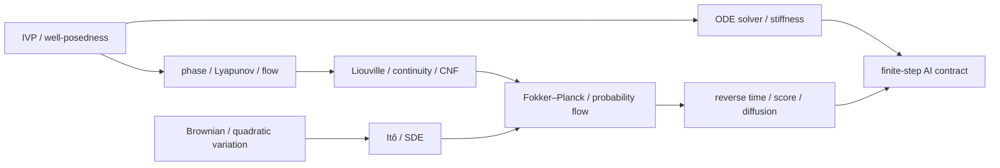

# 阶段测验 - ODE、动力系统与 SDE（10.9）

> [!abstract] 测验目标
> 本卷不检查能否背出 ODE、Itô 或 diffusion 的公式，而检查一条完整能力链：先判断连续时间模型是否定义良好，再区分轨迹稳定与求解器稳定；随后从流推出密度守恒，从 Brownian path 推出 Itô 与 Fokker–Planck；最后把 score、反向时间和有限步采样器写成可审计的 AI 合同。任何结论都必须标明对象究竟是 exact trajectory、numerical trajectory、sample path、marginal density 还是 learned approximation。

## 一、规则与允许常数

- 笔试时间 240 分钟，满分 100 分，闭卷；
- 可用只含四则、平方根、对数和指数的基础计算器，不可使用代码、CAS、AI 助手或笔记；
- 每次引用定理必须写出足以支持当前结论的条件，至少包括 domain、regularity、time interval 与 solution concept；
- 数值题必须报告方法、步长/容差、误差对象和验收量；只写 `success=true` 不得验收分；
- 随机题必须区分 pathwise、strong/weak、law/marginal 与 Monte Carlo error；
- 可使用 $e^{-\log2}=1/2$、$\sqrt3\approx1.732$ 和 classical RK4 负实轴稳定边界 $z_*\approx-2.7853$；
- 笔试后另有不计入 100 分但必须通过的[[实验 - ODE、动力系统与 SDE 累计复现门|计算复现门]]。

## 二、评分与通过标准

| 能力区 | 分值 | 题号 | 单项通过线 |
|---|---:|---|---:|
| A 定义、对象与条件 | 20 | 1—4 | 14/20 |
| B 手算、构造与数值解释 | 30 | 5—8 | 21/30 |
| C 推导、证明与统一结构 | 25 | 9—11 | 17/25 |
| D 反例、失败边界与纠错 | 15 | 12—13 | 10/15 |
| E AI 迁移与研究合同 | 10 | 14 | 7/10 |
| **合计** | **100** |  | **80/100** |

通过必须同时满足：

1. 总分至少 80，且 A—E 各区均达线；
2. 第 9 题的 well-posedness 主证明、第 10 题的 flow–density 主推导、第 11 题的 Itô–Fokker–Planck–reversal 主推导均不得为 0；
3. 第 12 题至少给出三个有效反例或明确失败机制；
4. 计算复现门通过；
5. 48 小时后无提示重做错题，14 天后完成一道未见过的连续生成模型审计题。

> [!warning] 状态语义
> 题卷、解答、脚本和 SVG 存在，只证明验收工具已经 `composed`。没有真实答卷、逐项评分、参数干预与间隔复测时，12 个节点仍保持 `draft / not-attempted`，不得批量升级为 mastered。

## 三、DYN-01—12 覆盖矩阵



| ID | 核心节点 | 主要题号 |
|---|---|---|
| DYN-01 | [[常微分方程、初值问题与解的存在唯一性]] | 1、9、12、14 |
| DYN-02 | [[线性 ODE 与矩阵指数]] | 2、5、14 |
| DYN-03 | [[相图、平衡点与局部稳定性]] | 2、5、6、12 |
| DYN-04 | [[Lyapunov 稳定性与能量函数]] | 2、6、9、12 |
| DYN-05 | [[Euler、Runge-Kutta 与离散化误差]] | 3、7、10、14 |
| DYN-06 | [[刚性系统、绝对稳定域与隐式方法]] | 3、7、12、14 |
| DYN-07 | [[流映射、Liouville 公式与连续正规化流]] | 4、5、10、14 |
| DYN-08 | [[连续性方程与守恒律]] | 4、8、10、14 |
| DYN-09 | [[随机过程、Brownian 运动与二次变差]] | 1、11、12 |
| DYN-10 | [[Itô 引理与随机微分方程]] | 1、8、11、14 |
| DYN-11 | [[Fokker-Planck 方程与概率流 ODE]] | 4、8、11、14 |
| DYN-12 | [[时间反演、score 与扩散生成动力学]] | 4、8、11、13、14 |

## 四、A 区：定义、对象与条件（20 分）

### 第 1 题：适定性与随机对象的十个断言（5 分）

逐一判断正误；错误时用一句话给出最小修正。每项 0.5 分。

1. $f(t,x)$ 连续便足以保证 IVP 局部唯一。
2. local solution 存在并不排除 finite-time blow-up。
3. 对 autonomous ODE，唯一性是轨迹不交叉和共同存在域上 flow injectivity 的关键条件。
4. equilibrium 的 Jacobian 所有特征值实部为负，则在标准光滑条件下它局部渐近稳定。
5. 若 Lyapunov 函数满足 $\dot V\le0$，则系统任意轨迹都必收敛到唯一 equilibrium。
6. Brownian motion 的每条连续样本路径都几乎处处具有 ordinary derivative。
7. 对确定性 partition，Brownian quadratic variation 依概率趋于时间长度，而 total variation 几乎处处无限。
8. Itô integral 的 integrand 可以任意依赖未来增量而不改变 martingale/isometry 结论。
9. SDE 的 strong solution 与数值方法的 strong convergence 是同一个定义。
10. 两个过程每个时刻的 marginal 都相同，仍可能有不同的 path law 与 quadratic variation。

### 第 2 题：线性系统、相图与 Lyapunov（5 分）

每问 1 分，用不超过四句话回答。

1. $e^{tA}$ 的定义至少给出哪两种等价路线？什么条件下可以只对特征值逐项指数化？
2. 为什么“$A$ 的全部特征值实部为负”不等于 $\|e^{tA}\|_2$ 对所有 $t$ 单调下降？
3. hyperbolic equilibrium 的线性化能稳定决定什么；纯虚或零实部特征值为什么需要高阶项？
4. Lyapunov stability、attractivity、asymptotic stability 与 exponential stability 分别多了什么要求？
5. LaSalle 原理中的目标为何是 $\{\dot V=0\}$ 内最大不变集，而不是整个零导数集合？

### 第 3 题：ODE 求解器合同（5 分）

每问 1 分。

1. local truncation error、global error 与 method order 的 fixed-horizon 关系是什么？
2. consistency 与 zero-stability 为什么在 multistep method 中必须分开？
3. absolute stability region 是 method 对 test equation 的性质，stiffness 为什么还依赖 problem、time scale 与目标精度？
4. A-stability 与 L-stability 有何区别；trapezoidal rule 属于哪一种边界例子？
5. adaptive solver 至少应记录哪些量，才能把 tolerance、accuracy、cost 与 failure 分开？

### 第 4 题：流、密度与生成动力学的对象（5 分）

每问 1 分。

1. flow map、Jacobian matrix、Jacobian determinant 与 divergence 分别是什么对象？
2. continuity equation 的 conservative form 与 material-derivative form 各是什么？
3. continuous normalizing flow 中的 $d\log p_t(X_t)/dt$ 是沿轨迹全导数还是固定空间点偏导？
4. Fokker–Planck 描述什么对象；probability-flow ODE 与原 SDE 共享什么、通常不共享什么？
5. 对 constant diffusion matrix $D(t)$，写出 forward drift $f$ 对应的 probability-flow velocity 与正常递增反向时钟的 reverse-SDE drift；指出 score 系数差异。

## 五、B 区：手算、构造与数值解释（30 分）

### 第 5 题：非正规线性流、瞬态与采样（8 分）

令

$$
A=\begin{bmatrix}-1&10\\0&-3\end{bmatrix},
\qquad x(0)=\begin{bmatrix}0\\1\end{bmatrix}.
$$

1. 不借助对角化，求 $e^{tA}$ 与 $x(t)$。（2.5 分）
2. 令 $t_*=\tfrac12\log3$。计算 $x(t_*)$ 和 $\|x(t_*)\|_2$，与 $\|x(0)\|_2$ 比较。（1.5 分）
3. 根据 eigenvalues 判断原点的渐近稳定性；解释第 2 问为何不矛盾。（1 分）
4. 求 $\det(e^{tA})$，说明 total oriented area 与某一方向长度为何可以同时收缩/增长。（1 分）
5. 若以步长 $h$ 做 zero-order-hold sampling，写出 exact discrete transition $A_d$；它的 eigenvalues 是什么？直接用 $I+hA$ 替代会新增什么误差与稳定边界？（2 分）

### 第 6 题：局部稳定、Lyapunov 与 LaSalle（7 分）

考虑 damped oscillator

$$
\dot q=v,
\qquad
\dot v=-q-v.
$$

1. 写出 system matrix、eigenvalues 并分类原点。（1.5 分）
2. 对 $V(q,v)=\tfrac12(q^2+v^2)$ 求 $\dot V$。为什么 $\dot V=0$ 的集合不只含原点？（1.5 分）
3. 求 $\{\dot V=0\}$ 中的最大不变集，并用 LaSalle 说明全局渐近稳定。（2 分）
4. 该 $V$ 能否直接给出 $\dot V\le-cV$ 的 Euclidean exponential certificate？“不能由此直接推出”和“系统不指数稳定”是否等价？（1 分）
5. 写出 continuous energy certificate 要迁移到 Euler 离散化时应重新检查的量。（1 分）

### 第 7 题：刚性模态与四种方法（8 分）

对 test equation $y'=-40y$，比较 explicit Euler、classical RK4、backward Euler 与 trapezoidal rule。

1. 写出四种 stability function $R(z)$，其中 $z=h\lambda$。（2 分）
2. 求 explicit Euler 的正步长稳定区间；利用给定常数求 RK4 在负实轴上的最大稳定步长。（1.5 分）
3. 取 $h=0.1$，计算 backward Euler 与 trapezoidal 的 amplification factor。两者都 A-stable，为什么 fast-mode damping 仍明显不同？（1.5 分）
4. 若只因 exact solution 很快衰减到零便给 explicit Euler 取 $h=0.1$，会发生什么？这属于 model instability 还是 solver instability？（1 分）
5. 为“同一终点 $T$、同一误差门、比较四种方法”设计最少报告字段；隐式方法的成本为什么不能只按步数计算？（2 分）

### 第 8 题：OU 边缘、score、current 与反向漂移（7 分）

设一维 Ornstein–Uhlenbeck SDE

$$
dX_t=-X_t\,dt+\sqrt2\,dW_t,
\qquad X_0\sim\mathcal N(2,4).
$$

可使用

$$
m_t=2e^{-t},
\qquad
s_t^2=1+3e^{-2t}.
$$

取 $t=\log2$。

1. 求 $m_t,s_t^2$ 与 score $\partial_x\log p_t(x)$。（1.5 分）
2. 写出 Fokker–Planck probability current $j_t(x)$ 和 probability-flow velocity $v_t(x)=j_t(x)/p_t(x)$。（1.5 分）
3. 写出正常递增反向时钟 $Y_s=X_{T-s}$ 在当前 forward time $t$ 处的 reverse drift。（1 分）
4. 在 $x=m_t$ 处分别计算 score、probability-flow velocity 与 reverse drift，并解释为什么两个 drift 不相等却可服务于相同 marginal path。（1 分）
5. 若 score 被统一乘成 $1.1$，即使步长趋零，哪些误差仍可能存在？若只把 Euler 步长减半，能否把这种误差自动消除？（2 分）

## 六、C 区：推导、证明与统一结构（25 分）

### 第 9 题：Picard–Lindelöf、Gronwall 与 continuation（8 分）

设 $f:[0,T]\times\mathbb R^d\to\mathbb R^d$ 对 $t$ 连续，对 $x$ 一致 $L$-Lipschitz，并满足 linear growth

$$
\|f(t,x)\|\le a+b\|x\|.
$$

1. 把 IVP 写成积分方程，并在小区间上给出 Picard operator 成为 contraction 的 norm estimate。（2 分）
2. 对两个初值 $x_0,y_0$ 的解推导
$$
\|x(t)-y(t)\|\le e^{Lt}\|x_0-y_0\|,
$$
说明 uniqueness 与 continuous dependence 如何同时得到。（2 分）
3. 用 linear-growth 条件和 Gronwall 推出 $[0,T]$ 上的 a priori bound，并解释它如何排除 finite-time escape、支持逐段 continuation。（2 分）
4. 若另有 proper $C^1$ 函数 $V$ 满足 $\nabla V(x)^Tf(t,x)\le-\alpha V(x)$，推导指数能量界；指出它比前三问额外提供什么，又不能替代什么。（2 分）

### 第 10 题：从可微流到守恒密度与 CNF（8 分）

设 $\dot X_t=f(t,X_t)$，$f$ 对 $x$ 连续可微，所讨论轨迹在 $[0,T]$ 存在且形成可微 flow $\phi_{0,t}$。令

$$
J_t=\frac{\partial\phi_{0,t}(x_0)}{\partial x_0}.
$$

1. 推导 variational equation $\dot J_t=(\nabla_xf)(t,X_t)J_t$，再用 Jacobi formula 推导
$$
\frac d{dt}\log|\det J_t|=\nabla\cdot f(t,X_t).
$$
（2.5 分）
2. 从有限维换元公式推导沿轨迹的 CNF 关系
$$
\frac d{dt}\log p_t(X_t)=-\nabla\cdot f(t,X_t).
$$
（1.5 分）
3. 用链式法则把它改写为 continuity equation $\partial_tp+\nabla\cdot(pf)=0$；再给出 test-function weak form。（2 分）
4. 解释 periodic、no-flux 与 open boundary 对 total mass ledger 的差异。（1 分）
5. 为什么 exact flow 的 injectivity、正 Jacobian determinant 或守恒定理不能自动传给一个粗 Euler/RK map？列出两个离散验收量。（1 分）

### 第 11 题：Itô—Fokker–Planck—概率流—反向时间（9 分）

设

$$
dX_t=f(t,X_t)dt+G(t,X_t)dW_t,
\qquad D=GG^T,
$$

并假设密度与系数足够光滑、边界项可控。

1. 对 $\varphi\in C^{1,2}$ 写出多维 Itô formula，标出 quadratic-variation 产生的项；由此写出 generator。（2 分）
2. 取期望并分部积分，推导 Fokker–Planck 方程
$$
\partial_tp=-\nabla\cdot(fp)+\frac12\sum_{i,j}\partial_{ij}(D_{ij}p).
$$
（2 分）
3. 定义 vector divergence $[\nabla\cdot(Dp)]_i=\sum_j\partial_j(D_{ij}p)$，推导 probability-flow velocity
$$
v=f-\frac1{2p}\nabla\cdot(Dp)
$$
和正常递增反向时钟的 reverse-SDE drift
$$
b_{\rm rev}=-f+\frac1p\nabla\cdot(Dp).
$$
（2.5 分）
4. 当 $D=D(t)$ 与状态无关时，用 score $s_t=\nabla\log p_t$ 化简二式，并解释“half score”和“full score”各属于哪个动力学。（1 分）
5. 说明原 SDE、probability-flow ODE 与 reverse SDE 在 marginals、transition/path law、quadratic variation 上的关系；给出一种 denoising score matching target，并写出它的 conditional-expectation 最优解。（1.5 分）

## 七、D 区：反例、失败边界与纠错（15 分）

### 第 12 题：四个最小失败机制（8 分）

每小题 2 分：给出具体对象或计算，指出被推翻命题，并写出最小修正。

1. continuous vector field 的 IVP 有解但不唯一；
2. continuous system 渐近稳定，但 explicit Euler 因步长过大而发散；
3. $\dot V\le0$ 且 $\{\dot V=0\}$ 含有非平衡点，说明为何不能把整个零导数集合直接叫作极限集；
4. exact marginals 相同却 path law 不同，或把 probability-flow ODE 的 half-score drift误用到 noisy reverse SDE 后得到错误 law。

### 第 13 题：连续生成模型报告审计（7 分）

某报告称：

> “Neural ODE 训练 loss 很低，所以 learned vector field 全局存在且可逆；CNF 的 solver 返回 success，所以 likelihood 精确；扩散模型在 20 步样本好看，所以 score 正确、reverse SDE 已收敛，而且 probability-flow ODE 与 SDE 是同一个随机过程。”

逐项审计：

1. well-posedness/global flow 还缺哪些 regularity、growth、domain 与 backward-continuation 证据？（1.5 分）
2. likelihood 审计还要分开哪些 state、log-density、trace 与 solver 误差？（1.5 分）
3. 好看的有限样本图不能认证 score/reverse law 的哪些量？（1.5 分）
4. probability-flow ODE 与 SDE 的“相同”应如何准确改写？（1 分）
5. 给出最小 refinement、multi-seed、held-out 与 failure-reporting 方案，并把原报告改写成不越界的两句话。（1.5 分）

## 八、E 区：AI 迁移与研究合同（10 分）

### 第 14 题：连续时间生成模型的端到端合同（10 分）

你要设计一个从数据分布到简单基分布、再反向生成的连续时间模型，可选择 CNF、flow matching、diffusion SDE 或混合方案。写出一份可实施、可证伪的研究合同：

1. 明确 state space、time interval、forward/noising path、base/data endpoint 与解概念；（1 分）
2. 给出 vector field 或 drift/diffusion 的 regularity、growth、boundary/support 与 existence/uniqueness 检查；（1.5 分）
3. 写出 density/continuity/Fokker–Planck、score 或 log-density 的训练对象，区分 conditional target、marginal optimum 与 parameterized predictor；（1.5 分）
4. 选择 ODE/SDE solver，声明 stiffness、atol/rtol 或 step schedule、NFE、implicit solve 与 endpoint 处理；（1.5 分）
5. 区分 model/score error、terminal mismatch、discretization、trace estimator、Monte Carlo 与 finite-precision error，并给 refinement/残差门；（1.5 分）
6. 说明 gradient estimator 优化的是 continuous objective 还是 discrete $J_h$，给 finite-difference/adjoint/refinement 检查；（1 分）
7. 预注册 likelihood 或 distributional metric、sample quality、coverage/mode、multi-seed interval、compute fairness 与 held-out/OOD 评价；（1 分）
8. 写出至少四个 failure state 与回退路线，并说明哪些 empirical 结果不能升级成 theorem。（1 分）

## 九、计算复现门（必须通过，不计入 100 分）

评分者从[[实验 - ODE、动力系统与 SDE 累计复现门]]的三条轨道中随机指定一条，学习者不能自选：

1. A 轨：稳定线性系统、连续能量与显式/隐式求解器边界；
2. B 轨：解析密度路径、probability current、probability-flow characteristics 与 CNF ledger；
3. C 轨：Brownian/Itô path 证书、SDE 与 ODE 的二次变差、reverse-score 误差分账。

通过至少要求：

- 重新生成 canonical SVG，验证 XML 与 SHA-256；
- 不看代码手算指定轨道的两个关键量；
- 在运行前写出一次参数干预的方向性预测，再输出到不同文件；
- 从终端摘要手工复核表格，并解释与预测不符的结果；
- 每轨分别写一条“能推出”和“一条不能推出”。

## 十、交卷后的错误分类

```text
总分与 A—E 分区：
对象混淆（trajectory / path / marginal / density / learned field）：
漏 theorem 条件：
漏 solver / boundary / endpoint 条件：
把 empirical diagnostic 当 certificate：
continuous / discrete objective 混淆：
score / solver / terminal / Monte Carlo 误差混账：
回链节点：
48 小时重做：
14 天迁移题：
实验复现门：not-attempted / attempted / passed / retained
```

## 十一、解答入口

正式交卷、冻结原答案和完成计算门之前不要打开：[[阶段测验解答 - ODE、动力系统与 SDE（10.9）]]。
