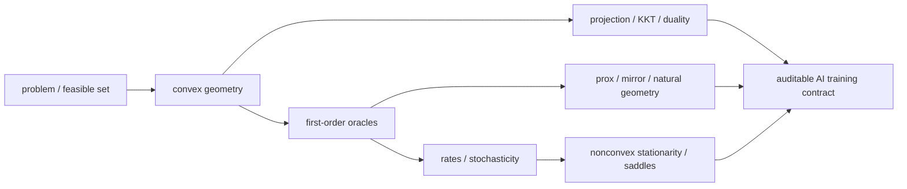

# 阶段测验 - 优化与凸分析（10.7）

> [!abstract] 测验目标
> 本卷检查一条完整能力链：先把变量、可行域、目标和解概念写对；再从 convexity、smoothness、oracle 与 geometry 推出算法；随后用 KKT、duality、proximal 与 mirror 工具处理约束和结构；最后在非凸深网中只声称条件真正支持的结论。只会背 Adam/SGD 更新式、看到 loss 下降便写“收敛”、或看到 Hessian 小便写“泛化好”，均不构成通过。

## 一、规则与允许常数

- 笔试时间 210 分钟，满分 100 分，闭卷；
- 可用只含四则、平方根、对数和指数的基础计算器，不可使用代码、CAS、AI 助手或笔记；
- 每次引用 theorem 必须写：问题类、几何/光滑条件、oracle、步长、结论对象和 rate；
- 所有约束统一先写成 $g_i(x)\le0,h_j(x)=0$ 再定义 multiplier sign；
- 可使用 $\log2\approx0.6931$、$e^{-1}\approx0.3679$；
- 开始笔试前先完成第九节 15 分钟卷级口试；口试未通过时，先回链补主线，不以刷题分掩盖对象混淆；
- 笔试后另有不计入 100 分但必须通过的[[实验 - 优化与凸分析累计复现门|计算复现门]]。

## 二、评分与通过标准

| 能力区 | 分值 | 题号 | 单项通过线 |
|---|---:|---|---:|
| A 定义、对象与条件 | 20 | 1—4 | 14/20 |
| B 手算、构造与数值解释 | 30 | 5—8 | 21/30 |
| C 推导、证明与统一结构 | 25 | 9—11 | 17/25 |
| D 反例、失败边界与纠错 | 15 | 12—13 | 10/15 |
| E AI 迁移与研究合同 | 10 | 14 | 7/10 |
| **合计** | **100** |  | **80/100** |

通过必须同时满足：

1. 总分至少 80，且 A—E 各区达线；
2. 第 9 题的 deterministic/stochastic rate、第 10 题的 KKT–duality–proximal 证书、第 11 题的 geometry 比较均不得为 0；
3. 第 12 题至少给出两个有效反例，第 13 题必须识别 Hessian/Fisher 与 sharpness 参数化问题；
4. 计算复现门通过；
5. 48 小时后无提示重做错题，14 天后完成一道未见过的优化建模与算法选择题。

> [!warning] 状态语义
> 题卷、解答和脚本存在，只说明材料已 `composed`。在没有真实答卷、评分、错题回链和延迟复测之前，16 个节点保持 `draft / not-attempted`，不得批量升级为 mastered。

## 三、OPT-01—16 覆盖矩阵



| ID | 核心节点 | 主要题号 |
|---|---|---|
| OPT-01 | [[优化问题、可行域与局部最优]] | 1、2、12、14 |
| OPT-02 | [[凸集、凸组合与分离超平面]] | 1、2、5、6 |
| OPT-03 | [[凸函数、Jensen 不等式与上图集]] | 1、2、5 |
| OPT-04 | [[次梯度、共轭函数与 Fenchel 对偶]] | 2、7、10 |
| OPT-05 | [[光滑性、强凸性与条件数]] | 1、3、5、9 |
| OPT-06 | [[一阶最优性条件与梯度下降]] | 3、5、9 |
| OPT-07 | [[加速梯度、动量与下界]] | 3、11 |
| OPT-08 | [[随机梯度与小批量估计]] | 3、9、13 |
| OPT-09 | [[自适应优化方法]] | 4、13、14 |
| OPT-10 | [[Newton 法、Gauss-Newton 与拟 Newton 法]] | 4、13、14 |
| OPT-11 | [[投影、约束与可行方向]] | 2、6、14 |
| OPT-12 | [[Lagrange 乘子与 KKT 条件]] | 2、6、10、12 |
| OPT-13 | [[弱对偶、强对偶与 Slater 条件]] | 2、6、10、12 |
| OPT-14 | [[近端算子、复合优化与稀疏正则]] | 4、7、10、14 |
| OPT-15 | [[镜像下降、Bregman 几何与自然梯度]] | 4、7、11、14 |
| OPT-16 | [[非凸优化、鞍点与深度网络损失地形]] | 1、8、12、13、14 |

## 四、A 区：定义、对象与条件（20 分）

### 第 1 题：十个断言（5 分）

判断正误；错误时给出最小修正。每项 0.5 分。

1. 若 $f$ 可微且 $\nabla f(x^*)=0$，则 $x^*$ 必为 local minimum。
2. convex function 的任一 local minimum 都是 global minimum；strictly convex function 若有 minimizer，则至多一个。
3. strongly convex 与 strict convex 是同义词，只是记号不同。
4. $L$-smooth 只说明 $|f(x)-f(y)|\le L\|x-y\|$。
5. 对闭凸集 $C$，Euclidean projection $\Pi_C(x)$ 唯一；对一般非凸闭集则未必唯一。
6. KKT 对任意 differentiable inequality-constrained local minimum 都自动必要，无需 constraint qualification。
7. weak duality 不需要 Slater；对 minimization primal，任一 dual-feasible point 给 primal optimum 的下界。
8. Adam 的 bias correction 使其对任意 smooth convex stochastic problem都自动收敛。
9. approximate SOSP 一般仍可能是 bad local minimum，也可能在容差内靠近 degenerate structure。
10. 同一 ReLU network function在 scale reparameterization 下 raw Hessian sharpness 必不变。

### 第 2 题：问题合同与凸几何（5 分）

每问 1 分，用不超过五句话回答。

1. 区分 domain、feasible set、infimum、minimum、argmin；给一个 infimum 有限但不 attained 的例子。
2. 如何用 epigraph 判断 extended-value function convex？为什么 convex sublevel sets 不能反推出一般 function convex？
3. 写出 subgradient definition 与 convex Fermat rule；在边界约束上如何改成 normal-cone inclusion？
4. 对 $g_i(x)\le0,h_j(x)=0$ 写出 KKT 四组条件，并标出 multiplier sign。
5. Slater 在 convex program 中主要保证什么？为什么“strong duality”与“dual optimum attained”必须分开报告？

### 第 3 题：oracle、步长与 rate（5 分）

每问 1 分。

1. descent lemma 需要什么条件，结论是什么？
2. smooth convex GD、smooth strongly convex GD、smooth nonconvex GD 的典型 guarantee 对象和迭代率分别是什么？
3. Nesterov acceleration 的 $O(1/k^2)$ 保证相对普通 GD 改善了什么，为什么不等同于所有实际 loss 都单调？
4. stochastic gradient 的 conditional unbiasedness 与 bounded variance应相对于哪个 filtration/iterate写？batch 内相关会破坏哪种简单方差缩放？
5. stopping rule 中 objective change、gradient norm、step norm 与 KKT residual 分别可能遗漏什么？

### 第 4 题：现代优化器中的四类几何对象（5 分）

每问 1 分：写出正式对象和一个不可忽略边界。

1. Adam/RMSProp 的 diagonal second-moment preconditioner；
2. Newton Hessian、generalized Gauss–Newton 与 empirical/model Fisher；
3. proximal operator 与 gradient mapping；
4. Bregman divergence 与 mirror step；
5. Fisher metric 下的 natural-gradient/trust-region step。

## 五、B 区：手算、构造与数值解释（30 分）

### 第 5 题：quadratic、条件数与 GD（8 分）

令

$$
f(x)=\frac12x^TQx,
\qquad
Q=\begin{bmatrix}1&0\\0&9\end{bmatrix},
\qquad
x_0=(1,1)^T.
$$

1. 求 $\mu,L,\kappa$，说明 $f$ 的 convexity/strong-convexity/smoothness。（2 分）
2. 对 $\eta=0.1$ 求 $x_1$、$f(x_0)$、$f(x_1)$。（2 分）
3. 对固定步长 GD，写出两个 eigenmode 的 contraction factors，并给出稳定区间。（1.5 分）
4. 在 $0<\eta<2/L$ 内最小化 worst-case spectral contraction，求最优 $\eta$ 与 contraction。（1.5 分）
5. 说明为什么 condition number 而非参数维数主导这个 exact quadratic 的一阶难度；这又不等于任意深网只由一个 global $\kappa$ 描述。（1 分）

### 第 6 题：projection、KKT 与对偶证书（8 分）

考虑

$$
\min_x\ \frac12(x-2)^2
\qquad\text{s.t.}\qquad x\le1.
$$

1. 直接求 primal optimum 与 value。（1 分）
2. 写 Lagrangian，解 KKT，给出 primal/dual feasibility、stationarity、complementarity。（2.5 分）
3. 推导 dual function $q(\lambda)$，求 dual optimum并验证 zero gap。（2 分）
4. 从 $x_0=0$、$\eta=1$ 做一步 projected gradient，说明 projection characterization。（1.5 分）
5. 若把约束误写成 $1-x\le0$ 但仍要求 $\lambda\ge0$，会改变成什么可行域？这个错误为何不是“只差一个符号”？（1 分）

### 第 7 题：proximal 与 entropy mirror 手算（7 分）

1. 对 $v=(3,-1,0.2)^T$，计算 $\operatorname{prox}_{\|\cdot\|_1}(v)$，并用最优性 inclusion 验证每个坐标。（2.5 分）
2. 写出 Moreau decomposition 的一个标准形式，说明 scaling。（1 分）
3. 在 probability simplex 上，当前 $p=(1/2,3/10,1/5)$，gradient $g=(1,0,-1)$，以 negative entropy 为 mirror map、$\eta=\log2$。计算 exponentiated-gradient 新点。（2 分）
4. 解释 Euclidean projection step 与 entropy mirror step 在 simplex boundary 上的几何差异；为什么 Bregman divergence一般不对称、也不是 metric？（1.5 分）

### 第 8 题：非凸 factorization 与驻点分类（7 分）

令

$$
F(a,b)=\frac12(ab-1)^2.
$$

1. 求全部 stationary points 与 Hessian。（2 分）
2. 分类 $(0,0)$，写出 negative-curvature direction。（1.5 分）
3. 证明 $ab=1$ 是 global-minimum manifold，并在 $(s,1/s)$ 求 Hessian eigenvalues。（2 分）
4. 比较 $s=1$ 与 $s=10$ 的 raw sharpness；说明能与不能推出的 generalization 结论。（1.5 分）

## 六、C 区：推导、证明与统一结构（25 分）

### 第 9 题：deterministic 与 stochastic 一阶界（8 分）

设 $f$ 为 lower-bounded、$L$-smooth。

1. 对 GD $x_{k+1}=x_k-\eta\nabla f(x_k)$ 推导一般 $0<\eta<2/L$ 的一步下降系数。（2 分）
2. 取 $\eta=1/L$，推导 smooth nonconvex 情形

$$
\min_{0\le k<T}\|\nabla f(x_k)\|^2
\le \frac{2L(f(x_0)-f_{\inf})}{T}.
$$

并解释其结论对象。（2 分）
3. 若 stochastic oracle 满足

$$
E[g_k\mid\mathcal F_k]=\nabla f(x_k),
\qquad
E[\|g_k-\nabla f(x_k)\|^2\mid\mathcal F_k]\le\sigma^2,
$$

对 $x_{k+1}=x_k-\eta g_k$ 推导 average expected gradient-norm bound。（3 分）
4. 指出 constant step 下的 noise term与 diminishing step 的权衡；为什么 gradient accumulation 不自动等于独立大 batch？（1 分）

### 第 10 题：KKT—duality—proximal 的统一证书（9 分）

考虑 convex composite constrained problem

$$
\min_x\ F(x)=f(x)+h(x)
\qquad\text{s.t.}\qquad Ax=b,\quad g_i(x)\le0,
$$

其中 $f$ convex differentiable且 $L$-smooth，$h$ proper closed convex，$g_i$ convex，并假设存在满足 affine equality 的 strict feasible point。

1. 写出包含 $\partial h$ 的 KKT inclusion；解释 Slater 的作用。（2 分）
2. 从 convexity/subgradient inequality 证明任一满足 KKT 的点是 global minimizer，并说明 primal–dual gap 如何成为 certificate。（3 分）
3. 去掉显式约束后，对 proximal-gradient step

$$
x^+=\operatorname{prox}_{\eta h}(x-\eta\nabla f(x))
$$

推导其 optimality inclusion，并定义 gradient mapping $G_\eta(x)$。（2 分）
4. 解释 $G_\eta(x)=0$ 与 $0\in\nabla f(x)+\partial h(x)$ 的等价；列出 inexact prox 时至少两个必须报告的 residual。（2 分）

### 第 11 题：acceleration、mirror 与 natural geometry（8 分）

1. 写出 Euclidean smooth convex first-order oracle 下，GD 与 optimal accelerated first-order method 的典型 function-gap rate，并说明 oracle lower bound 的含义。（2 分）
2. 对 differentiable strictly convex mirror map $\psi$，从 mirror update 的最优性条件推导 three-point inequality

$$
\eta\langle g_t,x_{t+1}-u\rangle
\le D_\psi(u,x_t)-D_\psi(u,x_{t+1})-D_\psi(x_{t+1},x_t).
$$

（3 分）
3. 说明在 simplex 上选 negative entropy 为什么产生 multiplicative update，而不是先做 Euclidean step 再“随便归一化”。（1 分）
4. 从 local KL trust region

$$
\min_\delta\ g^T\delta
\quad\text{s.t.}\quad
\frac12\delta^TF\delta\le\varepsilon
$$

推导 natural-gradient direction，并说明 damping、empirical Fisher 与 exact Fisher如何影响结论。（2 分）

## 七、D 区：反例、失败边界与纠错（15 分）

### 第 12 题：四个最小反例（8 分）

每小题 2 分：给出具体对象、验证反例成立，并写被推翻命题的最小修正。

1. continuous、lower-bounded objective 的 infimum 有限但不 attained；
2. local minimum 处 KKT 失败，因为 constraint qualification 不成立；
3. exact SOSP 不是 local minimum；
4. strong duality 的 value equality不能单独保证某一侧 optimum attained，或给出一个明确说明“值、可达性、证书”必须分开的 convex example。

### 第 13 题：深网优化报告审计（7 分）

某报告称：

> “Adam 比 SGD 更快达到低 train loss；endpoint 的 empirical-Fisher 最大特征值更小，二维 loss slice 更平，且小 batch run 能逃离一个 saddle。因此 Adam 找到了更 flat 的 global minimum，并由此必然 generalize 更好。”

请逐项审计：

1. 训练预算与 optimizer contract 至少缺少哪些控制？（1.5 分）
2. empirical Fisher、GGN 与 exact Hessian 的关系为何不能混用？（1.5 分）
3. raw sharpness 与二维 slice 需要哪些 symmetry/normalization 检查？（1.5 分）
4. 小 batch noise 支持 saddle escape 还需测什么？（1 分）
5. 设计最小 held-out/generalization 验证，并把最终可接受结论改写成不越界的两句话。（1.5 分）

## 八、E 区：AI 迁移与研究合同（10 分）

### 第 14 题：受约束稀疏深网的端到端优化合同（10 分）

你要训练一个模型，经验 loss 为 $\ell(\theta)$，要求：

- 参数分组稀疏，用 $\lambda\sum_g\|\theta_g\|_2$；
- validation proxy 的 latency $c(\theta)\le C$；
- 某 probability vector $p(\theta)$ 必须在 simplex；
- 主网络是非凸的，并可能有 scale/permutation symmetry。

设计端到端合同：

1. 明确变量、数据、objective、constraints、empirical/deployment quantities；（1.5 分）
2. 选择 primal/proximal/projected/mirror/dual 或 augmented-Lagrangian 组件，并为每个组件说明它解决哪一结构；（2 分）
3. 写出至少一个可执行更新或子问题，而非只列算法名；（1.5 分）
4. 给出 feasibility、stationarity、prox/KKT、linear-solve/HVP 与 stochastic noise diagnostics；（1.5 分）
5. 说明哪些 convex/KKT/duality theorem 在主网络上不再全局适用，哪些局部/算子结论仍可用；（1 分）
6. 处理 scale/permutation symmetry 与 raw sharpness；（1 分）
7. 预注册 compute/tuning fairness、multi-seed interval、latency真机复核、held-out/OOD/calibration，并写三个 failure criteria。（1.5 分）

## 九、15 分钟卷级口试

口试闭卷、无白板模板、不得查看四波摘要。评分者只读问题，不提示下一步；学习者可以使用一张空白纸。口试不计入笔试 100 分，但必须独立通过。

### 9.1 四波模型链（0—4 分钟，5 分）

无提示画出并解释：

1. A 波的三角形 projection model，以及 $x^*,p^*$、projection residual、Jensen/Fenchel certificate；
2. B 波的谱 quadratic，以及 $\mu,L,\kappa$、GD factors、momentum roots 与 SGD noise floor；
3. C 波怎样加入 $b$ 和 constraint，并产生 variable metric、Newton、projection、KKT；
4. D 波怎样从同一 convex core 进入 dual、prox、entropy/Fisher，再由 $w=ab$ 进入 nonconvex parameterization。

每波必须至少说出“改了什么对象”和“新增了什么可验证结论”。只背 OPT 编号不给分。

### 9.2 两条随机证书链（4—8 分钟，5 分）

评分者从下列四项随机抽两项，每项 2.5 分：

- 从 projection variational inequality 到 normal/Fenchel equality；
- 从 Hessian spectrum 到 GD stability，并说明 noise floor为何不是 convergence-to-zero；
- 从 Lagrangian 到 KKT 四组 residual，再到合法 primal–dual gap；
- 从 scalar subgradient 到 soft threshold fixed point，或从 entropy ratio 到 Fisher local direction。

公式正确但说不清对象、sign、norm 或适用条件，每项最高 1 分。

### 9.3 四种“逆对象”不能混名（8—12 分钟，5 分）

在一张表中区分：

| 对象 | 从哪里来 | 逆作用产生什么 | 一个失败边界 |
|---|---|---|---|
| objective Hessian | 二阶 Taylor/curvature | Newton direction | indefinite/singular、solve residual |
| adaptive second-moment state | sampled gradient history | diagonal rescaling | coordinate/epsilon/clipping dependence |
| Bregman/Fisher geometry | potential 或 model KL | mirror/natural direction | finite-step KL、damping、近似 Fisher |
| constraint/prox operator | feasible set 或 nonsmooth structure | projection/prox fixed point | inexact/nonconvex subproblem |

把 empirical Fisher、GGN、Hessian 与 Adam $v_t$ 无条件写成同一对象，本项不得超过 1 分。

### 9.4 AI claim ladder（12—15 分钟，5 分）

把下面陈述改写成两句不越界的结论，并补一个最小验证：

> “Adam 让训练 loss 更低，终点 Hessian 更平，因此它找到了更好的全局极小并必然泛化更好。”

合格答案必须分开 empirical optimization、stationarity/curvature diagnostic、global optimality 与 held-out/deployment；还要声明 matched tuning/compute、多个 seed、parameterization/symmetry 和至少一个 function-space 或 held-out 指标。

### 9.5 口试通过线与记录

| 维度 | 满分 | 通过要求 |
|---|---:|---:|
| 四波模型链 | 5 | 至少 2 |
| 随机证书链 | 5 | 至少 2 |
| 几何/算子对象分层 | 5 | 至少 2 |
| AI claim ladder | 5 | 至少 2 |
| **总计** | **20** | **至少 14** |

出现以下任一情形即使总分够也不通过：把 KKT 当任意非凸问题的 global certificate；把 SGD noise floor 当作零误差收敛；把 empirical Fisher/Adam state 当 exact Hessian；把训练目标下降直接当 generalization 证据。

```text
日期：
评分者：
四波模型链：__/5
随机抽题与得分：________，__/5
对象分层：__/5
AI claim ladder：__/5
总分：__/20
第一个断点：
回链节点：
状态：not-attempted / attempted / passed / retained
```

## 十、交卷后的错误分类

```text
总分与分区：
口试得分与第一个断点：
未写对象/量词：
漏 theorem 条件：
代数或符号错误：
把 diagnostic 当 certificate：
把 empirical 当 population：
把 coordinate geometry 当 invariant：
回链节点：
48 小时重做：
14 天迁移题：
实验复现门：not-attempted / attempted / passed / retained
```
