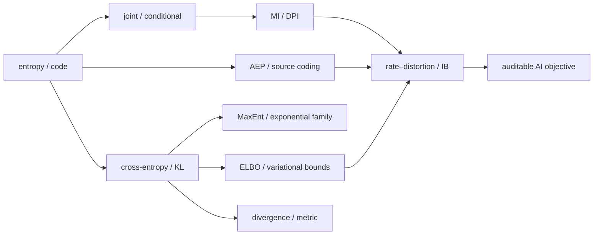

# 阶段测验 - 信息论与统计学习接口（10.6）

> [!abstract] 测验目标
> 本卷检查一条完整能力链：从 probability law 与 code 出发，正确区分 entropy、cross-entropy、KL、mutual information、probability metric 与 empirical surrogate；能证明编码、数据处理、最大熵和变分推断的骨架；最后能把 rate–distortion、information bottleneck 与 MDL 接到可审计的 AI 实验。只会说“loss 越低越好”或套一个 `KL/MI` 函数，不构成通过。

## 零、完整验收时间线与信息对象账本

`INFO-CUM-01`检查的不是会不会背“熵、KL、互信息”三个名字，而是能否在 source、channel、model、representation 与 code protocol 改变后，仍准确回答：谁产生样本，谁提供概率，在哪个分布下平均，单位是什么，当前数值是真值、估计、bound、surrogate 还是实际码长。后阶段看到的答案或 output 不得倒填前阶段记录。

执行前建立唯一 `attempt_id`，建议格式为 `INFO-CUM-01-YYYYMMDD-A`。口试、闭卷、nonce、解析校准、canonical run、盲干预、订正和延迟复测沿用同一 ID；打开详解后不得覆盖首次答案。

> [!important] 材料状态与个人状态分离
> `material_status: regression-passed`只表示十节正文、题卷、详解、脚本、SVG 与独立审计自洽；`learning_status: not-attempted`才描述个人证据。材料通过不能把 INFO-01—10 自动改为 mastered。

### 0.1 九层信息对象账本

| 层 | 必须先写清 | 本卷固定对象 | 常见偷换 |
|---|---|---|---|
| source / law | alphabet、PMF/joint、support、base measure | noisy bit、latent bit、Bernoulli sequence | 用经验频率替代 population law |
| realization / score | 哪个 outcome、由哪个模型评分 | $-\log q(x)$、token NLL | self-information 当语义重要性 |
| average / condition | expectation 分布、条件方向、sum/mean | $H_P$、$H_P(\cdot\mid\cdot)$ | pointwise 条件值当平均条件熵 |
| comparison / dependence | $P,Q$ 方向与 joint/product baseline | cross-entropy、KL、MI | KL 当 metric；MI 当因果 |
| processing / sufficiency | Markov contract、目标参数/任务 | BSC cascade、$K_m$ sufficient | parameter sufficiency 当无损恢复 |
| operational coding | code class、decoder side information、blocklength | Kraft、AEP、prefix/prequential code | 理想 NLL 当完整实际码长 |
| model / inference | constraint、prior、likelihood、posterior、$q$ | MaxEnt、ELBO、VAE | lower bound 当 evidence；gap 零当模型真 |
| geometry / estimator | divergence/IPM/ground metric、critic class | $f$-divergence、TV、$W_1$、MMD | 受限 critic 值当 population distance |
| rate / task / description | source、distortion、target、共享协议 | RD、IB、MDL | 相似 Lagrangian 当同一优化问题 |

### 0.2 三波统一模型族

1. **A：已知 noisy bit。** $X\to Y=X\oplus N$ 贯通 INFO-01—04，分离 realization score、entropy chain、错模 KL 与依赖 MI；
2. **B：处理、参数与长序列。** $X\to Y\to Z$、未知翻转率 $\theta$ 和 $N_{1:m}$ 贯通 INFO-05—06，分离 DPI、parameter sufficiency、AEP 与无损恢复；
3. **C：建模、推断与任务压缩。** moment constraints、latent $Z\to X$、variational $q$、representation $T$ 与 code protocol 贯通 INFO-07—10，分离 MaxEnt、ELBO、散度几何、RD/IB/MDL。

三波会复用 $h_2(1/4)$、$0.143156$ 等数值，但同值不代表同对象。每次改变 source 是否已知、参数是否固定未知、目标是推断/恢复/有损压缩还是任务表示，都必须重新写信息合同。

### 0.3 答案隔离与防挑轨协议

1. 口试关闭题卷外的全部材料，保存录音或逐字稿；未通过先补主线；
2. 闭卷结束立即保存只读原稿、用时、空题与第一个对象/方向错误；
3. 评分者在看到个人轨道偏好前给出 nonce，由 SHA-256 规则唯一决定 A/B/C 深入轨；
4. canonical run 只校准环境；盲参数运行前先冻结对象、单位、方向和可能失败的预测；
5. 冻结新 output/SVG/hash 后才打开[[阶段测验解答 - 信息论与统计学习接口（10.6）|详解]]，订正另存，不覆盖首答。

## 一、规则与允许常数

- 笔试时间 180 分钟，满分 100 分，闭卷；
- 可用只含四则、对数和指数的基础计算器，不可使用代码、CAS、AI 助手或笔记；
- 除非题目另说，离散编码题用 $\log_2$、单位为 bit；连续优化和 ELBO 题用自然对数、单位为 nat；
- 可以使用

$$
h_2(0.1)=0.468996,
\quad
\log 0.55=-0.597837,
\quad
e+1+e^{-1}=4.086161.
$$

- 每个量必须写明：随机对象、期望分布、条件、log base、单样本/总和/均值；
- 每个 neural estimator 必须标成 true quantity、finite-sample estimate、bound 或 surrogate；
- 开始笔试前先完成第九节 15 分钟卷级口试；口试未通过时先回链补对象主线，不用笔试分数掩盖方向、支撑或协议混淆；
- 笔试后另有不计入 100 分但必须通过的[[实验 - 信息论累计复现门|计算复现门]]。

## 二、评分与通过标准

| 能力区 | 分值 | 题号 | 单项通过线 |
|---|---:|---|---:|
| A 定义、对象与条件 | 20 | 1—4 | 14/20 |
| B 手算、构造与数值解释 | 30 | 5—8 | 21/30 |
| C 推导、证明与统一结构 | 25 | 9—11 | 17/25 |
| D 反例、失败边界与纠错 | 15 | 12—13 | 10/15 |
| E AI 迁移与研究契约 | 10 | 14 | 7/10 |
| **合计** | **100** |  | **80/100** |

通过必须同时满足：

1. 总分至少 80，且 A—E 各区达线；
2. 第 9 题 MaxEnt、第 10 题 coding/converse、第 11 题 ELBO/VIB 均不得为 0；
3. 第 13 题的 estimator/surrogate 审计不得为 0；
4. scorer nonce 随机轨与盲参数计算复现门通过；
5. 第九节 15 分钟卷级口试通过；
6. 48 小时后无提示重做错题，14 天后完成一道未见过的迁移题。

> [!warning] 状态语义
> `INFO-CUM-01` 材料达到 `regression-passed` 只表示验收工具自洽。只有真实口试/闭卷原稿、独立评分、nonce 随机轨、个人未见参数 output、48 小时换协议和 14 天迁移记录都存在，才形成升级学习状态的证据；否则仍为 `draft / not-attempted`。

## 三、INFO-01—10 覆盖矩阵

| ID | 核心节点 | 主要题号 |
|---|---|---|
| INFO-01 | [[自信息、熵与编码长度]] | 1、2、5、10 |
| INFO-02 | [[联合熵、条件熵与链式法则]] | 1、2、6、9 |
| INFO-03 | [[交叉熵与 KL 散度]] | 1、2、5、7、12 |
| INFO-04 | [[互信息与依赖性]] | 1、3、6、12 |
| INFO-05 | [[数据处理不等式与充分统计量]] | 3、6、10、13 |
| INFO-06 | [[无损编码、典型集与渐近等分性]] | 2、5、10 |
| INFO-07 | [[最大熵原理与指数族]] | 3、9 |
| INFO-08 | [[变分推断、ELBO 与证据分解]] | 4、7、11 |
| INFO-09 | [[f-散度、Bregman 散度与概率度量]] | 4、12、13 |
| INFO-10 | [[率失真、信息瓶颈与最小描述长度]] | 4、8、11、14 |

## 四、A 区：定义、对象与条件（20 分）

### 第 1 题：十个断言（5 分）

判断正误。错误时给出最小修正；每项 0.5 分。

1. 一个 realization 的 self-information 与事件的语义重要性相同。
2. 离散 entropy 只由概率分布决定；改变随机变量的标签但不改变各标签概率，不改变 entropy。
3. differential entropy 总是非负，并像离散 entropy 一样在坐标缩放下不变。
4. $H(X,Y)=H(X)+H(Y)$ 当且仅当离散 $X,Y$ 独立。
5. conditioning reduces entropy 意味着对每个具体 $y$ 都有 $H(X\mid Y=y)\le H(X)$。
6. $D_{\mathrm{KL}}(P\|Q)=0$ 当且仅当 $P=Q$ 几乎处处，但 KL 一般不是 metric。
7. $I(X;Y)=0$ 对一般 joint law 等价于 $X,Y$ 独立。
8. 若 $X\to Z\to Y$ 是 Markov chain，则 $I(X;Y)\le I(X;Z)$。
9. 训练集平均 NLL 很低，自动证明 population cross-entropy 和真实压缩码长都很低。
10. 对确定性连续表示 $Z=f(X)$，$I(X;Z)$ 总等于 differential entropy $h(Z)$，且必为有限数。

### 第 2 题：码长、熵与条件对象（5 分）

每问 1 分，用不超过四句话回答。

1. prefix code、uniquely decodable code 与 Kraft inequality 分别约束什么？
2. 为什么理想码长 $-\log_2p(x)$ 可以不是整数，而实际单符号码长必须是整数？
3. $H(P)$、$H(P,Q)$ 与 $D_{\mathrm{KL}}(P\|Q)$ 的期望分别在哪个分布下取？三者关系是什么？
4. 随机变量 $H(X\mid Y)$ 与一个给定条件值下的 $H(X\mid Y=y)$ 有什么关系？
5. AEP 的 typical set 结论为何不能直接等同于“每个有限序列的概率相同”或“单字符 Huffman 已达到 entropy rate”？

### 第 3 题：依赖、处理与建模原则（5 分）

每问 1 分。

1. pointwise mutual information（PMI）与 mutual information 的对象和符号性质有什么不同？
2. zero correlation 为什么不能替代 zero mutual information？joint Gaussian 时有什么特殊结论？
3. data processing inequality 的概率图条件是什么？网络中存在 skip connection 时为什么不能只看“层的先后”套用？
4. statistical sufficiency 与 task sufficiency 分别要求保留关于谁的信息？
5. 最大熵为何必须先声明 support/base measure 与约束？缺少这些信息会发生什么？

### 第 4 题：现代 AI 中的四类对象（5 分）

每问 1 分：写出正式对象和一个不可忽略的 gap/边界。

1. ELBO 与 log evidence；
2. variational mutual-information lower bound；
3. neural $f$-divergence critic objective；
4. MMD 或 Wasserstein-1 的 empirical estimate；
5. prequential MDL codelength 与训练集 NLL。

## 五、B 区：手算、构造与数值解释（30 分）

### 第 5 题：Huffman、entropy 与错配代价（8 分）

字母表 $\{a,b,c,d\}$ 的真实分布为

$$
P=(1/2,1/4,1/8,1/8).
$$

1. 构造一个 binary Huffman code，写出 codeword 和长度，并验证 prefix-free。（2 分）
2. 计算 $H(P)$ 与平均码长 $\bar L$；解释为什么本例恰好取等。（2 分）
3. 若错用

$$
Q=(0.4,0.3,0.2,0.1),
$$

计算理想 cross-entropy $H(P,Q)$ 和额外代价 $D_{\mathrm{KL}}(P\|Q)$。（2 分）
4. 若 $Q(d)=0$ 而 $P(d)>0$，理想 cross-entropy 如何？实际 coder 应怎样避免把这一数学失败伪装成有限 loss？（2 分）

### 第 6 题：BSC、mutual information 与 DPI（7 分）

令 $X\sim\operatorname{Bernoulli}(1/2)$，

$$
Y=X\oplus N_1,
\qquad N_1\sim\operatorname{Bernoulli}(0.1),
$$

再令

$$
Z=Y\oplus N_2,
\qquad N_2\sim\operatorname{Bernoulli}(0.2),
$$

且所有噪声相互独立。

1. 求 $H(X),H(Y),H(Y\mid X)$ 和 $I(X;Y)$。（2 分）
2. 求 composite crossover probability $P(Z\ne X)$。（1.5 分）
3. 求 $I(X;Z)$，并数值验证 DPI。（1.5 分）
4. 说明 $X\to Y\to Z$ 的 conditional independence；若把 $Z$ 的生成器额外接入 $X$ 的 skip connection，原 DPI 结论为什么未必可用？（2 分）

### 第 7 题：softmax cross-entropy 与 ELBO gap（8 分）

#### 7.1 softmax（3 分）

三类 logits 为 $(1,0,-1)$，target 是第二类。

1. 求 softmax probabilities；
2. 求单样本 NLL；
3. 求对三个 logits 的梯度。

#### 7.2 可枚举 latent model（5 分）

令 $z\in\{0,1\}$，$p(z=1)=1/2$，且

$$
p(x=1\mid z=0)=0.2,
\qquad
p(x=1\mid z=1)=0.9.
$$

观测 $x=1$，选择 $q(z=1\mid x)=0.75$。

1. 求 evidence $p(x=1)$ 和 exact posterior $p(z=1\mid x=1)$；（1.5 分）
2. 用

$$
\mathcal L(q)=E_q\!\left[\log\frac{p(x,z)}{q(z\mid x)}\right]
$$

计算 ELBO；（2 分）
3. 计算 $\log p(x)-\mathcal L(q)$，并指出它是哪一个 KL。（1.5 分）

### 第 8 题：rate–distortion、IB 与 prequential MDL（7 分）

1. 对 $X\sim\operatorname{Bernoulli}(1/2)$、Hamming distortion，计算 $R(0.1)$，并解释 $D=0.1$ 的约束对象。（2 分）
2. 令 $X=(Y,N)$，$Y,N$ 为独立公平 bit。比较 $Z=X$、$Z=Y$、$Z=Y\oplus E$（$E\sim\operatorname{Ber}(0.1)$）和常量表示。在 $\beta=2$ 下计算

$$
I(X;Z)-\beta I(Z;Y),
$$

并选出四者中的最优表示。（3 分）
3. 对序列 $(1,1,0,1)$，比较 fixed $p=0.5$ 的累计码长与 KT predictor

$$
q_t(1\mid x_{<t})=\frac{s_{t-1}+1/2}{t}
$$

的累计码长。列出 KT 的四个实际符号概率，并解释短序列结果为什么不否定长期自适应优势。（2 分）

## 六、C 区：推导、证明与统一结构（25 分）

### 第 9 题：最大熵、指数族与对偶（8 分）

在有限 support $\mathcal X$ 上给定统计量 $T(x)\in\mathbb R^k$，考虑

$$
\max_{p}\ -\sum_xp(x)\log p(x)
$$

满足

$$
p(x)\ge0,
\quad
\sum_xp(x)=1,
\quad
\sum_xp(x)T(x)=\tau.
$$

1. 写 Lagrangian 并对 interior solution 求驻点，推出 exponential-family 形式。（3 分）
2. 定义 log-partition $A(\eta)$，证明 $\nabla A(\eta)=E_\eta[T]$、$\nabla^2A(\eta)=\operatorname{Cov}_\eta(T)\succeq0$。（2 分）
3. 写出寻找 $\eta$ 的 convex dual objective，并说明其一阶条件如何恢复 moment matching。（1.5 分）
4. 说明不可行约束、边界矩和冗余统计量分别会造成什么问题。（1.5 分）

### 第 10 题：从无损编码到有损 converse（8 分）

1. 对任意 binary prefix code，利用 Kraft inequality 与 Gibbs inequality 证明平均码长 $\bar L\ge H(X)$。（2 分）
2. 对 iid source，说明 AEP 如何给出 typical set 的概率和 cardinality 量级，并据此解释为何任何 $R>H(X)$ 渐近可实现无损编码。（2 分）
3. 给出 $R<H(X)$ 时无损 source-coding converse 的 counting 核心，不要求完整技术细节。（1.5 分）
4. 对 memoryless lossy code，令 message 为 $M$、重构为 $\widehat X^n$。从

$$
nR\ge H(M)\ge I(X^n;M)\ge I(X^n;\widehat X^n)
$$

继续写出 single-letterization 的关键不等式，得到 $R\ge R(D)$。说明其中用到的 memoryless、平均失真和凸性步骤。（2.5 分）

### 第 11 题：ELBO、VIB bounds 与 gap 审计（9 分）

1. 从 joint $p_\theta(x,z)$ 和任意 $q_\phi(z\mid x)$ 出发，推导

$$
\log p_\theta(x)
=\mathcal L(\theta,\phi;x)
+D_{\mathrm{KL}}\!\left(q_\phi(z\mid x)\|p_\theta(z\mid x)\right).
$$

同时写出 ELBO 的 reconstruction-minus-KL 形式。（3 分）
2. 对 encoder $q_\phi(z\mid x)$ 和任意 reference $r(z)$，证明

$$
I(X;Z)\le E_{p(x)}D_{\mathrm{KL}}(q_\phi(z\mid x)\|r(z)),
$$

并写出 gap。（2 分）
3. 对任意 decoder $q_\psi(y\mid z)$，证明或推导

$$
I(Z;Y)\ge H(Y)+E_{p(y,z)}\log q_\psi(y\mid z),
$$

并写出 gap。（2 分）
4. 解释为什么用这两个 bounds 训练得到的数值不能直接声称“真实 IB optimum 已找到”；至少区分 variational gap、optimization gap、finite-sample/estimation gap 和 deterministic-continuous MI 病态中的三类。（2 分）

## 七、D 区：反例、失败边界与纠错（15 分）

### 第 12 题：四个反例（8 分）

每小题 2 分：给出明确构造、算出关键量，并指出它否定的错误推论。

1. 构造 differential entropy 为负的连续分布，并展示缩放会改变 $h(X)$；
2. 构造一个 KL 不对称的两点分布例子；
3. 构造 $\operatorname{Corr}(X,Y)=0$ 但 $I(X;Y)>0$ 的例子；
4. 令 $X$ 有连续密度、$Z=X$，说明为何 $I(X;Z)=\infty$，而不能写成有限的 $h(Z)$。

### 第 13 题：一次“信息论驱动”项目审计（7 分）

团队对一个 deterministic continuous encoder 宣称：

1. minibatch InfoNCE 为 3.2 nat，所以“真实 $I(X;Z)=3.2$”；
2. 一个有限 neural critic 的 $f$-objective 上升，所以“真实 divergence 严格上升”；
3. training NLL 下降，所以“模型的完整 MDL 更短且泛化更好”；
4. latent KL 接近 0，所以“表示已经最小充分”；
5. 两个 embedding 间 Euclidean distance 下降，所以“两个生成分布的 Wasserstein distance 下降”。

逐条指出对象错误或缺失条件，并为每条提出一个最小修复：需要记录什么分布/采样协议、bound 方向、held-out/prequential code、task relevance、ground metric 或 estimator uncertainty？最后写一条经修复后仍然不能做出的因果/部署结论。

## 八、E 区：AI 迁移与研究契约（10 分）

### 第 14 题：受限表示学习的完整研究协议（10 分）

你要为医疗影像构建表示 $Z$：它要预测疾病标签 $Y$，尽量不携带医院标识 $S$，并受到传输 budget 约束。请写一份可执行、可否证的协议，至少包含：

1. joint law、采样单位、train/validation/test 与跨医院 split；（1.5 分）
2. encoder/decoder、随机性与 Markov assumptions；（1.5 分）
3. rate、task relevance、医院泄漏和 distortion 的正式对象及单位；（2 分）
4. 每个不可计算真值所采用的 bound/estimator，方向和已知 gap；（1.5 分）
5. 至少两个非信息论 baseline、三个 failure diagnostics 与 uncertainty reporting；（1.5 分）
6. 一个 prequential/two-part MDL 比较协议，明确哪些共享成本可以抵消；（1 分）
7. 明确写出：即使所有指标改善，仍不能推出的因果、公平或部署结论。（1 分）

## 九、15 分钟卷级口试（必须通过，不计入 100 分）

合上全部笔记，在一张白纸上完成以下任务；可以录音或保留手绘扫描作为证据，但不能先看解答。

1. **三波模型链：**画出 A 波 known noisy bit、B 波 post-processing/未知翻转率/长序列、C 波 MaxEnt latent model/variational approximation/task compression。每一箭头必须写明哪一项概率或编码合同改变了；
2. **对象与同值异义：**从 probability、self-information、entropy、cross-entropy、KL、MI 中任选四个，说明输入层级和 expectation；再解释为什么 $0.143156$ bit 可以在不同模型中同时出现，却不能据此说两个信息对象相同；
3. **证据等级：**各给一个例子区分 true population quantity、finite-sample estimate、lower/upper bound 与 train surrogate；必须包含 ELBO 或 InfoNCE，以及 actual codelength；
4. **失败边界：**从 support mismatch、continuous deterministic MI、skip connection 破坏 Markov、typical-set 有限长度误读、critic/MDL 协议遗漏中任选一个，给出最小反例、修复和一个 AI 映射。

通过标准：四项中至少三项完整；第 1、3 项必须通过；不得把 statistical dependence 写成 causality，不得把 ELBO/critic/InfoNCE 数值直接写成未知真值，也不得把 training NLL 写成完整 MDL。失败后回到[[信息论与统计学习接口 MOC#零、怎样从零真正学完本卷|卷级学习合同]]，48 小时后更换模型重做。

## 十、计算复现门（必须通过，不计入 100 分）

完成[[实验 - 信息论累计复现门]]。评分者在运行前从 A/B/C 三条轨道中随机指定一条，学习者不能自选：

- A：Bernoulli–Hamming rate–distortion 前沿；
- B：task/nuisance representation 的 rate–relevance 平面；
- C：fixed model 与 KT predictor 的 prequential codelength。

通用通过条件：

1. 从代码入口独立生成 SVG，记录 Python 版本、命令、seed 与 SHA-256；
2. 先通过实验文档的解析校准门，再手算被指定轨道至少两个量；
3. 运行前写下参数干预的方向预测，输出到不同临时路径，运行后解释差异；
4. 分清 theorem、population information、finite computation 与 empirical sequence result；
5. 不得删去与预期不符的 sequence/parameter result，也不得把单一 toy model 外推为普遍 AI 结论。

## 十一、答题后复盘

| 题号 | 得分 | 状态 | 错误类型 | 第一个断点/回链小节 | 48 小时重做 | 14 天迁移题 |
|---|---:|---|---|---|---|---|
| 1—4 |  |  |  |  |  |  |
| 5 |  |  |  |  |  |  |
| 6 |  |  |  |  |  |  |
| 7 |  |  |  |  |  |  |
| 8 |  |  |  |  |  |  |
| 9 |  |  |  |  |  |  |
| 10 |  |  |  |  |  |  |
| 11 |  |  |  |  |  |  |
| 12 |  |  |  |  |  |  |
| 13 |  |  |  |  |  |  |
| 14 |  |  |  |  |  |  |

状态使用 `independent / hinted / copied / blocked / careless`。查看解答后的订正只能记为 `corrected`，不能倒填首次独立通过。

## 十二、48 小时换协议重建门

首次订正完成 48 小时后，不看原题、答案和 output，由评分者从下列方向任选一类并至少改变两个合同。只换小数、照抄原推导不算通过。

| 换协议方向 | 必须重建的对象 | 最低通过证据 |
|---|---|---|
| source / channel / support | 新 source PMF、channel 或 support mismatch | 重算 entropy/KL/MI，并说明有限或无穷边界 |
| conditioning / processing | 新 Markov 图、side information 或 skip path | 重写 DPI/chain rule 条件与等号/失效点 |
| code / block / sequence | 新 code class、blocklength、顺序或共享成本 | 区分理想 rate、有限 block code 与完整码流 |
| model / variational family | 新 moment constraint、prior/likelihood 或 $q$ family | 重建 evidence–ELBO identity、gap 与错设边界 |
| distortion / task / estimator | 新 distortion、target、critic/negative sampler | 重写 RD/IB/metric 的优化对象及 bound 方向 |

通过要求：45 分钟内无提示交出“对象账本 → 关键推导 → 操作协议 → 一个失败边界 → AI 映射”，并解释原结论为何不能原样搬运。

## 十三、14 天陌生 AI 信息目标迁移门

评分者提供一份未见过的 AI 摘要，例如 tokenizer/语言模型比较、VAE、对比学习、隐私表示、神经压缩或模型选择。学习者在 60 分钟内提交一页可审计合同，至少包含：

1. source/joint/channel/representation 图及 sampling unit；
2. population information quantity、log base、归约尺度和 support；
3. estimator/bound/surrogate 的方向、函数族和已知 gap；
4. operational code 或明确说明为何当前 loss 不是实际码长；
5. RD、IB、MDL 中真正适用的目标与不适用的另外两项；
6. finite-sample、shift、causality/fairness 和 deployment 不能推出的结论；
7. 失败即停止、独立复验与版本/seed/protocol 日志。

通过标准不是术语数量，而是所有量都能回到同一 joint law 与操作协议；仅把训练 loss 改名成“信息量”判为未迁移。

## 十四、提交证据清单

- [ ] 唯一 `attempt_id`、日期、用时、评分者与 scorer nonce；
- [ ] 15 分钟口试录音/逐字稿和首次 180 分钟闭卷原稿；
- [ ] A—E 分数、硬门、第一个对象/方向/协议错误与回链；
- [ ] 解析校准、canonical 命令/output/SVG/hash；
- [ ] 盲参数运行前预测、完整新 output/SVG/hash 和冲突解释；
- [ ] 打开详解后的订正，且没有覆盖首次答案；
- [ ] 48 小时换协议重建与 14 天陌生 AI 迁移记录；
- [ ] 最终个人结论：`passed / needs-remediation / not-attempted`。

## 十五、解答入口

冻结口试与笔试答案、完成计算复现并保存原始记录后再打开：[[阶段测验解答 - 信息论与统计学习接口（10.6）]]。
