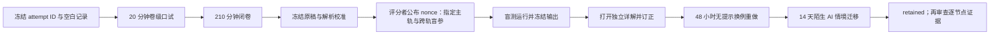
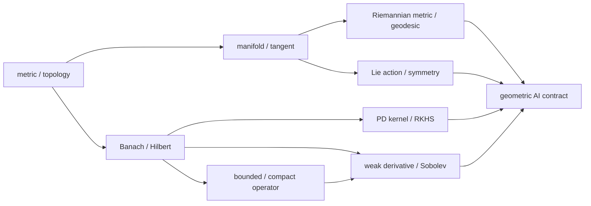

# 阶段测验 - 几何、泛函分析、核与算子基础（10.10）

> [!abstract] 测验目标
> 本卷检查学习者能否在三个尺度间稳定切换：用 topology/metric 说明全局空间结构，用 tangent/metric/group action 说明局部几何与对称，再用 Hilbert/compact operator/RKHS/Sobolev 说明函数与解算子。通过者不仅会算球面梯度或Gram矩阵，还必须知道哪些有限维结论在无限维失败、哪些离散实验不能推出连续空间定理，以及如何把几何神经网络、kernel方法和neural operator写成同一份可审计研究合同。

## 零、先看完整验收时间线

这不是“读完八篇正文，再做一张综合卷”。`GEO-CUM-01` 把即时生成、长推导、计算复现与延迟迁移分成四类证据；后面的证据不能倒填前面的独立性。



执行前建立唯一 `attempt_id`，建议格式为 `GEO-CUM-01-YYYYMMDD-A`。同一次尝试的口试记录、闭卷原稿、解析校准、scorer nonce、终端输出、干预图、评分表和复测结果都使用同一 ID。闭卷与盲测预测冻结后，评分者才公布带时间戳的 nonce；一旦打开详解或 canonical 输出，不得覆盖或润色第一次答案与预测。

> [!important] 材料状态与个人状态分开
> `material_status: regression-passed` 只表示题卷、详解、脚本、图和交叉审计自洽；`learning_status: not-attempted` 才是当前个人证据。第一次真实作答只能从 `not-attempted` 进入 `attempted`，不能因材料完善而跳到 `passed` 或 `retained`。

### 0.1 九层几何—泛函—算子对象账本

遇到任何题，先把对象放进正确一行，再选公式。三波不是三套术语，而是同一条“连续对象怎样被表示、作用和离散检验”的链。

| 层 | 必须写明的对象 | 本卷固定例子 | 最常见偷换 |
|---|---|---|---|
| 载体与邻近 | set、metric、topology、收敛/紧致量词 | $S^1/S^2$、同拓扑不同完备性的 $\mathbb R$ | 把有限点云连通当支撑流形定理 |
| 局部线性化 | chart、$T_pM$、curve/derivation 与 ambient constraint | sphere tangent、level set | 把 coordinate/ambient vector 当内蕴对象 |
| 对偶与度量 | $T_p^*M$、$df_p$、metric、gradient、Exp/retraction | sphere gradient 与 finite step | 把 covector 当 vector，或把 retraction 当 Exp |
| 变换结构 | group、action、orbit、invariant/equivariant map | $O(d)$ 同时作用于 $p,c$ | 若干采样旋转替代 $\forall Q$ |
| 函数空间 | Banach/Hilbert/RKHS/Sobolev space 与 norm | $\ell^2$、$H_0^1$、$H^{-1}$ | 把有限维有界闭集结论搬到无限维 |
| 算子与谱 | projection、bounded/compact operator、spectrum 与 regularization | $P_m$、diagonal $K$、spectral cutoff | 把有限矩阵低秩当连续 compactness |
| 核与变分 | PD kernel、RKHS representer、weak form、solution operator | Green kernel、KRR、Poisson $\mathcal G$ | 把 Gram 对称当 PSD，或把点残差当弱解 |
| 离散表示 | sample、Gram matrix、basis cutoff、mesh/quadrature | finite section、Galerkin、modal cutoff | 把离散对象与连续对象写成同一个符号 |
| 证据与声明 | error topology、极限变量、reference、统计协议与不可推出边界 | multi-norm OOD、rotation tests | 把小绝对误差或有限测试升级为全称定理 |

### 0.2 三波参数化模型族如何接合

1. **第一波 GEO-01—04：**固定半径为 $r$ 的 $S_r^2\subset\mathbb R^3$、线性目标 $f_c(p)=c^Tp$ 与 $Q\in O(3)$。先问空间里什么叫“附近”，再由 $T_pS_r^2=p^\perp$、metric、Exp/retraction 进入计算，最后核对 $(p,c)\mapsto(Qp,Qc)$ 的 family covariance；
2. **第二波 GEO-05—07：**在 $\ell^2$ 中取 $c_j=j^{-\alpha}$ 与 $Ke_j=j^{-\beta}e_j$。$\alpha>1/2$ 控制 projection tail，$\beta>0$ 控制 compact operator tail与 $N_{\rm eff}(\lambda)$；这迫使 target、operator、regularization 三本谱账分开；
3. **第三波 GEO-07—08：**在 $(0,L)$ 上把 Dirichlet Green kernel同时解释为 RKHS representer 与 Poisson solution operator，模态增益为 $(j\pi/L)^{-2}$。有限 cutoff 必须同时报告 absolute/relative $L^2$、energy/$H^{-1}$ 与 strong residual；
4. **累计出口：**任何 AI 声明都必须同时给出 continuous object、theorem hypotheses、discrete representation、empirical diagnostic 与不能推出的边界。

### 0.3 答案与输出隔离协议

- 口试和闭卷期间只打开本题卷；Obsidian 的反向链接、悬浮预览与全库搜索均关闭；
- [[阶段测验解答 - 几何、泛函分析、核与算子基础（10.10）|独立详解]]只在闭卷原稿、结束时间和 hash/照片位置冻结后打开；
- 代码、旧终端记录、canonical SVG 与文中“预期关键输出”在解析校准冻结前全部关闭；看到任一标准输出后，运行前预测不得再记为 `independent`；
- 评分者在闭卷与解析校准冻结后才公布 `scorer nonce`，据其指定一条主手算轨和至少跨两轨的盲参数；不得重抽 nonce，也不得先试跑再挑参数；
- 非 canonical 运行必须显式给新 `--output` 路径，canonical 图不得成为草稿区或被盲测覆盖；
- “曾经看过类似证明”不等于独立生成；若获得提示，独立性必须记为 `hinted`；
- 打开详解后的正确答案只能记 `corrected`，不得回填为 `independent`。

## 一、规则与允许工具

- 笔试时间210分钟，满分100分，闭卷；
- 可使用只含四则、平方根、三角函数、对数和指数的基础计算器，不可使用代码、CAS、AI助手或笔记；
- 每次引用定理必须声明空间类别、完备/紧致/正定/正则性等条件和结论所用topology/norm；
- 流形计算必须区分ambient vector、tangent vector、covector、Riemannian gradient和coordinate representation；
- infinite-dimensional反例必须给出具体sequence或operator，不能只说“无限维不同”；
- kernel、PDE和operator-learning答案必须声明input/output function spaces、norm、sampling/discretization与随机性；
- 可使用 $\sin h=h-h^3/6+O(h^5)$、$\cos h=1-h^2/2+O(h^4)$；
- 开始笔试前先完成第十节20分钟卷级口试；口试不计入100分，但必须独立通过；
- 笔试后另有不计入100分但必须通过的[[实验 - 几何、泛函与算子累计复现门|计算复现门]]。

## 二、评分与通过标准

| 能力区 | 分值 | 题号 | 单项通过线 |
|---|---:|---|---:|
| A 对象、定义与定理条件 | 20 | 1—4 | 14/20 |
| B 手算、构造与解释 | 30 | 5—8 | 21/30 |
| C 完整证明与统一推导 | 25 | 9—11 | 17/25 |
| D 反例、失效边界与纠错 | 15 | 12—13 | 10/15 |
| E AI迁移与研究合同 | 10 | 14 | 7/10 |
| **合计** | **100** |  | **80/100** |

通过必须同时满足：

1. 总分至少80，且A—E各区达线；
2. 第9—11题均不得为0，且其中至少两题达到该题70%；
3. 第12题至少给出三个完全合法的反例；第13题必须识别finite sample、global geometry与function-space generalization三种越界；
4. 流形/RKHS/弱PDE三类对象合同相关小题合计不得低于70%；
5. 20分钟卷级口试通过；
6. 随机指定的计算复现轨道通过；
7. 48小时后闭卷换例重做，14天后完成一道未见过的geometric/operator-learning审计题。

> [!warning] 状态语义
> 题卷、详解、代码、图与独立审计达到`regression-passed`，只说明验收材料自洽。没有首次口试/闭卷原稿、逐项评分、盲参数干预和延迟复测时，GEO-01—08仍为`draft / not-attempted`。

## 三、GEO-01—08覆盖矩阵



| ID | 核心节点 | 主要题号 |
|---|---|---|
| GEO-01 | [[度量空间、拓扑与连续映射]] | 1—5、12—14 |
| GEO-02 | [[光滑流形、切空间与余切空间]] | 1、2、4—6、9、12—14 |
| GEO-03 | [[Riemann 几何、测地线与流形优化]] | 1、4、6、9、13、14 |
| GEO-04 | [[Lie 群、Lie 代数与对称性]] | 1、4、6、9、13、14 |
| GEO-05 | [[Banach 空间、Hilbert 空间与正交投影]] | 1—4、7、10—12、14 |
| GEO-06 | [[有界算子、紧算子与谱理论基础]] | 1—4、7、10—14 |
| GEO-07 | [[正定核、RKHS 与表示定理]] | 1—4、8、10、12—14 |
| GEO-08 | [[弱导数、Sobolev 空间与神经算子接口]] | 2—4、8、11、13、14 |

## 四、A区：对象、定义与定理条件（20分）

### 第1题：十个断言（5分）

判断正误；错误时给出最小修正或最小反例。每项0.5分。

1. 两个metrics诱导同一topology，就必定有相同的Cauchy列和completeness。
2. Compact space在continuous map下的image仍compact。
3. 若decoder $D:\mathbb R^d\to\mathbb R^m$ 的Jacobian处处full column rank，则$D$必为global embedding。
4. Differential $df_p$ 与gradient $\nabla f(p)$ 是同一对象，不需要选择metric。
5. Riemannian gradient由 $g_p(\operatorname{grad}f(p),v)=df_p(v)$ 对所有 $v\in T_pM$ 唯一刻画。
6. 在任意geodesically complete Riemannian manifold上，$\operatorname{Exp}_p:T_pM\to M$ 都是global diffeomorphism。
7. 若Lie group是Abelian，则其Lie algebra bracket恒为0。
8. 任意Banach space中的closed bounded set都compact。
9. Infinite-dimensional $\ell^2$ 上的identity operator bounded、self-adjoint且compact。
10. 任意symmetric similarity $k(x,y)=k(y,x)$ 都是positive-definite kernel。

### 第2题：六类对象合同（5分）

每问用定义和至多三句解释回答。

1. Metric space中的compactness；它与complete、totally bounded有什么关系？（1分）
2. Smooth manifold的chart/atlas，以及tangent vector的一种coordinate-independent定义。（1分）
3. 区分covector $df_p$ 与Riemannian gradient；metric承担什么转换？（0.75分）
4. 区分Banach与Hilbert space，并写出closed-subspace projection theorem的对象。（0.75分）
5. Bounded operator与compact operator的定义；spectrum为何不能只理解成eigenvalues？（0.75分）
6. 写出PD kernel、RKHS reproducing property和weak derivative各自的量词定义。（0.75分）

### 第3题：五个定理合同（5分）

对每项写出主要hypotheses与准确conclusion。每项1分。

1. Heine–Cantor theorem；
2. Hilbert projection theorem；
3. Compact self-adjoint spectral theorem；
4. Representer theorem；
5. Lax–Milgram theorem。

### 第4题：五组不能混写的对象（5分）

每问给出正式区分与一个AI中的误用例。每项1分。

1. homeomorphism、diffeomorphism、isometry；
2. differential、Euclidean gradient、Riemannian gradient；
3. invariant quantity与equivariant map；
4. bounded、finite-rank与compact operator；
5. pointwise strong residual、weak/variational residual与solution norm error。

## 五、B区：手算、构造与解释（30分）

### 第5题：同topology、不同completeness与circle tangent（8分）

在$X=\mathbb R$上定义

$$
d_1(x,y)=|x-y|,
\qquad
d_2(x,y)=|\arctan x-\arctan y|.
$$

1. 证明$d_2$是metric，并说明$d_1,d_2$诱导同一topology。（2分）
2. 对$x_n=n$，判断它在两个metric下是否Cauchy；由此判断$(\mathbb R,d_2)$是否complete。（2分）
3. 把$S^1$写成$F^{-1}(1)$，其中$F(x,y)=x^2+y^2$。求$p=(3/5,4/5)$处的tangent space，并给一个unit tangent vector。（2分）
4. Decoder $D(t)=(\cos t,\sin t)$ 的Jacobian处处rank 1。说明它为何仍不是$\mathbb R\to S^1$的embedding，并指出需要修复的global condition。（2分）

### 第6题：球面梯度、Exp、retraction与旋转协变（8分）

在单位球面$S^2\subset\mathbb R^3$使用ambient Euclidean induced metric。令

$$
f_c(x)=c^Tx,\qquad
c=(1,2,-1)^T,\qquad
p=(1,0,0)^T.
$$

1. 写出$T_pS^2$与orthogonal projector $P_p$。（1.5分）
2. 求$\operatorname{grad}f_c(p)$及其norm。（1.5分）
3. 令$v=\operatorname{grad}f_c(p)/\|\operatorname{grad}f_c(p)\|$。写出$\operatorname{Exp}_p(hv)$与normalization retraction $R_p(hv)$；展开证明两者point difference为$O(h^3)$，并给出leading tangent term。（2.5分）
4. 令

   $$
   Q=\begin{bmatrix}0&-1&0\\1&0&0\\0&0&1\end{bmatrix}\in SO(3).
   $$

   直接核对

   $$
   \operatorname{grad}f_{Qc}(Qp)=Q\operatorname{grad}f_c(p),
   $$

   并解释为什么必须同时变换parameter $c$。（2.5分）

### 第7题：$\ell^2$上的compact diagonal operator（7分）

令$H=\ell^2$，标准基为$(e_j)$，定义

$$
(Kx)_j=\frac{x_j}{j}.
$$

1. 求$\|K\|$，判断$K$是否self-adjoint、positive、injective。（1.5分）
2. 令$K_m$只保留前$m$个坐标。求$\|K-K_m\|$，并由finite-rank norm approximation证明$K$ compact。（2分）
3. 写出$\sigma(K)$。解释为什么$0$属于spectrum却不是eigenvalue。（2分）
4. 用$(e_j)$比较identity与$K$对weakly convergent sequence的作用，说明identity为何不compact。（1.5分）

### 第8题：kernel ridge与Poisson弱形式（7分）

1. 对$k(x,y)=1+xy$写出显式feature map，并证明它是PD kernel。对$x_1=-1,x_2=1$求Gram matrix。（1.5分）
2. 取labels $y=(1,-1)^T$，使用KRR约定

   $$
   (K+n\lambda I)\alpha=y,
   \qquad n=2,\quad\lambda=\frac12.
   $$

   求$\alpha$与predictor $f(x)$。（1.5分）
3. 对

   $$
   -u''=2\quad\text{on }(0,1),
   \qquad u(0)=u(1)=0,
   $$

   求exact solution，并从integration by parts推导$H_0^1(0,1)$中的weak form。（2.5分）
4. 解释为什么piecewise-linear Galerkin solution可以对所有discrete test functions有zero weak residual，而element interior上的classical $-u_h''-2$仍非零。（1.5分）

## 六、C区：完整证明与统一推导（25分）

### 第9题：sphere的tangent、gradient与orthogonal symmetry（8分）

对$S^{d-1}=\{x\in\mathbb R^d:\|x\|=1\}$和$f_c(x)=c^Tx$，完整证明：

1. $S^{d-1}$是regular level set，并且$T_pS^{d-1}=\{v:p^Tv=0\}$；（3分）
2. induced metric下

   $$
   \operatorname{grad}f_c(p)=(I-pp^T)c;
   $$

   （2分）
3. 对任意$Q\in O(d)$，若同时作用于点和parameter，则

   $$
   \operatorname{grad}f_{Qc}(Qp)=Q\operatorname{grad}f_c(p).
   $$

   说明这是一条equivariance/covariance statement，而不是说固定$c$的$f_c$对所有旋转invariant。（3分）

### 第10题：Hilbert分解与RKHS representer theorem（8分）

设$\mathcal H$是$X$上的RKHS，training points为$x_1,\ldots,x_n$，考虑

$$
J(f)=\Phi(f(x_1),\ldots,f(x_n))+\Omega(\|f\|_{\mathcal H}),
$$

其中$\Omega$ strictly increasing，并假设minimizer存在。

1. 令$S=\operatorname{span}\{k(x_i,\cdot):1\le i\le n\}$，把任意$f$分解为$f_S+f_\perp$；证明$f(x_i)=f_S(x_i)$。（2分）
2. 用Pythagorean identity与strict monotonicity证明每个minimizer均属于$S$。（2.5分）
3. 对squared-loss KRR推导finite-dimensional system

   $$
   (K+n\lambda I)\alpha=y.
   $$

   说明singular Gram matrix下为何$\lambda>0$仍给唯一predictor。（2分）
4. 若data term依赖bounded linear functionals $L_i(f)$而非point evaluations，怎样推广representer span？（1.5分）

### 第11题：Poisson weak form、Lax–Milgram与Galerkin（9分）

设$\Omega\subset\mathbb R^d$为bounded Lipschitz domain，$H=H_0^1(\Omega)$，$f\in H^{-1}(\Omega)$。考虑$-\Delta u=f$、zero Dirichlet boundary。

1. 从smooth strong solution出发推导weak problem

   $$
   a(u,v)=\ell(v),\quad\forall v\in H,
   $$

   并写出$a,\ell$。（2分）
2. 使用Cauchy–Schwarz与Poincaré inequality证明$a$ continuous、coercive，$\ell$ continuous；据Lax–Milgram得到什么结论？（2.5分）
3. 证明weak solution也是energy

   $$
   E(w)=\frac12a(w,w)-\ell(w)
   $$

   的唯一minimizer。（2分）
4. 对finite-dimensional $V_h\subset H$推导Galerkin orthogonality，并证明Céa estimate

   $$
   \|u-u_h\|_H\le\frac{M}{\alpha}
   \inf_{v_h\in V_h}\|u-v_h\|_H.
   $$

   （2.5分）

## 七、D区：反例、失效边界与纠错（15分）

### 第12题：五个最小反例（10分）

每项给出合法对象、核对hypotheses、否定conclusion并写最小修正。每项2分。

1. 相同topology不保证相同completeness；
2. 处处full-rank differential不保证global embedding；
3. Infinite-dimensional Hilbert space中的closed bounded set不一定compact；
4. Bounded self-adjoint operator不一定compact；
5. Symmetric similarity不一定是PD kernel。

### 第13题：几何神经网络与neural operator声明审计（5分）

某报告写道：

> 有限训练点云的邻接图在一个阈值下连通，所以数据支撑必为compact smooth manifold。Autoencoder训练重构误差为0且decoder Jacobian在训练点full rank，因此encoder/decoder是global diffeomorphism。网络在十个采样旋转上误差接近0，所以对整个$SO(3)$严格equivariant。所用similarity matrix对称，因此定义了RKHS。PINN在全部collocation points残差为0，FNO在训练网格误差很小，所以二者都在任意mesh与任意forcing distribution上逼近真实solution operator。

识别至少五个独立错误，并改写成可由数学证明、离散诊断和held-out实验共同支持而不越界的版本。必须涉及finite sample topology、global map、group quantifier、PSD/kernel与function-space/operator generalization。（5分）

## 八、E区：AI迁移与研究合同（10分）

### 第14题：球面PDE上的rotation-equivariant neural operator合同（10分）

你要研究“从球面$S^2$上的forcing field预测elliptic PDE solution field，并要求模型尊重旋转对称”。建立一份完整、可证伪的研究合同：

1. **空间与topology：** 连续input/output function spaces、norm/Sobolev topology、数据分布，以及point cloud/mesh/quadrature如何近似连续对象；（2分）
2. **几何与对称：** tangent/metric/volume form、$SO(3)$对forcing与solution的group action，invariance/equivariance目标及discretization symmetry gap；（2分）
3. **PDE与operator：** weak form、well-posedness条件、solution operator的domain/codomain、稳定性/compactness或smoothing结论及其条件；（2分）
4. **kernel/谱/正则化基线：** 合法PD kernel或spectral baseline、representer/finite-section对象、regularization和truncation bias；（2分）
5. **经验证据与边界：** train/validation/OOD forcing、mesh refinement、rotation tests、seeds/interval、资源预算；写出至少两条有限实验不能单独推出的结论。（2分）

答案不要求提出新architecture；评分对象是topology、geometry、operator、kernel和evidence是否属于同一个连续问题，而不是五组互不相干的术语。

## 九、答题后的证据协议

完成后冻结原稿，再按以下顺序工作：

1. 记录每题用时、把握度和首次答案，不覆盖原错误，并冻结闭卷 hash/照片；
2. 关闭代码、旧输出和详解，先写 A/B/C 解析 reference、canonical 预测与新的输出路径；
3. 评分者公布 `scorer nonce`，由 `attempt_id|nonce` 指定主轨，并提供至少跨两轨的未见参数；完成[[实验 - 几何、泛函与算子累计复现门]]后冻结 stdout、SVG 与 SHA-256；
4. 打开[[阶段测验解答 - 几何、泛函分析、核与算子基础（10.10）]]逐项评分；
5. 把错误标为`topology / local-global / tangent-cotangent / metric / symmetry / completeness / compactness / kernel-PSD / weak-PDE / discretization / transfer`；
6. 回链到对应 GEO 节点，记录第一个失效条件并订正；
7. 48小时闭卷换机制重做，14天后完成新的continuous-to-discrete研究合同。

```text
日期：
用时：
A / B / C / D / E：
总分：
未达区线：
第一个失效条件：
错误类型：
scorer nonce 与 hash 前缀：
随机计算轨道：A / B / C
跨轨盲参数与新输出路径：
stdout / SVG SHA-256：
48小时复测：
14天迁移：
评分者：
状态：not-attempted / attempted / passed / retained
```

## 十、20 分钟卷级口试

口试在闭卷之前进行，不允许看题卷下方正文、笔记或公式表。评分者从六个题簇中抽四题，其中第1题和第6题必抽；每题最多给一次澄清，不能给公式提示。

### 口试题簇

1. **从零重建主链：**不用术语清单，解释为什么“点属于空间—速度属于切空间—微分属于余切空间—metric 把微分表示成梯度—operator 在函数空间之间作用”是五个不同类型的陈述；
2. **同拓扑不同完备性：**给出一个具体 metric pair 和一个具体 sequence，说明 topology 为什么相同、Cauchy 性为什么不同；
3. **local/global 与 symmetry：**解释 full-rank differential 为何只给 local information；再区分固定 $c$ 的 invariance 与 $(p,c)\mapsto(Qp,Qc)$ 的 covariance；
4. **有限维/无限维：**用 `(e_j)` 同时说明 closed bounded 不推出 compact、identity 不 compact，以及 compact `K` 怎样把 weak convergence 升级为 strong convergence；
5. **kernel 到 PDE：**从 `k_x` 的 reproducing identity 解释 representer theorem 为什么是投影结论，再说明 Green kernel 怎样定义 Poisson solution operator；
6. **连续—离散证据边界：**面对“有限旋转误差小、Gram 对称、collocation residual 为零、训练网格误差小”四条证据，逐条写出最多能推出什么和仍缺什么。

### 口试判分红线

每题记 `independent / prompted / failed`。通过要求：四题中至少三题 `independent`，必抽题1和6均不得 `failed`，且不得出现以下任一类型错误：

- 把 `df_p` 与 gradient 说成无需 metric 的同一对象；
- 把 symmetric kernel 当成 automatically PSD；
- 把 bounded operator 当 compact，或把 finite-rank approximation 未声明 norm；
- 把离散 residual、有限 group tests 或 finite-section spectrum 直接升级为连续全称定理。

口试失败时仍可做闭卷作为诊断，但本次只能记 `attempted`，不能记 `passed`。

## 十一、交卷后的错误分类与逐题复盘

| 题号 | 得分 | 独立性 | 原答案第一个断点 | 错误类型 | 正文回链 | 48小时 | 14天 |
|---|---:|---|---|---|---|---|---|
| 1—4 |  |  |  |  |  |  |  |
| 5 |  |  |  |  |  |  |  |
| 6 |  |  |  |  |  |  |  |
| 7 |  |  |  |  |  |  |  |
| 8 |  |  |  |  |  |  |  |
| 9 |  |  |  |  |  |  |  |
| 10 |  |  |  |  |  |  |  |
| 11 |  |  |  |  |  |  |  |
| 12 |  |  |  |  |  |  |  |
| 13 |  |  |  |  |  |  |  |
| 14 |  |  |  |  |  |  |  |

“独立性”只使用 `independent / hinted / copied / blocked / careless`。复盘先找最早的类型或条件错误，不以最终数值是否碰巧正确替代过程审查。

## 十二、48 小时换机制重建门与 14 天陌生 AI 几何—算子迁移门

### 48 小时：换例重建，不背原题数字

关闭详解、原答与代码，在空白纸上完成三项：

1. 重建首次答卷最早失效的定义、等式或定理合同；
2. 由评分者从下列三类换例中指定一个：把 sphere 换为半径 $r$ 的 sphere/另一个 $c$；把 $1/j$ diagonal 换为 $1/j^\alpha$；把 Poisson forcing 换为未见 mode 或两模态组合；
3. 写一个最小反例或“不能推出”边界，并说明为什么修复后的命题没有再次越界。

若首次闭卷无失分，仍需随机重建“sphere—symmetry”“Hilbert—compact—RKHS”或“weak PDE—operator”中的一条完整链。只复述原题文字不通过。

### 14 天陌生 AI 几何—算子迁移门

评分者给出未见过的 manifold representation、equivariant network、kernel model、PINN 或 neural operator 报告。45分钟内必须：

1. 建立本页0.1节的九层对象账本；
2. 定位至少三个彼此独立的缺失条件或量词越界；
3. 写出一条连续理论证书、一条离散/数值诊断和一条 held-out 实验证据；
4. 给出至少两种 norm/topology，并解释结论为什么依赖它们；
5. 把原声明改写为证据真正支持的范围。

只更换符号、维数或模型名而沿用原题句法，不算陌生迁移。

### 保持性状态

- `not-attempted`：只有仓库材料，没有个人原始证据；
- `attempted`：已有任一真实记录，但口试、闭卷、主证明、nonce盲测或延迟门尚未全部通过；
- `passed`：口试、闭卷、主证明、scorer nonce主轨、跨轨盲参和订正已通过，尚未完成全部延迟门；
- `retained`：48小时换机制与14天陌生迁移也独立通过；此状态仅可送入 GEO-01—08 逐节点审查，不能自动批量把八篇正文改成 `verified`。

## 十三、提交证据清单

| 字段 | 记录 |
|---|---|
| `attempt_id` / 日期 / Git commit |  |
| 口试原始记录与结论 |  |
| 闭卷原稿位置、开始/结束时间 |  |
| A—E分区分数与总分 |  |
| 第9—11题主证明状态 |  |
| 随机实验主轨、scorer nonce 与 hash 前缀 |  |
| 跨轨盲参数、干预前预测与新输出路径 |  |
| canonical / blind stdout 与 SVG SHA-256 |  |
| 第一个断点与GEO正文回链 |  |
| 48小时换例重做 |  |
| 14天陌生迁移题 |  |
| 最终学习状态 | `not-attempted / attempted / passed / retained` |

## 十四、解答入口

正式完成口试、交卷并冻结第一次答案之前不要打开：[[阶段测验解答 - 几何、泛函分析、核与算子基础（10.10）]]。
