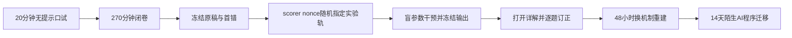

# 阶段测验 - 多元微积分、矩阵微分与自动微分（10.4）

> [!abstract] 测验目标
> 本卷检查能否把“求导公式”还原为局部线性算子，并在极限量词、Taylor余项、JVP/VJP、矩阵微分、隐式对象、谱分解与AD程序之间可靠切换。只会符号求导，或能调用框架却说不清传播对象、shape、正则性和数值验证边界，均不构成通过。

## 零、先看完整验收时间线

`CALC-CUM-01`不把“算出gradient”当作终点，而是检查能否在没有公式提示、计算图改变、参数逼近奇异边界和陌生AI模块中，始终辨认同一个导数对象及其证据边界。后阶段获得的信息不能倒填前阶段的独立记录。



执行前建立唯一`attempt_id`，建议格式为`CALC-CUM-01-YYYYMMDD-A`。口试记录、闭卷原稿、评分表、nonce、终端输出、干预SVG与延迟复测全部使用同一ID；打开详解后不得覆盖第一次答案。

> [!important] 材料状态与个人状态分离
> `material_status: regression-passed`只说明题卷、详解、脚本、SVG和独立审计彼此自洽；`learning_status: not-attempted`才描述当前个人证据。材料通过不能把CALC-01—16自动改成mastered。

### 0.1 八层微分与程序账本

| 层 | 必须先写清 | 本卷固定对象 | 常见偷换 |
|---|---|---|---|
| 空间与量词 | domain/codomain、norm、邻域、量词顺序 | $\phi,F,A(\theta),T_\tau$ | 有限采样代替极限或一致性 |
| 导数本体 | bounded linear map、余项尺度 | $Df(x)[h]$、$dA$ | 偏导/方向导数存在即全微分 |
| 几何表示 | inner product、covector/vector、adjoint | gradient、Frobenius pairing | 把gradient当作与metric无关的数组 |
| 一阶/二阶作用 | JVP、VJP、bilinear form、HVP | $Jv,J^*u,Hv$ | 物化数组后忘记输入输出shape |
| 复合与共享 | primal DAG、局部pushforward/pullback、分支累加 | solve/log-det共享$A$ | 链式顺序、广播或共享梯度漏加 |
| 隐式/谱/换元 | invertibility、gap、gauge、Jacobian determinant | $A x=b$、$A_\tau$、$T_\tau$ | local IFT当global；重谱列向量当规范对象 |
| 程序与数值 | mathematical function、executed program、AD rule、dtype | forward/reverse/checkpoint | AD exactness等同浮点无误差 |
| 证据 | proof、Taylor test、pairing、residual、held-out task | 四层验证合同 | 一个finite difference或benchmark证明全称命题 |

### 0.2 四个贯穿模型族

1. **模型族I：极限—导数—Taylor—多元方向。** $\phi(t)=\log(1+e^t)$与$F(x,y)=\log(e^x+e^y)$贯穿CALC-01—04；
2. **模型族II：统一全微分—几何—JVP/VJP—曲率。** $F$及$p=\nabla F=\operatorname{softmax}$贯穿CALC-05—08；
3. **模型族III：共享矩阵上的计算图。** $A(\theta)x=b$与solve/log-det复合损失贯穿CALC-09—12；
4. **模型族IV：谱—可逆—换元—程序语义。** $T_\tau=R_\tau\operatorname{diag}(2e^\tau,1)$及$A_\tau=T_\tau T_\tau^\top$贯穿CALC-13—16。

每一族都必须回答：输入输出空间是什么；导数作为哪个线性算子存在；采用何种norm/inner product；哪个regularity、invertibility或gap条件在分母中；实现检查的是数学函数、具体程序还是浮点近似。

### 0.3 答案隔离协议

1. 口试时关闭题卷正文以外的全部笔记，只保留录音或逐字记录；
2. 闭卷结束立即扫描或提交只读原稿，记录用时与未完成项；
3. 由评分者给出nonce后才计算轨道，学习者不能反复选择最熟悉的一轨；
4. canonical结果只用于确认环境，盲干预必须先写预测、再运行新output；
5. 冻结实验输出后才打开[[阶段测验解答 - 多元微积分、矩阵微分与自动微分（10.4）|详解]]；订正使用新文件，不改原答。

## 一、规则与允许工具

- 笔试270分钟，满分100分，闭卷；
- 可用基础计算器，不可使用代码、CAS、AI助手或笔记；
- 每个导数必须先声明为哪两个空间之间的linear map，再决定是否写Jacobian matrix；
- 写gradient必须声明inner product；写implicit derivative必须声明被求逆的Jacobian block；
- 谱导数必须核对simple/repeated spectrum与gauge；换元必须核对local/global injectivity与Jacobian determinant；
- AD实现的浮点稳定性深度属于10.8，本卷仍要求区分AD、symbolic differentiation与finite difference；
- 开始笔试前先完成第十节20分钟卷级口试；口试不计入100分，但必须通过；
- 笔试后另有不计入100分但必须通过的[[实验 - 微积分、矩阵微分与自动微分累计复现门|计算复现门]]。

## 二、评分与通过标准

| 能力区 | 分值 | 题号 | 单项通过线 |
|---|---:|---|---:|
| A 对象、条件、shape与量词 | 20 | 1—4 | 14/20 |
| B 手算与传播 | 25 | 5—8 | 17/25 |
| C 完整证明与统一结构 | 30 | 9—11 | 21/30 |
| D 反例与程序声明审计 | 15 | 12—13 | 10/15 |
| E AI迁移与验证合同 | 10 | 14 | 7/10 |
| **合计** | **100** |  | **80/100** |

通过还要求：卷级口试通过；第9—11题均不得为0且至少两题达到70%；第12题至少五个合法反例；第13题必须识别mathematical/program/numerical semantics、local/global与simple/repeated spectrum三类偷换；评分者随机轨道与盲干预通过；48小时重做和14天迁移完成。

> [!warning] 状态语义
> `CALC-CUM-01`材料达到`regression-passed`只表示验收工具自洽。没有真实口试/闭卷原稿、逐项评分、盲干预与延迟证据时，CALC-01—16保持`draft / not-attempted`。

## 三、CALC-01—16覆盖矩阵

| 主链 | 节点 | 主要题号 |
|---|---|---|
| 极限—导数—Taylor—多元可微 | CALC-01—05 | 1—5、9、12—14 |
| gradient—Jacobian—Hessian—chain rule | CALC-06—09 | 1—6、9、11—14 |
| 矩阵微分—solve/logdet—谱导数 | CALC-10—13 | 1—4、7—8、10—14 |
| inverse/implicit—change of variables—AD | CALC-14—16 | 1—4、8、10—14 |

## 四、A区：对象、条件、shape与量词（20分）

### 第1题：十个断言（5分）

判断正误；错误时给最小修正或反例。每项0.5分。

1. Fréchet differentiability at $x$ implies continuity at $x$。
2. 若函数在一点沿每个方向的directional derivative都存在，则它在该点Fréchet differentiable。
3. 若所有first partial derivatives在一点的某邻域存在且连续，则函数在该点Fréchet differentiable。
4. 微分$df_x$不依赖inner product，因此gradient $\nabla f(x)$也不依赖inner product。
5. 对$f:\mathbb R^n\to\mathbb R^m$，JVP把$\mathbb R^n$方向送到$\mathbb R^m$，VJP把output covector拉回$\mathbb R^n$ covector。
6. Twice differentiable函数在critical point的Hessian PSD足以推出strict local minimum。
7. 对invertible $A$，$d(A^{-1})=-A^{-1}(dA)A^{-1}$。
8. 对每个square matrix $A$，都有$d\log\det A=\operatorname{tr}(A^{-1}dA)$。
9. repeated eigenvalue处每个individual normalized eigenvector都有唯一、连续的导数。
10. scalar-output程序使用reverse mode永远比forward mode更便宜、更省内存。

### 第2题：五组对象合同（5分）

分别写定义、所在空间、关键条件与一个AI调用点。每项1分。

1. limit/continuity、pointwise/uniform convergence与“有限图像看似收敛”的差别；
2. Gâteaux/directional、Fréchet derivative、differential与gradient；
3. Jacobian、JVP、VJP、Hessian bilinear form与HVP；
4. matrix differential、adjoint/trace pairing、implicit derivative与condition；
5. forward/reverse AD、finite difference、checkpointing与stop-gradient。

### 第3题：五个定理合同（5分）

写主要hypotheses、conclusion和一个不能推出的结论：mean value/Taylor remainder、Fréchet chain rule、inverse/implicit function theorem、multivariable change of variables、simple Hermitian eigenvalue derivative。（每项1分）

### 第4题：shape与传播审计（5分）

令$f:\mathbb R^n\to\mathbb R^m$、$g:\mathbb R^m\to\mathbb R$，$A(\theta)\in\mathbb R^{p\times p}$、$b(\theta)\in\mathbb R^p$，$A(\theta)x(\theta)=b(\theta)$。

1. 写$Df(x)$、Jacobian、JVP $Df(x)[v]$与VJP $Df(x)^*[u]$的domain/codomain或shape。（1分）
2. 写$D(g\circ f)(x)$的operator顺序；reverse accumulation为什么按相反图顺序传播？（1分）
3. 写$x'[\dot\theta]$满足的linear system与scalar loss $\ell(x)$的adjoint system。（1分）
4. 若$F(X)=\operatorname{tr}(C^TAXB)$，写$dF$并给$\nabla_XF$的shape。（1分）
5. 若$y=T(x)$是$\mathbb R^n$上的diffeomorphism，写density change；若$T$非injective，缺少什么求和/分支信息？（1分）

## 五、B区：手算与传播（25分）

### 第5题：局部线性化、Taylor与曲率（6分）

令
$$
f(x,y)=e^{xy}+\frac12x^2+y^3.
$$

1. 求$f(0,0)$、gradient与Hessian。（2分）
2. 写二阶Taylor polynomial及$O(\|(x,y)\|^3)$余项声明。（1.5分）
3. 求Hessian eigenvalues并判断原点是否local min/max/saddle。（1.5分）
4. 对direction $v=(a,b)^T$写一阶与二阶directional variation，说明gradient为0为何仍不能判定极值。（1分）

### 第6题：计算图、JVP、VJP与HVP（7分）

定义
$$
u=x_1x_2,\quad v=\sin u,\quad w=x_1^2+v,\quad L=\frac12w^2.
$$
在$x=(1,2)^T$，令$s=\sin2,c=\cos2$。

1. 画出DAG并完成forward values。（1分）
2. 对direction $p=(1,-1)^T$前向传播JVP，求$DL(x)[p]$。（2分）
3. 反向传播所有adjoints，求$\nabla L(x)$并核对与第2问的pairing。（2分）
4. 不物化完整三阶对象，求$\nabla^2L(x)p$。（2分）

### 第7题：solve、implicit derivative、adjoint与log-det（7分）

令
$$
A(\theta)=\begin{bmatrix}2+\theta&1\\1&2\end{bmatrix},
\qquad
b(\theta)=\begin{bmatrix}1\\\theta\end{bmatrix},
\qquad A(\theta)x(\theta)=b(\theta).
$$

1. 求$x(0)$与$x'(0)$，不得通过显式展开$A(\theta)^{-1}$后逐项求导。（2.5分）
2. 对$\ell(\theta)=\frac12\|x(\theta)\|_2^2$求$\ell'(0)$。（1.5分）
3. 用一个adjoint solve重算$\ell'(0)$，注明adjoint变量shape。（1.5分）
4. 求$\frac d{d\theta}\log\det A(\theta)|_{\theta=0}$，并用direct determinant核对。（1.5分）

### 第8题：谱导数、重根与换元（5分）

令
$$
H(t)=\begin{bmatrix}2&t\\t&1\end{bmatrix}.
$$

1. 在$t=0$求top eigenvalue与对应unit eigenvector的一阶导数，并用exact eigenvalues核对。（2分）
2. 把$H(0)$改为$I$、perturbation改为$\operatorname{diag}(1,-1)$：为什么“第一个eigenvector的导数”不再是basis-invariant对象？可稳定报告什么？（1分）
3. 对linear change $y=T x$、$T=\operatorname{diag}(2,3)$，写积分换元与density pullback公式；明确determinant因子位于哪一侧。（2分）

## 六、C区：完整证明与统一结构（30分）

### 第9题：Fréchet—chain rule—Taylor统一证明（10分）

1. 证明Fréchet derivative若存在则唯一且函数在该点连续；（3分）
2. 从两个$o(\|h\|)$余项证明Fréchet chain rule，并指出中间增量为什么是$O(\|h\|)$；（3分）
3. 若$f\in C^2$，沿$\phi(t)=f(x+th)$推导二阶Taylor integral remainder；由此给gradient Lipschitz时的descent lemma。（4分）

### 第10题：implicit—adjoint—change of variables统一证明（10分）

1. 对$F(x,\theta)=0$，在$F_x$ invertible且正则条件满足时推导
   $$
   Dx(\theta)[\dot\theta]=-F_x^{-1}F_\theta[\dot\theta];
   $$
   说明这是local结论。（3分）
2. 对scalar loss$\ell(x,\theta)$推导adjoint system $F_x^*\lambda=\nabla_x\ell$与不显式形成$x'$的total derivative。（3分）
3. 先证明invertible linear map的volume factor为$|\det T|$，再陈述diffeomorphism换元公式；说明noninjective map和维数改变分别需要什么额外理论。（4分）

### 第11题：矩阵微分—谱导数—AD统一证明（10分）

1. 用Frobenius pairing推导
   $$
   d\operatorname{tr}(C^TAXB),\quad d(A^{-1}),\quad d\log\det A,
   $$
   并说明invertibility/branch条件。（3分）
2. 对Hermitian simple eigenpair $Hu=\lambda u$、$u^*u=1$，推导$\dot\lambda=u^*\dot H u$与eigenvector derivative的gap denominators；解释重根时为何转向projector/subspace derivative。（3分）
3. 用计算图上的局部pullback归纳证明reverse AD计算scalar output对所有inputs的VJP；再说明forward-over-reverse如何计算HVP，以及checkpointing改变什么、不改变什么。（4分）

## 七、D区：反例与程序声明审计（15分）

### 第12题：六个最小反例（9分）

每项给对象、核对条件、否定结论并写最小修正。每项1.5分。

1. 检查有限条路径不能证明多元极限存在；
2. 所有partial/directional derivatives存在不保证Fréchet differentiable；
3. critical point Hessian PSD不保证strict local minimum；
4. finite-difference step越小不一定越准确；
5. repeated eigenvalue处individual eigenvector derivative不是规范对象；
6. Jacobian在每点invertible或local inverse存在不保证global injectivity。

### 第13题：AI自动微分报告审计（6分）

某报告声称：

> Gradient是函数固有向量，与metric无关。为准确反向传播应物化每层完整Jacobian。Scalar loss总应使用reverse mode，因为它同时最快且最省内存。固定点层展开100步与implicit differentiation给出的梯度理论上完全相同。AD没有数值误差，所以无需gradient check。log-det公式对奇异Jacobian也直接成立。Top eigenvalue连续就说明top eigenvector梯度稳定。重根处框架返回的某组eigenvectors可直接跨step比较。Checkpointing会改变数学梯度。有限差分越小越可信。一个benchmark通过证明自定义VJP对任意shape、控制流和高阶导数都正确。

识别至少八个独立错误，并改写为区分数学函数、实际程序、AD rule、浮点计算和empirical validation的可证伪报告。（6分）

## 八、E区：AI迁移与验证合同（10分）

### 第14题：可微AI层的完整合同（10分）

为一个同时含attention/normalization、matrix solve或fixed point、log-det或spectral operation的可微AI模块建立合同：

1. 声明输入输出空间、batch/broadcast shapes、inner products与primal program；（2分）
2. 给出JVP/VJP/HVP路线和forward/reverse/checkpoint策略，说明时间—内存权衡；（2分）
3. 对implicit、log-det和spectral子层写正则性、condition、residual、gap与gauge要求；（2分）
4. 建立Taylor/directional finite difference、adjoint pairing、solve residual与subspace-invariant四层验证；（2分）
5. 设计multiple seeds/shapes/dtypes、edge cases、held-out task和failure criteria；写两条实验不能单独推出的结论。（2分）

## 九、答题后证据协议

冻结原稿后才打开解答，并把首个错误分类为`limit-quantifier / directional-vs-Frechet / Taylor-remainder / metric-gradient / JVP-VJP-shape / Hessian-HVP / chain-graph / matrix-layout / implicit-adjoint / logdet-change-variable / spectral-gap-gauge / AD-program-semantics`。随后完成随机计算轨道、事前预测干预、48小时重做与14天迁移。

```text
日期：
用时：
A / B / C / D / E：
总分：
第一个错误对象：
随机轨道：A / B / C
参数干预：
48小时复测：
14天迁移：
评分者：
状态：not-attempted / attempted / passed / retained
```

## 十、20分钟卷级口试

评分者从六个题簇中抽四题，其中第1题与第6题必抽。每题最多给一次“请补空间、norm、余项、regularity或程序语义”的澄清，不得给公式提示。学习者应先口述对象合同，再写最小公式；只背公式而无法解释类型不通过。

### 口试题簇

1. **从极限到全微分：**用量词说明连续、方向可微和Fréchet可微的差别；解释为什么同一个bounded linear map必须统一控制所有小方向；
2. **微分—梯度—JVP/VJP：**说明covector、metric、Jacobian representation、pushforward与pullback各是什么对象，为什么gradient会随inner product改变；
3. **Taylor—Hessian—finite difference：**区分二阶模型、余项证书、HVP和差分验证；解释步长过小为何可能更差；
4. **计算图与自动微分：**在一个有共享变量和广播的DAG上口述forward JVP与reverse VJP，说明反向贡献为何必须累加；
5. **隐式—log-det—谱—换元：**说明invertibility、condition、spectral gap、gauge与global injectivity分别控制哪个结论；
6. **AI声明出口：**审计“AD没有数值误差”“local Jacobian非奇异即flow全局双射”“top eigenvalue连续即eigenvector gradient稳定”“finite difference吻合即custom VJP对所有程序正确”。

### 口试通过线

- 四题中至少三题达到“对象、条件、推导、边界”四项中的三项；
- 第1题必须说出统一$o(\|h\|)$余项，第6题必须区分数学函数、执行程序、AD rule与浮点结果；
- 出现shape不可能、把VJP方向写反、把重谱individual eigenvector当规范对象、或把局部逆定理当全局双射时，该题直接不通过；
- 未通过时先回到对应节点和最小反例，24小时后换题重试，不提前开始闭卷。

## 十一、交卷后的错误分类与逐题复盘

冻结原稿后，对每个失分点记录“首个失效层”，而不是只抄正确答案：

| 错误类别 | 首要诊断问题 | 最小补救 |
|---|---|---|
| `limit-quantifier` | 是否写清“对任意—存在—对所有”的依赖？ | 重写一个$\varepsilon$证书和一个uniform反例 |
| `directional-vs-Frechet` | 是否存在同一个linear map及统一余项？ | 沿两类路径核对反例，再写Fréchet定义 |
| `metric-gradient` | 固定的是differential还是gradient数组？ | 在Euclidean与$G$-metric下表示同一covector |
| `JVP-VJP-shape` | tangent/cotangent来自哪个空间？ | 先写operator type，再做pairing test |
| `Taylor-HVP` | 二阶对象是bilinear form、matrix还是作用？ | 用两方向写$D^2f[h,k]$并恢复HVP |
| `chain-graph` | primal依赖和reverse累加是否完整？ | 画DAG并标每条edge的局部push/pull |
| `matrix-layout` | Frobenius配对、转置和结构约束是否一致？ | 从$dF=\langle G,dX\rangle_F$重新隔离$dX$ |
| `implicit-adjoint` | 被求逆的Jacobian block与伴随方程是什么？ | 先写tangent solve，再写adjoint solve |
| `spectral-gap-gauge` | 目标是谱值、单向量还是subspace？ | 把列向量误差改为projector/principal angle |
| `AD-program-semantics` | 数学函数与实际执行程序是否相同？ | 列出control flow、stop-gradient、mutation与dtype |

每题复盘必须包含：原答摘录；第一处错误；正确对象/条件；最短修复；一个换shape或换机制的新题；48小时是否仍能无提示重建。

## 十二、48小时与14天保持性门

### 48小时：换机制空白重建

关闭详解、原答和代码，由评分者改变至少一个机制量：

1. 改变Softplus/LogSumExp的方向、展开点或norm，重新区分directional与uniform局部结论；
2. 改变metric、输入输出维数、shared branch或HVP方向，重新写JVP/VJP与二阶作用；
3. 改变$A(\theta)$的右端、共享分支或最小奇异值，重新构造tangent/adjoint与log-det条件；
4. 改变$T_\tau$的伸缩、spectral gap、观测点或程序分解，重新区分谱基、diffeomorphism与AD语义。

学习者必须写出最早失效的条件、两个事前定量预测、一条exact identity、一条first-order/numerical结论和一条不能推出的AI声明。只替换符号或复述canonical数字不通过。

### 14天：陌生AI程序迁移

从normalizing flow、implicit/deep-equilibrium layer、spectral normalization、attention/normalization或differentiable solver中随机选一个未见模块，提交一页operator report：

- primal program与输入输出空间；
- JVP/VJP/HVP路线及time-memory选择；
- regularity、invertibility、condition、gap、gauge或measure条件；
- proof、Taylor test、adjoint pairing、residual和held-out experiment的分工；
- 一个最小失败反例及停止声明的failure criterion。

只有闭卷、随机实验、48小时重建与14天迁移均留有独立证据，卷级状态才可从`passed`进入`retained`；逐节点掌握仍需回到CALC-01—16审查。

## 十三、证据清单

```text
attempt_id：
口试日期/题簇/录音或逐字稿：
闭卷日期/用时/原稿只读位置：
A / B / C / D / E与总分：
首个错误类别：
scorer nonce与随机轨道：
canonical终端输出/hash：
盲参数与事前预测：
intervention终端输出/SVG/hash：
详解打开时间与订正文件：
48小时换机制记录：
14天陌生模块报告：
评分者签名：
状态：not-attempted / attempted / passed / retained
```

## 十四、解答入口

完成并冻结口试、闭卷、随机轨道和盲干预后，才打开[[阶段测验解答 - 多元微积分、矩阵微分与自动微分（10.4）]]。若只是学习某个局部定理，应回到对应CALC节点或习题解答，不要把卷级详解当作第一次学习材料。
