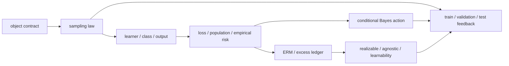

# 阶段测验 - 学习问题、决策与风险（20.1）

> [!abstract] 测验目标
> 本卷不检查八章名词能否逐条背诵，而检查一份学习问题合同能否从头运行：先声明 population、sample、learner、predictor、loss 与 target risk；再区分 Bayes、类内 oracle、ERM 与实际计算输出；随后推导条件 Bayes 决策、固定预测器无偏性和 approximate-ERM 超额风险桥梁；最后审计 train/validation/test 的信息反馈、适应性复用与陌生 AI 评价合同。若概率没有随机性来源、风险没有目标分布、最优没有 comparator、测试集已经反馈却仍称“独立”，答案即使公式漂亮也不能通过。

## 零、先看完整验收时间线


七步是一条有顺序的证据链，不是可任选的练习清单。口试先检查对象和量词是否可调用；闭卷检查推导；随机实验检查能否在未见参数上把解析预测与程序证据对齐；延迟门检查是否形成可迁移结构。后补预测、覆盖原稿、先看 canonical 输出再手算，均不构成首次证据。

## 一、规则与允许工具

- 先完成 20 分钟无提示口试；口试未过仍可参加笔试诊断，但本次最高记 `attempted`；
- 笔试 210 分钟，满分 100 分，闭卷；
- 只允许基础计算器；不可使用代码、CAS、AI 助手、Obsidian 搜索、反向链接或笔记；
- 每个 $P,S,s,A,h,\mathcal H,\ell,R$ 必须说明类型或由题面唯一确定；
- “以至少 $1-\delta$ 概率”必须说明概率对 sample、algorithm seed、test draw 还是其他随机性取；
- argmin 不得默认存在；需要时写 infimum、approximate minimizer 或 existence 条件；
- 证明题必须标出 hypotheses、插入项、比较对象和 closure；
- 反例必须满足被反驳声明的全部前提；
- 可使用 Hoeffding：对独立 $U_i\in[0,1]$，

  $$P\left(\left|m^{-1}\sum_iU_i-\mathbb EU_i\right|>t\right)\le2e^{-2mt^2};$$

- 闭卷后另有不计入 100 分但必须通过的[[实验 - 学习问题、决策与风险累计复现门|三轨累计复现门]]。

## 二、评分与通过标准

| 能力区 | 分值 | 题号 | 单项通过线 |
|---|---:|---|---:|
| A 对象、定义与量词 | 20 | 1—4 | 14/20 |
| B 手算、构造与解释 | 30 | 5—8 | 21/30 |
| C 完整证明与统一推导 | 25 | 9—11 | 17/25 |
| D 反例、边界与信息流审计 | 15 | 12—13 | 10/15 |
| E 陌生 AI 评价迁移 | 10 | 14 | 7/10 |
| **合计** | **100** |  | **80/100** |

通过必须同时满足：

1. 总分至少 80，A—E 各区达线；
2. 第 9—11 题至少两题达到该题 70%，且三题均不得为 0；
3. 第 6 题必须正确识别 loss-dependent Bayes action；
4. 第 10 题的 approximate-ERM 推导不得把 data-dependent 输出当 fixed hypothesis；
5. 第 13 或 14 题必须画对 information-flow feedback；
6. 20 分钟口试与累计复现门通过；
7. 48 小时换机制重建、14 天陌生评价迁移完成后，状态才可记 `retained`。

> [!warning] 状态语义
> 题卷、详解、脚本、总图和独立审计达到 `regression-passed`，只表示验收工具自洽。没有个人口试、闭卷原稿、scorer nonce、运行前预测、盲参输出和延迟复测时，LT-01—08 仍是 `draft / not-attempted`。

## 三、LT-01—08 覆盖矩阵



| ID | 核心节点 | 主要题号 |
|---|---|---|
| LT-01 | [[统计学习问题的对象合同]] | 1、3、9、12—14 |
| LT-02 | [[数据生成分布与采样假设]] | 1—3、5、8、9、13、14 |
| LT-03 | [[预测器、假设空间与学习算法]] | 1、3、5、7、10、12、14 |
| LT-04 | [[损失、总体风险与经验风险]] | 1、4—6、9—12、14 |
| LT-05 | [[经验风险最小化、近似 ERM 与超额风险分解]] | 4、7、10、12、14 |
| LT-06 | [[Bayes 决策、Bayes 预测器与 Bayes 风险]] | 4、6、7、11、12、14 |
| LT-07 | [[可实现、不可知、相合性与可学习性]] | 2、4、7、12、14 |
| LT-08 | [[训练集、验证集、测试集与自适应复用]] | 2、3、8、9、12—14 |

### 三轨参数化模型族

| 轨道 | 模型族 | 主参数 | 机制变化时必须重写 |
|---|---|---|---|
| A 对象—风险—选择 | binary $(X,Y)$、0–1 loss、finite $\mathcal H$ | $(\pi,\eta_0,\eta_1,m,\mathcal H)$ | Bayes/class oracle、sample law、ERM selection 与三笔差 |
| B Bayes decision | $r(a\mid x)$、cost/reject actions | $(c_{FP},c_{FN},c_R,\eta)$ | threshold、reject interval 与 optimal action |
| C evaluation feedback | finite candidates + holdout | $(K,n,q,\delta)$ 与反馈图 | order statistic、simultaneous radius、fresh-test 合同 |

### 九层学习问题账本

综合题先逐层记账，后一层不得静默改写前一层：

1. **观察、标签与动作空间：** $X,Y,a$ 各属于哪里；
2. **世界与目标：** target population/distribution 是 $P$ 还是部署时 $Q$；
3. **样本与随机性：** $S$ 怎样抽，是否 i.i.d.，seed/feedback 是否进入概率空间；
4. **函数与算法：** parameter、predictor、class、learner、meta-learner 分别是什么；
5. **损失与风险：** pointwise loss、conditional/population/empirical/test risk 的 estimand；
6. **比较对象：** Bayes、class oracle、ERM、computed output 与 baseline；
7. **误差账：** target mismatch、approximation、selection/estimation、optimization、evaluation noise；
8. **信息流与证据：** 哪份数据影响拟合、选择、报告与后续开发；
9. **声明边界：** fixed vs data-dependent、finite vs asymptotic、in-distribution vs shift、statistical vs computational。

## 四、A 区：对象、定义与量词（20 分）

### 第 1 题：十个断言（5 分）

判断正误；错误时给出最小修正或最小反例。每项 0.5 分。

1. 随机样本 $S$ 与已经观察到的数据表 $s$ 是同一个数学对象。
2. 若 $S\sim P^m$，则样本中每个 observation 的边缘分布为 $P$，且 observations 相互独立。
3. 参数空间 $\Theta$ 与函数类 $\mathcal H$ 必须一一对应。
4. 若 $h$ 在抽样前固定且 loss 可积，则 i.i.d. 下 $\mathbb E_SR_S(h)=R_P(h)$。
5. 上式允许直接把 $h$ 替换成由同一 $S$ 训练的 $h_S$。
6. Bayes predictor 就是使用 Bayesian prior 训练出的 predictor。
7. Realizable 意味着有限样本 ERM 已经找到了真实 predictor。
8. Statistical consistency 自动给出一个对所有允许 $P$ 统一的有限样本复杂度。
9. 验证集未参与 gradient，所以用它反复选 architecture 不会使输出依赖验证集。
10. Fresh test 的无偏性不保证低方差，也不保证对部署分布 $Q\ne P$ 无偏。

### 第 2 题：量词、概率与学习状态（5 分）

1. 写出 agnostic PAC 风格声明的完整量词骨架，至少出现 $\varepsilon,\delta,P,m,S$ 与 learner 输出，并指出 sample probability 对谁取。（2 分）
2. 写出“对每个固定 $P$，$R_P(A(S_m))\to\inf_{h\in\mathcal H}R_P(h)$ in probability”的形式化定义。它与存在统一 $m(\varepsilon,\delta)$ 有何量词差异？（1.5 分）
3. 区分 `material_status: regression-passed`、学习者 `passed` 与 `retained`；说明为什么脚本 hash 不能改变个人状态。（1.5 分）

### 第 3 题：对象合同与信息流（5 分）

某团队说：“我们用 10 万条样本训练一个分类模型，验证准确率最高的是 best model，最后在 test 上报告结果。”请补齐一份最小合同：

1. $\mathcal X,\mathcal Y,\mathcal A,\mathcal Z$ 与 target law；（1 分）
2. train/validation/test 的抽样和独立性；（1 分）
3. parameterization、function class、learner 与 validation meta-learner 的类型；（1.5 分）
4. loss、selection metric、reported estimand 与 confidence source；（1 分）
5. 画出一个 test score 反馈给开发者后继续改模型的回路，并指出哪个“冻结”条件失效。（0.5 分）

### 第 4 题：四种最优对象与四种学习状态（5 分）

1. 分别定义 Bayes risk、class oracle value、empirical ERM value 与 $\rho$-approximate ERM output；若 argmin 不存在应怎样写？（2 分）
2. 区分 realizable、agnostic、empirical consistency、$\mathcal H$-consistency/PAC learnability；各自约束的是世界、样本拟合、渐近行为还是统一有限样本保证？（2 分）
3. “训练误差为零”最多直接关闭哪一个对象上的哪笔账？列出至少两笔仍未关闭的账。（1 分）

## 五、B 区：手算、构造与解释（30 分）

### 第 5 题：二元对象合同与四个风险（8 分）

设 $X,Y\in\{0,1\}$，$P(X=1)=0.4$，$P(Y=1\mid X=0)=0.2$，$P(Y=1\mid X=1)=0.75$，使用 0–1 loss。

1. 写出 $(X,Y)=(0,0),(0,1),(1,0),(1,1)$ 的联合概率。（1.5 分）
2. 对四个确定性函数 $h_{00}=(0,0),h_{01}=(0,1),h_{10}=(1,0),h_{11}=(1,1)$ 求总体风险。（2 分）
3. 求 Bayes predictor 与 Bayes risk。（1.5 分）
4. 若 $\mathcal H=\{h_{00},h_{11}\}$，求 class oracle 与 approximation error。（1 分）
5. 给定样本 count vector $(N_{00},N_{01},N_{10},N_{11})=(2,1,0,3)$，求两个类内 hypotheses 的经验风险和 lexicographic ERM；再计算该输出的总体风险。（1.5 分）
6. 解释为什么单个 count vector 不能给出“期望 ERM 风险”。（0.5 分）

### 第 6 题：成本敏感 Bayes 决策与 reject（8 分）

固定 $x$，令 $\eta=P(Y=1\mid X=x)$。false positive cost 为 1，false negative cost 为 2，reject cost 为 0.24。

1. 写出 action $0,1,\bot$ 的条件风险。（1.5 分）
2. 不允许 reject 时推导预测 1 的阈值。（1.5 分）
3. 推导 reject 同时严格优于 0 和 1 的 $\eta$ 区间，并说明端点如何处理。（2 分）
4. 对 $\eta\in\{0.12,0.38,0.62,0.88\}$ 分别计算 Bayes action 与最小条件风险。（2 分）
5. 指出其中至少一个 0–1 Bayes action 与当前部署 cost 下 Bayes action 不同的点；解释这为什么不是 posterior estimator 的统计误差。（1 分）

### 第 7 题：Bayes、类内、经验与计算输出的误差账（8 分）

某任务在 target $P$ 上有 $R_P^*=0.08$；给定类的 infimum 为 0.13；一次样本上的 exact ERM $\widehat h$ 满足 $R_P(\widehat h)=0.19$；实际 optimizer 输出 $\widetilde h$ 满足 $R_S(\widetilde h)\le R_S(\widehat h)+0.02$，且测得 $R_P(\widetilde h)=0.205$。

1. 计算 approximation error 与此次 exact ERM 的 class excess。（2 分）
2. 计算实际输出对 Bayes 的总 excess，并给出一个数值分账；说明总体 optimization contribution 为何不能仅从经验容差 0.02 断言“恰等于 0.02”。（2 分）
3. 若部署目标换成 $Q$ 且 $R_Q(\widetilde h)=0.31$，应新增哪笔账？为什么不能把它自动归为 estimation error？（1.5 分）
4. Realizable、agnostic 两种 comparator 下分别如何改写目标？（1 分）
5. 若类随验证集选择而改变，使用 fixed-$\mathcal H$ uniform bound 时还缺什么控制？（1.5 分）

### 第 8 题：验证选择、union bound 与 fresh test（6 分）

有 $K=20$ 个在看到 validation set 之前已经固定的候选，每个 loss 在 $[0,1]$，validation size 为 $n=500$，目标失败概率 $\delta=0.05$。

1. 从单模型 Hoeffding 与 union bound 推导同时控制全部候选的半径，并给出数值近似。（2 分）
2. 解释为何选最小验证风险后仍可使用这条 simultaneous event，但不能使用只为“事先固定的最终一个模型”写的单模型 event。（1.5 分）
3. 若每看一次 leaderboard 就训练一个新模型，重复 200 轮，指出 fixed candidate 证明的哪一步失效。（1 分）
4. 写出一个恢复可信 final estimate 的协议，区分 validation selection 与 fresh test evaluation。（1.5 分）

## 六、C 区：完整证明与统一推导（25 分）

### 第 9 题：固定预测器无偏性与 data dependence 裂缝（8 分）

设 $Z_i\overset{i.i.d.}{\sim}P$，$R_P(h)=\mathbb E\ell(h,Z)$，$R_S(h)=m^{-1}\sum_i\ell(h,Z_i)$，loss 可积。

1. 对抽样前固定的 $h$，从期望线性性完整证明 $\mathbb E_SR_S(h)=R_P(h)$。（2 分）
2. 指出证明中哪一步使用了“$h$ 不依赖 $S$”。（1 分）
3. 构造如下 memorization learner：$\mathcal Z$ 为一个大小 $N>m$ 的有限集合，$P$ 均匀，训练 loss 是“若输入在已见集合则预测正确，否则错误”。求 $R_S(h_S)$，并求 $R_P(h_S)$ 的表达式。（2 分）
4. 由此说明为什么不能把固定-$h$ 无偏式直接代入 $h_S$；再说明 fresh test 对给定已冻结 $h_S$ 的 conditional unbiasedness 如何写。（2 分）
5. 这是否证明所有 data-dependent learners 都有正的 expected generalization gap？说明边界。（1 分）

### 第 10 题：approximate ERM 的类内超额风险桥梁（9 分）

设

$$
R_S(\widetilde h)\le\inf_{h\in\mathcal H}R_S(h)+\rho.
$$

假设存在 class oracle $h_{\mathcal H}^*\in\arg\min_{h\in\mathcal H}R_P(h)$。

1. 在 $R_P(\widetilde h)-R_P(h_{\mathcal H}^*)$ 中插入两次经验风险，逐行推导

   $$
   R_P(\widetilde h)-R_P(h_{\mathcal H}^*)
   \le
   2\sup_{h\in\mathcal H}|R_P(h)-R_S(h)|+\rho.
   $$

   每一步写出使用的 inequality。（4 分）
2. 为什么只控制某个事先固定 $h$ 的 gap 不足以完成该证明？（1 分）
3. 加上 Bayes comparator，写出总 excess 的 approximation + class-excess 分解。（1 分）
4. 若 class oracle 不 attained，怎样用 $\varepsilon$-minimizer 修改证明？（1.5 分）
5. 举出一种不通过 uniform convergence 也可能泛化的算法路线，并说明本题 bound 是充分模板而非所有 learner 的必要条件。（1.5 分）

### 第 11 题：Bayes rule 的逐点条件风险证明（8 分）

设 observation 为 $X$，action space 为 $\mathcal A$，loss 为 $\ell(a,Y)$。假设 regular conditional law 存在，且存在 measurable selector

$$
h^*(x)\in\arg\min_{a\in\mathcal A}
r(a\mid x),
\qquad
r(a\mid x)=\mathbb E[\ell(a,Y)\mid X=x].
$$

1. 使用 tower property 证明 $R_P(h)=\mathbb E_Xr(h(X)\mid X)$。（2 分）
2. 从逐点最优推出对任意 measurable $h$ 有 $R_P(h^*)\le R_P(h)$。（2 分）
3. 对 binary 0–1 loss 推导 posterior mode rule 与 Bayes risk $\mathbb E_X\min\{\eta(X),1-\eta(X)\}$。（2 分）
4. 对 square loss 推导条件均值；需明确所需 moment/existence 条件。（1 分）
5. 说明改变 observation、action space 或 loss 为什么会改变 Bayes risk；列出一个 measurable selection/existence 边界。（1 分）

## 七、D 区：反例、边界与信息流审计（15 分）

### 第 12 题：六个学习理论声明审计（10 分）

对以下声明逐项完成：指出第一个错误对象或量词；给最小反例/边界；改成可验证版本。前四项各 2 分，后两项各 1 分。

1. “训练误差为零，所以真实标签函数属于当前假设类，且模型已达到 Bayes risk。”
2. “对每个分布算法最终都相合，所以存在一个与分布无关的统一样本复杂度。”
3. “固定 $h$ 的经验风险无偏，因此 ERM 选出的 $h_S$ 的训练风险也是其总体风险的无偏估计。”
4. “模型的 posterior accuracy 很高，所以 $1/2$ 阈值在任何业务成本下都是 Bayes optimal。”
5. “validation 不参与梯度，因此可以无限次复用而不产生 selection bias。”
6. “test error 很低，所以部署分布上每个 subgroup 的风险都很低。”

### 第 13 题：公开 benchmark 的反馈回路（5 分）

一个团队连续三个月查看同一公开 benchmark 排名；每次根据分数修改 prompt、过滤数据、选择 checkpoint 与解码参数，最后把最高分称为“独立 test performance”。

1. 画出 dataset/score/developer/pipeline 的反馈图，指出最终 pipeline 依赖哪些信息。（1.5 分）
2. 区分 leakage、multiple selection、adaptive reuse 与 distribution shift；本案例至少涉及哪些？（1.5 分）
3. 提出一个可执行修复：development benchmark、封存 final set、查询预算/反馈限制、预注册与 fresh sample 怎样组合。（1.5 分）
4. 即使 fresh final estimate 无偏，为什么仍需置信区间与 subgroup/shift 审计？（0.5 分）

## 八、E 区：陌生 AI 评价迁移（10 分）

### 第 14 题：建立一份可审计的医疗 triage 学习合同（10 分）

任务：根据急诊到院时信息输出“立即干预 / 常规处理 / 请求更多检查”之一。不同漏诊、误报与追加检查具有不同成本；医院希望用历史多院数据训练，并在新医院部署。

提交一份完整合同：

1. **对象与世界：** observation、latent outcome、action、source hospitals、target hospital 与 sampling unit；（1.5 分）
2. **learner 与输出：** parameterization、function class、algorithm、random seed、preprocessing 与 threshold/reject selection；（1.5 分）
3. **loss 与 Bayes decision：** 成本矩阵、conditional risk、允许 reject 后的 action；说明为何 accuracy 不是完整目标；（2 分）
4. **风险账：** Bayes/class/estimation/optimization/evaluation/target-shift 六层至少写五层，并给 comparator；（1.5 分）
5. **数据与反馈：** train/validation/test/external-site split，patient-level independence、temporal leakage 与 adaptive tuning 控制；（1.5 分）
6. **证据与边界：** point estimate/interval、subgroup、calibration、shift、至少一个不可由现有实验推出的 causal/deployment claim；（1 分）
7. **失败与复现：** 一个合法 failure case、冻结/版本/hash 方案与重采样触发条件。（1 分）

答案不要求给临床建议；评分对象是学习理论合同能否让统计、决策与评价问题同时可复核。

## 九、答题后的证据协议

### 答案与输出隔离协议

1. 作答期间只允许打开本题卷与空白证据目录；不得打开详解、实验固定 fixture、canonical stdout/SVG 源码或审计脚本；
2. 交卷后记录 `attempt_id`、起止时间和原稿 SHA-256；原稿只读冻结；
3. 评分者随后公布 `scorer nonce`，指定[[实验 - 学习问题、决策与风险累计复现门]]主轨和跨轨盲参数；
4. 运行前冻结解析预测；非默认输出必须写入个人路径，不覆盖 canonical 资产；
5. 命令、stdout、SVG、SHA-256 与偏差解释冻结后，才可打开详解；
6. 订正另页书写，保留第一个错误对象、第一处错误条件化或第一个无根据不等式。

### 首次执行协议

1. 每题记录用时、把握度与首次答案；
2. 先计算 A—E 分区，不用总分掩盖关键区失败；
3. 错误分类为 `object / sampling / randomness / loss / comparator / dependence / bound / decision / feedback / transfer`；
4. 回链 LT-01—08，写“第一个断点”，而非只抄正确答案；
5. 完成 nonce 主轨、跨轨盲参和运行前预测；
6. 48 小时完成换机制重建，14 天完成陌生 AI 评价合同。

## 十、20 分钟卷级口试

评分者从六个题簇抽四题；第 1、4 题必抽。每题先说对象与概率空间，再说公式；每题最多一次澄清，不给公式提示。

1. **七对象合同：** 从未知世界到 risk，依次给 $P,S,A,h,\ell,R$ 的类型与随机性；
2. **fixed 与 selected：** 为什么固定-$h$ 无偏式不能直接代入 $h_S$，fresh test 又怎样恢复条件无偏；
3. **四个最优对象：** Bayes、class oracle、ERM、computed output 的集合与风险各是什么；
4. **Bayes 决策：** 从 conditional risk 推出 cost-sensitive threshold，解释 Bayes decision 不等于 Bayesian training；
5. **learnability 量词：** realizable/agnostic、consistency、PAC 与 efficient learning 各回答什么；
6. **评价反馈：** validation 何时成为 meta-learner 输入，test reuse 的反馈箭头如何破坏冻结条件。

口试红线：把 $S$ 与 $s$ 混写、概率没有随机来源、Bayes 等同 Bayesian、把训练零错当 population guarantee、把 validation 未参与梯度当独立、把 material PASS 当个人通过。任一红线经追问仍不能修正，口试不通过。通过要求四问中至少三问完整，另一问能在追问后补齐对象—条件—结论—边界。

## 十一、48 小时换机制重建门

评分者至少改变两种机制：函数类 constant/full 切换；0–1 loss 改为不对称 cost/reject；fixed candidates 改成 adaptive feedback；source/target law 发生 shift。学习者不得照抄原数字，需无提示：

1. 重建九层账本；
2. 完成首次错题的同构变式；
3. 先写新公式、comparator 与失败边界，再运行个人输出；
4. 解释旧结论中哪一步因机制改变而失效；
5. 冻结第二份原稿与 hash。

只有重新达到分区线且不重复红线错误，首次 `passed` 才保持有效。

## 十二、14 天陌生 AI 评价迁移门

从 recommendation、LLM evaluation、fraud detection、robot policy evaluation 或 scientific surrogate 中选一个未在题卷出现的场景，提交两页合同：对象/target law；sampling/feedback 图；loss/action；Bayes/class comparator；风险分账；train/validation/test protocol；一个 data-dependent selection failure；fresh evaluation 与 uncertainty；不能推出的 deployment/causal claim。仅把第 14 题名词替换不算迁移。

## 十三、提交证据清单

- 口试抽题、录音/摘要、评分和红线记录；
- 首次闭卷原稿、`attempt_id`、起止时间、SHA-256；
- A—E 分区、逐题得分、错误分类与 LT 回链；
- scorer nonce、主轨与跨轨盲参、运行前预测；
- 命令、stdout、SVG、hash 与偏差解释；
- 独立订正版、48 小时变式、14 天迁移合同；
- 最终状态只能取 `not-attempted / attempted / passed / retained`。

## 十四、解答入口与记录模板

冻结全部首次证据后，才可打开[[阶段测验解答 - 学习问题、决策与风险（20.1）]]。

```text
日期 / attempt_id：
口试：
闭卷起止时间：
A / B / C / D / E：
总分 / 未达区线：
第一个对象或条件化断点：
错误类型：
scorer nonce / 主轨 / 跨轨参数：
原稿 SHA-256：
stdout / SVG SHA-256：
48 小时：
14 天：
评分者：
状态：not-attempted / attempted / passed / retained
```
