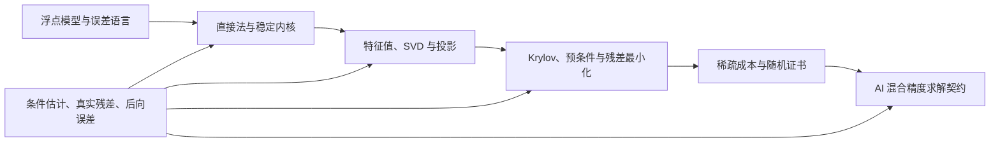

# 阶段测验 - 数值计算与数值线性代数（10.8）

> [!abstract] 测验目标
> 本卷末测验不检查是否背会了 20 章目录，而检查一条完整能力链：能否从浮点模型出发，区分问题条件性和算法稳定性，为直接/迭代/谱/随机算法推导残差证书，构造失败边界，并把这些契约迁移到 AI 系统。

## 一、测验规则

- 笔试时间：180 分钟；满分 100 分；
- 笔试闭卷，可用无符号代数功能的基础计算器；
- 不允许使用 CAS、代码、AI 助手或查看笔记；
- 每题必须展示对象/形状、关键中间式、所用假设与结论边界；
- 只写“稳定”、“收敛”、“条件差”而不给度量或契约，不得该结论分；
- 笔试后还有一项不计分但必须通过的实验复现门，见第八节。

## 二、评分与通过标准

| 能力 | 分值 | 题号 | 单项通过线 |
|---|---:|---|---:|
| A 定义、对象与条件 | 20 | 1—4 | 14/20 |
| B 手算、构造与追踪 | 30 | 5—8 | 21/30 |
| C 推导、证明与算法骨架 | 25 | 9—11 | 17/25 |
| D 失败边界、反例与纠错 | 15 | 12—13 | 10/15 |
| E AI 迁移与研究契约 | 10 | 14 | 7/10 |
| **合计** | **100** |  | **80/100** |

通过必须同时满足：

1. 总分至少 80；
2. A–E 五个能力区均达单项通过线；
3. 第 9 题的残差—条件—迭代改进主推导不得为 0；
4. 第 12 题的数值判断不得为 0；
5. 实验复现门通过。

> [!warning] 状态语义
> 本测验文档成稿不会让任何章节自动升级。只有真实独立作答、评分、错题回链、48 小时后无提示重做与实验复现都留下证据，才构成 `verified` 的一部分条件。

## 三、NUM-01—20 覆盖矩阵

读图：主线从局部舍入模型逐层进入大规模算法与 AI 系统；条件估计和可信停止不是最后附加的检查，而是横跨直接法、谱算法、迭代法与 AI 部署的认证层。

| ID | 核心节点 | 主要题号 |
|---|---|---|
| NUM-01 | [[浮点数与舍入误差]] | 1、5、12 |
| NUM-02 | [[前向误差与后向误差]] | 1、6、9 |
| NUM-03 | [[数值稳定性]] | 1、12 |
| NUM-04 | [[误差传播、条件估计与停止准则]] | 1、6、9、14 |
| NUM-05 | [[稳定求和、点积与矩阵乘法]] | 2、5、14 |
| NUM-06 | [[稳定求解线性方程组]] | 2、6、9、12 |
| NUM-07 | [[迭代改进、混合精度与残差校正]] | 2、9、14 |
| NUM-08 | [[Householder 与 Givens 变换]] | 2、6、12 |
| NUM-09 | [[稳定最小二乘与正规方程的风险]] | 2、6、12 |
| NUM-10 | [[幂法、反幂法与 Rayleigh 商迭代]] | 3、7 |
| NUM-11 | [[Hessenberg 化与 QR 特征值算法]] | 3、12 |
| NUM-12 | [[Lanczos 方法]] | 3、7、10 |
| NUM-13 | [[Arnoldi 方法]] | 3、10、12 |
| NUM-14 | [[SVD 算法与谱范数估计]] | 3、7、12 |
| NUM-15 | [[定常迭代法与谱半径]] | 4、11 |
| NUM-16 | [[Krylov 子空间与预条件]] | 4、10、11、14 |
| NUM-17 | [[共轭梯度法]] | 4、8、11 |
| NUM-18 | [[GMRES、MINRES 与残差最小化]] | 4、10、12、14 |
| NUM-19 | [[稀疏矩阵计算与存储复杂度]] | 4、8、13 |
| NUM-20 | [[随机化低秩近似与随机 SVD]] | 4、13、14 |

## 四、A 区：定义、对象与条件（20 分）

### 第 1 题：误差语言与停止（5 分）

对下列 10 个断言逐一判断正误。错误时用一句话给出最小修正。每小题 0.5 分。

1. 条件数是浮点算法实现的属性。
2. 后向稳定算法在任何问题上都给出高前向精度。
3. 对 $Ax=b$，残差 $r=b-A\widehat x$ 和前向误差 $x-\widehat x$ 是同一向量。
4. 若 $\|r_k\|$ 的递推值低于 `rtol`，就不需重算真实残差。
5. 达到 `max_iter` 只是一种终止，不自动表示收敛。
6. 消去只是算法不稳定，与问题条件性无关。
7. 一阶前向误差预算常呈“条件数 $\times$ 后向误差”。
8. 相对误差在真值为零时仍总是最好的度量。
9. 数据噪声、模型偏差、舍入误差和迭代误差应分层记账。
10. `stagnated` 和 `converged` 可以共用同一个无解释布尔状态。

### 第 2 题：直接方法与基础内核的契约（5 分）

对每个场景写出首选方法和一个必须报告的数值量，每行 1 分。

| 场景 | 候选方法 |
|---|---|
| 对称正定稠密线性系统 | Cholesky / 无主元 LU / 正规方程 |
| 过定满列秩最小二乘，$\kappa(A)$ 大 | 正规方程 / Householder QR / 只解 $A^TAx=A^Tb$ |
| 长度 $10^7$、并行的求和归约 | 左结合 / pairwise tree / 任意顺序且不记录 |
| 低精度 LU 可用但初解不达工作精度 | 直接接受 / 迭代改进 / 显式求逆 |
| 极端尺度的二维旋转参数 | 直接平方 / 安全缩放的 Givens / 先形成正规方程 |

### 第 3 题：谱算法的对象与结构（5 分）

将下列每个对象与最精确的算法/小问题形状配对，并写出一个关键结构，每项 1 分。

1. 一般稠密 $A\in\mathbb R^{n\times n}$ 的全部特征值；
2. 只有 matvec 的对称 $A$的极端特征对；
3. 只有 matvec 的一般非正规 $A$的 Ritz 近似；
4. 矩形 $A\in\mathbb R^{m\times n}$ 的稳定完整 SVD；
5. 只要主特征向量且 $|\lambda_1|>|\lambda_2|$。

可用名称：Hessenberg–QR、Lanczos、Arnoldi、Golub–Kahan 双对角化、幂法。

### 第 4 题：大规模迭代与随机方法（5 分）

用不超过两句话回答每问，每问 1 分。

1. 定常迭代 $x_{k+1}=Bx_k+c$ 对任意初值收敛的精确线性代数条件是什么？
2. 为什么预条件不应只用“迭代次数变少”评价？
3. CG 需要 $A$ 满足什么核心结构？MINRES 可放宽哪一项？
4. CSR 中仅有 `nnz` 为什么不足以预测并行 SpMV 时间？
5. 随机 SVD 中过采样 $p$、幂步 $q$ 和独立后验证书分别控制什么？

## 五、B 区：手算、构造与追踪（30 分）

### 第 5 题：求和、点积与误差深度（8 分）

设 binary32 的单位舍入误差取 $u=2^{-24}\approx5.96\times10^{-8}$。

1. 对 $n=2^{20}$ 项求和，分别估计顺序求和的 $\gamma_{n-1}$ 和平衡 pairwise 树的 $\gamma_{20}$。（3 分）
2. 对 $x=(1,1,1)^T$、$y=(2^{24},-2^{24},1)^T$，计算精确点积、$|x|^T|y|$ 与 $\kappa_{\rm dot}$。（2 分）
3. 解释为什么 $(2^{24}+1)-2^{24}$ 与 $(2^{24}-2^{24})+1$ 在 binary32 可不同，并各给出一种系统改进和一个仍然不能消除的边界。（3 分）

### 第 6 题：病态方向、直接求解与最小二乘（8 分）

令

$$
A=\operatorname{diag}(1,10^{-4}),\qquad
x=(1,1)^T,\qquad b=Ax=(1,10^{-4})^T,
$$

某算法返回 $\widehat x=(1,0.99)^T$。

1. 计算 $r=b-A\widehat x$、$\|r\|_2/\|b\|_2$和 $\|x-\widehat x\|_2/\|x\|_2$。（3 分）
2. 计算 $\kappa_2(A)$，检查“条件数 $\times$ 相对残差”是否能解释前向误差量级。（2 分）
3. 若把同一 $A$ 当作最小二乘设计矩阵，求 $\kappa_2(A^TA)$，说明为何不应显式形成正规方程。（1 分）
4. 给出一个更稳定的最小二乘方法和两个验收量。（2 分）

### 第 7 题：幂法、Rayleigh 商与 Lanczos 残差（7 分）

令

$$
A=\operatorname{diag}(5,2,1),\qquad
q_1=(1,1,0)^T/\sqrt2.
$$

1. 求 $\alpha_1=q_1^TAq_1$、$w=Aq_1-\alpha_1q_1$、$\beta_1=\|w\|_2$ 和 $q_2=w/\beta_1$。（3 分）
2. 对一步幂法 $z=Aq_1$，求归一化后向量中前两个特征方向系数的比值，并写出渐近收敛因子。（2 分）
3. 若在第 $k$ 步 Lanczos 中 $\beta_k=0.03$，小特征向量满足 $|e_k^Ty|=0.2$，求 Ritz 残差范数；它能否单独证明 Ritz 向量接近唯一真特征向量？（2 分）

### 第 8 题：CG 手算与 CSR 字节（7 分）

令

$$
A=\begin{bmatrix}2&-1\\-1&2\end{bmatrix},\qquad
b=\begin{bmatrix}1\\0\end{bmatrix},\qquad x_0=0.
$$

1. 用标准 CG 从 $r_0=p_0=b$ 出发，计算 $\alpha_0,x_1,r_1,\beta_0,p_1,\alpha_1,x_2$，并用直接求解检查 $x_2$。（4 分）
2. 某 CSR 矩阵有 $n=10^6$、`nnz`$=8\times10^6$，值用 8 字节，列索引和行指针用 4 字节。估计三个 CSR 数组的总字节，不计对齐；为什么这仍不足以预测 SpMV 时间？（3 分）

## 六、C 区：推导、证明与算法骨架（25 分）

### 第 9 题：残差、条件性、停止与迭代改进（9 分）

设 $A$ 非奇异，$Ax=b$，当前近似为 $x_k$，$r_k=b-Ax_k$。

1. 从定义推导 $Ae_k=r_k$，再推导
$$
\frac{\|x-x_k\|}{\|x\|}
\le\kappa(A)\frac{\|r_k\|}{\|b\|}.
$$
（3 分）
2. 证明 $\eta_k=\|r_k\|/(\|A\|\|x_k\|+\|b\|)$ 是允许 $A,b$ 同时发生范数相对扰动时的自然后向误差尺度。（2 分）
3. 若 correction solve 用近似逆 $M^{-1}$，推导 classical IR 的
$$
e_{k+1}=(I-M^{-1}A)e_k.
$$
令 $M=A+\Delta A$，解释 $\kappa(A)u_f<1$ 收缩直观的来源和不完整性。（2 分）
4. 写出至少四个停止/退出信号，并说明何时必须重算真实残差。（2 分）

### 第 10 题：Arnoldi/Lanczos 投影与 GMRES 残差（8 分）

设 $V_k$ 列正交，Arnoldi 分解为

$$
AV_k=V_kH_k+h_{k+1,k}v_{k+1}e_k^T.
$$

1. 若 $H_ky=\theta y$、$\|y\|_2=1$，推导 Ritz 残差公式。（2 分）
2. 对 $A=A^T$，证明投影 $V_k^TAV_k$ 为什么从上 Hessenberg 缩成对称三对角矩阵。（2 分）
3. 对 $x_k=x_0+V_ky$、$r_0=\beta v_1$，推导 GMRES 的小最小二乘
$$
\min_y\|\beta e_1-\bar H_ky\|_2.
$$
（3 分）
4. 说明一次 MGS、重启与递推残差各引入什么有限精度验收风险。（1 分）

### 第 11 题：定常迭代、预条件与 CG 能量最优（8 分）

1. 对 $x_{k+1}=Bx_k+c$推导 $e_{k+1}=Be_k$，并证明在有限维中“对任意初值收敛”与 $\rho(B)<1$ 的关系。（3 分）
2. 设 $A$ SPD，$\phi(x)=\tfrac12x^TAx-b^Tx$。证明
$$
\phi(x)-\phi(x_*)=\tfrac12\|x-x_*\|_A^2.
$$
据此解释 CG 的 Krylov 空间能量最优性。（3 分）
3. 说明对 SPD 问题为何通常使用对称预条件 $M=C C^T$ 的变换，并给出评估预条件器的至少三项总成本。（2 分）

## 七、D 区：失败边界、反例与纠错（15 分）

### 第 12 题：数值症状诊断（8 分）

对下列每个场景，写出：①错误断言；②主要失效机制；③一个最小修正/诊断。前三项各 1.5 分，后两项各 1.75 分。

1. 正规方程的原始最小二乘残差很小，因此参数必然很准。
2. 对称但不定矩阵上 CG 出现 $p_k^TAp_k\le0$，但只要残差下降就可继续声明 CG 理论。
3. 非正规矩阵的 Ritz 残差很小，因此特征向量前向误差必然很小。
4. 混合精度 IR 的高精度残差能修复已经在 FP16 分解中成为零主元的方向。
5. 软件更新后 Hessenberg/Schur 驱动返回非零状态，但前面部分特征值看起来合理，因此可把整个谱标为成功。

### 第 13 题：稀疏、随机与可复现性（7 分）

某团队报告：“新随机 SVD 在一个 seed 上的谱范数误差为 0.02，比旧法快 2 倍；稀疏矩阵 `nnz` 相同，所以所有 GPU 上的加速都会一样；不同归约树产生的末位差异说明其中一个实现不稳定。”

1. 指出三个逻辑跳跃。（3 分）
2. 设计一个最小但可审计的重做方案：必须包含 seed、独立后验证书、数据 pass、稀疏字节/负载与确定性契约。（4 分）

## 八、E 区：AI 迁移与研究契约（10 分）

### 第 14 题：隐式层的混合精度线性求解器（10 分）

一个隐式模型的反向传播需要近似解

$$
(I-J_f(z_*)^T)v=g,
$$

只能通过 VJP 计算 $J_f(z_*)^Tw$，不能显式形成 Jacobian。GPU 支持低精度密集内核，但 VJP 和预条件器都可含数值噪声。设计一份可实施契约，必须包含：

1. 算子、向量形状和不显式形成的对象（1 分）；
2. 求解器选择与选择条件（1.5 分）；
3. 低精度存储/运算/累加、工作精度和验收精度（1.5 分）；
4. 预条件器与 classical/GMRES-IR 风格残差校正（1.5 分）；
5. 递推/真实残差、后向误差、条件估计和任务容差的停止（2 分）；
6. 停滞、非有限数、负曲率/非对称、预算用尽的回退（1.5 分）；
7. 数学质量、系统成本与下游梯度质量的日志（1 分）。

## 九、实验复现门（必须通过，不计入 100 分）

从以下三项中由评分者随机指定一项，不由学习者挑选：

1. [[实验 - 条件估计、误差传播与可信停止]]；
2. [[实验 - 稳定归约、点积消去与混合精度累加]]；
3. [[实验 - 三精度迭代改进与 GMRES-IR 边界]]。

通过条件：

- 从代码入口重新生成 SVG，记录环境与命令；
- 重算 SHA-256，若与笔记不同，定位是代码/环境/格式还是结果变化；
- 从终端输出手工复核至少两个表格数值；
- 修改一个控制参数，在运行前写预测，运行后解释偏差；
- 结论不超出实验家族，且保留与预测冲突的结果。

## 十、答题后复盘

| 题号 | 得分 | 状态 | 错误类型 | 具体断点/回链小节 | 48 小时重做 | 14 天迁移题 |
|---|---:|---|---|---|---|---|
| 1—4 |  |  |  |  |  |  |
| 5 |  |  |  |  |  |  |
| 6 |  |  |  |  |  |  |
| 7 |  |  |  |  |  |  |
| 8 |  |  |  |  |  |  |
| 9 |  |  |  |  |  |  |
| 10 |  |  |  |  |  |  |
| 11 |  |  |  |  |  |  |
| 12 |  |  |  |  |  |  |
| 13 |  |  |  |  |  |  |
| 14 |  |  |  |  |  |  |

状态使用 `independent / hinted / copied / blocked / careless`。`copied` 不算通过；重做必须在空白纸上无提示完成，不能照着旧推导誊写。

## 十一、解答入口

笔试和实验复现结束前不要打开：[[阶段测验解答 - 数值计算与数值线性代数（10.8）]]。
