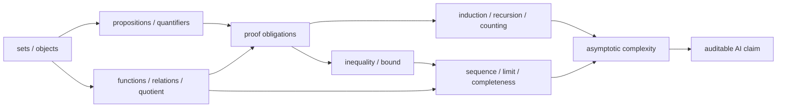

# 阶段测验 - 数学语言、逻辑与证明（10.1）

> [!abstract] 测验目标
> 本卷不检查八章术语能否分别背出，而检查一条完整论证链能否独立运行：先声明对象、集合与映射，再展开命题的量词和否定；随后选择证明方法、完成归纳或反例；最后把界、极限与渐近复杂度写成条件完整、可被证伪的 AI 理论声明。只给直觉、只画有限实验图、只写最终复杂度或只说“显然成立”，均不构成通过。

## 一、规则与允许工具

- 笔试时间 180 分钟，满分 100 分，闭卷；
- 可用只含四则、平方根、对数和指数的基础计算器，不可使用代码、CAS、AI 助手或笔记；
- 每个公式中的集合、函数、序列和渐近变量必须能够从题面或答案中找到定义；
- 证明题必须标出 hypotheses、quantifiers、关键推理与 closure，不能只写定理名；
- 反例必须满足原命题的全部 hypotheses，同时否定 conclusion；
- 复杂度答案必须说明资源对象、输入规模、计算模型与哪些变量趋于无穷；
- 可使用 $\log_2 8=3$、$\sum_{k=1}^n2^{-k}=1-2^{-n}$；
- 笔试后另有不计入 100 分但必须通过的[[实验 - 数学语言、逻辑与证明累计复现门|计算复现门]]。

## 二、评分与通过标准

| 能力区 | 分值 | 题号 | 单项通过线 |
|---|---:|---|---:|
| A 对象、定义与量词 | 20 | 1—4 | 14/20 |
| B 手算、构造与解释 | 30 | 5—8 | 21/30 |
| C 完整证明与统一推导 | 25 | 9—11 | 17/25 |
| D 反例、边界与纠错 | 15 | 12—13 | 10/15 |
| E AI 理论迁移 | 10 | 14 | 7/10 |
| **合计** | **100** |  | **80/100** |

通过必须同时满足：

1. 总分至少 80，且 A—E 各区达线；
2. 第 9、10、11 题至少两题达到该题 70%，且三题均不得为 0；
3. 第 12 题至少构造三个合法反例，第 13 题必须识别量词换序和复杂度制度错误；
4. definition/quantifier相关小题合计不得低于 70%；
5. 计算复现门通过；
6. 48 小时后闭卷重做全部错题，14 天后完成一道未见过的 AI theorem-audit 题。

> [!warning] 状态语义
> 题卷、解答、脚本与图已经存在，只说明验收工具 `composed`。在没有首次闭卷原稿、评分、错题回链、参数干预和延迟复测前，MATH-01—08 仍是 `draft / not-attempted`，不得升级为 mastered。

## 三、MATH-01—08 覆盖矩阵



| ID | 核心节点 | 主要题号 |
|---|---|---|
| MATH-01 | [[集合、元素与集合运算]] | 1、2、5、9、12、14 |
| MATH-02 | [[命题、量词与逻辑等价]] | 1、2、4、12、13、14 |
| MATH-03 | [[必要条件、充分条件与证明方法]] | 1、4、9—14 |
| MATH-04 | [[函数、映射、关系与等价类]] | 1、3、5、9、12、14 |
| MATH-05 | [[数学归纳、递归与组合计数]] | 1、5、8、10、11 |
| MATH-06 | [[基本不等式与界的构造]] | 6、11、14 |
| MATH-07 | [[数列、极限与完备性的直觉]] | 1、7、11、12 |
| MATH-08 | [[渐近记号、增长率与复杂度]] | 1、2、8、11—14 |

## 四、A 区：对象、定义与量词（20 分）

### 第 1 题：十个断言（5 分）

判断正误；错误时给出最小修正或最小反例。每项 0.5 分。

1. 若 $\varnothing\subseteq A$，则 $\varnothing\in A$。
2. 若 $\forall x\in X\,\exists y\in Y\,R(x,y)$，则 $\exists y\in Y\,\forall x\in X\,R(x,y)$。
3. “$P$ 是 $Q$ 的充分条件”对应 $P\Rightarrow Q$；“$P$ 是 $Q$ 的必要条件”对应 $Q\Rightarrow P$。
4. 对任意函数 $f:X\to Y$ 和 $A,B\subseteq X$，都有 $f(A\cap B)=f(A)\cap f(B)$。
5. 若 $x\sim y$ 是等价关系，则任意依赖代表元 $x$ 的公式都自动在商集 $X/{\sim}$ 上定义了函数。
6. 若命题 $P(0)$ 成立且对每个 $n\in\mathbb N$ 有 $P(n)\Rightarrow P(n+1)$，则 $P(n)$ 对所有 $n\in\mathbb N$ 成立。
7. 每个有界实数列都收敛。
8. 每个有理数 Cauchy 列都收敛到某个有理数。
9. 若 $f(n),g(n)>0$ eventually 且 $f(n)\sim g(n)$，则 $f(n)=\Theta(g(n))$。
10. 若某算法在 $n\le 10^6$ 的 log–log 图上斜率接近 $1$，则其时间复杂度已经被证明为 $\Theta(n)$。

### 第 2 题：形式化、否定与量词边界（5 分）

1. 设 $\mathcal D$ 为允许的数据集集合，$\Theta$ 为参数空间，$L_D:\Theta\to\mathbb R$。用量词写出“每个数据集都有唯一的经验风险最小化参数”，再写出其完整否定。（2 分）
2. 设 $E_n(x)$ 表示算法在规模 $n$ 时对输入 $x\in X$ 失败。写出“对每个固定输入，最终都不再失败”的形式化语句及其否定；再写出更强的“存在统一阈值”版本。（1.5 分）
3. 对成本 $W:\mathbb N^2\to\mathbb R_+$，把

   $$W(n,d)=O(nd^2+n^2d)$$

   写成一个明确的 two-variable 量词合同。说明“固定 $d$、$n\to\infty$”是同一个声明还是另一个声明。（1.5 分）

### 第 3 题：函数、关系与商的对象合同（5 分）

设 $X$ 是输入集合、$Y$ 是表示集合，$f:X\to Y$，$A\subseteq X$，$C\subseteq Y$。

1. 分别写出 $f(A)$ 与 $f^{-1}(C)$ 的定义，并指出二者属于哪个幂集。（1 分）
2. 区分 injective、surjective 与 inverse function；为什么 $f^{-1}(C)$ 的记号不要求 $f$ 可逆？（1 分）
3. 写出 equivalence relation 的三条性质，并说明它与 partition 的双向关系。（1.5 分）
4. 若 $\phi:X/{\sim}\to Z$ 由 $\phi([x])=g(x)$ 给出，必须证明什么才 well-defined？这与证明 $g$ injective/surjective 是否相同？（1.5 分）

### 第 4 题：证明义务与方法选择（5 分）

对每项写出必须完成的 proof obligations，并选择一种自然方法；只写“直接证明”不得分。

1. 证明 $P\Leftrightarrow Q$。（1 分）
2. 证明存在唯一 $x\in X$ 使 $P(x)$。（1 分）
3. 否定 universal implication $\forall x\in X,[H(x)\Rightarrow C(x)]$。（1 分）
4. 证明递归定义 $F(n)$ 对每个 $n\in\mathbb N$ 终止且返回值满足 invariant $I(n)$。（1 分）
5. 从有限数值实验支持一个无穷域上的定理时，还缺少什么逻辑桥梁？（1 分）

## 五、B 区：手算、构造与解释（30 分）

### 第 5 题：集合—映射—商—计数（8 分）

令

$$
U=\{1,2,3,4,5,6\},\quad
A=\{2,4,6\},\quad
B=\{1,2,3,6\},
$$

并令 $f:U\to\{0,1,2\}$，$f(x)=x\bmod 3$。

1. 求 $A\cup B,A\cap B,A\setminus B,A\triangle B$，并验证一次 De Morgan law。（2 分）
2. 求 $f(A)$、$f^{-1}(\{0,1\})$；判断 $f$ 是否 injective/surjective。（2 分）
3. 定义 $x\sim y\iff f(x)=f(y)$。写出 $U/{\sim}$ 的全部等价类，并说明 $\bar f([x])=f(x)$ 是否 well-defined、是否 bijective 到 $\{0,1,2\}$。（2 分）
4. 长度 6、恰含两个 1 且两个 1 不相邻的二进制串有多少个？给出不是“列举看起来如此”的计数论证。（2 分）

### 第 6 题：不等式、等号与松弛账本（8 分）

1. 对 $u,v\in\mathbb R$ 与 $\eta>0$，从平方非负推出

   $$2|uv|\le \eta u^2+\eta^{-1}v^2,$$

   并写出等号条件。（2 分）
2. 对向量 $x_1,\ldots,x_m\in\mathbb R^d$，推导

   $$\left\|\sum_{i=1}^m x_i\right\|_2^2\le m\sum_{i=1}^m\|x_i\|_2^2,$$

   标出每一步用了什么不等式和最终等号条件。（2 分）
3. 设 $M=\max_i z_i$，证明

   $$M\le \operatorname{LSE}(z):=\log\sum_{i=1}^m e^{z_i}\le M+\log m.$$

   对 $z=(\log4,\log2,0)$ 求精确 LSE 与上下界 gap。（2.5 分）
4. 写出数值稳定的 LSE 公式，并解释有限精度中“代数恒等”为什么不等于“计算同样可靠”。（1.5 分）

### 第 7 题：极限、Cauchy 与尾部证书（7 分）

1. 对 $a_n=(3n+1)/(n+2)$，从 $\varepsilon$–$N$ 定义给出一个显式有效的 $N(\varepsilon)$，证明 $a_n\to3$。（2.5 分）
2. 对 $s_n=\sum_{k=1}^n2^{-k}$，直接用尾部证明它是 Cauchy 列，并求其极限。（2 分）
3. 说明 $b_n=(-1)^n$ 为什么 bounded 但不 convergent；求其 Cesàro means

   $$c_n=\frac1n\sum_{k=1}^n b_k$$

   的极限。（1.5 分）
4. “一个序列在 binary64 中从某步起不再变化”是否证明其对应的实数序列已收敛？说明对象差别。（1 分）

### 第 8 题：递推、精确操作数与复杂度制度（7 分）

1. 一个程序对 $i=1,\ldots,n$，再对 $j=1,\ldots,i$ 执行一次标量操作。求精确操作数并给出 $\Theta$ 级别。（1.5 分）
2. 对 $n=2^k$，递推

   $$T(1)=1,\qquad T(n)=2T(n/2)+n$$

   求精确闭式，并用 recursion tree 或归纳核对。（2 分）
3. 一个 dense attention block 的工作代理为

   $$W(n,d)=4nd^2+2n^2d,$$

   显式 score memory 为 $M(n)=n^2$。分别在 fixed $d$、$d=n$ 两个制度下给出 $W$ 的 $\Theta$ 级别；说明 time、score memory 与 parameter memory 为什么不能混报。（2 分）
4. 若实测只覆盖 $n\le4096$，怎样报告观察到的 slope 才不越界成渐近定理？（1.5 分）

## 六、C 区：完整证明与统一推导（25 分）

### 第 9 题：image、preimage 与反例（8 分）

设 $f:X\to Y$，$A,B\subseteq X$，$C,D\subseteq Y$。从 element chasing 出发完整证明：

1. $f^{-1}(C\cap D)=f^{-1}(C)\cap f^{-1}(D)$；（2 分）
2. $f^{-1}(Y\setminus C)=X\setminus f^{-1}(C)$；（2 分）
3. $f(A\cup B)=f(A)\cup f(B)$；（2 分）
4. 构造最小反例说明一般只有 $f(A\cap B)\subseteq f(A)\cap f(B)$，并证明增加 injectivity 后等号成立。（2 分）

### 第 10 题：分类计数、递推与归纳（8 分）

令 $a_n$ 为长度 $n$、不含相邻两个 1 的二进制串数量，并约定空串计为一个对象。

1. 通过按末位分类，证明

   $$a_n=a_{n-1}+a_{n-2}\quad(n\ge2),$$

   写出 $a_0,a_1$；必须说明分类既覆盖全部对象又互不重叠。（3 分）
2. 计算 $a_2,\ldots,a_6$。（1 分）
3. 用 strong induction 证明 $a_n\le2^n$；指出 induction hypothesis 的合法调用范围。（2 分）
4. 给出一个生成全部合法串且必终止的递归算法不变量，并说明输出无重复、无遗漏。（2 分）

### 第 11 题：递推误差、界、收敛与复杂度（9 分）

设

$$
e_0=1,\qquad e_{k+1}=0.8e_k+0.5(0.6)^k\quad(k\ge0).
$$

1. 猜测并用归纳证明

   $$e_k=3.5(0.8)^k-2.5(0.6)^k.$$

   （3 分）
2. 证明 $0\le e_k\le3.5(0.8)^k$，并把每个不等式的方向和条件写清。（2 分）
3. 对任意 $\varepsilon>0$，给出一个显式 $N(\varepsilon)$ 使 $k\ge N$ 时 $e_k<\varepsilon$；由此证明 $(e_k)$ 收敛并说明它为何也是 Cauchy 列。（2 分）
4. 把达到误差 $\varepsilon$ 所需的证书步数写成 $O(\log(1/\varepsilon))$。说明该结论中固定了哪些常数，以及它为何不是“实际最小步数等于这个上界”。（2 分）

## 七、D 区：反例、边界与纠错（15 分）

### 第 12 题：五个最小反例（10 分）

每项给出合法对象、核对 hypotheses、否定 conclusion，并写一个最小修正。每项 2 分。

1. $\forall x\exists y\,R(x,y)$ 不推出 $\exists y\forall x\,R(x,y)$；
2. 一般函数的 image 不保持 intersection；
3. bounded sequence 不一定 convergent；
4. $|x_{n+1}-x_n|\to0$ 不推出 $(x_n)$ Cauchy；
5. 有限窗口上完美的幂律拟合不证明全局 $\Theta(n^p)$。

### 第 13 题：线性 Attention 声明审计（5 分）

某报告写道：

> 对每个序列长度 $n$ 和每个输入，都存在某个 feature rank $r$，使线性 Attention 精确匹配 dense Attention。因此存在一个固定 $r$，对所有长度和输入都精确匹配。我们又在 $n\le4096$ 上测得 wall-time log–log slope 为 1.05，所以该方法已被证明为 $\Theta(n)$；训练损失相同还证明它在任意部署分布上与 dense Attention 一样好。

识别至少五个独立的逻辑或建模错误，并把声明改写成一个可以由“数学证明 + 有限实验”共同支持、但不越界的版本。答案必须涉及：量词顺序、映射/近似对象、复杂度制度、finite evidence 与 generalization/deployment。（5 分）

## 八、E 区：AI 理论迁移（10 分）

### 第 14 题：建立一份可审计的 Attention 理论合同（10 分）

你要研究如下问题：“通过 feature map 重结合，能否在较长序列上以更低资源近似 softmax attention，同时保持任务性能？”写出一份完整研究合同，至少包含：

1. **对象与形状：** 输入集合、$Q/K/V$、feature map、dense/approximate operator 的 domain/codomain，以及 mask/normalization约定；（2 分）
2. **量词与目标：** 是逐输入、某个输入分布下的概率结论，还是 uniform bound；误差使用哪个 norm，概率对哪些随机性取；（2 分）
3. **证明义务：** well-definedness、denominator/stability、approximation bound、假设调用和至少一个 failure case；（2 分）
4. **资源账本：** arithmetic、activation/score memory、parameter memory，明确 $n,d,r$ 的渐近制度和低阶交叉区；（2 分）
5. **经验证据与边界：** 数据切分、baselines、compute/tuning budget、seeds、区间与 deployment shift；写出至少两条实验不能单独推出的结论。（2 分）

答案不要求提出全新的 Attention 算法；评分对象是定义、量词、证明、复杂度和证据边界是否组成同一份可检验合同。

## 九、答题后的证据协议

完成后先冻结原稿，再按以下顺序工作：

1. 记录每题用时、把握度与首次答案，不覆盖原错误；
2. 打开[[阶段测验解答 - 数学语言、逻辑与证明（10.1）]]逐项评分；
3. 把错误标为 `object / quantifier / implication / proof-gap / counterexample / bound / limit / complexity / transfer`；
4. 回链到对应 MATH 节点，写出“第一个无根据步骤”；
5. 完成[[实验 - 数学语言、逻辑与证明累计复现门]]的随机指定轨道；
6. 48 小时闭卷重做错题，14 天后做新的 AI theorem contract。

```text
日期：
用时：
A / B / C / D / E：
总分：
未达区线：
第一个无根据步骤：
错误类型：
随机计算轨道：A / B / C
48 小时复测：
14 天迁移：
评分者：
状态：not-attempted / attempted / passed / retained
```
