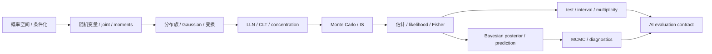

# 阶段测验 - 概率论与数理统计（10.5）

> [!abstract] 测验目标
> 本卷不检查是否背会了 20 个章节标题，而检查一条完整能力链：能否从概率空间和 joint model 出发，正确计算分布与条件期望，区分渐近近似、有限样本界和 Monte Carlo 误差，再把频率推断、Bayesian 推断与 MCMC 计算组织成可审计的 AI 不确定性报告。

## 零、完整验收时间线与概率对象账本

`PROB-CUM-01`检查的不是“会不会算一个概率”，而是能否在数据生成机制、条件化方向、重复单位和计算预算变化后，仍然准确回答：什么是随机的、条件于什么、目标量是什么、当前证据允许怎样解释。后阶段看到的答案或模拟结果不能倒填前阶段的独立记录。

执行前建立唯一`attempt_id`，建议格式为`PROB-CUM-01-YYYYMMDD-A`。口试、闭卷、nonce、解析校准、canonical输出、盲干预、订正和延迟复测使用同一ID；打开详解后不得覆盖首次答案。

> [!important] 材料状态与个人状态分离
> `material_status: regression-passed`只说明20节、题卷、详解、脚本、SVG和独立审计自洽；`learning_status: not-attempted`才描述当前个人证据。材料通过不能把PROB-01—20自动改为mastered。

### 0.1 八层概率—统计账本

| 层 | 必须先写清 | 本卷固定对象 | 常见偷换 |
|---|---|---|---|
| 概率空间 | $\Omega,\mathcal F,P$与可测对象 | 八原子硬币、Beta–Bernoulli | 把任意子集或 density 值当概率 |
| 生成与coupling | joint factorization、iid/conditional iid、sampling unit | $Z,\Theta_i,W_i,Y_i$ | 只给marginal便臆造joint；把cluster当iid |
| 条件与推前 | 条件方向、边缘化、变换原像 | Bayes、$S=X_1+X_2$、density change | 条件相关当因果；漏非单射分支 |
| functional与矩 | estimand、expectation、variance、tail/quantile | mean、covariance、$P(Z>c)$ | 有限样本矩代替总体存在性 |
| 极限与界 | 随机收敛模式、渐近尺度、finite-sample guarantee | LLN/CLT/Delta、Hoeffding | approximation当上界；点态当uniform |
| 统计推断 | model、parameter、estimator、sampling law、selection | MLE/MAP、Fisher、CI/test | likelihood当parameter density；选后照搬p值 |
| Bayesian条件化 | prior、likelihood、posterior、predictive | $Q\mid y\sim\operatorname{Beta}(5,9)$ | credible probability当coverage；忽略prior/model |
| 随机计算与决策 | proposal/kernel、ESS/MCSE、diagnostic、deployment loss | IS、MH、$\widehat R$、AI协议 | 高ESS/低$\widehat R$当全局正确证书 |

### 0.2 五波统一模型族

1. **A：隐藏硬币。** $Z\to(X_1,X_2)\to S$贯穿PROB-01—04，区分事件、条件化、推前与边缘依赖；
2. **B：Beta–Bernoulli混合。** $\Theta\to(X_1,X_2)$贯穿PROB-05—08，把矩、条件期望、离散/连续分布和指数族接通；
3. **C：每样本重抽潜变量。** $\Theta_i\to W_i\to\overline W_n$贯穿PROB-09—12，连接Gaussian几何、变换、LLN/CLT与Delta；
4. **D：共同成功指标。** $Y_i\sim\operatorname{Bernoulli}(q)$贯穿PROB-13—16，分离浓缩、Monte Carlo积分和未知参数估计；
5. **E：观测后的推断与计算。** $K=3$、$Q\mid y$及MCMC draws贯穿PROB-17—20，分离sampling、posterior和numerical uncertainty。

五波不是同一个DGP的五种叫法。每次改变潜变量是否共享、参数是否固定未知、数据是否已观测或积分目标是否已知，都必须重新写joint/conditional contract。

### 0.3 答案隔离与防挑题协议

1. 口试关闭题卷以外的全部笔记，保留录音或逐字稿；未通过时先补主线，不进入闭卷；
2. 闭卷结束立即保存只读原稿、用时、空题和第一个对象错误；
3. 评分者在看到个人偏好前给出nonce，由SHA-256规则唯一决定A/B/C实验轨；不得更换nonce挑题；
4. canonical run只核对环境，盲干预必须先写DGP/functional/diagnostic的方向预测，再运行新output；
5. 冻结个人实验输出后才打开[[阶段测验解答 - 概率论与数理统计（10.5）|详解]]，订正另存，不覆盖首答。

## 一、测验规则

- 笔试时间：180 分钟；满分 100 分；
- 闭卷，可用无符号代数功能的基础计算器和标准正态分布表；
- 不允许使用代码、CAS、AI 助手或查看笔记；
- 可以把 $z_{0.95}=1.645$、$z_{0.975}=1.96$、$\Phi(2)=0.97725$ 作为已知；
- 每个概率必须说明随机对象、条件和所用分布；每个近似/上界必须写明它是哪一种；
- 每个统计结论必须说明 estimand、重复抽样或 posterior 条件对象，以及 selection/stopping 是否预先规定；
- 开始笔试前先完成第九节 15 分钟卷级口试；口试未通过时，先回链补主线，不用刷题分掩盖对象混淆；
- 笔试后还有不计入 100 分、但必须通过的[[实验 - 概率统计累计复现门|计算复现门]]。

## 二、评分与通过标准

| 能力 | 分值 | 题号 | 单项通过线 |
|---|---:|---|---:|
| A 定义、对象与条件 | 20 | 1—4 | 14/20 |
| B 手算、构造与数值解释 | 30 | 5—8 | 21/30 |
| C 推导、证明与统一结构 | 25 | 9—11 | 17/25 |
| D 失败边界、反例与纠错 | 15 | 12—13 | 10/15 |
| E AI 迁移与研究契约 | 10 | 14 | 7/10 |
| **合计** | **100** |  | **80/100** |

通过必须同时满足：

1. 总分至少 80；
2. A—E 五个能力区均达单项通过线；
3. 第 9 题“条件期望—投影—全方差”不得为 0；
4. 第 11 题“统计推断—posterior prediction—MCMC”不得为 0；
5. 第 13 题 selection/MCMC 诊断不得为 0；
6. 15分钟卷级口试通过；
7. scorer nonce随机轨和盲参数干预通过；
8. 48小时换DGP重建与14天陌生AI研究迁移通过。

> [!warning] 状态语义
> `PROB-CUM-01`材料达到`regression-passed`只表示验收工具自洽。只有真实口试/闭卷原稿、独立评分、scorer nonce随机轨、个人盲干预、48小时无提示重做和14天迁移记录都存在，才形成升级节点状态的学习证据；否则仍是`draft / not-attempted`。

## 三、PROB-01—20 覆盖矩阵

| ID | 核心节点 | 主要题号 |
|---|---|---|
| PROB-01 | [[样本空间、事件与概率公理]] | 1、5、12 |
| PROB-02 | [[条件概率、全概率与 Bayes 公式]] | 1、5、9 |
| PROB-03 | [[随机变量、分布与分位数]] | 1、2、5 |
| PROB-04 | [[联合分布、边缘分布与独立性]] | 1、5、12 |
| PROB-05 | [[期望、方差与矩]] | 2、6、7、9 |
| PROB-06 | [[协方差、相关性与条件期望]] | 2、6、9、12 |
| PROB-07 | [[常用离散分布]] | 2、5、7 |
| PROB-08 | [[常用连续分布与指数族]] | 2、5、8 |
| PROB-09 | [[多元高斯分布]] | 2、6 |
| PROB-10 | [[随机变量变换与密度换元]] | 2、5、10 |
| PROB-11 | [[随机变量的收敛与大数定律]] | 3、7、10、12 |
| PROB-12 | [[中心极限定理与 Delta 方法]] | 3、7、10 |
| PROB-13 | [[浓缩不等式]] | 3、7 |
| PROB-14 | [[Monte Carlo、重要性采样与方差缩减]] | 3、7、12、13 |
| PROB-15 | [[统计模型、估计量与偏差方差]] | 4、8、13 |
| PROB-16 | [[最大似然估计与 MAP]] | 4、8、11 |
| PROB-17 | [[Fisher 信息、Cramér–Rao 界与渐近正态性]] | 4、8、11、12 |
| PROB-18 | [[Bayesian 推断与后验预测]] | 4、8、11、13、14 |
| PROB-19 | [[假设检验、置信区间与多重比较]] | 4、8、13、14 |
| PROB-20 | [[MCMC 与随机模拟诊断]] | 4、11、13、14 |

## 四、A 区：定义、对象与条件（20 分）

### 第 1 题：概率语言与条件化（5 分）

判断下列 10 个断言。错误时给出最小修正；每项 0.5 分。

1. 样本空间的任意子集都必须被赋予概率。
2. 若 $P(A)=0$，则事件 $A$ 不可能发生。
3. 连续密度 $f_X(x_0)$ 就是 $P(X=x_0)$。
4. 条件概率 $P(\cdot\mid B)$ 在 $P(B)>0$ 时仍满足概率公理。
5. $P(A\mid B)>P(A)$ 证明了 $B$ 导致 $A$。
6. pairwise independence 自动推出 mutual independence。
7. 若 $X,Y$ 独立，则 $g(X),h(Y)$ 对可测 $g,h$ 仍独立。
8. $X$ 与 $Y$ 不相关就意味着独立。
9. likelihood $p(x\mid\theta)$ 固定 $x$ 后自动成为参数 $\theta$ 的概率密度。
10. 一个只给 marginal distributions、不给 coupling 的模型通常不能确定 $P(X<Y)$。

### 第 2 题：分布、矩与变换对象（5 分）

每问 1 分，用不超过三句话回答。

1. PMF、PDF、CDF 与 quantile 分别是什么对象？哪一个对任意实值随机变量都存在？
2. 为什么“样本均值有限”不能证明总体期望存在？
3. exponential family 的 log-partition $A(\eta)$ 的一阶、二阶导数在什么条件下分别是什么？
4. 多元 Gaussian 的零协方差何时能推出独立？奇异 covariance 时为什么未必有关于全维 Lebesgue 测度的 density？
5. 一维变换公式为什么在非单射映射下要对所有原像分支求和？

### 第 3 题：极限、有限样本与随机计算（5 分）

每问 1 分。

1. 写出 a.s. convergence、convergence in probability、$L^2$ convergence 与 convergence in distribution 中任意三条正确蕴含或不蕴含关系。
2. LLN 与 CLT 分别回答样本均值的什么问题？
3. Hoeffding bound 与 CLT Gaussian approximation 在保证类型上有什么根本区别？
4. posterior SD、iid Monte Carlo SE、MCMC MCSE 与 weight ESS 为什么不能用同一个“误差条”替代？
5. self-normalized importance sampling 为何通常有限样本有偏？support 条件是什么？

### 第 4 题：三种推断语言（5 分）

对每个术语写出“随机性/条件对象”和一个最常见误读；每项 0.5 分：

1. sampling distribution；
2. likelihood；
3. Fisher information；
4. 95% confidence interval；
5. p-value；
6. posterior distribution；
7. posterior predictive distribution；
8. $\widehat R$；
9. bulk/tail ESS；
10. HMC divergence。

## 五、B 区：手算、构造与数值解释（30 分）

### 第 5 题：Bayes 更新、联合结构与变量变换（8 分）

某病在人群中的 prevalence 为 $0.02$。一次检测的 sensitivity 为 $0.90$、specificity 为 $0.95$。

1. 随机抽取一人，检测为阳性后患病的 posterior probability 是多少？画出或写出完整分割表。（3 分）
2. 若给定患病状态后两次检测条件独立，且两次参数相同，连续两次阳性后的 posterior probability 是多少？指出“条件独立”使用在何处。（2 分）
3. 令 $U\sim\operatorname{Uniform}(0,1)$，$Y=-\log U$。从 CDF 或换元公式推导 $Y$ 的 density 和 support。（2 分）
4. 只知道两个变量边缘都为 Bernoulli$(1/2)$，能否确定它们相等的概率？给出两个不同 coupling。（1 分）

### 第 6 题：多元 Gaussian、条件期望与方差分解（7 分）

设

$$
\begin{pmatrix}X\\Y\end{pmatrix}
\sim N\left(
\begin{pmatrix}0\\0\end{pmatrix},
\begin{pmatrix}4&2\\2&3\end{pmatrix}
\right).
$$

1. 求 $X\mid Y=1$ 的分布。（2 分）
2. 求 $E[X\mid Y]$ 与 $\operatorname{Var}(X\mid Y)$，并验证 total variance。（2 分）
3. 在所有可测函数 $g(Y)$ 中，哪个使 $E[(X-g(Y))^2]$ 最小？最小 MSE 是多少？（1.5 分）
4. 求 $Z=2X-Y$ 的分布，并判断 $Z$ 与 $Y$ 是否独立。（1.5 分）

### 第 7 题：有限样本界、Gaussian 近似与 Monte Carlo（7 分）

令 $X_1,\dots,X_{100}\stackrel{iid}{\sim}\operatorname{Bernoulli}(0.4)$，$\bar X=100^{-1}\sum_iX_i$。

1. 求 $E\bar X$、$\operatorname{Var}(\bar X)$ 和 standard error。（1.5 分）
2. 分别用 Chebyshev 与 Hoeffding 给出 $P(|\bar X-0.4|\ge0.1)$ 的上界。（2 分）
3. 用 CLT 给出同一概率的近似值；明确指出它不是有限样本上界。（1.5 分）
4. 某 importance sampler 产生四个未归一化 weights $(1,1,1,7)$。求 normalized weights、weight ESS 和最大权重占比；这些量能否证明 proposal 没漏掉 mode？（2 分）

### 第 8 题：从 likelihood 到区间、后验与预测（8 分）

设 $X_i\stackrel{iid}{\sim}N(\mu,4)$，$n=25$，观察到 $\bar x=1.2$。

1. 求 $\mu$ 的 MLE、总 Fisher information 和 MLE standard error。（1.5 分）
2. 检验 $H_0:\mu=0$：求双侧 z statistic、p-value 与 95% confidence interval。（2 分）
3. 现在加入 prior $\mu\sim N(0,4)$。推导 posterior mean/variance 与 95% equal-tail credible interval。（2 分）
4. 求未来一个观测 $\widetilde X$ 的 posterior predictive distribution，并解释其 variance 为何大于 posterior parameter variance。（1.5 分）
5. 若 prior 是在看见 $\bar x$ 后才从多个候选中挑出的，普通 posterior interval 仍然在“哪一个模型”下计算正确？它遗漏了什么过程？（1 分）

## 六、C 区：推导、证明与统一结构（25 分）

### 第 9 题：条件期望、投影与全方差（8 分）

设 $X\in L^2$，$\mathcal G$ 是子 $\sigma$-代数，$m=E[X\mid\mathcal G]$。

1. 从条件期望定义证明对任意有界 $\mathcal G$-可测 $Z$，$E[(X-m)Z]=0$。（2 分）
2. 对任意 $g\in L^2(\mathcal G)$ 推导

$$
E[(X-g)^2]
=E[(X-m)^2]+E[(m-g)^2],
$$

并说明唯一性意义。（2 分）
3. 由此推导 total variance

$$
\operatorname{Var}(X)
=E[\operatorname{Var}(X\mid\mathcal G)]
+\operatorname{Var}(E[X\mid\mathcal G]).
$$

（2 分）
4. 解释为什么 MSE regression 学到 conditional mean，而不自动学到完整 conditional distribution；给出一个多峰反例。（2 分）

### 第 10 题：变换、收敛与 Delta 方法（8 分）

令 $Z\sim N(0,1)$，$Y=Z^2$；另令 $X_1,X_2,\dots$ iid，$E[X_i]=\mu\ne0$、$\operatorname{Var}(X_i)=\sigma^2<\infty$。

1. 用多分支换元推导 $Y$ 在 $y>0$ 的 density，并指出 $y=0$ 邻域的行为。（3 分）
2. 从 CLT 与一阶 Taylor 展开推导

$$
\sqrt n(\bar X_n^2-\mu^2)
\Rightarrow N(0,4\mu^2\sigma^2).
$$

（2 分）
3. 若改成 $\mu=0$，解释一阶 Delta 为什么退化，并推导 $n\bar X_n^2$ 的极限分布。（2 分）
4. 给出一个“依分布收敛但期望不收敛”的随机变量序列，说明还缺少什么矩条件。（1 分）

### 第 11 题：信息下界、后验预测与 MH 正确性（9 分）

1. 在允许微分积分交换、support 不随参数变化等正则条件下，从 $E_\theta[T]=g(\theta)$ 推导

$$
\operatorname{Var}_\theta(T)
\ge\frac{[g'(\theta)]^2}{I(\theta)}.
$$

必须写出 score covariance 与 Cauchy–Schwarz 步骤。（3 分）
2. 若 $p\sim\operatorname{Beta}(a,b)$，观察 $s$ 次成功和 $f$ 次失败，推导 posterior，并求未来 $m$ 次试验成功数 $\widetilde S$ 的 posterior predictive PMF。（2 分）
3. 对未归一化 target $\widetilde\pi$ 和 proposal $q(y\mid x)$，写出 MH acceptance，并证明 off-diagonal accepted flow 满足 detailed balance。为什么 target normalization constant 抵消？（3 分）
4. detailed balance 成立为何仍不足以证明有限运行已代表 target？至少再写出两个结构/诊断条件。（1 分）

## 七、D 区：失败边界、反例与纠错（15 分）

### 第 12 题：四个反例（8 分）

每小题 2 分：给出明确构造、算出关键量，并指出它否定了什么错误推论。

1. 构造 $\operatorname{Cov}(X,Y)=0$ 但 $X,Y$ 不独立；
2. 构造 $X_n\to0$ in probability，但 $E[X_n]$ 不趋于 0；
3. 构造 importance sampling 的 target 在 proposal 零密度区域仍有正质量；
4. 给出一个 regular MLE 渐近正态结论失败的 parameter-dependent-support 模型，并指出正确速率不再是 $\sqrt n$。

### 第 13 题：选择、校准与采样器的联合失效（7 分）

团队比较两个生成模型：在 20 个 datasets、10 个 metrics、30 个 prompts、5 个 seeds 上挑最高提升；每次查看结果后决定是否再跑；最终只报告一个普通 p-value。随后用四条都从同一 posterior mode 启动的 chains 得到 $\widehat R=1.00$，便宣称 Bayesian uncertainty 已可靠；posterior predictive check 看起来也不错，于是宣称模型适用于部署人群。

1. 枚举最小 selection family，解释普通 p-value/CI 为什么不再对应整个程序。（2 分）
2. 解释 optional stopping 破坏了哪一个 reference process，并给出两类合法设计。（1.5 分）
3. 构造双峰 posterior 说明同一 mode 启动时低 $\widehat R$ 仍可给错误 global mean；提出至少三项修复。（2 分）
4. 解释 PPC、held-out evaluation 与 deployment-shift audit 分别回答什么问题，为什么不能互相替代。（1.5 分）

## 八、E 区：AI 迁移与研究契约（10 分）

### 第 14 题：概率分类器的端到端不确定性与评价协议（10 分）

一个 Bayesian neural classifier 将部署到多个医院。数据以 patient 为 cluster，每个 patient 有多条记录；类别极不平衡；模型包含 hierarchical hospital effects，posterior 用 HMC 近似。团队还要在线比较新旧版本，并在 100 个子群检查 calibration。

设计一份可执行契约，必须包含：

1. 数据生成层、estimand、randomization/sampling unit 与 cluster 处理（1.5 分）；
2. prior predictive、prior sensitivity、posterior predictive 与 held-out evaluation 的分工（1.5 分）；
3. HMC chains、初始化、warmup、rank-$\widehat R$、bulk/tail ESS、MCSE、divergence/energy 与 symmetry 报告（2 分）；
4. 类别不平衡下的 calibration/discrimination/decision metrics 和 practical margin（1.5 分）；
5. primary/guardrail metrics、sample size/power、interim looks、SRM、attrition 与 interference（1.5 分）；
6. 100 子群的 minimum size、FWER/FDR 选择、effect shrinkage 与独立复验（1 分）；
7. distribution shift、missingness、版本/seed 和失败结论的日志边界（1 分）。

## 九、15 分钟卷级口试（必须通过，不计入 100 分）

合上全部笔记，在一张白纸上完成以下任务；可以录音或保留手绘扫描作为证据，但不能先看下方提示或解答。

1. 画出 A—E 五波模型链：$Z$ 隐藏硬币、$\Theta$–Bernoulli、iid 向量 $W_i$、共同成功指标 $Y_i$ 与固定未知 $q$、观测 $K$ 后的 $Q\mid y$ 和 MCMC draws。每一箭头必须写明**哪一项概率合同改变了**；
2. 解释 $\Theta$ 与 $Q\mid y$ 都能写成随机变量，为什么它们在生成模型和推断语境中的角色仍不同；
3. **三类不确定性：**各写一个对象或公式区分 sampling uncertainty、posterior uncertainty 与 Monte Carlo/MCMC numerical error，并补充 model misspecification 为什么不等于三者之一；
4. 从隐藏变量边缘依赖、共享 $\Theta$ 破坏 iid、importance support failure、selection、同峰 MCMC 盲区中任选一个，说明“看起来正常的局部指标”为何没有推出全局可靠；再给出一个 AI 场景映射。

通过标准：四项中至少三项完整；第 1、3 项必须通过；不得把条件概率写成因果效应，不得把 confidence coverage、posterior probability 与 MCSE 写成同一个对象。失败后回到[[概率论与数理统计 MOC#零、怎样从零真正学完本卷|卷级学习合同]]，48 小时后更换例子重做。

## 十、计算复现门（必须通过，不计入 100 分）

完成[[实验 - 概率统计累计复现门]]。评分者在运行前从 A/B/C 三条轨道中随机指定一条，学习者不能挑选：

- A：LLN、CLT 与 Wald interval coverage；
- B：importance sampling tail estimate、weight ESS 与无限方差边界；
- C：双峰 target 的多链 $\widehat R$ 盲区。

通用通过条件：

1. 从代码入口独立生成 SVG，并记录 Python 版本、命令、seed 与 SHA-256；
2. 手工复核至少两个输出数值或公式；
3. 运行前写下一个参数干预的方向预测，运行后解释结果；
4. 区分 theorem、finite-sample approximation、Monte Carlo error 与本次经验结果；
5. 不能删掉与预测冲突的 seeds/chains，不能把单次图形升级为普遍结论。

## 十一、答题后复盘

| 题号 | 得分 | 状态 | 错误类型 | 第一个断点/回链小节 | 48 小时重做 | 14 天迁移题 |
|---|---:|---|---|---|---|---|
| 1—4 |  |  |  |  |  |  |
| 5 |  |  |  |  |  |  |
| 6 |  |  |  |  |  |  |
| 7 |  |  |  |  |  |  |
| 8 |  |  |  |  |  |  |
| 9 |  |  |  |  |  |  |
| 10 |  |  |  |  |  |  |
| 11 |  |  |  |  |  |  |
| 12 |  |  |  |  |  |  |
| 13 |  |  |  |  |  |  |
| 14 |  |  |  |  |  |  |

状态使用 `independent / hinted / copied / blocked / careless`。查看解答后的订正只能记为 `corrected`，不能记为首次独立通过。

## 十二、48 小时换机制重建门

首次订正完成 48 小时后，不看原题、原答案和原输出，由评分者从下列五类中任选一类并改变至少两个机制；只换数字、照抄原推导不算通过。

| 换机制方向 | 必须重建的对象 | 最低通过证据 |
|---|---|---|
| DGP / coupling / cluster | joint factorization、随机单位、条件独立图 | 写出新 joint law，并指出原结论哪一步保留、哪一步失效 |
| tail / functional / convergence | 新 tail threshold、quantile 或非光滑 functional | 区分精确值、有限样本界、渐近近似和数值误差 |
| estimator / selection / stopping | 新 estimator、selection family 或 stopping rule | 重写 estimand、reference process、bias/coverage 合同 |
| prior / model / posterior | 新 prior、likelihood 或 posterior functional | 重新归一化并做 prior/posterior predictive 边界解释 |
| sampler / geometry / diagnostic | 新 mode separation、proposal 或初始化 | 运行前预测 occupancy、acceptance、$\widehat R$ 与 MCSE 的方向 |

通过要求：在 45 分钟内无提示交出“对象账本 → 关键推导 → 一个失败边界 → 一项 AI 映射”，并能解释为何这不是原题的机械替换。失败只回链到第一个断点，再隔 48 小时换机制重做。

## 十三、14 天陌生 AI 研究迁移门

评分者提供一份此前未见的 AI 实验摘要，例如生成模型评测、医院风险预测、RL 离线评估或大模型采样。学习者在 60 分钟内完成一页可审计报告，至少包含：

1. 生成图或 joint factorization，以及 observation / missingness / deployment 机制；
2. estimand、sampling/randomization unit、cluster 与 interference；
3. sampling、posterior、Monte Carlo/MCMC 三层不确定性分别对应的对象；
4. estimator、interval/test 或 posterior functional，以及 selection/stopping 合同；
5. proposal/kernel、ESS/MCSE/$\widehat R$ 等计算诊断及其不能证明的内容；
6. distribution shift、model misspecification、practical margin 和失败即停止规则。

通过标准不是术语数量，而是所有公式都能回到同一生成机制，且能明确写出“当前证据不可推出什么”。若更换应用名后合同仍原封不动，视为未完成迁移。

## 十四、提交证据清单

- [ ] 唯一 `attempt_id`、日期、用时、评分者与 scorer nonce；
- [ ] 15 分钟口试录音/逐字稿和首次 180 分钟闭卷原稿；
- [ ] 五区分数、硬门结果、第一个对象错误与回链位置；
- [ ] 解析校准、canonical 命令/output/SVG/hash；
- [ ] 盲参数运行前预测、完整新 output/SVG/hash 与冲突解释；
- [ ] 打开详解后的逐题订正，且没有覆盖首次答案；
- [ ] 48 小时换机制重建记录；
- [ ] 14 天陌生 AI 研究迁移记录；
- [ ] 最终个人结论：`passed / needs-remediation / not-attempted`。

## 十五、解答入口

冻结笔试答案并完成计算复现前不要打开：[[阶段测验解答 - 概率论与数理统计（10.5）]]。
