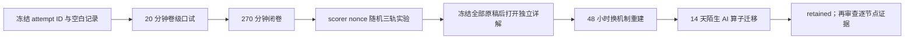

# 阶段测验 - 矩阵分析（10.3）

> [!abstract] 测验目标
> 本卷检查能否从“矩阵有某种分解”进一步走到“矩阵作为算子有多大、对扰动多敏感、哪些结论受结构约束、哪些谱声明在非正规情形失效”。核心不是多背几个matrix factorizations，而是建立 **object—norm—gap—condition—structure—evidence** 六联账本。

## 零、先看完整验收时间线

`MA-CUM-01` 不只检查能否算出一个谱或分解，而是检查能否在无提示口述、长证明、盲参数变化和陌生 AI 报告中反复重建同一套“对象—范数—扰动—证据”判断。后阶段获得的信息不能倒填前阶段的独立记录。



执行前建立唯一 `attempt_id`，建议格式为 `MA-CUM-01-YYYYMMDD-A`。口试记录、闭卷原稿、评分表、nonce、终端输出、干预 SVG 和延迟复测全部使用同一 ID；一旦打开详解，不得覆盖第一次答案。

> [!important] 材料状态与个人状态分离
> `material_status: regression-passed` 只说明题卷、详解、脚本、SVG 和独立审计自洽；`learning_status: not-attempted` 才描述当前个人证据。材料通过不能把 MA-01—16 自动改成 mastered。

### 0.1 八层矩阵分析账本

| 层 | 必须先写清 | 本卷固定对象 | 常见偷换 |
|---|---|---|---|
| 算子 | domain/codomain、square/rectangular、field | $A_\varepsilon$、$H_\tau$、$T_K$ | 把同 shape 当作同 operator |
| 度量 | vector norm、induced/UI norm、inner product | $\|\cdot\|_2$、$\|\cdot\|_F$ | 只写“误差小”而不写 norm/scale |
| 谱结构 | singular/eigen spectrum、normality、gap | $\sigma_{\min}$、eigengap、Schur geometry | 把 eigenvalue 与 singular value混写 |
| 变分/分解 | Rayleigh、SVD、Cholesky、polar、sign | $H_\tau=LL^*$、$M=QH$ | 分解存在便宣称因子唯一/稳定 |
| 扰动 | absolute/relative、structured/unstructured、tangent | $E_\eta$、symmetric tangent | 把 ambient worst case 当允许扰动 |
| 敏感性 | condition、resolvent、pseudospectrum、Fréchet map | $L_f(A,E)$、$R(z;A)$ | 把一阶局部界当任意有限步保证 |
| 数值诊断 | residual、threshold、finite precision、algorithm | numerical rank、factor residual | 小 residual 直接等同小 forward error |
| 证据 | theorem、bound、diagnostic、held-out result | Weyl/DK、下界、OOD test | 一张谱图或 benchmark 证明全称命题 |

### 0.2 四个贯穿模型族

1. **模型族 I：近奇异矩形映射。** $A_\varepsilon=\operatorname{diag}(1,\varepsilon)$ 贯穿 MA-01—04：SVD、矩阵范数、条件数、距奇异性以及谱值/方向扰动的不同证书；
2. **模型族 II：秩亏端点与方向—伸缩分离。** $A_0$、$A_\varepsilon$ 与 $M_\varepsilon=RA_\varepsilon$ 贯穿 MA-05—08：伪逆、Eckart–Young–Mirsky、effective rank 和 polar 唯一性边界；
3. **模型族 III：正定裕量与方向可辨识性。** $H_\tau$ 和结构化 $E_\eta$ 贯穿 MA-09—12：二次型、Cholesky、Rayleigh/Courant–Fischer 与 eigengap-controlled subspace rotation；
4. **模型族 IV：固定点谱下的非正规耦合。** $T_K$ 与平移后的 $B_K$ 贯穿 MA-13—16：Fréchet map、resolvent/pseudospectrum、structured condition 与 matrix sign 的斜谱投影。

每一族都必须回答：对象是什么；使用哪个 norm/inner product；稳定分母是最小奇异值、正定裕量、谱间隙还是 separation；允许哪些扰动；结论是 exact、first-order、numerical 还是 empirical。

### 0.3 答案隔离协议

- 口试和闭卷期间只打开本题卷；关闭 Obsidian 反向链接、悬浮预览与全库搜索；
- [[阶段测验解答 - 矩阵分析（10.3）|独立详解]]只在口试/闭卷原稿、结束时间和照片或 hash 位置冻结后打开；
- 得到提示的答案记 `hinted`，打开详解后的正确订正只能记 `corrected`；
- 结果碰巧相同不能覆盖 norm、gap、structure、局部/全局或第一个错误步骤。

## 一、规则与允许工具

- 笔试270分钟，满分100分，闭卷；
- 可用只含四则、平方根、对数和指数的基础计算器，不可使用代码、CAS、AI助手或笔记；
- 每次写“small / stable / low-rank / positive / structured”都必须指明norm、scale、threshold、gap或允许扰动集；
- Hermitian结论不可无条件迁移到non-normal matrix；matrix function不可无条件按entrywise function处理；
- 数值算法的浮点实现深度属于10.8，本卷仍要求解释为什么condition、non-normality和structure会改变算法选择；
- 开始笔试前先完成第十节20分钟卷级口试；口试不计入100分，但必须通过；
- 笔试后另有不计入100分但必须通过的[[实验 - 矩阵分析累计复现门|计算复现门]]。

## 二、评分与通过标准

| 能力区 | 分值 | 题号 | 单项通过线 |
|---|---:|---|---:|
| A 对象、定理条件与shape | 20 | 1—4 | 14/20 |
| B 手算、分解与诊断 | 25 | 5—8 | 17/25 |
| C 完整证明与统一结构 | 30 | 9—11 | 21/30 |
| D 反例与研究声明审计 | 15 | 12—13 | 10/15 |
| E AI迁移与实验合同 | 10 | 14 | 7/10 |
| **合计** | **100** |  | **80/100** |

通过还必须满足：第9—11题均不得为0且至少两题达到70%；第12题至少五个合法反例；第13题必须识别Hermitian/non-normal、matrix/task error、unstructured/structured三类偷换；20分钟口试、随机计算轨道、48小时换机制重做与14天迁移全部完成。

> [!warning] 状态语义
> `MA-CUM-01`材料达到`regression-passed`只表示验收工具自洽。没有真实口试/闭卷原稿、逐项评分、盲干预与延迟证据时，MA-01—16保持`draft / not-attempted`。

## 三、MA-01—16覆盖矩阵

| 主链 | 节点 | 主要题号 |
|---|---|---|
| 范数—正定—变分—Cholesky—条件 | MA-01—05 | 1—5、9、12—14 |
| 扰动—子空间—低秩—有效秩 | MA-06—09 | 1—3、6、10、12—14 |
| Schur—polar—sign—matrix function | MA-10—13 | 1—3、7、11—14 |
| Fréchet—resolvent/pseudospectrum—structure | MA-14—16 | 1—4、8、11—14 |

## 四、A区：对象、定理条件与shape（20分）

### 第1题：十个断言（5分）

判断正误；错误时给最小修正或反例。每项0.5分。

1. 对任意induced matrix norm，$\rho(A)\le\|A\|$。
2. Frobenius norm不是induced norm，但满足$\|AB\|_F\le\|A\|_F\|B\|_F$。
3. $A^*A$ positive definite当且仅当$A$ injective。
4. Hermitian $H$的Rayleigh quotient取值恰落在$[\lambda_{\min},\lambda_{\max}]$。
5. 线性系统relative residual很小，就一定有很小的relative forward error。
6. 对Hermitian $H,E$，按序eigenvalues满足$|\lambda_i(H+E)-\lambda_i(H)|\le\|E\|_2$。
7. 只要两个矩阵的eigenvalues接近，它们的eigenvectors与invariant subspaces就一定接近。
8. Truncated SVD既最小化matrix Frobenius error，也必最小化任意下游task loss。
9. 任意rank-deficient rectangular matrix的polar isometric factor都唯一。
10. 对任意analytic $f$，都有$f(A+E)=f(A)+f'(A)E+O(\|E\|^2)$。

### 第2题：五组对象合同（5分）

分别写定义、所在空间、关键条件和一个AI调用点。每项1分。

1. induced norm、unitarily invariant norm、dual norm与submultiplicativity；
2. PSD order、Rayleigh quotient、spectral gap与condition number；
3. unstructured perturbation、structured perturbation、tangent space与structured condition number；
4. Schur factorization、polar decomposition、matrix sign及三者不能互换之处；
5. Fréchet derivative、resolvent、$\varepsilon$-pseudospectrum与effective rank。

### 第3题：五个定理合同（5分）

分别写主要hypotheses、conclusion与一个不能推出的结论：Courant–Fischer、Cholesky存在唯一性、Eckart–Young–Mirsky、Davis–Kahan/Wedin型子空间扰动、analytic matrix function的Cauchy/Fréchet表示。（每项1分）

### 第4题：shape、算子与结构审计（5分）

令$A,E\in\mathbb C^{n\times n}$、$X\in\mathbb C^{n\times r}$，$f$在$\sigma(A)$邻域analytic。

1. 写出$L_f(A,E)$的shape，并说明$E\mapsto L_f(A,E)$本身属于哪个operator space。（1分）
2. column-vec下，若$\operatorname{vec}(L_f(A,E))=K_f(A)\operatorname{vec}(E)$，写$K_f(A)$的shape；为什么一般不应显式物化？（1分）
3. 对rank-$r$ matrix $M=UV^*$，写出factorization manifold的tangent direction；指出gauge direction。（1分）
4. 写实方阵到symmetric subspace和Toeplitz subspace的orthogonal projection原则；二者为什么需要先声明inner product？（1分）
5. 若$H=H^*$，写eigen-residual $r=Hx-\mu x$、Rayleigh quotient $\mu$与shape；若$H$非Hermitian，为什么同一residual不能直接调用Davis–Kahan？（1分）

## 五、B区：手算、分解与诊断（25分）

### 第5题：范数、正定、Rayleigh、Cholesky与条件（7分）

令

$$
H=\begin{bmatrix}4&2\\2&3\end{bmatrix}.
$$

1. 求$\|H\|_1,\|H\|_\infty,\|H\|_F,\|H\|_2$。（2分）
2. 用eigenvalues与leading principal minors分别判断positive definiteness，写Rayleigh quotient的精确范围。（1.5分）
3. 求positive-diagonal Cholesky factor $H=LL^T$。（1.5分）
4. 求$\kappa_2(H)$；对$b=(2,1)^T$解$Hx=b$，并解释为什么“小residual”还需乘condition信息才可解释forward error。（2分）

### 第6题：扰动、子空间、低秩与有效秩（6分）

令

$$
A=\operatorname{diag}(5,3,1),
\qquad
A_\varepsilon=\begin{bmatrix}5&\varepsilon&0\\\varepsilon&3&0\\0&0&1\end{bmatrix},
\qquad \varepsilon=0.2.
$$

1. 求$A_\varepsilon$的eigenvalues，并用Weyl bound核对谱值移动量。（1.5分）
2. 写top eigenvector相对$e_1$的rotation angle关系，并与“扰动norm / 原始gap”量级比较。（1.5分）
3. 对$A$写最佳rank-1与rank-2近似的spectral/Frobenius errors。（1.5分）
4. 求$A$的stable rank，并在threshold $\tau=2$下求hard threshold rank；说明二者回答的问题不同。（1.5分）

### 第7题：Schur、matrix function、sign与polar（6分）

令

$$
T=\begin{bmatrix}2&1\\0&-1\end{bmatrix},
\qquad
D=\operatorname{diag}(3,-2).
$$

1. 给出$T$的一种complex Schur factorization，并求$e^T$。（2分）
2. 用divided difference或spectral projector求$\operatorname{sign}(T)$。（1.5分）
3. 求$D$的polar decomposition与matrix sign；为什么这里两个direction factors相同？（1.5分）
4. 说明为什么不能由第3问推出一般矩阵的polar factor等于matrix sign。（1分）

### 第8题：Fréchet、resolvent、pseudospectrum与structure（6分）

令

$$
A=\operatorname{diag}(0,\log4),
\qquad
E=\begin{bmatrix}1&2\\-1&0\end{bmatrix},
\qquad
J_K=\begin{bmatrix}0&K\\0&0\end{bmatrix}.
$$

1. 求$L_{\exp}(A,E)$。（2分）
2. 求$(zI-J_K)^{-1}$并给一个显示$K/|z|^2$增长的norm lower bound；解释其对pseudospectrum的含义。（2分）
3. 在Frobenius inner product下求$E$到real symmetric subspace的orthogonal projection。（1分）
4. 比较unstructured与symmetric-structured perturbation集合：哪个condition number一定不大于哪个？为什么这不是“结构总能改善实际误差”的无条件结论？（1分）

## 六、C区：完整证明与统一结构（30分）

### 第9题：正定—变分—分解统一证明（9分）

对Hermitian $H\in\mathbb C^{n\times n}$：

1. 从spectral theorem证明Rayleigh quotient位于$[\lambda_{\min},\lambda_{\max}]$，并刻画等号条件；（3分）
2. 证明$\lambda_{\max}=\max_{\|x\|=1}x^*Hx$，并给Courant–Fischer的$k$维min–max形式及其几何解释；（3分）
3. 证明$H\succ0$当且仅当存在唯一positive-diagonal lower triangular $L$使$H=LL^*$；指出每一步对strict positivity的调用点。（3分）

### 第10题：谱值—子空间—低秩误差统一证明（10分）

1. 用Rayleigh/min–max证明Hermitian Weyl bound $|\lambda_i(H+E)-\lambda_i(H)|\le\|E\|_2$；（3分）
2. 对simple Hermitian eigenpair $Hu=\lambda u$与unit approximate vector $x$，令$\mu=x^*Hx$、$r=Hx-\mu x$。在$\mu$与其余spectrum距离至少$\delta>0$时，证明$\sin\angle(x,u)\le\|r\|_2/\delta$；解释subspace版本为何使用projector/principal angles。（3分）
3. 从SVD证明spectral norm下的Eckart–Young下界与截断达到性，再说明Frobenius tail公式；指出唯一性需要什么singular gap。（4分）

### 第11题：矩阵函数—非正规—结构统一证明（11分）

设$f$在包围$\sigma(A)$的contour $\Gamma$内analytic。

1. 从Cauchy表示与resolvent identity推导
   $$
   L_f(A,E)=\frac1{2\pi i}\oint_\Gamma f(z)(zI-A)^{-1}E(zI-A)^{-1}\,dz,
   $$
   并解释non-normal resolvent为何会放大matrix-function sensitivity。（3分）
2. 对polynomial $p$证明block identity
   $$
   p\!\left(\begin{bmatrix}A&E\\0&A\end{bmatrix}\right)
   =\begin{bmatrix}p(A)&L_p(A,E)\\0&p(A)\end{bmatrix},
   $$
   再说明如何推广到analytic $f$。（3分）
3. 对无imaginary-axis eigenvalue的$A$，证明$\operatorname{sign}(A)^2=I$且$P_\pm=(I\pm\operatorname{sign}(A))/2$是spectral projectors；对full-column-rank $B$写polar factor $Q=B(B^*B)^{-1/2}$，说明sign与polar的对象差异。（3分）
4. 若允许结构扰动空间$\mathcal S$是ambient matrix space的线性subspace，证明同一norm下structured absolute condition number不超过unstructured one；说明非线性结构需改用tangent space的原因。（2分）

## 七、D区：反例与研究声明审计（15分）

### 第12题：六个最小反例（9分）

每项给合法对象、核对hypotheses、否定conclusion并写最小修正。每项1.5分。

1. 相同eigenvalues不保证相同operator norm或transient；
2. eigenvalue扰动小不保证eigenvector稳定（gap闭合）；
3. 小relative residual不保证小relative forward error；
4. truncated SVD的matrix-norm最优不保证task-loss最优；
5. rank-deficient matrix的polar factor不一定唯一；
6. unstructured worst-case direction可能不属于模型允许的structured perturbations。

### 第13题：AI矩阵报告审计（6分）

某报告声称：

> 权重矩阵spectral radius小于1，所以深层网络和SSM在每一步都contractive。Hessian的eigenvalues大多为正，因此可以直接做Cholesky。PCA top eigenvalue变化很小，所以top eigenvector稳定。Truncated SVD是最优低秩逼近，因此必是最佳压缩模型。某种effective rank下降，所以表示一定坍缩。两个state matrices eigenvalues相同，所以其matrix exponential、gradient和robustness相同。矩阵指数的导数就是逐元素乘$e^A$。LoRA只允许rank-$r$更新，但可以直接用unstructured condition number精确预测训练敏感性。Matrix sign与polar都输出“方向”，所以可以互换。有限benchmark成功说明上述理论已经被证明。

识别至少八个独立错误，并改写成一份区分theorem、condition estimate、numerical diagnostic与held-out evidence的可证伪报告。（6分）

## 八、E区：AI迁移与实验合同（10分）

### 第14题：结构化、稳定、低秩的AI算子合同（10分）

为“把一个Transformer/SSM中的dense operator替换为低秩、SPD、orthogonal、Toeplitz或stable structured operator，同时保持任务性能与训练稳定性”建立完整合同：

1. 声明domain/codomain、operator与parameter shapes、inner products、允许结构集及tangent perturbations；（2分）
2. 建立spectral/Frobenius/effective-rank、Rayleigh/PSD、eigen/pseudospectral与condition账本，说明各指标能控制什么；（2分）
3. 给出truncated SVD、polar/retraction、matrix function或structured projection的初始化/更新路线，说明gauge、rank-change和Fréchet边界；（2分）
4. 给出从operator error到activation/logit/task error的传播条件，并区分normal/non-normal、unstructured/structured和exact/numerical rank；（2分）
5. 设计matched compute/tuning、多seed、held-out/OOD、latency/memory、扰动压力测试与预注册failure criteria；写两条实验不能单独推出的结论。（2分）

## 九、答题后证据协议

冻结原稿后才打开解答，逐题记录第一个错误对象，并分类为`norm / PSD-Rayleigh / factorization / condition-residual / perturbation-gap / low-rank-effective-rank / Schur-polar-sign / matrix-function-Frechet / resolvent-pseudospectrum / structure-tangent / AI-transfer`。随后完成随机计算轨道、一次事前预测干预、48小时重做与14天迁移。

```text
日期：
用时：
A / B / C / D / E：
总分：
第一个错误对象：
随机轨道：A / B / C
参数干预：
48小时复测：
14天迁移：
评分者：
状态：not-attempted / attempted / passed / retained
```

## 十、20 分钟卷级口试

评分者从六个题簇中抽四题，其中第1题和第6题必抽；每题最多给一次“请补 norm/gap/扰动集/证据等级”的澄清，不能给公式提示。

### 口试题簇

1. **从线性代数到矩阵分析：**解释 map、matrix representation、operator norm、condition number、residual 和 forward error 分别是什么对象，为什么“可逆”不等于“良态”；
2. **SVD—伪逆—低秩—polar：**用 $A_\varepsilon\to A_0$ 说明哪些量连续、哪些因 rank change 不连续、哪些因子唯一；
3. **正定—变分—Cholesky：**用 $H_\tau$ 连接方向能量、$\lambda_{\min}$、Rayleigh extrema、condition 与 pivot，并说明 ordering/algorithm 边界；
4. **谱值—方向—子空间：**区分 Weyl、Davis–Kahan/Wedin、Bauer–Fike 与 pseudospectrum 的对象和分母；
5. **matrix function—Fréchet—sign：**解释 $f(A)$、$L_f(A,E)$、entrywise $f$、polar factor 和 matrix sign 为什么不能互换；
6. **AI 声明出口：**审计“谱半径小即逐步压缩”“PCA eigenvalue稳定即方向稳定”“EYM即任务最优”“unstructured condition精确预测LoRA训练”。

### 口试判分红线

每题记 `independent / prompted / failed`。四题至少三题 `independent`，必抽题1和6均不得 `failed`。出现以下任一错误时，本次口试不通过：

- 不声明 norm/scale 就比较误差或condition；
- 把 singular value、eigenvalue、Rayleigh value、pseudospectral point 混成同一对象；
- 把 Hermitian gap 定理无条件用于一般 non-normal matrix；
- 把 local Fréchet derivative、lower certificate 或 structured worst case 升级成任意有限步/分布结论；
- 把 matrix approximation 最优性直接写成 task/OOD 最优性。

口试失败时仍可完成闭卷用于诊断，但本次最多记 `needs-remediation`。

## 十一、交卷后的错误分类与逐题复盘

| 题号 | 得分 | 独立性 | 原答案第一个断点 | 错误类型 | 正文回链 | 48小时 | 14天 |
|---|---:|---|---|---|---|---|---|
| 1—4 |  |  |  |  |  |  |  |
| 5 |  |  |  |  |  |  |  |
| 6 |  |  |  |  |  |  |  |
| 7 |  |  |  |  |  |  |  |
| 8 |  |  |  |  |  |  |  |
| 9 |  |  |  |  |  |  |  |
| 10 |  |  |  |  |  |  |  |
| 11 |  |  |  |  |  |  |  |
| 12 |  |  |  |  |  |  |  |
| 13 |  |  |  |  |  |  |  |
| 14 |  |  |  |  |  |  |  |

独立性只用 `independent / hinted / copied / blocked / careless`。复盘先定位最早的 object、norm、gap、perturbation set 或 evidence-level 错误，不按最后数值是否碰巧正确倒推掌握。

## 十二、48 小时与 14 天保持性门

### 48 小时：换机制重建

关闭详解、原答与代码，由评分者改变至少一个机制量：

1. 改变 $A_\varepsilon$ 的奇异谱或右端弱方向；
2. 改变低秩端点、截断 rank、effective-rank 定义或 polar rank；
3. 改变 $H_\tau$ 的正定裕量、eigengap、扰动方向或 cluster dimension；
4. 改变 $T_K/B_K$ 的非正规耦合、contour separation、允许结构或 Fréchet direction。

学习者必须重建最早失效的定理条件，给两个事前定量预测，标出一条 exact invariant、一条 first-order/condition-sensitive 结论和一条不能推出的 task 声明。只替换字母或复述 canonical 数字不通过。

### 14 天：陌生 AI 算子迁移

评分者给出未见过的压缩权重、Hessian、PCA、SSM、LoRA、orthogonal/SPD layer 或 matrix-function optimizer 报告。45分钟内必须：

1. 建立0.1节八层账本；
2. 找出至少三个彼此独立的 norm、gap、structure 或证据越界；
3. 给出一条 exact theorem/bound、一条 numerical diagnostic 和一条 held-out/OOD test；
4. 分离 operator error、activation/logit error 与 task risk；
5. 把原声明缩回证据真正支持的范围。

### 保持性状态

- `needs-remediation`：口试、分区线、主证明或随机实验任一关键门未过；
- `passed-initial`：口试、闭卷与随机实验通过，延迟门未完成；
- `retained`：48小时换机制与14天陌生迁移均独立通过；
- `verified-candidate`：卷级证据可送入MA-01—16逐节点审查，不代表16篇正文自动 verified。

## 十三、证据清单

| 字段 | 记录 |
|---|---|
| `attempt_id` / 日期 / Git commit |  |
| 口试原始记录与结论 |  |
| 闭卷原稿位置、开始/结束时间 |  |
| A—E分区分数与总分 |  |
| 第9—11题主证明状态 |  |
| scorer nonce、随机轨道与 canonical hash |  |
| 干预前预测、输出路径与偏差解释 |  |
| 第一个断点与MA正文回链 |  |
| 48小时换机制重做 |  |
| 14天陌生迁移题 |  |
| 最终学习状态 | `not-attempted / attempted / needs-remediation / passed-initial / retained` |

## 十四、解答入口

正式完成口试、闭卷并冻结第一次答案前不要打开：[[阶段测验解答 - 矩阵分析（10.3）]]。
