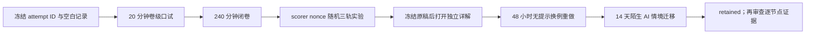

# 阶段测验 - 线性代数（10.2）

> [!abstract] 测验目标
> 本卷检查能否把矩阵还原为“空间之间的映射”，并在四种语言间可靠切换：坐标与换基、核像与商空间、内积投影与稳定分解、谱/SVD与张量缩并。只会消元、只会背分解公式，或把eigenvalue、singular value、rank与低秩模型容量混为一谈，均不构成通过。

## 零、先看完整验收时间线

`LA-CUM-01` 检查的不是“能否一次算对矩阵”，而是能否在无提示、长推导、计算干预与陌生 AI 情境中反复重建同一套对象语言。后出现的答案不能倒填前面的独立性。



执行前建立唯一 `attempt_id`，建议格式为 `LA-CUM-01-YYYYMMDD-A`。口试记录、闭卷原稿、评分表、终端输出、干预图与延迟复测都使用同一 ID；一旦打开详解，不得覆盖第一次答案。

> [!important] 两种状态不能混写
> `material_status: regression-passed` 只说明题卷、详解、脚本、SVG 和交叉审计自洽；`learning_status: not-attempted` 描述当前个人证据。材料变完整不会自动把 LA-01—24 从 `draft` 改成 mastered。

### 0.1 八层对象账本

| 层 | 必须先写清 | 本卷固定例子 | 常见偷换 |
|---|---|---|---|
| 空间 | vector space、subspace、dimension、field | $\mathbb R^3$、column/row/null spaces | 把数组 shape 当抽象空间全部结构 |
| 表示 | ordered basis、coordinate map、change of basis | 病态基 $B_\varepsilon$ | 坐标很大便说 abstract vector 很大 |
| 映射 | domain/codomain、kernel、image、quotient | 秩2映射 $A:\mathbb R^3\to\mathbb R^3$ | rank 相同便说两个 maps 相同 |
| 几何 | inner product、norm、orthogonal complement | design matrix $X$ 的 column space | 不声明 metric 便谈 gradient/adjoint |
| 求解 | elimination、projection、QR、least squares | $\min_x\|b-Xx\|_2$ | residual 小便说问题 well-conditioned |
| 谱结构 | eigen/Jordan/normal/SVD/pseudoinverse | symmetric $S$、diagonalizable $B$、defective $J$ | eigenvalues 与 singular values 混写 |
| 结构化坐标 | vec、Kronecker、free/summed indices | $\operatorname{vec}(AXB)$、$QK^T$ | 恒等式成立便要求显式物化巨矩阵 |
| 证据 | exact theorem、finite precision、empirical risk | numerical rank、task loss、OOD test | 把有限谱图或 benchmark 升级为全称定理 |

### 0.2 四个贯穿模型族

1. **模型族 I：秩亏映射。** 第5题的 $A$ 重点贯穿 LA-01—06 与 LA-12—14：向量/子空间、基与坐标、linear map、kernel/image、quotient、四子空间、方程解集、rank 与 determinant 边界；
2. **模型族 II：设计矩阵。** 第6题的 $X:\mathbb R^2\to\mathbb R^3$ 与 $b$ 贯穿 LA-07—16：inner product、Gram–Schmidt、projection、QR、least squares、四子空间、solve/invariants 与 dual/adjoint；pseudoinverse 是本卷调用的桥接知识，不冒充某个 LA ID；
3. **模型族 III：三类方阵与一个矩形映射。** symmetric $S$、diagonalizable non-normal $B$、defective $J$ 和 rectangular $M$ 重点贯穿 LA-19—24：eigenstructure、重数、spectral theorem、Jordan、Schur 与 matrix function；SVD/规范反演作为矩形映射桥接知识另列；
4. **模型族 IV：矩阵未知量与张量缩并。** $AXB$、column-vec、$QK^T$ 与 row-softmax 贯穿 LA-17—18，并检验线性 rank/shape 结论穿过 nonlinear block 后在哪里失效。

累计出口始终是同一五问：对象在哪个空间？map 的 domain/codomain 是什么？结论依赖哪个 inner product/norm？exact theorem 与 numerical diagnostic 各证明什么？进入 nonlinear/data-dependent AI system 后还剩什么？

### 0.3 答案隔离协议

- 口试和闭卷期间只打开本题卷；关闭 Obsidian 反向链接、悬浮预览与全库搜索；
- [[阶段测验解答 - 线性代数（10.2）|独立详解]]只在原稿、结束时间与 hash/照片位置冻结后打开；
- 得到提示的答案必须记为 `hinted`，打开详解后的正确订正只能记 `corrected`；
- “结果相同”不能覆盖 shape、对象、定理条件或第一个错误步骤。

## 一、规则与允许工具

- 笔试240分钟，满分100分，闭卷；
- 可用只含四则、平方根和指数的基础计算器，不可使用代码、CAS、AI助手或笔记；
- 每个矩阵必须注明所代表映射的domain/codomain或shape；换基必须区分abstract vector与coordinate column；
- 证明题必须说明维数、子空间、正交补或分解唯一性的调用点；
- 复数情形使用共轭转置$A^*$，不能无条件以$A^T$替代；
- 数值稳定算法的深入验收属于10.8；本卷仍要求能解释normal equations、eigendecomposition和显式Kronecker物化的风险；
- 开始笔试前先完成第十节20分钟卷级口试；口试不计入100分，但必须通过；
- 笔试后另有不计入100分但必须通过的[[实验 - 线性代数累计复现门|计算复现门]]。

## 二、评分与通过标准

| 能力区 | 分值 | 题号 | 单项通过线 |
|---|---:|---|---:|
| A 对象、定义、shape与条件 | 20 | 1—4 | 14/20 |
| B 手算、分解与构造 | 30 | 5—8 | 21/30 |
| C 完整证明与统一结构 | 25 | 9—11 | 17/25 |
| D 反例、数值/建模边界 | 15 | 12—13 | 10/15 |
| E AI迁移与研究合同 | 10 | 14 | 7/10 |
| **合计** | **100** |  | **80/100** |

通过还必须满足：第9—11题均不得为0且至少两题达到70%；第12题至少四个合法反例；第13题必须识别eigen/SVD、linear/nonlinear和finite/structural三类偷换；20分钟口试通过；随机计算轨道通过；48小时换例重做与14天迁移完成。

> [!warning] 状态语义
> `LA-CUM-01`材料达到`regression-passed`只表示验收工具自洽。没有真实口试/闭卷原稿、评分、盲干预和延迟证据时，LA-01—24保持`draft / not-attempted`。

## 三、LA-01—24覆盖矩阵

| 主链 | 节点 | 主要题号 |
|---|---|---|
| 空间—映射—商 | LA-01—06 | 1—5、9、12—14 |
| 内积—正交化—投影—求解—对偶 | LA-07—16 | 1—3、5—6、10、12—14 |
| Kronecker—vec—张量缩并 | LA-17—18 | 2、4、8、13—14 |
| 特征—Jordan—Schur—矩阵函数 | LA-19—24 | 1—3、7、9—13 |
| 桥接：SVD—伪逆—最优低秩 | 无独立 LA ID；本卷作为统一矩形映射工具调用 | 1—3、6、8、10—14 |

## 四、A区：对象、定义、shape与条件（20分）

### 第1题：十个断言（5分）

判断正误；错误时给最小修正或反例。每项0.5分。

1. 一个向量在不同基下的coordinate column可以不同，但abstract vector不变。
2. 若$T:V\to W$ injective，则$\dim V\le\dim W$。
3. 对任意subspaces $U,W\subseteq V$，都有$V=U\oplus W$。
4. $\mathcal R(A^*)=\mathcal N(A)^\perp$，$\mathcal R(A)=\mathcal N(A^*)^\perp$。
5. 对任意full-column-rank $A$，$A^*A$ positive definite。
6. 每个square matrix都diagonalizable over $\mathbb C$。
7. Normal matrix可被unitary diagonalization。
8. Eigenvalues与singular values只差绝对值。
9. $AA^+$总是投影到$\mathcal R(A)$的orthogonal projector。
10. 若矩阵$S=QK^T$的rank至多$d$，对$S$逐行做softmax后rank仍至多$d$。

### 第2题：六组对象合同（5分）

1. Basis、coordinate isomorphism与change-of-basis matrix。（1分）
2. Kernel、range、rank、nullity与first isomorphism theorem。（1分）
3. Inner product、linear functional与adjoint；为什么gradient依赖inner product？（1分）
4. Eigenpair、invariant subspace、algebraic/geometric multiplicity与Jordan chain。（1分）
5. Thin SVD、Moore–Penrose pseudoinverse与四个基本子空间。（0.5分）
6. Kronecker product、column-vec与tensor contraction中的free/summed indices。（0.5分）

### 第3题：五个定理合同（5分）

分别写主要hypotheses、conclusion与一个不能推出的结论：rank–nullity、orthogonal projection theorem、finite-dimensional spectral theorem、SVD existence、least-squares normal equation。（每项1分）

### 第4题：shape与索引审计（5分）

令$A\in\mathbb R^{m\times n}$、$X\in\mathbb R^{n\times p}$、$B\in\mathbb R^{p\times q}$，并使用column-major vec。

1. 写出$AXB$与$\operatorname{vec}(AXB)$的shape。（1分）
2. 写出正确vec–Kronecker恒等式，并给Kronecker factor的shape。（1.5分）
3. 若$Q,K\in\mathbb R^{T\times d}$、$V\in\mathbb R^{T\times d_v}$，用indices写$S=QK^T$与$Y=\operatorname{softmax}_{row}(S)V$，标出summed/free indices。（1.5分）
4. 为什么tensor order、dimension、matrix rank、CP rank不能互换？（1分）

## 五、B区：手算、分解与构造（30分）

### 第5题：核、像、四子空间与商（8分）

令

$$
A=\begin{bmatrix}1&0&1\\0&1&1\\1&1&2\end{bmatrix}.
$$

1. 求rank、$\mathcal N(A)$与$\mathcal R(A)$的一组basis。（2分）
2. 求row space与left nullspace，核对四子空间维数及正交关系。（2分）
3. 对$b=(1,2,3)^T$解$Ax=b$，写出完整解集及minimum-norm solution。（2分）
4. 证明$\bar A:\mathbb R^3/\mathcal N(A)\to\mathcal R(A)$，$[x]\mapsto Ax$ well-defined且bijective；说明本题两个空间维数。（2分）

### 第6题：Gram–Schmidt、QR、最小二乘与残差（8分）

令

$$
A=\begin{bmatrix}1&0\\1&1\\0&1\end{bmatrix},
\qquad b=\begin{bmatrix}1\\2\\2\end{bmatrix}.
$$

1. 用Gram–Schmidt求thin QR，要求$R$对角为正。（3分）
2. 用$Rx=Q^Tb$求least-squares solution。（2分）
3. 求residual $r=b-A\hat x$，核对$A^Tr=0$并给$\|r\|_2$。（1.5分）
4. 写出$A^+$并说明为什么形成$A^TA$可能放大condition number。（1.5分）

### 第7题：特征、Jordan、谱定理与矩阵函数（7分）

令

$$
J=\begin{bmatrix}2&1\\0&2\end{bmatrix},
\qquad
S=\begin{bmatrix}2&1\\1&2\end{bmatrix}.
$$

1. 对两矩阵求eigenvalues、algebraic/geometric multiplicities并判断diagonalizability/normality。（2分）
2. 求$J^n$与$e^{tJ}$。（2分）
3. 给出$S$的orthogonal eigendecomposition，并由它求$e^{tS}$。（2分）
4. 两者都有eigenvalue 1和3吗？若没有，指出这个常见“看矩阵元素猜谱”的错误；再解释为什么Jordan多项式因子对RNN/SSM重要。（1分）

### 第8题：SVD、伪逆、低秩与Kronecker（7分）

令

$$
M=\begin{bmatrix}3&0\\0&1\\0&0\end{bmatrix}.
$$

1. 写thin/full SVD的一种选择，求$M^+$、$MM^+$与$M^+M$。（2分）
2. 求最佳rank-1近似以及spectral/Frobenius error。（1.5分）
3. 对$X=\begin{bmatrix}1&2\\3&4\end{bmatrix}$、$A=\begin{bmatrix}1&1\\0&1\end{bmatrix}$、$B=\begin{bmatrix}2&0\\1&1\end{bmatrix}$，直接算$AXB$与column-vec，并核对$(B^T\otimes A)\operatorname{vec}(X)$。（2.5分）
4. 为什么实现中通常不应显式形成巨大$B^T\otimes A$？（1分）

## 六、C区：完整证明与统一结构（25分）

### 第9题：第一同构定理与rank–nullity（8分）

对finite-dimensional $T:V\to W$：

1. 证明$\widetilde T:V/\ker T\to\operatorname{im}T$，$[v]\mapsto Tv$ well-defined、linear、injective、surjective；（4分）
2. 由商空间维数推出rank–nullity；（2分）
3. 解释该结构如何区分neural layer的不可辨识输入方向与可达表示，并说明非线性网络只能在何种局部对象上调用它。（2分）

### 第10题：Projection—least squares—pseudoinverse统一证明（8分）

对$A\in\mathbb F^{m\times n}$、$b\in\mathbb F^m$：

1. 证明$x$为least-squares solution当且仅当$A^*(b-Ax)=0$；（2分）
2. 证明所有least-squares solutions满足$Ax=P_{\mathcal R(A)}b$，解集为$x_0+\mathcal N(A)$；（2分）
3. 用$\mathbb F^n=\mathcal R(A^*)\oplus\mathcal N(A)$证明其中存在唯一minimum-norm solution；（2分）
4. 从thin SVD证明该解为$A^+b$，并证明$AA^+$、$A^+A$是对应orthogonal projectors。（2分）

### 第11题：从谱定理构造SVD并读出四子空间（9分）

对$A\in\mathbb C^{m\times n}$：

1. 从$A^*A$的spectral theorem构造positive singular values与right singular vectors；（2分）
2. 定义$u_i=Av_i/\sigma_i$，证明$(u_i)$ orthonormal并得到thin SVD；（2分）
3. 补齐orthonormal bases得到full SVD，并由此证明

   $$
   \mathcal R(A)=\operatorname{span}\{u_1,\ldots,u_r\},\quad
   \mathcal N(A^*)=\operatorname{span}\{u_{r+1},\ldots,u_m\},
   $$

   及input侧对应关系；（2.5分）
4. 推导$\|A\|_2=\sigma_1$、$\|A\|_F^2=\sum_i\sigma_i^2$与$A^+=V_r\Sigma_r^{-1}U_r^*$；说明这些不等于eigendecomposition。（2.5分）

## 七、D区：反例、数值与建模边界（15分）

### 第12题：五个最小反例（10分）

每项给合法对象、核对hypotheses、否定conclusion并最小修正。每项2分。

1. Sum $U+W$不一定direct；
2. $AB=0$不推出$A=0$或$B=0$；
3. 重复eigenvalue不保证有足够eigenvectors；
4. Eigenvalues稳定/相同不保证operator norm、transient或singular values相同；
5. Tensor order 3不表示CP rank为3。

### 第13题：Transformer低秩报告审计（5分）

某报告声称：

> LoRA rank为$r$，所以经过任意后续非线性层后logit变化rank仍至多$r$。Attention score $QK^T$ rank至多$d$，所以softmax attention matrix也rank至多$d$。PCA保留最大方差方向，因此必保留分类最重要信息。两个state matrices eigenvalues相同，所以其RNN稳定性、瞬态与gradient完全相同。K-FAC写成Kronecker product，所以它就是exact Hessian。有限benchmark上低秩模型准确率相同，因此已证明任意分布上函数等价。

识别至少六个独立错误，并改写成一份可由线性代数定理、数值诊断和held-out实验共同支持的版本。（5分）

## 八、E区：AI迁移与研究合同（10分）

### 第14题：结构化压缩Transformer block（10分）

为“用低秩与Kronecker结构压缩一个Transformer block，同时保持任务性能”建立完整合同：

1. 声明每个linear map、tensor和index的space/shape，区分parameter rank、activation rank、score rank与Jacobian rank；（2分）
2. 给出SVD/低秩baseline、LoRA factorization和Kronecker/张量方案，分别说明表达集合与gauge nonuniqueness；（2分）
3. 说明projection/least squares/pseudoinverse可解决的初始化或拟合子问题及其condition/stability边界；（2分）
4. 建立spectral、Frobenius、function/logit与task error账本，说明线性层误差经过nonlinearity/residual/composition后的传播条件；（2分）
5. 设计matched compute/tuning、multiple seeds、held-out/OOD、latency/memory与可证伪failure criteria；写两条实验不能单独推出的结论。（2分）

## 九、答题后证据协议

冻结原稿后才打开解答，逐题记录第一个错误对象，并分类为`space / coordinate / kernel-range / orthogonality / solve / dual-adjoint / eigen-Jordan / SVD-pinv / kron-index / nonlinear-transfer`。随后完成随机计算轨道、一次事前预测干预、48小时重做与14天迁移。

```text
日期：
用时：
A / B / C / D / E：
总分：
第一个错误对象：
随机轨道：A / B / C
参数干预：
48小时复测：
14天迁移：
评分者：
状态：not-attempted / attempted / passed / retained
```

## 十、20 分钟卷级口试

评分者从六个题簇中抽四题，其中第1题和第6题必抽；每题最多给一次“请补充对象/shape/条件”的澄清，不能给公式提示。

### 口试题簇

1. **从零重建类型链：**解释 abstract vector、coordinate column、linear map、matrix representation、linear functional、gradient 与 tensor 分别是什么类型；
2. **核—像—商：**用一个具体秩亏 $A$ 解释为什么 $V/\ker A\cong\operatorname{im}A$，并说清 well-defined 证明；
3. **几何与反向：**解释 inner product 怎样定义 orthogonality、projection、adjoint 和 gradient；为什么“反向就是转置”只在特定坐标/metric 下成立；
4. **projection—QR—SVD：**从同一个 least-squares 问题说明 normal equation、QR、SVD/$A^+$ 各自解决什么，哪些结论是 exact、哪些是 stability 选择；
5. **eigen—Jordan—SVD：**比较 symmetric、diagonalizable non-normal 与 defective matrix；说明相同 eigenvalues 为什么不控制 transient 或 singular values；
6. **线性结论的出口：**逐条审计“LoRA rank 穿过非线性”“score rank 穿过 softmax”“PCA 必保标签信息”“有限 benchmark 证明函数等价”。

### 口试判分红线

每题记 `independent / prompted / failed`。四题至少三题 `independent`，必抽题1和6均不得 `failed`。出现以下任一错误时，本次口试不通过：

- 把 vector 与 coordinate column、map 与 matrix、dual vector 与 primal vector说成无需选择表示/metric的同一对象；
- 把 eigenvalue 与 singular value、exact rank 与 numerical rank、tensor order 与 tensor rank混写；
- 把 normal equations 的数学等价误写成数值稳定性等价；
- 把线性 rank、谱或低秩结论无条件穿过 nonlinearity、composition 或 data distribution。

口试失败时仍可完成闭卷用于诊断，但本次最多记 `needs-remediation`。

## 十一、交卷后的错误分类与逐题复盘

| 题号 | 得分 | 独立性 | 原答案第一个断点 | 错误类型 | 正文回链 | 48小时 | 14天 |
|---|---:|---|---|---|---|---|---|
| 1—4 |  |  |  |  |  |  |  |
| 5 |  |  |  |  |  |  |  |
| 6 |  |  |  |  |  |  |  |
| 7 |  |  |  |  |  |  |  |
| 8 |  |  |  |  |  |  |  |
| 9 |  |  |  |  |  |  |  |
| 10 |  |  |  |  |  |  |  |
| 11 |  |  |  |  |  |  |  |
| 12 |  |  |  |  |  |  |  |
| 13 |  |  |  |  |  |  |  |
| 14 |  |  |  |  |  |  |  |

独立性只用 `independent / hinted / copied / blocked / careless`。复盘优先寻找第一个 space、shape、metric、rank 或 quantifier 错误，不按最后数值是否碰巧正确倒推掌握。

## 十二、48 小时与 14 天保持性门

### 48 小时：换例重建

关闭详解、原答与代码，由评分者指定一种机制变化：

1. 把病态基 $B_\varepsilon$ 的目标向量或夹角/scale 结构改变；
2. 把 design matrix 换为 rank-deficient 或不同 column geometry；
3. 把 Jordan 参数 $\rho$、block size 或 singular spectrum 改变；
4. 把 Attention score scale、numerical-rank threshold 或 vec convention 改变。

学习者必须重建最早失效的定义/证明，再给出两个事前定量预测、一条仍成立的 exact conclusion 和一条不再成立的 empirical/numerical conclusion。只背原题数字不通过。

### 14 天：陌生 AI 情境迁移

评分者给出未见过的 embedding、linear probe、LoRA、PCA、K-FAC、RNN/SSM 或 tensor contraction 报告。45分钟内必须：

1. 建立0.1节八层对象账本；
2. 定位至少三个彼此独立的类型、条件或量词越界；
3. 给出一条 exact linear-algebra certificate、一条 numerical diagnostic 与一条 held-out empirical test；
4. 区分至少三种 rank/error 对象；
5. 把原声明缩回证据真正支持的范围。

### 保持性状态

- `needs-remediation`：口试、分区线、主证明或随机实验任一关键门未过；
- `passed-initial`：口试、闭卷与随机实验通过，延迟门未完成；
- `retained`：48小时换例与14天陌生迁移均独立通过；
- `verified-candidate`：卷级证据可送入LA-01—24逐节点审查，不代表24篇正文自动 verified。

## 十三、证据清单

| 字段 | 记录 |
|---|---|
| `attempt_id` / 日期 / Git commit |  |
| 口试原始记录与结论 |  |
| 闭卷原稿位置、开始/结束时间 |  |
| A—E分区分数与总分 |  |
| 第9—11题主证明状态 |  |
| scorer nonce、随机轨道与 canonical hash |  |
| 干预前预测、输出路径与偏差解释 |  |
| 第一个断点与LA正文回链 |  |
| 48小时换例重做 |  |
| 14天陌生迁移题 |  |
| 最终学习状态 | `not-attempted / attempted / needs-remediation / passed-initial / retained` |

## 十四、解答入口

正式完成口试、闭卷并冻结第一次答案前不要打开：[[阶段测验解答 - 线性代数（10.2）]]。
