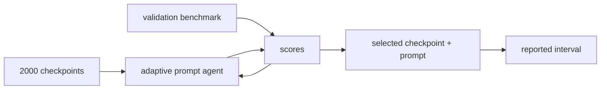

# 阶段测验解答 - PAC 学习与有限假设类（20.2）

> [!danger] 答案隔离
> 先独立完成 20 分钟口试和 210 分钟[[阶段测验 - PAC 学习与有限假设类（20.2）|闭卷题卷]]，冻结 `attempt_id`、原稿、时间与 SHA-256；再由评分者公布 `scorer nonce`，提交[[实验 - PAC 学习与有限假设类累计复现门]]的运行前预测和跨轨盲参。上述证据冻结后才可打开本页或 canonical stdout。答案的任务是定位首个错误事件、量词或比较器，不是制造“看懂了”的熟悉感。

## 一、评分总则

| 能力区 | 分值 | 达标线 | 判分核心 |
|---|---:|---:|---|
| A 定义、量词与事件 | 20 | 14 | 事件、量词、概率空间和学习制度不混写 |
| B 手算、构造与解释 | 30 | 21 | 数值必须依附正确模型，界与精确值不得互称 |
| C 完整上界证明 | 25 | 17 | 每个不等式说明理由，共同事件覆盖数据依赖输出 |
| D 反例、NFL 与下界 | 15 | 10 | 反例满足前提，下界量词为“任意算法存在难世界” |
| E 陌生 AI 迁移 | 10 | 7 | 信息流、修复、编码和下界形成闭环 |

严重错误即使最终公式碰巧正确也扣除对应步骤分：

- 未说明概率对 $S$ 或 learner seed 取；
- 把 pointwise event 直接代入 $h_S$；
- 把 $\Pr(\cup_jB_j)\le\sum_j\Pr(B_j)$ 写成依赖独立性的乘法；
- 把 realizability 写成“训练误差为零”；
- 把 class excess 当作对 Bayes 的总 excess；
- 事后选择 hypothesis class、code/prior 或 confidence claim；
- 用一个算法的失败冒充 minimax lower bound。

## 二、A 区参考解答

### 第 1 题解答：十个断言（5 分）

1. **错。** 对每个 $h$ 各自存在概率至少 $1-\delta$ 的好事件，并不产生一个同时覆盖所有 $h$ 的共同事件。最小修正是对 $M$ 个坏事件各分配 $\delta/M$，再做 Union Bound；或直接建立 uniform/stability/independent-test guarantee。
2. **错。** Union Bound 只用指标不等式 $\mathbf1_{\cup_jB_j}\le\sum_j\mathbf1_{B_j}$，无需独立。独立只可能帮助计算精确并集概率。
3. **对。** 它对一次样本 $S$ 同时陈述所有 $h$ 的 gap 上界。
4. **错。** $\varepsilon$ 是 accuracy/excess-risk tolerance，$\delta$ 是允许的 failure probability。
5. **错。** Distribution-free 指定理对允许分布族中的每个 $P$ 成立；它仍依赖 sampling、loss、class、realizability 等合同。
6. **错。** Realizability 只保证存在零总体风险 $h^*$，因而版本空间非空；其他与样本一致的假设可能有正总体风险。
7. **对。** 一个风险至少 $\varepsilon$ 的坏假设要在 $m$ 次抽样中全部避开错误区域，概率按 $(1-\varepsilon)^m\le e^{-m\varepsilon}$ 衰减。
8. **对。** 一般噪声下比较均值需要精度 $O(\varepsilon)$，Hoeffding 指数含 $m\varepsilon^2$。
9. **错。** 权重/语言必须在评估数据之前固定；事后让胜者变短重新使用了数据，未计入选择复杂度。可在独立数据上冻结语言或把语言选择纳入更上一层 simultaneous budget。
10. **错。** 这只证明某算法的坏例子。Minimax 下界要证明 $\inf_A\sup_{P\in\mathcal P}\mathbb E_P L(A,S)$ 的下界，即任意 $A$ 都存在难 $P$。

每项判断 0.2，理由/修正 0.3。第 1、2、6、9、10 项若理由只写“条件不足”给一半理由分。

### 第 2 题解答：PAC、NFL 与 Minimax 的量词（5 分）

一种 agnostic PAC 骨架为：存在一个学习器 $A$ 和样本复杂度函数 $m_{\mathcal H}$，对所有 $\varepsilon,\delta\in(0,1)$，对所有允许分布 $P$，对所有 $m\ge m_{\mathcal H}(\varepsilon,\delta)$，若 $S\sim P^m$ 且 $U$ 是学习器内部随机性，则

$$
\Pr_{S,U}\!\left[
R_P(A(S,U))\le \inf_{h\in\mathcal H}R_P(h)+\varepsilon
\right]\ge1-\delta.
$$

$A$ 不能依赖未知 $P$；$\varepsilon,\delta$ 是用户请求，$m$ 达标后才抽样。若学习器确定性，可省略 $U$，但不能省略对 $S$ 的概率。

一个上界的典型量词是

$$
\exists A\ \forall P\in\mathcal P:\quad \mathcal R_m(A,P)\le u_m.
$$

一个下界的典型量词是

$$
\forall A\ \exists P_A\in\mathcal P:\quad \mathcal R_m(A,P_A)\ge \ell_m,
$$

等价地 $\inf_A\sup_P\mathcal R_m(A,P)\ge\ell_m$。它们可以同时成立，只要 $\ell_m\le u_m$；二者共同夹住最优可达率。

NFL 的正确读法是：若 $\mathcal P$ 包含有限域上所有 labeling，则对每个算法存在一个与其归纳偏好不匹配的 target/distribution，使其有限样本风险保持为常数量级。它没有声称自然图像分布对所有算法对称；现实成功恰恰来自限制世界或引入匹配的归纳偏置。

### 第 3 题解答：四类事件与数据依赖（5 分）

对 $j=1,\ldots,M$，定义

$$
B_j=\{|R_S(h_j)-R_P(h_j)|>\alpha\}.
$$

uniform 坏事件为

$$
B_{\rm unif}
=\left\{\sup_{h\in\mathcal H}|R_S(h)-R_P(h)|>\alpha\right\}.
$$

有限类中 supremum 超过 $\alpha$ 当且仅当至少存在一个 $j$ 的 gap 超过 $\alpha$，所以

$$
B_{\rm unif}=\bigcup_{j=1}^MB_j.
$$

在补事件 $B_{\rm unif}^c$ 上，命题是

$$
\forall h\in\mathcal H:\ |R_S(h)-R_P(h)|\le\alpha.
$$

因此同一次样本产生的 $\widehat h(S)$ 无论取类中哪个元素，都自动满足该不等式。相反，$B_j^c$ 只控制预先指定的 $h_j$；事件发生后再把下标换成数据选择的 $j(S)$ 是量词偷换。

若 $\mathcal H(S)$ 也由同一 $S$ 生成，原 union 只覆盖抽样前固定的候选。需要控制所有可能生成类的上层 union/cover，或使用条件独立数据、稳定性、信息论/reusable-holdout 等 data-dependent complexity 工具。

### 第 4 题解答：四种学习制度与三种复杂度（5 分）

- **Realizable PAC：** 世界满足 $\inf_{h\in\mathcal H}R_P(h)=0$，目标通常为 $R_P(A(S))\le\varepsilon$；
- **Agnostic PAC：** 不假设零风险 comparator，目标为 $R_P(A(S))\le\inf_hR_P(h)+\varepsilon$；
- **Consistent learner：** 对 realizable sample 返回 $R_S(h)=0$，是有限样本的经验性质；
- **Exact/approximate ERM：** 分别最小化经验风险，或满足 $R_S(\widetilde h)\le\inf_hR_S(h)+\rho$。二者不自动等于总体最优。

有限类典型充分阶为

$$
m_{\rm real}=O\!\left(\frac{\log|\mathcal H|+\log(1/\delta)}{\varepsilon}\right),
$$

控制总体风险；

$$
m_{\rm agn}=O\!\left(\frac{\log|\mathcal H|+\log(1/\delta)}{\varepsilon^2}\right),
$$

控制相对类内 infimum 的 excess。对 Bayes 的总 excess 还包含 approximation error。

Sample complexity 问需要多少 observations；computational complexity 问能否在时间/空间预算内找到所需输出；representation error 问类本身离理想决策有多远。存在统计学习器并不保证 ERM 可高效计算。

## 三、B 区参考解答

### 第 5 题解答：版本空间生存与可实现样本量（8 分）

固定坏假设每个 observation 以概率 $r=0.18$ 出错。它在 $m=28$ 个独立 observations 上全部未出错的概率为

$$
s=(1-r)^m=0.82^{28}\approx0.003862.
$$

在题设独立坐标构造中，31 个坏假设的生存事件相互独立，因此

$$
\Pr(\text{至少一个坏假设生存})
=1-(1-s)^{31}
\approx0.113033.
$$

Union Bound 给

$$
\Pr(\text{至少一个坏假设生存})
\le31s\approx0.119715.
$$

再使用 $1-r\le e^{-r}$：

$$
31(1-r)^m\le31e^{-mr}\approx0.200686.
$$

所以本构造中

$$
P_{\rm exact}\le P_{\rm union}\le P_{\rm exponential},
$$

其中后两项超过 1 时还应截为 1。令 $Me^{-mr}\le\delta$，得到充分条件

$$
m\ge\frac{\log M+\log(1/\delta)}r
=\frac{\log(M/\delta)}r.
$$

题设的精确并集公式用到了“不同坏假设对应独立错误坐标”。一般 finite-class theorem 不需要假设各 hypotheses 的错误事件独立；它只用对每个坏 $h$ 的生存上界和 Union Bound。如果仅知 $R_P(h)\ge r$，则固定 $h$ 的生存概率是 $(1-R_P(h))^m\le(1-r)^m$，精确等号与独立并集公式一般都不再成立。

### 第 6 题解答：不可知 ERM、共同半径与选择偏差（8 分）

经验风险最小的是 $h_2$，所以 $\widehat h=h_2$。总体 oracle 是 $h_1$，类内最优风险为 $0.18$；本次输出的 class excess 为

$$
0.22-0.18=0.04.
$$

对每个 fixed $h_j$，Hoeffding 给 $2e^{-2m\alpha^2}$。求并后要求

$$
2M e^{-2m\alpha^2}\le\delta,
$$

故

$$
\alpha=\sqrt{\frac{\log(2M/\delta)}{2m}}
=\sqrt{\frac{\log160}{800}}
\approx0.07965.
$$

在共同事件上：

$$
\begin{aligned}
R_P(\widehat h)
&\le R_S(\widehat h)+\alpha &&\text{共同事件用于 ERM 输出}\\
&\le R_S(h^*_{\mathcal H})+\alpha &&\text{ERM 比较}\\
&\le R_P(h^*_{\mathcal H})+2\alpha &&\text{共同事件用于 oracle}.
\end{aligned}
$$

四个 absolute gaps 为 $(0.025,0.045,0.04,0.06)$，均小于 $0.07965$，所以给定数值落在事件内。选中者的训练风险低于总体风险是选择偏差的常见方向，不违反尾界；尾界从未声称 gap 必须为零或必须有某个符号。

对 $\rho$-approximate ERM，中间一步增加 $\rho$：

$$
R_P(\widetilde h)\le R_P(h^*_{\mathcal H})+2\alpha+\rho.
$$

### 第 7 题解答：Occam 权重与编码长度（8 分）

Kraft sum 为

$$
2^{-1}+2^{-2}+2^{-4}+2^{-4}+2^{-5}
=\frac{29}{32}=0.90625\le1.
$$

令 $\delta_j=\delta2^{-L_j}$。要使

$$
2e^{-2m\alpha_j^2}\le\delta2^{-L_j},
$$

取

$$
\alpha_j
=\sqrt{\frac{\log(2/\delta)+L_j\log2}{2m}}.
$$

于是所有坏事件的并集概率不超过

$$
\sum_j\delta2^{-L_j}\le\delta.
$$

当 $m=800,\delta=0.05$：

$$
\alpha_{L=1}=\sqrt{\frac{\log80}{1600}}\approx0.05233,
$$

$$
\alpha_{L=5}=\sqrt{\frac{\log40+5\log2}{1600}}\approx0.06687.
$$

短码获得更多失败预算，故置信 penalty 更小；这不是说短模型必然真实。完整 code 必须使接收者唯一恢复 hypothesis，因此 decoder、architecture metadata、precision 与其他 side information 都进入 description length。$\pi(h)$ 是抽样前分配 simultaneous failure budget 的权重，不是观察数据后的 Bayesian posterior。

若看完 validation 后才让胜者最短，则语言本身也是 data-dependent selection。可在独立 pilot data 上设计并冻结 code，或预先列出一族可能语言并为“语言 + hypothesis”联合编码/分配更高层预算。

### 第 8 题解答：Bernoulli 两点检验与下界接口（6 分）

令 $K=\sum_iX_i$。似然比为

$$
\frac{P_+^m(X_{1:m})}{P_-^m(X_{1:m})}
=\left(\frac{1/2+\gamma}{1/2-\gamma}\right)^{2K-m}.
$$

因此 $K>m/2$ 选世界 $+$，$K<m/2$ 选世界 $-$；$K=m/2$ 时似然相同，可随机平票以保持对称。

等先验下的最优平均检验错误为

$$
P_e^*=\frac{1-\operatorname{TV}(P_-^m,P_+^m)}2.
$$

单样本 KL 为

$$
\begin{aligned}
D_{KL}(P_-\|P_+)
&=(\tfrac12-\gamma)\log\frac{1/2-\gamma}{1/2+\gamma}
+(\tfrac12+\gamma)\log\frac{1/2+\gamma}{1/2-\gamma}\\
&=2\gamma\log\frac{1/2+\gamma}{1/2-\gamma}.
\end{aligned}
$$

product rule 给 $mD_{KL}$，Pinsker 给

$$
\operatorname{TV}(P_-^m,P_+^m)
\le\sqrt{\frac{mD_{KL}(P_-\|P_+)}2},
$$

所以

$$
P_e^*\ge\frac12\left(1-\sqrt{\frac{mD_{KL}}2}\right)_+.
$$

当 $\gamma=c/\sqrt m$ 时，$mD_{KL}=O(c^2)$，不会随 $m$ 自动发散；两世界仍有常数级不可区分性。要转成 classification lower bound，还需构造一个问题，使错认世界必然选择在该世界中有至少某个 separation 的 predictor，从而把 testing error 乘上 excess-risk separation。

## 四、C 区参考解答

### 第 9 题解答：可实现有限类的一致学习器定理（8 分）

定义版本空间

$$
V(S)=\{h\in\mathcal H:R_S(h)=0\}.
$$

因为 $R_P(h^*)=0$，所以单个 observation 上 $h^*$ 几乎处处正确；有限个独立 observations 上仍有 $R_S(h^*)=0$（概率 1），故 $V(S)$ 非空，一致学习器有合法输出。

定义坏集合

$$
\mathcal H_{>\varepsilon}=\{h\in\mathcal H:R_P(h)>\varepsilon\}.
$$

固定 $h\in\mathcal H_{>\varepsilon}$。它在一个 observation 上不出错的概率是 $1-R_P(h)<1-\varepsilon$；独立抽样给

$$
\Pr_S(h\in V(S))=(1-R_P(h))^m
<(1-\varepsilon)^m\le e^{-m\varepsilon}.
$$

若算法输出风险大于 $\varepsilon$，由于输出位于 $V(S)$，则版本空间中至少有一个坏假设。因此

$$
\{R_P(A(S))>\varepsilon\}
\subseteq
\bigcup_{h\in\mathcal H_{>\varepsilon}}\{h\in V(S)\}.
$$

求并得

$$
\Pr(R_P(A(S))>\varepsilon)
\le |\mathcal H_{>\varepsilon}|e^{-m\varepsilon}
\le Me^{-m\varepsilon}.
$$

当

$$
m\ge\frac{\log M+log(1/\delta)}\varepsilon
$$

时，右侧至多 $\delta$，取补事件即得结论。若坏集合定义为 $R_P(h)\ge\varepsilon$，则生存概率至多 $(1-\varepsilon)^m$，可以证明 $R_P(A(S))<\varepsilon$ 或按目标声明处理闭边界；关键是事件中的严格号和最终 risk inequality 一致。

判分：版本空间 1；固定坏假设 2；失败包含 1.5；union 1.5；指数和反解 1.5；边界 0.5。只写教科书最终链而不定义事件最高 4 分。

### 第 10 题解答：不可知有限类 ERM 的双侧证明（9 分）

对每个 fixed $h$，Hoeffding 给

$$
\Pr(|R_S(h)-R_P(h)|>\alpha)\le2e^{-2m\alpha^2}.
$$

对 $M$ 个事件求并：

$$
\Pr\left(\sup_{h\in\mathcal H}|R_S(h)-R_P(h)|>\alpha\right)
\le2Me^{-2m\alpha^2}.
$$

令右侧为 $\delta$，取

$$
\alpha=\sqrt{\frac{\log(2M/\delta)}{2m}}.
$$

在概率至少 $1-\delta$ 的共同事件 $E_\alpha$ 上，所有 $h$ 同时受控，因此 data-dependent $\widehat h$ 与固定的 $h_\eta$ 都能代入：

$$
\begin{aligned}
R_P(\widehat h)
&\le R_S(\widehat h)+\alpha &&(E_\alpha,\text{ 输出方向})\\
&\le R_S(h_\eta)+\alpha &&(\text{exact ERM})\\
&\le R_P(h_\eta)+2\alpha &&(E_\alpha,\text{ comparator 方向})\\
&\le \inf_{h\in\mathcal H}R_P(h)+\eta+2\alpha. &&(\eta\text{-oracle})
\end{aligned}
$$

有限类中总体 argmin 实际存在，可直接取 $\eta=0$；题目保留 $h_\eta$ 是为了训练 infimum 思维。取 $\eta=0$ 且 $2\alpha\le\varepsilon$，得到

$$
m\ge\frac{2\log(2M/\delta)}{\varepsilon^2}.
$$

若必须保留 $\eta$，可令 $\eta=\varepsilon/2,\alpha=\varepsilon/4$，常数相应改变。$1/\varepsilon^2$ 来自 $e^{-2m\alpha^2}$ 的均值浓缩，而非 union 的对数项。

若 candidate class 或 loss 看过同一 $S$ 后生成，事件只对原先列入 union 的对象同时成立。需要控制所有可能输出的更大类，或引入独立性/稳定性/信息量等新机制。

### 第 11 题解答：可数类的 weighted Hoeffding/Occam 界（8 分）

对每个 $h$ 令

$$
\alpha(h)=\sqrt{\frac{\log(2/(\delta\pi(h)))}{2m}}.
$$

则 Hoeffding 给

$$
\Pr(|R_S(h)-R_P(h)|>\alpha(h))\le\delta\pi(h).
$$

对可数并集使用 countable subadditivity：

$$
\Pr\left(\exists h:\ |R_S(h)-R_P(h)|>\alpha(h)\right)
\le\delta\sum_h\pi(h)\le\delta.
$$

因此以至少 $1-\delta$ 概率，所有 $h$ 同时满足其各自半径。若 $L(h)$ 是 prefix-free binary code length，由 Kraft inequality，$\sum_h2^{-L(h)}\le1$。令 $\pi(h)=2^{-L(h)}$，得到

$$
|R_S(h)-R_P(h)|
\le\sqrt{\frac{L(h)\log2+log(2/\delta)}{2m}}
\quad\forall h.
$$

一种合法 upper-confidence score 是

$$
\operatorname{score}(h)=R_S(h)+
\sqrt{\frac{L(h)\log2+log(2/\delta)}{2m}}.
$$

选择其最小者时，共同事件给该输出的总体风险 upper certificate；进一步比较 oracle 时还需像 ERM 一样把输出和 comparator 的 penalties 都记账，不能只保留胜者 penalty。

Prefix-free 保证多个 codeword 可唯一解析；预先固定语言防止 evaluation-data-dependent budget allocation；完整描述保证 receiver 真能恢复同一 hypothesis。三者决定 $\sum_h\pi(h)\le1$ 是否对应真实候选集合，因此是概率证明的合同。

## 五、D 区参考解答

### 第 12 题解答：五个研究声明审计（10 分）

1. **Adaptive prompt selection。** 单模型 fixed-query interval 不覆盖从 10 万个候选中选择的胜者，更不覆盖候选生成看过 validation feedback 的循环。预先固定 10 万库可支付 $\log K$ 做 simultaneous bound；自适应生成还需 fresh holdout、reusable holdout/DP、信息控制或把所有可能 transcript 纳入复杂度。
2. **Interpolation 不是 realizability。** 零训练误差只说明 empirical consistency。Realizability 要存在类内 predictor 对目标分布几乎处处零风险；label noise、memorization 和 distribution mismatch 都会破坏可实现 survival proof。现有证据最多支持“该优化输出插值此样本”。
3. **Compression claim 越界。** Occam bound 在预先固定、可解码语言中给 generalization penalty；它不推出 causal truth。文件大小还可能漏掉 decoder、训练 recipe 与 precision。可声明“在完整 code contract 下得到较小 complexity term”，不能声明因果机制更真。
4. **算法坏例不等于 minimax。** 需要对任意算法构造难世界族，并验证统计 closeness 与 decision separation。现有证据只说明该 optimizer/dataset 组合失败。
5. **NFL 误读现实平均。** NFL 的对称平均覆盖所有 labeling；自然图像不是均匀任意 labeling。卷积局部性、等变性、预训练语义等归纳偏置正是在限制/偏好现实结构。可声明“无结构分布族上无统一保证”。

每项：缺失合同 0.75，反例/修复 0.75，证据边界 0.5。

### 第 13 题解答：有限域 NFL 构造与归纳偏置（5 分）

样本有 $m$ 个 positions，即使无重复也至多覆盖 $m$ 个不同输入，故 $2m$ 点中至少 $m$ 点未见。条件于观察到的 sample、labels 与 learner randomness，对每个未见点再均匀随机赋 target label；学习器 prediction 已经确定或有固定条件分布，而独立公平 label 与它不相等的概率为 $1/2$。

因此在未见部分的平均错误质量至少为

$$
\frac{m}{2m}\cdot\frac12=\frac14
$$

（更精细常数取决于 sampling construction）。若对所有 targets 的平均期望风险至少为常数，则至少存在一个固定 target 达到该平均值；不能所有 target 都低于平均。因为 hypothesis class 包含所有 labeling，该 hard target 本身属于类，故仍然 realizable。

合法归纳偏置示例：

- convolutional locality/translation equivariance 偏好局部共享模式，排除大量任意位置依赖函数；
- 图网络 permutation equivariance 偏好节点重标号不改变语义的函数；
- 数据增强偏好在指定 transformation orbit 上标签不变的世界；
- 预训练表示偏好能由语料统计和任务语义低复杂度读出的 target。

只写“CNN、Transformer”而不说明偏好的函数/世界，不给最后 0.75 分。

## 六、E 区参考解答

### 第 14 题解答：大模型 prompt/checkpoint 选择合同（10 分）

一份合格合同至少包含：target population 是未来真实 query/response/context 分布 $P$（不是现有 benchmark 文件）；loss 是抽样前固定的 task loss 或 bounded judge loss；candidate generator $G$ 接收 checkpoint、历史 prompts、validation transcripts 与内部 seed，输出新 prompt；selection rule 在所有 transcript 后选最终 pair；reported estimand 是 $R_P(h_{c,p})$ 或相对预注册 comparator 的 excess。

信息流可写为：



若 2,000 checkpoints 在 validation 前固定，Union Bound 可同时覆盖它们的固定 queries；但 prompt agent 通过 score 回路生成的候选依赖同一 validation，不能简单把实际出现的 $K\le100000$ 当成抽样前固定集合。

修复路径示例：

1. 预注册全部 checkpoint-prompt 库，再对固定有限库支付 $\log K$；新增假设是生成不接触 evaluation sample；
2. validation 供自适应搜索，冻结最终候选后用完全 fresh test 做一次 fixed query；新增假设是 test 与搜索 transcript 独立且 target law 相同；
3. 外层 test/内层 search 的 nested split，估计整个 selection procedure；需外层 observations 独立并重复足够多；
4. reusable holdout/DP mechanism 限制 transcript 信息泄漏；需满足相应 privacy/stability theorem 的形式条件。

编码路线必须描述 checkpoint identity/weights、prompt tokens、agent/program、搜索 budget、decoder、precision、tool/schema 和任何 side information，并在评价样本前冻结。若语言也搜索，则联合编码语言选择。

下界可设两个 deployment worlds $P_-,P_+$：validation observations 在两者下 KL/TV 很小，但 checkpoint A 在 $P_-$ 风险更低、checkpoint B 在 $P_+$ 风险更低，且错误选择导致至少 $\Delta$ excess。验证 $P_-^m,P_+^m$ closeness 后，Le Cam 给常数 testing error，再乘 $\Delta$ 得 selection excess lower bound。

最终 bounded-i.i.d. 证书不覆盖 $Q\ne P$ 的 distribution shift；无界生成 loss 不能直接用 Hoeffding；若 optimizer/agent 未找到定理指定候选，还需 optimization/computation error 账。

## 七、卷级口试参考要点

评分时先听对象和事件，再听公式：

1. **PAC 量词：** learner 先存在，随后对全部请求和允许世界统一；概率对 $S,U$；
2. **Fixed 对 data-dependent：** $\forall h$ 的共同事件可代入随机下标，单个 $h_j$ 的事件不行；
3. **可实现率：** bad region 被 $m$ 次全部避开，$e^{-m\varepsilon}$；
4. **不可知率：** 输出与 oracle 各跨一次双侧 gap，$2\alpha$ 且 $\alpha\asymp1/\sqrt m$；
5. **Occam：** $\delta\pi(h)$ 分预算，Kraft 让权重可求和；
6. **下界：** 上界是存在好算法，下界是任意算法存在难世界；NFL 说明必须限制世界。

只背最终 sample complexity、无法说出坏事件者，该项最高 2/5。

## 八、实验复现门的评分说明

三轨不以“脚本成功退出”判分。每个被指定轨道须先提交：

- 对象、独立性和比较器；
- 至少两个可手算锚点；
- 参数改变时的单调性预测；
- 一个 theorem-bound 与 exact finite-model value 不相等的原因；
- 一个不能从图中推出的外部声明。

Track A 必须分开 exact any-survivor、Union Bound 和 exponential relaxation；Track B 必须解释 exact binomial selection 与 high-probability $2\alpha$ 是不同统计对象；Track C 必须同时解释“短码上界”和“难分辨下界”，不得把 Pinsker 下界当精确检验错误。

## 九、Nonce 与盲参数判分红线

- `scorer nonce` 必须在闭卷 hash 之后公布；
- 主轨由 nonce 决定，不得挑选自己最熟的一轨；
- 至少跨另一轨完成一组评分者未提前透露的参数；
- 非 canonical 参数必须写入新 `--output`，不得覆盖总图；
- stdout、SVG 和 hash 一并保存；
- 先运行后补预测，该轨最高记为 practice；
- 只改变随机 seed 不算换机制，因为脚本本身是解析确定性的。

## 十、48 小时与 14 天复测说明

48 小时门要求重新建立证明的一处机制。例如不同 $r_j$ 时，Track A 的 independent-coordinate exact failure 变为

$$
1-\prod_j\left[1-(1-r_j)^m\right],
$$

而通用 Union Bound 变为 $\sum_j(1-r_j)^m$。只把 $m=28$ 改成 30 不算重建。

14 天门评分 10 分：对象合同 2、上界事件 2、data-dependence/shift 边界 2、下界构造 2、可证伪实验 2。总分至少 7 且任一项不得为 0。

## 十一、从 `retained` 到逐节点证据

卷级通过说明 LT-09—16 的接口可共同调用，不自动把八个节点逐一改为 `verified`。若要逐节点升级，每个节点还需至少一种独立证据：

- 未见题目的完整推导；
- 无提示口述并回答追问；
- 新反例/边界构造；
- 对陌生论文 theorem contract 的逐项审计；
- 延迟复测中明确调用该节点且无关键错误。

## 十二、最终状态边界

本解答、题卷、实验、脚本和总图达到 `regression-passed`，只说明材料结构、解析锚点和确定性输出通过审计。没有学习者原始口试、闭卷、nonce、盲参和延迟证据时：

```text
material: regression-passed
volume gate built: yes
learner attempt: not-attempted
learner pass: no evidence
retention: no evidence
node status: draft
```

不得用仓库 commit、CI 通过或阅读本页的时间戳替代个人学习证据。
