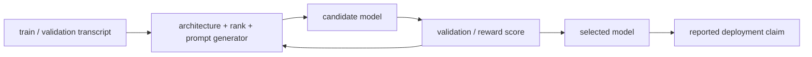

# 阶段测验解答 - VC 维与一致收敛（20.3）

> [!danger] 答案隔离
> 先独立完成 20 分钟口试和 210 分钟[[阶段测验 - VC 维与一致收敛（20.3）|闭卷题卷]]，冻结 `attempt_id`、原稿、时间和 SHA-256；再由评分者公布 `scorer nonce`，提交[[实验 - VC 维与一致收敛累计复现门]]的组合预测、主轨手推和跨轨盲参。上述证据冻结后才可打开本页或 canonical stdout。阅读证明时，应标注自己原稿中第一个对象、量词或事件错误，而不是只对照最终公式。

## 一、评分总则

| 能力区 | 分值 | 达标线 | 判分核心 |
|---|---:|---:|---|
| A 对象、量词与定义 | 20 | 14 | trace、growth、dimension 和学习命题不混写 |
| B 组合计数与推广 | 30 | 21 | 见证与上界成对，精确量与 theorem bound 分离 |
| C 完整证明链 | 25 | 17 | Sauer、对称化、必要性和 SRM 每步有理由 |
| D 反例与声明审计 | 15 | 10 | 反例满足原命题前提，参数数不冒充功能容量 |
| E 陌生迁移 | 10 | 7 | class/loss/feedback/shift 形成可审计合同 |

以下错误触发对应步骤重扣：

- 用一个被打散的 $d$ 点集断言 VC 维“恰为” $d$，却无 $d+1$ 点上界；
- 把 $|\Pi_{\mathcal H}(C)|$ 直接写成 $\tau_{\mathcal H}(m)$；
- 用参数数量替代 shattering/growth 证明；
- 在 ghost-sample proof 中只数训练样本的 $m$ 点模式；
- 看到 VC bound 大于 1 便称 theorem 错误；
- 将 Natarajan witness、Graph witness 与 pseudo-witness 互换；
- 在看过数据后才选择 SRM 权重，仍使用原 weighted Union Bound。

## 二、A 区参考解答

### 第 1 题解答：十个断言（5 分）

1. **对。** 存在一个 $m$ 点集产生 $2^m$ 模式，而 universal envelope 又给 $\tau(m)\le2^m$，所以等号成立。
2. **错。** VC 维 $d$ 只保证存在至少一个被打散的 $d$ 点集；其他 $d$ 点集可能不被打散。
3. **错。** 例如所有常数实值函数参数无限，却作为阈值分类族只具有很低容量；反之一个实数参数可编码可数域上任意 labeling，得到无限 VC 维。
4. **对。** 可给较小点集添加新点并限制，模式数不减少；二分类总模式至多 $2^m$。
5. **对。** 四个有序点能形成任意至多两段 1 的字符串，即全部 16 种；五点上的交替串 10101 有三段 1，不能实现。
6. **错。** 当 $m\le d$ 时上界是 $2^m$，并可达到；只有 $m>d$ 时 binomial sum 严格小于 $2^m$。
7. **对。** 对称化同时出现 $S,S'$；条件于 pooled $2m$ points 后，只需对其上不同限制模式求并。
8. **错。** Binary 基本定理不能直接照搬。多分类要用 Natarajan/Graph 等容量，且“某个 ERM”与“任意 ERM”可能分离。
9. **错。** 它只证明伪维至少 2；还要证明任意三点和任意逐点阈值不能全部实现，才能得上界 2。
10. **错。** 权重必须在用于证书的数据之前固定；事后选择权重本身产生额外 data dependence。

每项判断 0.2，理由或最小修正 0.3。

### 第 2 题解答：四类命题和概率量词（5 分）

设 loss 有界，类固定。Distribution-free uniform convergence 要求存在 $m^{UC}_{\mathcal H}$，使对所有 $\varepsilon,\delta$、所有允许 $P$ 和所有 $m\ge m^{UC}$：

$$
\Pr_{S\sim P^m}\left[
\sup_{h\in\mathcal H}|R_S(h)-R_P(h)|\le\varepsilon
\right]\ge1-\delta.
$$

ERM agnostic PAC 要求指定 ERM rule 对所有上述对象满足

$$
R_P(\widehat h_S)\le\inf_{h\in\mathcal H}R_P(h)+\varepsilon
$$

的高概率保证。Agnostic PAC 只要求**存在**某学习器 $A$ 满足该 class-excess 合同；realizable PAC 额外限制 $P$ 满足 $\inf_hR_P(h)=0$，目标可写 $R_P(A(S))\le\varepsilon$。

四个命题的对象不同：有限 VC 是组合容量；uniform convergence 是全类 empirical process；ERM learnability 是特定 algorithm guarantee；PAC learnability 是学习器存在性。充分链为有限 VC 推出增长受控，继而 UC，继而 ERM PAC，再推出存在 learner。必要方向固定任意 learner 后用 shattered set 构造 hard realizable distribution。统计存在性没有给出搜索 ERM 或实现 learner 的时间界，因此不含 computational efficiency。

### 第 3 题解答：trace、增长函数与 VC 维（5 分）

对无重复点集 $C=(x_1,\ldots,x_m)$：

$$
\Pi_{\mathcal H}(C)
=\{(h(x_1),\ldots,h(x_m)):h\in\mathcal H\}
\subseteq\{0,1\}^m.
$$

重排点只对向量坐标做同一置换，不改变基数；重复点强迫相应坐标相同，不增加可区分模式。

$$
\tau_{\mathcal H}(m)
=\sup_{C\subseteq\mathcal X,\ |C|=m}|\Pi_{\mathcal H}(C)|.
$$

$C$ 被打散是 $\Pi_{\mathcal H}(C)=\{0,1\}^m$，等价于

$$
\forall y\in\{0,1\}^m\ \exists h\in\mathcal H:\ h|_C=y.
$$

否定为

$$
\exists y\in\{0,1\}^m\ \forall h\in\mathcal H:\ h|_C\ne y.
$$

VC 维是可被打散点集大小的 supremum。若 $\tau(d)=2^d$，存在被打散的 $d$ 点集；若 $\tau(d+1)<2^{d+1}$，不存在任何被打散的 $d+1$ 点集。由 shattering downward closure，更大点集也不能被打散，因此 VC 维恰为 $d$。

### 第 4 题解答：学习制度、率与扩展对象（5 分）

二分类 0–1 学习在信息论最优尺度上为

$$
m_{\rm real}=\Theta\left(\frac{d+\log(1/\delta)}\varepsilon\right),
\qquad
m_{\rm agn}=\Theta\left(\frac{d+\log(1/\delta)}{\varepsilon^2}\right).
$$

用初等 Sauer + VC inequality 反解，常出现 $d\log(1/\varepsilon)$ 或隐式 $d\log(m/d)$，不是所有路线的最优率。

- Uniform PAC：一个样本复杂度同时覆盖类中所有 target/允许分布；
- Nonuniform learnability：对每个 comparator/hypothesis 可有依赖其所在层的样本量；
- Universal consistency：对每个固定分布渐近逼近 Bayes 或目标风险，未必有统一有限样本率；
- SRM：在可数有限容量层之间用预先固定预算和 penalty 做选择，是实现 nonuniform/sieve 思路的一种算法。

Natarajan witness 在每个点指定两种不同标签 $f_1(x)\ne f_2(x)$，要求每个二元选择子集都由某 $h$ 逐点选择其一。Graph witness 固定 reference labeling $f$，要求每个子集都能实现“在子集上等于 $f$，在补集上不等于 $f$”。Pseudo-shattering 为每点固定实阈值 $r_i$，要求所有 $\mathbf1\{f(x_i)>r_i\}$ bit patterns 可实现；阈值在选择函数前固定，但不同点可以不同。

## 三、B 区参考解答

### 第 5 题解答：阈值、区间与两段区间的增长函数（8 分）

将点按 $x_1<\cdots<x_m$ 排列。单侧阈值只在相邻点之间选择一次切换位置；包括全 0 和全 1，共 $m+1$ 种。一个点可实现 0/1，两点上的某个相反方向 labeling 不能同时由固定方向阈值实现，所以 VC 维为 1（若类同时含两方向，应重新定义并计算）。

单闭区间在有序点上产生空 labeling，或选择一对 boundary gaps 包住一段连续 1。$m+1$ 个 gaps 中选两个，故

$$
\tau_1(m)=1+\binom{m+1}{2}
=1+\frac{m(m+1)}2.
$$

两点上四种 labeling 都可实现；三点交替串 101 需要两段 1，单区间不能实现，所以 VC 维为 2。

若恰有 $k$ 段 1，每段由一个 start gap 和 end gap 唯一确定；所有 $2k$ 个 boundaries 严格按顺序排列。因此在 $m+1$ gaps 中选择 $2k$ 个即得

$$
N_{m,k}=\binom{m+1}{2k}.
$$

至多两段的增长函数为

$$
\tau_2(m)
=\sum_{k=0}^2\binom{m+1}{2k}.
$$

于是

$$
\tau_2(5)=1+\binom62+\binom64=1+15+15=31,
$$

$$
\tau_2(6)=1+\binom72+\binom74=1+21+35=57.
$$

$m=4$ 时 $1+\binom52+\binom54=16=2^4$，存在全部 labeling；$m=5$ 时只有 31 小于 32，交替串 10101 是缺失见证。因此 VC 维为 4。只展示四点见证只能证明 $d\ge4$，不能排除某个五点集也被打散。

### 第 6 题解答：Sauer–Shelah 的递推手算（8 分）

把集合族 $\mathcal F\subseteq2^{[m]}$ 按最后元素 $m$ 删除。令

$$
\mathcal F_0=\{A\subseteq[m-1]:A\in\mathcal F\text{ 或 }A\cup\{m\}\in\mathcal F\},
$$

记录投影后至少出现一次的 fiber；令

$$
\mathcal F_1=\{A\subseteq[m-1]:A\in\mathcal F\text{ 且 }A\cup\{m\}\in\mathcal F\},
$$

记录同时出现 0/1 两个 fiber 的 base。每个 base 至少贡献一个集合，同时出现两 fiber 时多贡献一个，故

$$
|\mathcal F|=|\mathcal F_0|+|\mathcal F_1|.
$$

若 $\mathcal F_0$ 打散 $d+1$ 点，则原族也打散这些点，矛盾，所以其 VC 维至多 $d$。若 $\mathcal F_1$ 打散 $d$ 点，因为每种 base labeling 都同时有不含/含最后点两个 extensions，原族会打散这 $d$ 点加最后点，共 $d+1$ 点，矛盾。因此

$$
g_d(m)\le g_d(m-1)+g_{d-1}(m-1).
$$

用归纳假设和 Pascal identity：

$$
\begin{aligned}
g_d(m)
&\le\sum_{i=0}^d\binom{m-1}{i}
+\sum_{i=0}^{d-1}\binom{m-1}{i}\\
&=\sum_{i=0}^d\binom mi.
\end{aligned}
$$

$d=0$ 时最多一个 pattern；$m\le d$ 时 binomial sum 取到 $2^m$。对 $d=4,m=10$：

$$
1+10+45+120+210=386<1024=2^{10}.
$$

当 $1\le d\le m$ 时，可由标准 binomial estimate 得

$$
\sum_{i=0}^d\binom mi\le\left(\frac{em}{d}\right)^d.
$$

它把精确组合和进一步替换为单项式包络，便于取对数但可能明显更松，尤其在 $d$ 接近 $m$ 或小样本时。

### 第 7 题解答：三种一致偏差半径（8 分）

令 $h_j(x)=\mathbf1\{x\le j\}$，$j=0,\ldots,6$。则

$$
R_P(h_j)=P(X\le j)=\frac j6,
\qquad
R_S(h_j)=\frac1m\sum_{i=1}^m\mathbf1\{X_i\le j\}=F_m(j).
$$

所以 supremum 正是离散支持点上的 empirical-CDF deviation。

DKW 半径为

$$
\sqrt{\frac{\log40}{80}}\approx0.214735.
$$

有限类 $|\mathcal H|=7$ 的 Hoeffding radius 为

$$
\sqrt{\frac{\log(14/0.05)}{80}}
=\sqrt{\frac{\log280}{80}}
\approx0.265396.
$$

VC 路线使用 $\tau(80)=81$：

$$
\sqrt{\frac8{40}\left(\log81+\log80\right)}
\approx1.324876.
$$

0–1 risk gap 本来至多 1，所以半径大于 1 的 event 仍以概率 1 成立；只是没有排除任何可能值，因此“valid but vacuous”。四者排列为

$$
0.175\;\text{(exact)}
<0.214735\;\text{(DKW)}
<0.265396\;\text{(finite union)}
<1.324876\;\text{(本卷 VC 常数)}.
$$

精确值使用有限域和精确 multinomial law；DKW 使用 CDF 的嵌套结构；finite union 只用实际 7 个固定函数；VC route 只用最坏 growth、ghost sample 和通用常数。全部都是对 $P$ 的 in-distribution statement，不能把 $P$ 静默换成部署 $Q$。

### 第 8 题解答：多分类与伪维的有限见证（6 分）

在三点上 full class 函数数为

$$
K^q=4^3=64.
$$

每点选择两种标签，例如 $f_1(x_i)=0,f_2(x_i)=1$。Full class 包含全部 $2^3=8$ 个逐点二元选择，所以这是 size-3 Natarajan witness。对 Graph witness，取 reference $f(x_i)=0$；对每个子集 $T$，令 $h_T$ 在 $T$ 上为 0、补集上为 1，也得到 8 个 match/deviate patterns。因此 $d_N,d_G\ge3$。上界来自 domain 只有 3 个点，不可能打散 4 个不同点，所以在这个特定 domain 上二者恰为 3；只给见证本身时不能跳过该上界。

Affine pseudo-witness 可取：

| bits at $(-1,1)$ | $(a,b)$ |
|---|---|
| 00 | $(0,-1)$ |
| 11 | $(0,1)$ |
| 10 | $(-1,0)$ |
| 01 | $(1,0)$ |

相对阈值 $(0,0)$，四种严格大于模式均实现，故 pseudo-dimension 至少 2。要得恰为 2，还需证明三点上界。

有限 prediction Pdim 只约束阈值化预测行为。Squared loss 会把大残差平方放大；若输出/标签无界，有限 Pdim 不提供统一 envelope。可要求 $|f(X)|,|Y|\le B$，或加入 sub-Gaussian/sub-exponential tails、truncation 和相应 concentration，再控制 loss class。

## 四、C 区参考解答

### 第 9 题解答：从增长函数到 VC 一致收敛（9 分）

记

$$
\Gamma(S)=\sup_{h\in\mathcal H}|P f_h-P_mf_h|,
$$

其中 $f_h(z)=\ell(h,z)\in\{0,1\}$。引入独立 ghost sample $S'\sim P^m$。当 $m\varepsilon^2\ge2$ 时，对每个导致 $|P_mf_h-Pf_h|>\varepsilon$ 的 fixed $S,h$，ghost empirical mean 以至少 $1/2$ 概率落在 $Pf_h$ 的 $\varepsilon/2$ 邻域。因此三角不等式使

$$
\Pr_S(\Gamma(S)>\varepsilon)
\le2\Pr_{S,S'}\left[
\sup_h|P_mf_h-P'_mf_h|>\frac\varepsilon2
\right].
$$

将 $S,S'$ 合并为 $2m$ 个 pooled observations $(Z_i,Z'_i)$。对每对独立投掷 Rademacher sign $\sigma_i$，决定是否交换。由 pairwise exchangeability，双样本差的分布等于

$$
\frac1m\sum_{i=1}^m\sigma_i\bigl(f_h(Z_i)-f_h(Z'_i)\bigr).
$$

条件于 pooled data 后，每个 $h$ 只通过它在这至多 $2m$ 个点上的 binary restriction 进入。不同参数若产生相同 pooled labeling，就给出同一个 difference vector；因此 distinct vectors 至多

$$
|\Pi_{\mathcal H}(\widetilde S)|\le\tau_{\mathcal H}(2m).
$$

对一个 fixed vector，变量 $\sigma_i a_i$ 独立、均值 0 且位于 $[-1,1]$。Two-sided Hoeffding 在阈值 $\varepsilon/2$ 给

$$
\Pr_\sigma\left(\left|\frac1m\sum_i\sigma_i a_i\right|>\frac\varepsilon2\right)
\le2e^{-m\varepsilon^2/8}.
$$

对至多 $\tau(2m)$ 个 vectors 求并，再乘对称化外因子 2：

$$
\Pr(\Gamma(S)>\varepsilon)
\le4\tau_{\mathcal H}(2m)e^{-m\varepsilon^2/8}.
$$

右侧与具体 pooled data 无关，故解除条件/积分后保持。令其不超过 $\delta$：

$$
\Gamma(S)\le
\sqrt{\frac8m\left[\log\tau_{\mathcal H}(2m)+\log\frac4\delta\right]}
$$

以至少 $1-\delta$ 概率成立。若再用 Sauer，可将 $\log\tau$ 换成 $d\log(2em/d)$。不同教材若改变 symmetrization threshold、one/two-sided event 或 concentration range，前因子和指数会联动变化，不能只挑更好看的常数组合。

判分：ghost 2；交换/pooled 2；模式 union 2；Hoeffding/常数 1.5；反解/边界 1.5。

### 第 10 题解答：二分类基本定理与无限 VC 必要性（8 分）

充分链为：

$$
\text{finite VC}
\Rightarrow\text{Sauer polynomial growth}
\Rightarrow\text{uniform convergence}
\Rightarrow\text{ERM agnostic PAC}
\Rightarrow\text{PAC learnable}.
$$

第一箭头用组合计数；第二用对称化/浓缩；第三用 two-gap ERM comparison；第四只是“特定 ERM 成功”蕴含“存在成功 learner”。

必要性中先固定任意 $A$ 和 $m$。无限 VC 保证存在被打散的

$$
C=\{x_1,\ldots,x_{2m}\}.
$$

随机均匀抽 $\Sigma\in\{0,1\}^{2m}$；由 shattering，存在 $h_\Sigma\in\mathcal H$ 实现该 labeling。令 $X$ 在 $C$ 上均匀，$Y=h_\Sigma(X)$，所以每个世界 realizable。

对每个 $x_j$，未在 $m$ 次有放回样本中出现的概率为

$$
\left(1-\frac1{2m}\right)^m\ge\frac12.
$$

故未见点的期望概率质量至少 $1/2$。条件于 training transcript 和 learner randomness，未见点的随机 label 仍是公平 bit，预测错误概率 $1/2$。联合平均风险至少

$$
\frac12\cdot\frac12=\frac14.
$$

对 targets 平均至少 $1/4$，故至少有一个固定 $\sigma$ 满足 $\mathbb E_{S,U}R_{P_\sigma}(A(S,U))\ge1/4$。令 $q=\Pr(R>1/8)$，因 $R\le1$：

$$
\mathbb ER\le\frac18(1-q)+q
=\frac18+\frac78q,
$$

所以 $q\ge1/7$。量词为：对每个 learner、每个样本量，都存在一个 realizable hard distribution，使其以常数概率风险大于常数。学习基本定理是统计存在性结论；找到 ERM 或另一 learner 可能计算困难，因此不推出高效 ERM。

### 第 11 题解答：SRM 共同事件与 Oracle Inequality（8 分）

定义

$$
E_k=\left\{
\sup_{h\in\mathcal H_k}|R_P(h)-R_S(h)|
\le\alpha_k(m,\delta\pi_k)
\right\}.
$$

每层失败概率至多 $\delta\pi_k$，故

$$
\Pr\left(\bigcap_{k\ge1}E_k\right)
\ge1-\sum_k\delta\pi_k\ge1-\delta.
$$

记 $\alpha_k=\alpha_k(m,\delta\pi_k)$。Exact SRM 选择

$$
(\widehat k,\widehat h)
\in\arg\min_{k,h\in\mathcal H_k}
\{R_S(h)+\alpha_k\}.
$$

在共同事件上，对任意 $k,h\in\mathcal H_k$：

$$
\begin{aligned}
R_P(\widehat h)
&\le R_S(\widehat h)+\alpha_{\widehat k}
&&\text{输出层的共同事件}\\
&\le R_S(h)+\alpha_k
&&\text{SRM score 最小}\\
&\le R_P(h)+2\alpha_k
&&\text{comparator 层的共同事件}.
\end{aligned}
$$

若 score 只做到 $\rho$-approximate minimization，第二行增加 $\rho$，最终为 $R_P(h)+2\alpha_k+\rho$。

对任意固定 comparator $h$，只要它落在某个有限维层 $\mathcal H_k$，增加 $m$ 可使该固定层 penalty 变小；样本量可以依赖这个 $k/h$，形成 nonuniform guarantee。总并类即使 VC 维无限也不妨碍该结论。若层级或 $\pi_k$ 看过同一 $S$ 后才生成，原共同事件没有同时覆盖这种 meta-selection；需要上层编码/Union、独立数据、稳定性或信息控制。

## 五、D 区参考解答

### 第 12 题解答：五个研究声明审计（10 分）

1. **参数数不等于 VC。** VC 是 prediction functions 的 shattering capacity；参数共享、约束、重参数化和离散 precision 都会改变关系。现有证据只给 parameter count。修正为：对明确 architecture/function class 建立已知 upper/lower capacity theorem。
2. **经验模式不等于最坏增长。** 一个 batch 上 30 个 patterns 只是 $|\Pi_{\mathcal H}(C_{obs})|$ 或更小的搜索产物；$\tau(m)$ 对所有 $m$ 点集和全类取 supremum。可报告“该 batch/采样程序观察 30 种”，不能报告全局上界。
3. **Vacuous 不等于 false。** 半径 $>1$ 对 0–1 gap 仍真，只是不能排除任何风险差。可换更结构化 inequality、更多样本或更小容量；实验没有反驳 theorem。
4. **标签函数计数不是 $\log_2$ 维数。** 在 3 点 domain 上，Natarajan 维至多 3；full class 用两标签 witness 打散全部 3 点，所以等于 3。64 是 $4^3$ 个 functions，不给维数 6。
5. **Pdim 不自动控制无界 squared loss。** 需要控制 loss class envelope/tails；极少的大 reward residual 可破坏均值浓缩。可加 bounded outputs/labels、tail assumptions、truncation 或适当 empirical-process bound。

每项：缺失合同 0.75，反例/修复 0.75，证据边界 0.5。

### 第 13 题解答：见证、上界与不可学习反例（5 分）

令 $\mathcal X$ 无限，$\mathcal H$ 为所有有限子集的 indicators。对每个固定有限 $C$，trace 当然是有限集合，且实际上包含全部 $2^{|C|}$ labeling；由于每个有限 $C$ 都被打散，VC 维无限。这个例子说明“每次只观察有限个模式”是有限样本的平凡事实，uniform learnability 需要模式随 $m$ 的统一增长控制。

单参数反例：令 $\mathcal X=\mathbb N$，用一个实数 $\theta\in[0,1]$ 的二进制 digits 编码序列，定义 $h_\theta(n)$ 为第 $n$ 个 digit（对双展开点固定约定）。这一个标量参数表示所有二元序列，打散任意有限自然数集合，VC 维无限。它不一定是连续或计算良好的参数化，恰好说明不加正则性时 parameter dimension 不是 capacity theorem。

任意 lower witness 只给 $d\ge q$。要证明等号，还需对任意 $q+1$ 个点和允许的全部 auxiliary witnesses（多分类的标签对/reference、伪维的阈值向量）证明至少有一个 pattern 不可实现。

## 六、E 区参考解答

### 第 14 题解答：自适应架构、LoRA 与 reward-model 选择（10 分）

合格合同示例：target population $P$ 是未来真实 prompts、contexts、labels/rewards 的联合分布；sample law 明确 train/validation transcript 是否 i.i.d.；prediction class 包含 encoder、LoRA rank、prompt template 与 head 组合产生的函数；loss class 是分类 0–1/surrogate 或 reward regression loss；meta-algorithm 读取历史 scores 并生成下一候选；comparator 是预注册总层级内的 oracle，而非未定义“最佳模型”。

反馈图：



只有数据前固定的 layers/classes/weights 才被原 SRM common event 覆盖；经 score feedback 产生的新结构是 data-dependent class selection。

合法路线包括：预注册可数层 $(\mathcal H_k,\pi_k)$ 并用 weighted SRM；把自适应搜索全部留在 inner data，冻结最终 procedure 后用 fresh outer sample 评价；或使用满足形式条件的 stability/DP/information mechanism。每条路线都新增独立性、bounded loss、可测性或机制参数合同。

四分类应先明确 multiclass 0–1 目标，并使用 Natarajan/Graph 等容量；标签数本身不是维数。实值 reward 需要 pseudo/fat-shattering 或直接控制 thresholded subgraph/loss class；若 squared loss 无界，还需 envelope/tails。

下界可构造 $P_-,P_+$：它们在当前 transcript 下 TV/KL 小，但 $P_-$ 上低 rank/简单层最优，$P_+$ 上高 rank/复杂层最优，错选造成至少 $\Delta$ excess。验证 product closeness 和 decision separation 后，才能转成选择下界。

最终 in-distribution capacity certificate 不自动覆盖 $Q\ne P$ 的 shift；adaptive/dependent prompts 破坏 i.i.d.；unbounded loss 破坏 Hoeffding；optimizer 没有达到 ERM/SRM score 时还需 $\rho$ optimization error。

## 七、卷级口试参考要点

1. **Trace/growth/VC：** 固定 $C$ 的集合、对 $C$ 取 supremum 的函数、发生全模式转折的整数；
2. **Sauer：** fiber 投影计数，双 fiber 家族维数少 1，Pascal 闭合；
3. **VC inequality：** ghost 转总体均值为双样本差，交换后只数 pooled restrictions；
4. **必要性：** 任意 learner 先固定，hard realizable distribution 后构造；
5. **SRM：** 权重预先固定，共同事件同时覆盖输出层与 comparator 层；
6. **推广：** Natarajan 用两标签选择，Graph 用 reference match，Pdim 用逐点实阈值。

无法给出见证/否定量词、只背维数表者，该项最高 2/5。

## 八、实验复现门的评分说明

脚本成功退出只占可复现分，不代表理解。每个指定轨道先提交：

- 对象和取 supremum 的范围；
- 一个精确计数/概率锚点；
- 一个 theorem envelope；
- 参数干预的方向预测；
- 一个图不能推出的维数或部署声明。

Track A 必须区分 enumeration、Sauer equality 和 VC upper obligation；Track B 必须区分 exact finite-domain law、DKW、finite-H 与 general VC radius；Track C 必须区分 selected layer、best true-risk layer、oracle-bound layer，并说明有限 extension witness 只给 lower bound。

## 九、Nonce 与盲参数判分红线

- nonce 在闭卷 hash 后公布，主轨不得自选；
- 至少跨另一轨完成未公开参数；
- 非 canonical 参数写到新路径；显式指向 canonical 也应被拒绝；
- 先冻结预测，再运行；反向顺序只记 practice；
- stdout、SVG、SHA-256 和 command 同时保存；
- 只把 `max-size=10` 改成 11 不算 48 小时换机制；
- 公开 audit fixture 不得充当个人盲参。

## 十、48 小时与 14 天复测说明

48 小时门必须改变一处对象结构。例如至多 $s$ 段 1 的模式数为

$$
\sum_{k=0}^s\binom{m+1}{2k},
$$

其 VC 转折为 $2s$；学习者需重新解释为什么 boundaries 唯一，而不能只让脚本输出新数值。

14 天门按 10 分评分：对象/反馈 2，lower witness 2，upper obligation 2，风险路线 2，边界/反例 2；总分至少 7，任一项不得为 0。

## 十一、从 `retained` 到逐节点证据

卷级通过只说明 LT-17—24 的接口可共同调用。逐节点升级仍需新的独立证据，例如：

- LT-17/18：陌生几何类的 lower/upper VC 证明与增长计算；
- LT-19：脱离模板重建 fiber recursion；
- LT-20：另一常数版本的完整对称化账本；
- LT-21：必要性量词与常数概率转换；
- LT-22：新层级的 SRM oracle inequality；
- LT-23/24：新 multiclass/real-valued 类的见证与上界。

## 十二、最终状态边界

题卷、详解、实验、脚本、总图和独立审计达到 `regression-passed`，表示材料合同自洽；在个人证据真实产生前：

```text
material: regression-passed
volume gate built: yes
learner attempt: not-attempted
learner pass: no evidence
retention: no evidence
node status: draft
```

commit、CI、canonical hash 或阅读本页均不能替代学习者证明能力。
