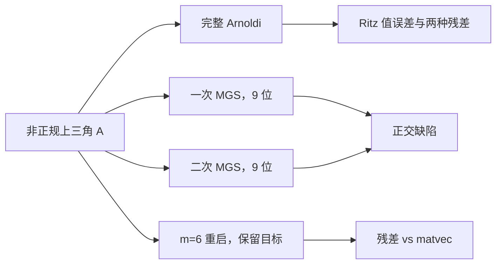

# 实验 - Arnoldi 非正规性、重正交与重启

> [!question] 本实验的判别问题
> 在同一个非正规特征值问题上，Arnoldi 尾项残差、有限精度正交性与短重启遗忘能否作为三个不同机制分别验收？

## 研究问题与预注册假设

1. 最大实 Ritz 对的直接残差是否等于 $|h_{k+1,k}e_k^Ty|$？
2. 9 位舍入模拟中，二次 MGS 是否比一次 MGS 保持更好的 $\|Q^TQ-I\|_F$？
3. 子空间上限 $m=6$、每轮保留目标 Ritz 向量时，重启残差能否持续下降？

> [!hypothesis] 假设
> 两种残差在计算误差内重合；二次 MGS 将正交缺陷压在模拟舍入量级；保留目标信息的短重启比随机清空具有持续进展。

## 实验对象

矩阵为实上三角：对角线含两个分离目标 $5,3$，其余从 $2.5$ 递减到 $0.5$；第一、第二超对角线分别为 $0.9,0.2$。特征值可直接从对角线读出，但非零上三角耦合使矩阵非正规。

- 代码：[plot_arnoldi_restart_nonnormal.py](</Users/tong/Nodes/basic/00-知识库管理/_labs/code/plot_arnoldi_restart_nonnormal.py>)；
- 图形：[plot-arnoldi-restart-nonnormal-v2.svg](</Users/tong/Nodes/basic/00-知识库管理/_assets/plots/arnoldi/plot-arnoldi-restart-nonnormal-v2.svg>)；
- 图形 SHA-256：`7ec20901dde9a4fa14a6dc5aaee0483d6969cb56c5620f1710a2028fc90dd19e`；
- Python：系统 `python3`，仅标准库；
- 种子：`20260815`；
- 面板 B：每个基本运算舍入到 9 位有效数字。

## 方法



完整 Arnoldi 面板使用双精度并显式计算原问题残差；重启面板每轮用当前最大实部 Ritz 向量作为新起点。

## 结果

**图中哪些现象分别支持“残差公式正确”“重正交有效”和“短重启仍有进展”？**

![[00-知识库管理/_assets/plots/arnoldi/plot-arnoldi-restart-nonnormal-v2.svg|880]]

> [!figure] 实验图｜Arnoldi 的残差恒等式、正交性与重启代价
> A 对最大实部 Ritz 对比较 Ritz 值误差、直接原问题残差与尾项廉价残差；B 在 9 位舍入模拟中比较一次与二次 MGS 的 $\|Q^TQ-I\|_F$；C 比较完整 Arnoldi 与保留目标 Ritz 方向的 $m=6$ 重启。生成脚本：[[plot_arnoldi_restart_nonnormal.py]]；确定性上三角非正规矩阵，并对残差恒等式、MGS2 分离和重启下降设断言。

**怎样读图。** A 先核对直接残差与尾项残差是否全程重合，再比较它们与 Ritz 值误差到达数值地板的先后；B 读取一次、二次 MGS 在后期相差的数量级；C 不只看终点，还要比较每次重启后的下降是否持续，以及它相对完整 Arnoldi 多用了多少 matvec。

**适用边界（图没有证明什么）。** 这是一个分离目标明确的确定性上三角矩阵，9 位十进制舍入也不是某种具体硬件格式；图只验证一个目标 Ritz 方向的保留式短重启，不证明随机重启、内部特征值、聚簇或缺陷矩阵上同样有效。

### 完整 Arnoldi 代表点

| $k$ | Ritz 值误差 | 直接残差 | 廉价残差 |
|---:|---:|---:|---:|
| 5 | $2.20\times10^{-2}$ | $2.307\times10^{-1}$ | $2.307\times10^{-1}$ |
| 10 | $1.125\times10^{-4}$ | $1.489\times10^{-3}$ | $1.489\times10^{-3}$ |
| 15 | $4.816\times10^{-7}$ | $1.160\times10^{-5}$ | $1.160\times10^{-5}$ |
| 20 | $2.558\times10^{-11}$ | $1.861\times10^{-8}$ | $1.861\times10^{-8}$ |
| 24 | 数值地板 | $3.718\times10^{-11}$ | $3.718\times10^{-11}$ |

### 正交与重启

| 指标 | 结果 |
|---|---:|
| $k=24$ 一次 MGS 正交缺陷 | $2.284\times10^{-7}$ |
| $k=24$ 二次 MGS 正交缺陷 | $3.697\times10^{-9}$ |
| matvec 6 重启残差 | $9.023\times10^{-2}$ |
| matvec 18 重启残差 | $6.671\times10^{-6}$ |
| matvec 30 重启残差 | $1.640\times10^{-10}$ |

## 分析

直接与廉价残差逐点重合，验证 Arnoldi 尾项公式。Ritz 值误差往往早于残差达到很小数量级，说明停止应以原方程残差而非值变化为主。二次 MGS 在最终维数将正交缺陷降低约两个数量级。短重启能收敛，是因为它保留了目标方向；这不意味着任何随机重启都有效。

## 失败与边界

- 矩阵特征值因上三角结构已知，这是机制实验而非盲测；
- 9 位舍入模型不等同于具体低精度硬件；
- 重启只求一个分离目标，不能外推到聚簇、多重或内部谱；
- 实验未估计左右特征向量条件数，因此只验证后向残差与算法现象，不证明普适前向精度。

## 复现

```bash
python3 "00-知识库管理/_labs/code/plot_arnoldi_restart_nonnormal.py"
```

## 下一步

- [ ] 加入近 Jordan 矩阵并绘制左右夹角；
- [ ] 比较 harmonic、厚重启与隐式重启；
- [ ] 在 JVP/VJP 上报告 matvec、归约与内存而非仅迭代数。
