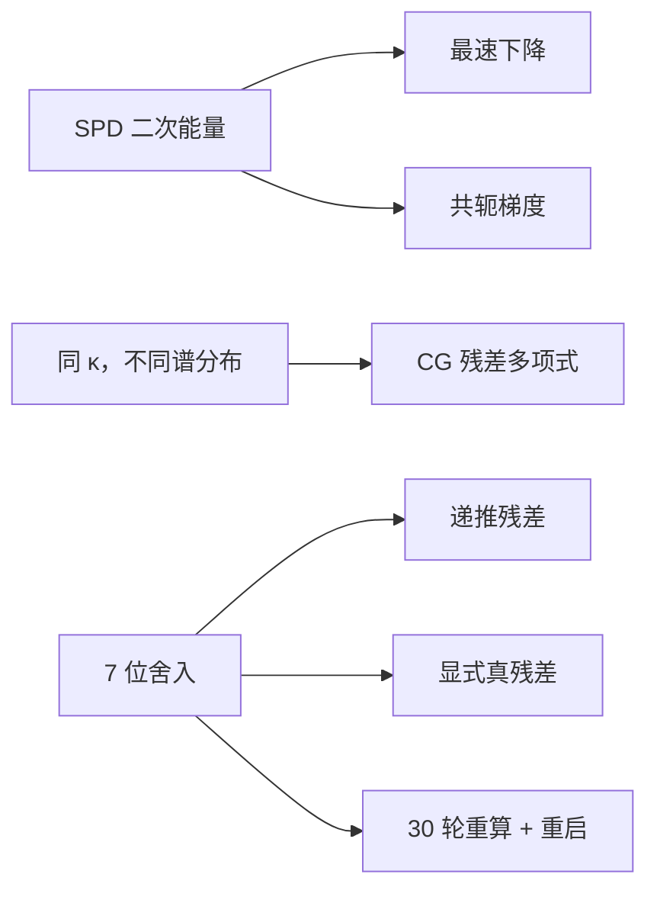

# 实验 - CG 能量几何、谱聚集与递推残差漂移

> [!question] 本实验的判别问题
> CG 的能量最优性、谱聚集加速与有限精度残差漂移，能否在不混淆“几何”“谱分布”和“监控量”的前提下分别观察？

## 研究问题与预注册假设

1. 在狭长 SPD 能量椭圆中，CG 是否比最速下降更少之字形？
2. 保持 $\kappa=1000$ 不变，聚簇谱是否比均匀铺开的谱收敛更快？
3. 模拟 7 位有效数字时，递推残差是否会与显式真残差严重分离？周期重算并重启能否恢复可信度？

> [!hypothesis] 假设
> 三项都成立；但残差替换会丢失共轭历史，因此它是可靠性—速度折中，不是免费修复。

## 实验对象

### 几何面板

$$
A=\operatorname{diag}(1,20),
$$

取同一初值与真解，分别运行最速下降和 CG。

### 谱面板

构造两个 $\kappa=1000$ 的 SPD 矩阵：

- `spread`：特征值在 $[1,1000]$ 广泛铺开；
- `clustered`：特征值集中在四个紧簇。

两者使用同一维数、同类确定性初始残差，并与只依赖条件数的 Chebyshev 界比较。

### 有限精度面板

取 $n=35$、$\kappa=10^4$ 的 SPD 矩阵，把基本运算模拟舍入到 7 位有效数字，运行 400 轮：

- 仅递推残差；
- 每 30 轮重算真残差并令 $p\leftarrow r$ 重启。

- 代码：[plot_conjugate_gradient_geometry.py](</Users/tong/Nodes/basic/00-知识库管理/_labs/code/plot_conjugate_gradient_geometry.py>)；
- 图形：[plot-conjugate-gradient-geometry-v2.svg](</Users/tong/Nodes/basic/00-知识库管理/_assets/plots/conjugate-gradient/plot-conjugate-gradient-geometry-v2.svg>)；
- 图形 SHA-256：`d53798a25dee6dbeb569feaeed61f68018e160b2b02ee810975c3f43a10dbf68`；
- Python：系统 `python3`，仅标准库；
- 随机性：无外部数据；确定性构造。

## 方法



面板 A 绘制目标二次函数等高线和迭代点。面板 B 每轮显式计算真相对残差；界曲线为

$$
2\left(\frac{\sqrt\kappa-1}{\sqrt\kappa+1}\right)^k.
$$

面板 C 同时保存递推残差与 $b-Ax$，以二者比值度量残差间隙。

## 结果

**为什么相同条件数不意味着相同迭代数，而很小的递推残差也不一定意味着原方程已解好？**

![[00-知识库管理/_assets/plots/conjugate-gradient/plot-conjugate-gradient-geometry-v2.svg|880]]

> [!figure] 实验图｜CG 的能量几何、谱聚集与残差可信度
> A 在同一 SPD 二次能量上比较最速下降与 CG 轨迹；B 比较条件数同为 $1000$、但特征值分散或成簇时的真残差；C 在 7 位舍入模拟中分开递推残差、显式真残差与每 30 轮重算后重启。生成脚本：[[plot_conjugate_gradient_geometry.py]]；确定性 SPD 构造，并对两步能量几何、谱聚集加速和残差漂移设断言。

**怎样读图。** A 看搜索方向是否反复横穿狭谷；B 固定相同谱端点，读取聚簇谱曲线比铺开谱提前多少步到达地板；C 先比较递推与真残差何时分叉，再检查周期重算是否恢复监控一致性。Chebyshev 曲线只提供由 $\kappa$ 决定的最坏情形参照。

**适用边界（图没有证明什么）。** Chebyshev 公式严格约束的是 $A$-范数误差，不是图中每一点的二范数真残差上界；谱与初始残差均为人工构造，7 位十进制舍入和固定 30 轮替换也不能直接代表 GPU `float32` 或生产系统的最优可靠更新策略。

### 谱分布代表点

| 谱 | $k=4$ | $k=10$ | $k=40$ |
|---|---:|---:|---:|
| 分散谱 | $1.672\times10^{-1}$ | $5.715\times10^{-2}$ | $3.613\times10^{-4}$ |
| 四簇谱 | $1.029\times10^{-9}$ | 已到数值地板 | 已到数值地板 |

四簇问题在第 5 轮约为 $3.141\times10^{-14}$。这远快于只由 $\kappa=1000$ 得到的最坏界。

### 残差漂移

无替换运行在 $k=396$ 达到最大的真/递推残差比约

$$
2.526\times10^{14}.
$$

此时递推相对残差约 $4.721\times10^{-18}$，但真相对残差仍约 $1.192\times10^{-3}$。周期重算并重启到 $k=400$ 时，递推与真残差分别约 $3.533\times10^{-4}$ 和 $4.149\times10^{-4}$，两者重新一致，但收敛历史被重启打断。

## 分析

1. 面板 A 中最速下降不断横穿狭谷；CG 通过 $A$-共轭方向保留已经解决的信息，在二维精确算术中两步到达。
2. 面板 B 证明条件数不是完整收敛描述。Krylov 多项式能利用特征值簇，因此相同端点可能有完全不同的速度。
3. 面板 C 展示一种危险失败：内部标量看似远超容差，原方程却停在 $10^{-3}$。只打印递推残差会虚假宣告成功。
4. 残差重算加重启恢复了监控可信性，却牺牲共轭历史；应根据精度、容差和额外 matvec 成本选择触发策略。

## 失败与边界

- 7 位十进制舍入是机制模拟，不等于特定 GPU `float32` 的逐指令行为；
- 谱面板使用可控人工谱，不代表所有聚簇都同样容易，初始残差权重也重要；
- Chebyshev 公式严格界定能量误差，图中与真残差并列用于趋势参考，不能逐点解释为残差上界；
- 固定每 30 轮重启不是普适最优策略；
- 未模拟分布式归约顺序、混合精度和预条件漂移。

## 复现

```bash
python3 "00-知识库管理/_labs/code/plot_conjugate_gradient_geometry.py"
xmllint --noout "00-知识库管理/_assets/plots/conjugate-gradient/plot-conjugate-gradient-geometry-v2.svg"
```

## 下一步

- [ ] 比较周期替换、阈值触发 reliable update 与高精度残差；
- [ ] 加入 PCG 并跟踪预条件自然范数；
- [ ] 在多 GPU 上比较经典、合并归约与 pipelined CG；
- [ ] 用 HVP 演示负曲率触发截断 CG。
