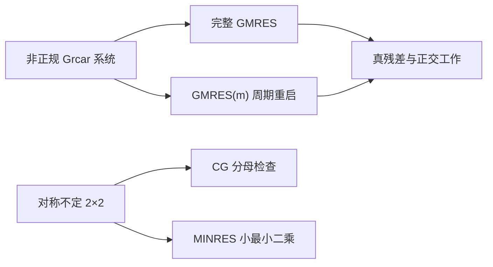

# 实验 - GMRES 重启、MINRES 结构与残差最小化

> [!question] 本实验的判别问题
> 怎样把 GMRES 的残差最小化、重启造成的信息遗忘，以及 MINRES 对对称不定结构的适用性，拆成可独立验收的现象？

## 研究问题与预注册假设

1. 对非正规 Grcar 系统，完整 GMRES 与 GMRES\((m)\) 的真残差曲线如何分化？
2. 对称不定问题上，CG 的 SPD 递推能否在第一步失效，而 MINRES 仍完成最小残差求解？
3. 增大 \(m\) 是否必然在固定 matvec 预算内得到更小残差？

> [!hypothesis] 假设
> 完整 GMRES 在一个 \(n\) 维周期内收敛到舍入地板；重启曲线只在每个周期内部继承嵌套空间，跨周期会遗忘；固定预算下 \(m\) 与最终误差并不单调。

## 实验对象

### 非正规系统

使用 \(n=40\) 的确定性 Grcar 型矩阵：主对角与三个上对角为 \(1\)，第一下对角为 \(-1\)。取确定性右端和 \(x_0=0\)，比较：

- 完整 GMRES；
- GMRES\((16)\)；
- GMRES\((8)\)。

Arnoldi 使用 modified Gram–Schmidt；小最小二乘用逐列 Givens 更新。每步均显式计算

$$
\frac{\|b-Ax_k\|_2}{\|b\|_2}.
$$

### 对称不定系统

$$
A=\operatorname{diag}(1,-1),\qquad b=(1,1)^T.
$$

CG 的首个分母

$$
p_0^TAp_0=0
$$

导致递推无定义；直接在 \(\mathcal K_1,\mathcal K_2\) 中求最小残差，模拟 MINRES 的结构性行为。

### 重启扫描

固定最多 120 次 matvec，扫描

$$
m\in\{4,6,8,12,16,24,40\}.
$$

同时记录最终真残差、累计 Arnoldi 内积数与基维数。

- 代码：[plot_gmres_minres_restart.py](</Users/tong/Nodes/basic/00-知识库管理/_labs/code/plot_gmres_minres_restart.py>)；
- 图形：[plot-gmres-minres-restart-v2.svg](</Users/tong/Nodes/basic/00-知识库管理/_assets/plots/residual-minimization/plot-gmres-minres-restart-v2.svg>)；
- 图形 SHA-256：`1987138db27ab34df8c8f1d308cc98cd8840886a706f5ff98330f314a9a6f4ed`；
- Python：系统 `python3`，仅标准库；
- 随机性：无外部数据；矩阵、右端与扫描均确定。

## 方法



每个 GMRES 周期重新令当前真残差为起点。圆点大小按累计正交内积数缩放，用于提醒“基更大”同时增加内存和全局归约。

## 结果

**完整 GMRES、重启 GMRES 与 MINRES 的“合法性”和“效率”应分别从哪里读？**

![[00-知识库管理/_assets/plots/residual-minimization/plot-gmres-minres-restart-v2.svg|880]]

> [!figure] 实验图｜残差最小化的结构决定与重启权衡
> A 在非正规 Grcar 系统上比较完整 GMRES 与 GMRES$(8)$、GMRES$(16)$ 的真残差；B 用 $2\times2$ 对称不定系统展示 CG 首步 breakdown 而 MINRES 两步求解；C 在固定 120 次 matvec 下扫描重启维数，并以点大小提示正交化工作。生成脚本：[[plot_gmres_minres_restart.py]]；确定性矩阵与右端，并对完整 GMRES 单调性、CG/MINRES 结构分离和重启非单调权衡设断言。

**怎样读图。** A 只在同一周期内把重启曲线理解为嵌套子空间最小化，并观察周期边界后是否停滞；B 区分“第一步没有下降”与“递推无定义”，再看第二步 Krylov 空间补全后的结果；C 同时读取纵坐标、重启维数与圆点大小，避免把更低残差误解成无代价优势。

**适用边界（图没有证明什么）。** 结论来自一个 $n=40$ Grcar 矩阵、一个右端和一个极小对称不定例子；圆点大小只是内积数代理，不是墙钟时间，图也不包含预条件、重正交、通信、recycling 或 MINRES-QLP 的有限精度行为。

### 主曲线

| 方法 | matvec | 最终相对真残差 | 累计正交内积 |
|---|---:|---:|---:|
| full GMRES | 40 | \(2.700\times10^{-16}\) | 820 |
| GMRES\((16)\) | 120 | \(3.317\times10^{-6}\) | 988 |
| GMRES\((8)\) | 120 | \(1.484\times10^{-7}\) | 540 |

短重启不是完整 GMRES 的低内存等价物；本例甚至出现 \(m=8\) 在固定预算下优于 \(m=16\)。

### 重启维数扫描

| \(m\) | 最终真残差 | 正交内积数 |
|---:|---:|---:|
| 4 | \(2.033\times10^{-7}\) | 300 |
| 6 | \(4.602\times10^{-7}\) | 420 |
| 8 | \(1.484\times10^{-7}\) | 540 |
| 12 | \(2.115\times10^{-6}\) | 780 |
| 16 | \(3.317\times10^{-6}\) | 988 |
| 24 | \(1.443\times10^{-7}\) | 1500 |
| 40 | \(2.700\times10^{-16}\) | 820 |

### MINRES 结构对照

相对残差为

$$
k=0:1,\qquad k=1:1,\qquad k=2:2.220\times10^{-16}.
$$

第一步没有下降不是算法失败：\(\mathcal K_1\) 中的最小值确实位于 \(x_0\)。第二步 Krylov 空间已为 \(\mathbb R^2\)，残差归零。

## 分析

1. 完整 GMRES 的搜索空间逐步嵌套，所以精确算术残差不增；到维数 \(40\) 后恢复精确解。
2. 重启后只保留当前 \(x,r\)，旧 Arnoldi 基和隐含残差多项式因子被丢弃，故不能把各周期拼成完整 GMRES。
3. \(m\) 增大延长一个周期，但也减少固定预算内的重启次数；不同多项式因子与非正规性相互作用，最终误差无简单单调律。
4. CG breakdown 来自正曲率假设被破坏；MINRES 只要求对称性，并直接最小化二范数残差。

## 失败与边界

- 这是单个 \(40\times40\) 人工非正规矩阵，不代表某个 \(m\) 普遍优于另一个；
- 实验使用 double 和 MGS，没有专门模拟低精度正交性丢失；
- MINRES 面板直接解小最小二乘，用于验证结构，不是完整生产 MINRES-QLP 实现；
- 正交内积数只是工作代理，未计通信延迟、重正交、预条件和基更新；
- 未比较 harmonic Ritz recycling、deflation、FGMRES 或 communication-avoiding 变体。

## 复现

```bash
python3 "00-知识库管理/_labs/code/plot_gmres_minres_restart.py"
xmllint --noout "00-知识库管理/_assets/plots/residual-minimization/plot-gmres-minres-restart-v2.svg"
```

## 下一步

- [ ] 加入左/右预条件并同时画真残差与预条件残差；
- [ ] 比较 MGS、MGS2 和 selective reorthogonalization；
- [ ] 加入 harmonic Ritz/GCRO-DR recycling；
- [ ] 在多 GPU 上记录 global reduction 而不只计内积数。
