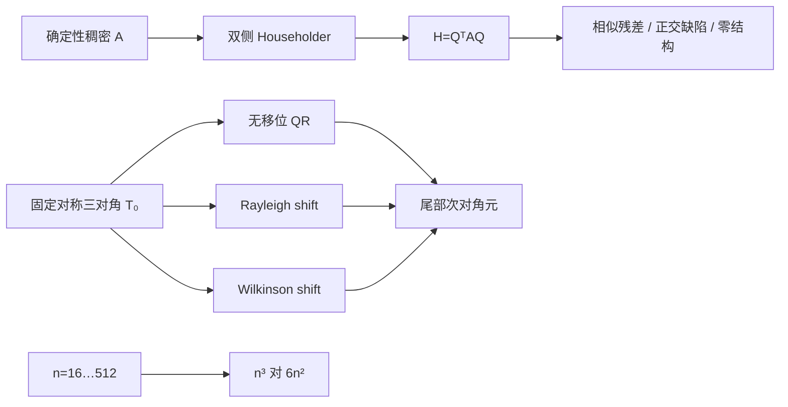

# 实验 - Hessenberg 约化、移位与 QR deflation

> [!question] 本实验的判别问题
> Hessenberg 约化是否同时保持正交相似与带宽结构，移位是否真正缩短 deflation，而结构化单步是否改变规模增长率？

## 研究问题

1. 双侧 Householder 更新是否同时实现 Hessenberg 结构、正交性和相似关系？
2. 对同一个对称三对角问题，无移位、Rayleigh shift 与 Wilkinson shift 到达 deflation 的步数相差多少？
3. “每次对稠密矩阵做 QR”与“先 Hessenberg、再隐式 QR”的工作量增长率有什么本质差别？

## 预注册假设

> [!hypothesis] 假设
> 六阶确定性稠密矩阵的归一化相似残差和正交缺陷将保持在 $10^{-14}$ 以下；对四阶对称三对角矩阵，尾部感知移位会比无移位更快令 $|h_{n,n-1}|$ 达到相对 deflation 阈值；代理工作量 $n^3$ 与 $6n^2$ 的比值按 $n/6$ 线性增大。

## 变量设计

| 子实验 | 自变量 | 因变量 | 控制项 |
|---|---|---|---|
| Hessenberg 约化 | 双侧 Householder 步 | $\|Q^TAQ-H\|_F/\|A\|_F$、$\|Q^TQ-I\|_F$、零结构 | 固定六阶矩阵 |
| QR 收敛 | 无移位、Rayleigh、Wilkinson | 尾部 $|h_{n,n-1}|$ 与 deflation 步数 | 同一四阶对称三对角矩阵 |
| 工作量 | $n=16,\ldots,512$ | $n^3$ 与 $6n^2$ 代理 | 只比较增长率，不做墙钟计时 |

四阶测试矩阵为

$$
T_0=
\begin{bmatrix}
4&0.8&0&0\\
0.8&3&0.6&0\\
0&0.6&2&0.4\\
0&0&0.4&1
\end{bmatrix}.
$$

## 环境

- 代码：[plot_hessenberg_qr.py](</Users/tong/Nodes/basic/00-知识库管理/_labs/code/plot_hessenberg_qr.py>)；
- Python：系统 `python3`，仅标准库；
- 算术：Python 双精度 `float`；
- 随机种子：无随机性；
- 图形：[plot-hessenberg-qr-v2.svg](</Users/tong/Nodes/basic/00-知识库管理/_assets/plots/hessenberg-qr/plot-hessenberg-qr-v2.svg>)；
- 图形 SHA-256：`48805a5b1b2a2694d38b32db8c5060e5547ce4d1810e5ddd739851b47d8337b2`。

## 方法



### 1. Hessenberg 约化

对每一列构造 Householder $U_k=I_k\oplus P_k$，更新

$$
A\leftarrow U_k^TAU_k,
\qquad
Q\leftarrow QU_k.
$$

实验不只检查“第二条次对角线以下是不是零”，还独立计算相似残差与正交缺陷，防止只左乘也得到零结构却破坏谱。

### 2. 移位 QR

每步显式形成

$$
T_k-\mu_kI=Q_kR_k,
\qquad
T_{k+1}=R_kQ_k+\mu_kI.
$$

三种策略分别取 $\mu_k=0$、$\mu_k=(T_k)_{nn}$，或尾部 $2\times2$ 块中离 $(T_k)_{nn}$ 更近的 Wilkinson shift。若

$$
|(T_k)_{n,n-1}|
\le10^{-14}\bigl(|(T_k)_{n-1,n-1}|+|(T_k)_{nn}|\bigr),
$$

则把尾部次对角元置零。

### 3. 工作量代理

只比较

$$
C_{\mathrm{dense}}(n)=n^3,
\qquad
C_{\mathrm{Hess}}(n)=6n^2.
$$

这不是实际 LAPACK flop 计数或 GPU 基准，而是用来隔离三次与二次增长率。

## 结果

**如何分别验收“结构正确”“收敛更快”和“单步更便宜”，而不把三者混成一个结论？**

![[00-知识库管理/_assets/plots/hessenberg-qr/plot-hessenberg-qr-v2.svg|880]]

> [!figure] 实验图｜Hessenberg 不变量、移位 deflation 与工作量阶
> A 并列原矩阵与 $H=Q^TAQ$ 的幅度结构，并报告相似残差和正交缺陷；B 在同一对称三对角矩阵上比较无移位、Rayleigh 与 Wilkinson shift 的尾部次对角元；C 比较 $n^3$ 与 $6n^2$ 工作代理。生成脚本：[[plot_hessenberg_qr.py]]；无随机数，并对带宽外零、正交相似、移位加速与复杂度分离设断言。

**怎样读图。** A 必须把零结构与两个残差一起读，单看三角形外观不能证明相似；B 读取首次跨过 $10^{-8}$ 与实际 deflation 的步数，不把绘图地板当作非零残差；C 在对数坐标比较两条斜率，并记住一次 Hessenberg 预处理仍需 $O(n^3)$。

**适用边界（图没有证明什么）。** 收敛面板只用一个四阶对称三对角矩阵，工作曲线是增长率代理；图不包含 Francis 双移位、bulge chasing、AED、平衡、非正规复 Schur 块或硬件墙钟，不能据此宣称 Wilkinson shift 在一般问题上总最优。

### 结构与不变量

| 指标 | 实测值 | 验收 |
|---|---:|---|
| $\|Q^TAQ-H\|_F/\|A\|_F$ | $4.948\times10^{-16}$ | 通过 |
| $\|Q^TQ-I\|_F$ | $1.021\times10^{-15}$ | 通过 |
| 第二条次对角线以下 | 精确写零 | 通过 |

两项残差都在双精度舍入量级。这里“精确写零”是算法在反射后清理理论零位，并不是声称原始浮点更新绝无舍入尾数。

### QR 收敛步数

| 策略 | 首次 $|h_{n,n-1}|<10^{-8}$ | deflation 步 | 最终记录值 |
|---|---:|---:|---:|
| 无移位 | 23 | 40 | $10^{-18}$ 绘图地板 |
| Rayleigh shift | 3 | 4 | $10^{-18}$ 绘图地板 |
| Wilkinson shift | 3 | 3 | $10^{-18}$ 绘图地板 |

### 工作量代理

| $n$ | 稠密 $n^3$ | Hessenberg $6n^2$ | 比值 $n/6$ |
|---:|---:|---:|---:|
| 16 | 4,096 | 1,536 | 2.67 |
| 64 | 262,144 | 24,576 | 10.67 |
| 256 | 16,777,216 | 393,216 | 42.67 |
| 512 | 134,217,728 | 1,572,864 | 85.33 |

## 分析

### 1. 零结构、相似性、正交性必须同时验收

单看 Hessenberg 外形不足以证明算法正确：只做左 Householder 同样能产生许多零，却改变特征值。这里 $Q^TAQ\approx H$ 与 $Q^TQ\approx I$ 同时成立，才支持“压缩带宽而不改变谱”的解释。

### 2. 移位改变的是收敛，不是谱

三条路径每步都是正交相似变换，目标特征值集合相同，但尾部 deflation 从无移位的 40 步缩短到 3–4 步。这个例子清楚展示了 shift 的算法价值；它不证明 Wilkinson 对所有非对称矩阵都最优。

### 3. Hessenberg 是摊销结构，不只是美观的零

先约化需要一次 $O(n^3)$，但若后续需要多次 QR 步，$O(n^2)$ 的单步成本会迅速回收这次预处理。$n$ 从 64 增到 512 时，代理比值从约 10.7 增到 85.3，差距随规模继续扩大。

## 失败与异常记录

- 教学脚本使用显式 Householder QR，没有实现隐式 $Q$ 定理、bulge chasing、多移位或 AED；
- 对称 QR 步后只在舍入量级对称化，并清理理论带宽外的小量，以免实验测量被无关的浮点填充主导；
- deflation 后为对数作图把零显示为 $10^{-18}$，实际状态是已置零；
- 无移位曲线不是严格逐步单调，图中保留真实轨迹；
- 工作量面板是增长率代理，不能解释为墙钟速度或精确常数。

## 结论边界

> [!warning] 不可外推之处
> 收敛实验只用一个小型对称三对角矩阵，避开了复共轭对、强非正规性、聚簇、平衡和有限迭代失败。生产一般实 eigensolver 还需要 Francis 双移位、bulge chasing、尺度感知 deflation、AED、异常移位和明确的部分收敛接口。

## 复现

在仓库根目录运行：

```bash
python3 "00-知识库管理/_labs/code/plot_hessenberg_qr.py"
```

脚本会重建 SVG，并输出相似残差、正交缺陷、三种策略的收敛步数和工作量表。

## 下一步

- [ ] 加入一般非对称 Hessenberg 与 Francis 双移位；
- [ ] 构造复共轭对和近缺陷矩阵，观察 $2\times2$ deflation；
- [ ] 在有 LAPACK 的环境中比较 `DHSEQR`，记录 `INFO` 和 Schur 后向残差；
- [ ] 在 [[Arnoldi 方法]] 中把相同 QR/Schur 验收迁移到小型投影矩阵。
