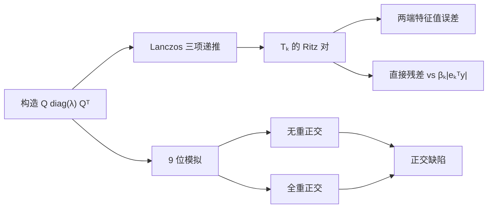

# 实验 - Lanczos Ritz 收敛、残差与正交性

> [!question] 本实验的判别问题
> Lanczos 的极端 Ritz 收敛、尾项残差恒等式与有限精度正交性丢失，能否在保持实验对象一致的同时分别验证？

## 研究问题

1. 非均匀谱上，分离的最大特征值是否比聚簇的最小端更早被 Ritz 值解析？
2. 直接计算 $\|AQ_ky-\theta Q_ky\|$ 是否与 $|\beta_ke_k^Ty|$ 一致？
3. 显式模拟 9 位有效数字时，无重正交和全重正交的 $\|Q_k^TQ_k-I\|_F$ 如何分化？

## 预注册假设

> [!hypothesis] 假设
> 最大 Ritz 值在约 10 步达到高精度，最小端因聚簇需要更多步；精确三项递推中的两种残差逐点一致；低精度无重正交的缺陷随已收敛方向再进入而急升，全重正交保持在模拟舍入量级。

## 变量与环境

| 面板 | 自变量 | 因变量 | 控制 |
|---|---|---|---|
| A | 子空间维数 $k$ | 两端 Ritz 值误差 | 同一对称矩阵、同一起点 |
| B | $k$ | 直接/廉价 Ritz 残差 | 同一最大 Ritz 对 |
| C | $k$、重正交策略 | $\|Q^TQ-I\|_F$ | 同一聚簇谱、9 位舍入模拟 |

- 代码：[plot_lanczos_ritz_orthogonality.py](</Users/tong/Nodes/basic/00-知识库管理/_labs/code/plot_lanczos_ritz_orthogonality.py>)；
- 图形：[plot-lanczos-ritz-orthogonality-v2.svg](</Users/tong/Nodes/basic/00-知识库管理/_assets/plots/lanczos/plot-lanczos-ritz-orthogonality-v2.svg>)；
- 图形 SHA-256：`3d40c11c5a361c8f5ac8acacffbc1d3e014146e31ad6e9973c21a15f587d367e`；
- Python：系统 `python3`，仅标准库；
- 随机种子：`20260815`；
- 算术：主实验双精度；正交性面板每个基本运算显式舍入到 9 位有效数字。

## 方法



面板 A、B 保留纯三项递推，避免全重正交改变廉价残差恒等式的实验对象；面板 C 单独比较正交化策略。

## 结果

**分离的极端特征值为何先收敛，而一个已收敛方向又为何会在低精度递推中“重新出现”？**

![[00-知识库管理/_assets/plots/lanczos/plot-lanczos-ritz-orthogonality-v2.svg|880]]

> [!figure] 实验图｜Lanczos 的 Ritz 解析、尾项残差与正交性
> A 比较分离最大端与聚簇最小端的 Ritz 值误差；B 对最大 Ritz 对逐步核对直接残差与 $|\beta_ke_k^Ty|$；C 在 9 位舍入模拟中比较无重正交与全重正交的 $\|Q^TQ-I\|_F$。生成脚本：[[plot_lanczos_ritz_orthogonality.py]]；确定性对称谱构造，并对极端值收敛次序、残差恒等式与重正交分离设断言。

**怎样读图。** A 不只按“最大/最小”比较，而要联系各端的局部谱间隙；B 看两种残差是否在所有 $k$ 上重合，不能只验终点；C 找到无重正交曲线从舍入量级跃升到 $O(1)$ 的区间，并与全重正交基线对照。贴近图底只表示低于显示阈值。

**适用边界（图没有证明什么）。** 主实验使用人工构造的对称矩阵，正交性面板是 9 位十进制模拟；它不代表一般非对称问题、生产库的选择性重正交、锁定和隐式重启，也不从单一谱给出普适迭代数。

### Ritz 值与残差代表点

| $k$ | 最大端误差 | 最小端误差 | 直接残差 | 廉价残差 |
|---:|---:|---:|---:|---:|
| 5 | $8.696\times10^{-3}$ | $3.740\times10^{-1}$ | $2.149\times10^{-1}$ | $2.149\times10^{-1}$ |
| 10 | $3.745\times10^{-9}$ | $1.859\times10^{-1}$ | $1.513\times10^{-4}$ | $1.513\times10^{-4}$ |
| 20 | 数值地板 | $3.736\times10^{-3}$ | $1.614\times10^{-11}$ | $1.614\times10^{-11}$ |
| 30 | 数值地板 | $1.122\times10^{-8}$ | $1.069\times10^{-12}$ | $1.069\times10^{-12}$ |

### 9 位模拟正交缺陷

| $k$ | 无重正交 | 全重正交 |
|---:|---:|---:|
| 10 | $1.088\times10^{-6}$ | $2.146\times10^{-9}$ |
| 20 | $6.627\times10^{-1}$ | $2.551\times10^{-9}$ |
| 45 | $8.511\times10^{-1}$ | $3.636\times10^{-9}$ |

## 分析

最大端在 $k=10$ 已接近机器精度，而最小端仍有 $0.186$ 误差，说明“极端值先收敛”还受局部谱分离影响，不能只按端点/内部二分。直接残差和廉价公式在打印精度内一致，验证了 Lanczos 分解的秩一尾项。聚簇谱实验中，无重正交缺陷在 10 到 20 步间跃迁到 $O(1)$；全重正交保持在模拟舍入尺度。

## 失败与异常记录

- 对数轴把低于绘图阈值的误差钳制到地板，不代表数学误差等于该阈值；
- 面板 C 的“9 位”是教学性确定性舍入模型，不等于某种真实硬件格式；
- 全重正交版本的系数关系与纯三项递推实现细节不同，所以未拿它验证面板 B；
- 单一矩阵不能提供普适迭代数，只提供机制证据。

## 结论边界

> [!warning] 不可外推之处
> 一般非对称矩阵需要 Arnoldi；生产库的部分/选择性重正交、隐式重启和锁定会改变成本曲线；HVP 或分布式 matvec 还存在算子噪声、通信和非确定性。

## 复现

```bash
python3 "00-知识库管理/_labs/code/plot_lanczos_ritz_orthogonality.py"
xmllint --noout "00-知识库管理/_assets/plots/lanczos/plot-lanczos-ritz-orthogonality-v2.svg"
```

复现后应同时检查终端打印、SVG 是否可解析、直接/廉价残差的相对差以及正交缺陷数量级。

## 下一步

- [ ] 对照 Arnoldi 的完整 Hessenberg 投影；
- [ ] 实现选择性重正交与锁定，记录 matvec/内积/通信；
- [ ] 加入 noisy HVP，研究算子误差与 Ritz 停止条件。
