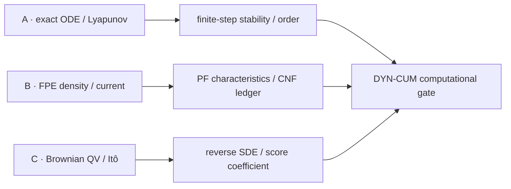

# 实验 - ODE、动力系统与 SDE 累计复现门

> [!abstract] 实验定位
> 这是 `DYN-CUM-01` 的计算复现门。三条轨道有意选择不同证据对象：A 检查 exact continuous system 与 finite-step solver map；B 检查 density、current、characteristics 与 log-density ledger；C 检查 stochastic path、Itô identity、marginal 和 reverse drift。三轨共同阻止三种常见偷换：“连续稳定所以任意求解器稳定”“同 marginal 所以是同一个过程”“把步长减小便能消除 score 错误”。脚本成功只是最低门槛；正式通过还要求手算、参数干预和边界解释。

## 一、三轨总览



| 轨道 | 直接对象 | 主证书 | 故障注入 | 不允许越界成 |
|---|---|---|---|---|
| A | 给定 linear ODE 与四个离散 recurrence | exact energy、$R(z)$、endpoint order | fast mode 落出 explicit stability region | 任意 nonlinear/stiff solver 的普遍排名 |
| B | 已知解析密度的圆周扩散与 PF ODE | mass、PDE residual、characteristic/CNF order | 粗步长改变 finite flow/logp | 所有 learned CNF/score 都有四阶 accuracy |
| C | stationary OU paths 与 reverse samplers | QV、Itô residual、endpoint second moment | noisy reverse SDE 误用 half-score | 一时刻二阶矩等于完整 path-law 认证 |

## 二、A 轨：连续稳定与离散稳定不是同一证书

### 2.1 对象与解析基线

研究

$$
\dot x=-x,
\qquad
\dot y=-\lambda y,
\qquad
\lambda=80,
\qquad
(x_0,y_0)=(1,1).
$$

exact solution 与 Euclidean energy 为

$$
x(t)=e^{-t},
\qquad
y(t)=e^{-80t},
$$

$$
V(t)=\frac12(x(t)^2+y(t)^2).
$$

沿 exact trajectory，

$$
\dot V=-x^2-80y^2
\le-(x^2+y^2)
=-2V.
$$

所以

$$
V(t)\le e^{-2t}V(0).
$$

该问题的 slow component 按时间尺度 1 变化，fast component 按时间尺度 $1/80$ 消失；若只看 $t=O(1)$ 的目标轨迹，accuracy 未必需要很小步，但 explicit stability 会受 fast mode 限制。这正是本轨使用的 operational stiffness。

### 2.2 四种 finite-step map

对 $u'=\mu u$、$z=h\mu$：

$$
R_{\rm EE}=1+z,
$$

$$
R_{\rm RK4}=1+z+\frac{z^2}{2}+\frac{z^3}{6}+\frac{z^4}{24},
$$

$$
R_{\rm BE}=\frac1{1-z},
\qquad
R_{\rm Trap}=\frac{1+z/2}{1-z/2}.
$$

canonical plot 使用 25 步积分 $T=1$，即 $h=0.04$，fast coordinate 的

$$
z_{\rm fast}=-80\times0.04=-3.2.
$$

脚本恢复：

| method | $R(-3.2)$ | magnitude | 本轨预测 |
|---|---:|---:|---|
| Euler | $-2.2$ | $2.2>1$ | 交替发散 |
| RK4 | $1.82773333$ | $>1$ | 单调幅值发散 |
| backward Euler | $0.23809524$ | $<1$ | 强衰减 |
| trapezoidal | $-0.23076923$ | $<1$ | 交替但衰减 |

> [!hypothesis]
> exact energy 单调下降；Euler/RK4 即使连续模型稳定也会在该步长下增长；BE/Trap保持 absolute stability。进入共同稳定细网格后，endpoint errors 应分别恢复约 $1,4,1,2$ 阶。

### 2.3 为什么同时看 stability 与 order

“发散/不发散”只检查某步长下 amplification；“order”检查 $h\to0$ 时误差如何衰减。一个方法可在当前步长 stable 但不够 accurate，也可具有高 formal order 却因当前 $z$ 落出 stability region而完全不可用。实验用两套网格：

- 25 步轨迹图负责展示 stability failure；
- $N=80,160,320,640$ 的共同稳定网格负责拟合 endpoint convergence order。

隐式方法这里只用解析 diagonal recurrence，不测 Newton/Krylov 成本。因此本轨不能支持“BE 在真实大型 neural ODE 上总是更快”；production comparison 必须另记 Jacobian、factorization、linear iterations、preconditioner reuse 与 wall time。

## 三、B 轨：解析密度、probability current 与 PF characteristics

### 3.1 圆周扩散的解析 density path

在 $x\in[-\pi,\pi)$ 的周期域上考虑

$$
dX_t=\sigma\,dW_t,
\qquad
\sigma=1.1,
$$

初始密度

$$
p_0(x)=\frac{1+a_0\cos x}{2\pi},
\qquad a_0=0.65.
$$

因为 $0<a_0<1$，$p_0$ 处处正。Fokker–Planck 是 heat equation

$$
\partial_tp=\frac{\sigma^2}{2}\partial_{xx}p.
$$

单 Fourier mode 保持形状、只衰减幅值：

$$
p_t(x)=\frac{1+a_t\cos x}{2\pi},
\qquad
a_t=a_0e^{-\sigma^2t/2}.
$$

直接微分：

$$
\partial_tp_t
=-\frac{\sigma^2a_t\cos x}{4\pi},
$$

$$
\frac{\sigma^2}{2}\partial_{xx}p_t
=-\frac{\sigma^2a_t\cos x}{4\pi}.
$$

这给 pointwise analytic PDE certificate，不依赖网格图“看起来像”。

### 3.2 Current、score 与 probability-flow velocity

score 为

$$
s_t(x)=\partial_x\log p_t(x)
=-\frac{a_t\sin x}{1+a_t\cos x}.
$$

current 与 PF velocity 是

$$
j_t=-\frac{\sigma^2}{2}\partial_xp_t,
$$

$$
v_t=\frac{j_t}{p_t}
=-\frac{\sigma^2}{2}s_t
=\frac{\sigma^2a_t\sin x}{2(1+a_t\cos x)}.
$$

于是

$$
p_tv_t=\frac{\sigma^2a_t\sin x}{4\pi},
$$

$$
\partial_x(p_tv_t)=\frac{\sigma^2a_t\cos x}{4\pi},
$$

恰好与 $\partial_tp_t$ 抵消。这把二阶 Fokker–Planck 与一阶 continuity equation

$$
\partial_tp_t+\partial_x(p_tv_t)=0
$$

连接起来；连接的是 marginal density path，不是 Brownian path。

PF divergence 为

$$
\partial_xv_t
=\frac{\sigma^2}{2}
\frac{a_t\cos x+a_t^2}{(1+a_t\cos x)^2}.
$$

所以增广 ODE 同时积分

$$
\dot x=v_t(x),
\qquad
\frac d{dt}\log p_t(x_t)=-\partial_xv_t(x_t).
$$

### 3.3 独立的 exact characteristic 证书

圆周上从 $-\pi$ 起算的 CDF 为

$$
F_t(x)=\frac{x+\pi+a_t\sin x}{2\pi}.
$$

因为 $1+a_t\cos x>0$，$F_t$ 严格递增。characteristic 上的左侧质量守恒，故 exact terminal point满足

$$
F_T(x_T)=F_0(x_0).
$$

脚本用 bisection 解这个单调方程，作为独立于 RK4 recurrence 的 state reference；同时把数值 log-density 与 analytic $\log p_T(x_T)$ 比较。这样不会出现“用同一个实现生成 reference，再用它验证自己”的循环认证。

> [!hypothesis]
> 对 $T=0.8$ 和 $N=5,10,20,40$，RK4 characteristic 与 CNF log-density maximum error 都应约四阶收敛；周期中点求积的 mass drift 接近机器精度，analytic continuity residual 为零。

## 四、C 轨：Brownian path、Itô 与 reverse score 系数

### 4.1 Stationary OU 的三个动力学

考虑

$$
dX_t=-\frac\beta2X_tdt+\sqrt\beta\,dW_t,
\qquad
X_0\sim\mathcal N(0,1),
\qquad
\beta=2.
$$

此时 $p_t=\mathcal N(0,1)$ 对所有 $t$，score 为

$$
s_t(x)=-x.
$$

probability-flow velocity：

$$
v_{\rm PF}
=-\frac\beta2x-\frac\beta2s_t(x)
=0.
$$

所以 PF ODE 的每条 path 恒定、quadratic variation 为零，但它仍保持同一 stationary marginal。

正常递增反向时钟的 exact reverse drift 是

$$
b_{\rm rev}
=-\left(-\frac\beta2x\right)+\beta s_t(x)
=-\frac\beta2x.
$$

OU 在 stationary law 下 time reversible，因此 reverse SDE 与 forward SDE 具有相同形式。

若把 PF 的 half-score correction 误用到**仍保留噪声**的 reverse SDE，drift 变成

$$
b_{\rm wrong}
=\frac\beta2x+\frac\beta2(-x)
=0.
$$

错误过程成为纯 Brownian diffusion：

$$
dY_s=\sqrt\beta\,d\bar W_s,
$$

因此从 variance 1 出发，在 $T=0.6$ 后

$$
\mathbb E[Y_T^2]=1+\beta T=2.2,
$$

而正确 stationary target 是 1。这是 score coefficient error，不会因 Euler step 趋零而消失。

### 4.2 Quadratic variation 与 Itô identity

OU 的 quadratic variation 为

$$
[X]_T=\int_0^T\beta\,dt=\beta T=1.2.
$$

PF ODE 的 path finite variation，故

$$
[X^{\rm PF}]_T=0.
$$

对 $\varphi(x)=x^2$，Itô formula 给

$$
d(X_t^2)
=(-\beta X_t^2+\beta)dt
+2\sqrt\beta X_t\,dW_t.
$$

脚本在同一 nested Brownian path 上，用左端和检查

$$
R_h=X_T^2-X_0^2
-\sum_n(-\beta X_n^2+\beta)h
-\sum_n2\sqrt\beta X_n\Delta W_n.
$$

因为 pathwise stochastic discretization 的主尺度由 Brownian increments 控制，RMSE 应约呈 $O(h^{1/2})$。这不是在证明所有 SDE method 只有半阶，而是在验收当前 EM/left-sum contract。

> [!hypothesis]
> 2048 条 nested paths、最细 512 步时，SDE quadratic variation mean 应接近 1.2，PF ODE 为零；Itô residual RMSE 的 log–log order 应接近 $1/2$；full-score noisy reverse 的二阶矩接近 1，而 half-score noisy reverse 接近 2.2。

## 五、canonical 结果

先看图判断：连续流的稳定性、密度方程的守恒和随机路径的二次变差分别属于哪一种对象？减小步长能修复哪些失败，又不能修复哪些失败？

![[00-知识库管理/_assets/plots/dynamics/plot-dynamics-cumulative-gate-v2.svg|880]]

> [!figure] 实验图｜刚性离散稳定、概率流守恒与 reverse-score 系数
> A 在同一 $h=0.04$ 下比较 exact energy 与四种 finite-step map；B 用 probability-flow characteristics 与 log-density ledger 核对四阶和守恒；C 分开 SDE/PF ODE 的 quadratic variation，并比较 full-score 与误用 half-score 的 terminal second moment。生成脚本：[[dynamics_cumulative_gate.py]]；固定种子，并对稳定因子、收敛阶、质量守恒、Itô 阶和二阶矩目标设门槛。

**怎样读图。** A 先看 fast mode 的稳定函数是否落在单位圆内，再读全局误差阶；B 把 state、log-density、mass drift 与 PDE residual 一起核对；C 左侧用 quadratic variation 区分随机路径和确定性概率流，右侧用目标二阶矩识别 score 系数错误。

**适用边界（图没有证明什么）。** 刚性轨是二维线性系统，概率流使用解析 Fourier 密度，随机轨是 stationary OU 与有限 Monte Carlo；图不证明一般非线性求解器、神经 ODE/CNF 或扩散模型的训练与采样都具备同样性质。

> [!question] 本实验的判别问题
> 为什么连续系统稳定不保证显式离散稳定，同一 marginal 不保证同一路径规律，而 score 系数错误又不会因单纯减小时间步自动消失？

图注：A 在同一 $h=0.04$ 下展示 exact energy 与四种 finite-step energy；B 显示 PF characteristics 把高低密度差异逐渐摊平；C 左侧分开 SDE/PF ODE 的 quadratic variation，右侧比较 noisy reverse 中 full-score 与误用 half-score 的 terminal second moment。

### 5.1 A 轨数值摘要

| quantity | result |
|---|---:|
| fast $z$ | $-3.2$ |
| Euler / RK4 fast factor | $-2.2$ / $1.82773333$ |
| BE / Trap fast factor | $0.23809524$ / $-0.23076923$ |
| Euler observed order | $1.00216894$ |
| RK4 observed order | $3.92818205$ |
| BE observed order | $0.99784827$ |
| Trap observed order | $2.00000782$ |

RK4 order稍低于 4 是有限 refinement interval 与 slow-mode endpoint error 的结果；继续细化最终会遇到 roundoff floor，不能无限拟合 formal order。

### 5.2 B 轨数值摘要

| quantity | result |
|---|---:|
| characteristic state order | $4.03145834$ |
| CNF log-density order | $4.04224788$ |
| maximum mass drift | $4.441\times10^{-16}$ |
| analytic PDE residual | $0$（浮点运算中逐项相消） |

PDE residual 为零主要验证 analytic expression 与代码 transcription；mass 近机器精度来自 periodic Fourier mode 与中点规则的匹配。它不代表任意 finite-volume discretization 都精确守恒，更不代表 learned score 没有 approximation error。

### 5.3 C 轨数值摘要

| quantity | result |
|---|---:|
| finest SDE QV mean | $1.19888410$ |
| theoretical QV | $1.2$ |
| Itô residual RMSE order | $0.49850219$ |
| full-score noisy reverse $\mathbb E[X_T^2]$ | $0.97673218$ |
| half-score noisy reverse $\mathbb E[X_T^2]$ | $2.14844674$ |
| analytic half-score target | $2.2$ |

Monte Carlo values不必等于解析期望到机器精度；这里 2048 paths 下的偏差属于 sampling variability 加有限步误差。关键是 full-score 围绕 1，而 half-score 明确趋向另一个 continuous process 的 2.2。

## 六、代码、环境与确定性产物

- 代码：[dynamics_cumulative_gate.py](</Users/tong/Nodes/basic/00-知识库管理/_labs/code/dynamics_cumulative_gate.py>)；
- 图形：[plot-dynamics-cumulative-gate-v2.svg](</Users/tong/Nodes/basic/00-知识库管理/_assets/plots/dynamics/plot-dynamics-cumulative-gate-v2.svg>)；
- canonical SVG SHA-256：`b03decf286243fdfd16051a04ec70e1afb7b35c3369c24bd0a5e2856b90957cc`；
- Python：仅用标准库；随机轨固定 seed `20260819`；
- 图中不写时间戳、绝对机器路径或随机 UUID；相同 Python、seed 与参数下应 byte-for-byte deterministic。

在仓库根目录执行：

```bash
python3 "00-知识库管理/_labs/code/dynamics_cumulative_gate.py"
xmllint --noout \
  "00-知识库管理/_assets/plots/dynamics/plot-dynamics-cumulative-gate-v2.svg"
shasum -a 256 \
  "00-知识库管理/_assets/plots/dynamics/plot-dynamics-cumulative-gate-v2.svg"
```

预期关键输出：

```text
A z_fast=-3.200000 factors EE=-2.20000000 RK4=1.82773333 BE=0.23809524 Trap=-0.23076923
A orders EE=1.00216894 RK4=3.92818205 BE=0.99784827 Trap=2.00000782
B orders state=4.03145834 logp=4.04224788 mass_drift=4.441e-16 pde_residual=0.000e+00
C qv=1.19888410 target=1.20000000 ito_order=0.49850219 full_m2=0.97673218 half_m2=2.14844674 half_target=2.20000000
sha256 b03decf286243fdfd16051a04ec70e1afb7b35c3369c24bd0a5e2856b90957cc
```

确定性二次复跑必须写到其他路径，不覆盖 canonical artifact：

```bash
python3 "00-知识库管理/_labs/code/dynamics_cumulative_gate.py" \
  --output /tmp/plot-dynamics-cumulative-gate-v2.svg
shasum -a 256 /tmp/plot-dynamics-cumulative-gate-v2.svg
```

## 七、评分者随机指定的手工复核

### A 轨手工门

1. 从 $V=\tfrac12(x^2+y^2)$ 重算 $\dot V\le-2V$；
2. 对 $h=0.04$ 手算 $z=-3.2$ 与 Euler/BE/Trap factors；
3. 说明 RK4 formal fourth order 为何不能防止当前步长发散；
4. 把 `--stiffness 80` 改为 `40` 前，预测四个 $R(z)$ 的 stability 方向，再运行。

### B 轨手工门

1. 从 heat equation 推出 $a_t=a_0e^{-\sigma^2t/2}$；
2. 独立求 score、current、PF velocity 与 divergence；
3. 证明 $F_t(x_t)=F_0(x_0)$；
4. 把 `--density-a 0.65` 改为 `0.9` 前，预测 characteristic fan、最小密度和数值误差常数如何变化。

### C 轨手工门

1. 验证 $\mathcal N(0,1)$ 是 OU stationary density；
2. 推出 PF velocity 为 0、exact reverse drift为 $-\beta x/2$；
3. 用 Itô formula推出 $dX^2$ 与 QV target；
4. 把 `--beta 2` 改为 `1` 前，预测 QV target 与 wrong half-score terminal moment。

## 八、参数干预门

至少完成一项，且先写预测、输出到新文件。例如：

```bash
python3 "00-知识库管理/_labs/code/dynamics_cumulative_gate.py" \
  --stiffness 40 \
  --output /tmp/dynamics-gate-stiffness40.svg
```

此时 $z_{\rm fast}=-40/25=-1.6$。事前可预测：

$$
R_{\rm EE}=-0.6,
$$

已进入 Euler stability interval；RK4 也 stable；BE/Trap 继续 stable。若图仍显示 Euler fast energy长期增长，应优先检查参数是否真正传入、图的纵轴或代码，而不是事后修改预测。

另一个清晰干预：

```bash
python3 "00-知识库管理/_labs/code/dynamics_cumulative_gate.py" \
  --beta 1 \
  --output /tmp/dynamics-gate-beta1.svg
```

预测：

$$
[X]_{0.6}=\beta T=0.6,
\qquad
\mathbb E[Y_{0.6}^2]_{\rm wrong}=1+\beta T=1.6.
$$

Monte Carlo 实现不会恰等于 0.6/1.6；应比较其相对 MC fluctuation，而非要求 hash 与 canonical 相同。

## 九、通过门槛

必须同时满足：

1. canonical full run 的五行摘要、XML 校验和 hash 匹配；
2. 随机指定轨道的关键公式与两个数值可不看代码重算；
3. 完成一个不同输出文件的参数干预，包含事前预测、实际结果与偏差解释；
4. A 轨能区分 continuous stability、absolute stability、accuracy 与 cost；
5. B 轨能区分 density PDE、PF characteristic、CNF log ledger 与 finite solver；
6. C 轨能区分 marginal、path law、QV、full/half score 与 Monte Carlo error；
7. 48 小时后空白重建三轨核心式；
8. 失败项回链正文，不因脚本成功把任何节点自动升级为 `verified`。

```text
日期：
canonical hash：
随机指定轨道：A / B / C
手算结果：
干预参数与输出路径：
事前预测：
实际结果：
偏差解释：
每轨一条“能推出”：
每轨一条“不能推出”：
48 小时复测：
评分者：
状态：not-attempted / attempted / passed / retained
```

## 十、与 DYN-01—12 的连接

- A 轨调用[[常微分方程、初值问题与解的存在唯一性]]、[[线性 ODE 与矩阵指数]]、[[相图、平衡点与局部稳定性]]、[[Lyapunov 稳定性与能量函数]]、[[Euler、Runge-Kutta 与离散化误差]]与[[刚性系统、绝对稳定域与隐式方法]]；
- B 轨调用[[流映射、Liouville 公式与连续正规化流]]、[[连续性方程与守恒律]]和[[Fokker-Planck 方程与概率流 ODE]]，并把 finite change-of-variables 与 PDE/current 两条证据对齐；
- C 轨调用[[随机过程、Brownian 运动与二次变差]]、[[Itô 引理与随机微分方程]]、[[Fokker-Planck 方程与概率流 ODE]]和[[时间反演、score 与扩散生成动力学]]；
- 笔试与评分见[[阶段测验 - ODE、动力系统与 SDE（10.9）]]和[[阶段测验解答 - ODE、动力系统与 SDE（10.9）]]。
