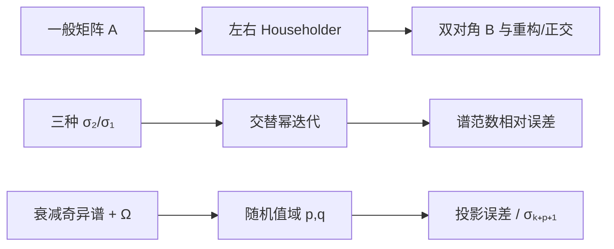

# 实验 - SVD 双对角化、谱范数与随机子空间

> [!question] 本实验的判别问题
> SVD 计算中的结构约化、最大奇异值估计和随机值域近似，应怎样用不同不变量与误差基线分别验收？

## 研究问题

1. 左右 Householder 是否把一般矩阵约化为双对角，并保持重构与正交性到双精度舍入量级？
2. 交替幂迭代的谱范数估计误差如何随 $\sigma_2/\sigma_1$ 改变？
3. 固定目标秩下，随机值域的过采样 $p$ 与幂步 $q$ 如何改变相对同维最优投影误差？

## 预注册假设

> [!hypothesis] 假设
> 双对角非带元素、相对重构误差和正交缺陷均接近 $10^{-15}$；$r=0.2$ 很快到地板，$r=0.98$ 在 30 步仍可见误差；$q=1$ 整体优于 $q=0$，过采样降低随机漏捕获风险但单个固定种子不保证严格单调。

## 环境与方法

- 代码：[plot_svd_bidiagonal_norm.py](</Users/tong/Nodes/basic/00-知识库管理/_labs/code/plot_svd_bidiagonal_norm.py>)；
- 图形：[plot-svd-bidiagonal-norm-v2.svg](</Users/tong/Nodes/basic/00-知识库管理/_assets/plots/svd-algorithms/plot-svd-bidiagonal-norm-v2.svg>)；
- 图形 SHA-256：`7dc630b18bef8945afaa7d5ac6afe246898f8c625c414e10f2709a1fb13a3fa8`；
- Python：系统 `python3`，仅标准库；
- 种子：`20260815`；
- 双对角化：显式教学版 Householder；
- 谱范数：确定性对角奇异谱与固定起点；
- 随机值域：目标 $k=5$，$p\in\{0,2,5,8\}$，$q\in\{0,1\}$。



面板 C 的分母随值域宽度 $\ell=k+p$ 变化：$\sigma_{\ell+1}$ 是任何 $\ell$ 维值域在谱范数下的最优误差。它衡量随机值域相对**同维最优值域**的开销，不是最终 rank-$k$ 截断误差。

## 结果

**为什么双对角结构正确、谱范数估计准确和随机子空间接近最优是三项不同的验收义务？**

![[00-知识库管理/_assets/plots/svd-algorithms/plot-svd-bidiagonal-norm-v2.svg|880]]

> [!figure] 实验图｜SVD 的结构约化、gap 效应与随机值域
> A 并列一般 $7\times5$ 矩阵与 $B=U^TAV$ 的双对角幅度结构，并报告重构/正交缺陷；B 比较三种 $\sigma_2/\sigma_1$ 下谱范数幂估计误差；C 在固定 Gaussian sketch 上扫描过采样 $p$ 与幂步 $q$ 的同维最优误差比。生成脚本：[[plot_svd_bidiagonal_norm.py]]；seed `20260815`，并对双对角不变量、gap 排序和 $q=1$ 改善设断言。

**怎样读图。** A 要同时读带宽外零、重构残差与左右正交缺陷；B 固定迭代次数比较谱比接近 1 时的停滞；C 的分母随 $p$ 变为 $\sigma_{k+p+1}$，因此横向不单调不能直接解读为“过采样变差”，但同一 $p$ 下可比较 $q=0$ 与 $q=1$。

**适用边界（图没有证明什么）。** 双对角化是未分块教学实现，谱范数只测最大奇异值，随机面板只有一个 seed 且分母随值域维数变化；图不提供生产 SVD 的性能、失败概率或最终 rank-$k$ 任务误差保证。

### 双对角化

| 指标 | 数值 |
|---|---:|
| 相对重构残差 $\|U^TAV-B\|_F/\|A\|_F$ | $4.022\times10^{-16}$ |
| $\|U^TU-I\|_F$ | $2.206\times10^{-15}$ |
| $\|V^TV-I\|_F$ | $8.205\times10^{-16}$ |

### 谱范数估计相对误差

| $\sigma_2/\sigma_1$ | $t=5$ | $t=15$ | $t=30$ |
|---:|---:|---:|---:|
| $0.2$ | $1.532\times10^{-14}$ | 数值地板 | 数值地板 |
| $0.8$ | $6.158\times10^{-3}$ | $8.448\times10^{-7}$ | $1.295\times10^{-12}$ |
| $0.98$ | $1.339\times10^{-2}$ | $9.485\times10^{-3}$ | $4.232\times10^{-3}$ |

### 随机值域相对同维最优误差

| $p$ | $q=0$ | $q=1$ |
|---:|---:|---:|
| 0 | $1.546$ | $1.090$ |
| 2 | $1.551$ | $1.130$ |
| 5 | $2.549$ | $1.320$ |
| 8 | $2.538$ | $1.379$ |

## 分析

双对角化三项指标均在双精度舍入量级，验证正交变换没有破坏矩阵尺度。谱范数实验准确展示 gap 效应：$0.98$ 即使 30 步仍有约 $0.4\%$ 相对误差。随机值域中 $q=1$ 对每个 $p$ 都改善比值；固定种子下 $p$ 的比值不单调，因为分母 $\sigma_{k+p+1}$ 也随 $p$ 变小，故“过采样增加绝对捕获能力”和“相对同维最优比值下降”不是同一命题。

## 失败与异常记录

- 对数面板把零/舍入以下误差钳制到绘图地板；
- 教学版 Householder 未做生产级分块和缩放；
- 随机面板只有一个种子，不用于估计失败概率或置信区间；
- $p$ 改变分母，不能把表格横向当作相同 rank-$k$ 误差直接排序；
- 幂法矩阵固定，不能代表训练中随步变化的权重追踪偏差。

## 结论边界

> [!warning] 不可外推之处
> 生产 SVD 应调用经验证的库；最小奇异值与高相对精度有不同难点；随机算法需多种子/概率界；JVP/VJP 可能含自动微分噪声和状态变化。

## 复现

```bash
python3 "00-知识库管理/_labs/code/plot_svd_bidiagonal_norm.py"
```

## 下一步

- [ ] 加入完整 bidiagonal QR 的 deflation 轨迹；
- [ ] 多种子估计随机值域误差分布；
- [ ] 对真实低秩权重同时报告矩阵、激活和任务误差。
