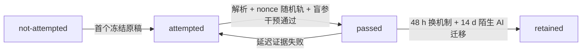

# 实验 - 优化与凸分析累计复现门

> [!abstract] 实验定位
> 这是 `OPT-CUM-01` 的计算复现门。三条轨道有意分开三种证据：A 是具体离散动力系统；B 是解析不等式与非凸性同时成立；C 是参数化反例。它们共同阻止三种常见误读：“GD 对任意初值都逃离严格鞍点”“非凸必然只能收敛到局部解”“raw Hessian sharpness 是函数或泛化不变量”。运行脚本只是最低门槛；通过还要求手算、参数干预与结论边界说明。

## 零、执行顺序、答案隔离与 scorer nonce

### 0.1 一条不能倒放的证据链

本实验不接受“先跑脚本、后解释输出”作为正式通过。每次尝试先记录 `attempt_id = OPT-CUM-01-YYYYMMDD-A`，然后严格按如下顺序：

1. 关闭正文、MOC、本页结果节和标准 SVG/stdout，手写四波解析校准；
2. 提交后，评分者发布带时间戳的 `scorer nonce`，由 nonce 指定 A/B/C 中一条手算轨；
3. 评分者同时给出一组未见参数；学习者先冻结方向、数值范围与失败条件；
4. 运行时使用新输出文件，保存完整命令、stdout、SVG、SHA-256 和 Python 版本；
5. 只有上述文件全部冻结后，才打开 canonical 结果或解答订正。

### 0.2 答案与输出隔离

在正式尝试中，以下内容都视为答案：本页第四、五节，canonical SVG/hash，历史 stdout，[[阶段测验解答 - 优化与凸分析（10.7）]]，以及旧尝试的参数预测。评分者不得提示“选哪轨容易”；学习者不得重复更换 nonce 直到出现熟悉轨。

### 0.3 进入实验前的解析校准门

运行任何代码前，关闭正文与 MOC，在空白纸上完成下表。允许最后用[[optimization_teaching_contract_audit.py]]核对，但首次答案必须保留；脚本输出不能替代推导。

| 波次 | 必须重建的输入 | 必须得到的校准值 | 最少边界说明 |
|---|---|---|---|
| A：projection/Fenchel | $a=(1,1)^T$，$C=\operatorname{conv}\{0,e_1,e_2\}$ | $x^*=(1/2,1/2)^T$，$p^*=1/4$，projection residual $(1/2,1/2)^T$，Jensen gap $1/4$，dual gap $0$ | 输出集合/mixture 凸不推出生成它的 parameterization 凸 |
| B：spectral dynamics | $H=\operatorname{diag}(1,4)$，$x_0=(1,1)^T$ | $\mu=1,L=4,\kappa=4$；$\eta=1/4$ factors $(3/4,0)$；HB roots $\pm1/3$；SGD injection $5\sigma^2/(32B)$、floor $11\sigma^2/(56B)$ | factor、function gap、noise floor 和 wall-clock 是不同对象 |
| C：metric/constraint | 加 $b=(1,5/2)^T$ 与三角形 constraint | $u=(1,5/8)^T$；$\Pi_C^I(u)=(11/16,5/16)^T$；$\Pi_C^H(u)=x^*=(1/2,1/2)^T$；$\lambda^*=(1/2,0,0)^T$ | adaptive state、Hessian、projection 和 KKT residual 不可混名 |
| D：structured/nonconvex | dual、$\frac12\|x\|_1$ composite、binary simplex、$\Phi(a,b)$ | dual gap $5/32\to0$；prox gap $9/128$；Fisher $16/3$、natural direction $15/64$；saddle factors $(3/4,5/4)$ | local Fisher 不等于 finite mirror step；raw sharpness不等于泛化 |

### 0.4 校准时必须写出的四条证书

1. **Projection/Fenchel：**

   $$
   \langle a-x^*,z-x^*\rangle\le0,\quad\forall z\in C,
   $$

   并解释它怎样对应 normal cone，而不是只报 $x^*$。

2. **Spectral recurrence：**

   $$
   x_{k+1,i}=(1-\eta\lambda_i)x_{k,i},
   $$

   并分别写 deterministic factor 与 stochastic covariance recurrence。

3. **KKT/dual/prox：**

   $$
   0=\nabla f(x^*)+\lambda_0^*(1,1)^T,
   \qquad
   G_\eta(x^*)=0,
   $$

   并说明两式对应 hard constraint 与 nonsmooth regularizer 两个不同问题。

4. **Mirror/nonconvex：**

   $$
   \frac{x_{+,1}}{x_{+,2}}
   =\frac13\exp\left(\frac54\eta\right),
   \qquad
   DT(0)=I-\eta\nabla^2\Phi(0),
   $$

   并说明前者是 finite normalized update，后者是 local linear dynamics。

### 0.5 解析校准通过线

四波每波 2 分：输入/对象 0.5，核心值 1，边界 0.5。总分至少 7/8 且不得有整波为 0，才进入三轨计算。失败时回到相应波的第一遍停靠线，不先运行脚本寻找数字。

## 一、预注册对象与可证伪预期

### A 轨：严格鞍点的稳定流形与扰动

研究

$$
f(x,y)=\frac14(x^2-1)^2+\frac12y^2.
$$

其 gradient 与 Hessian 是

$$
\nabla f(x,y)=
\begin{bmatrix}
x(x^2-1)\\y
\end{bmatrix},
\qquad
\nabla^2f(x,y)=
\begin{bmatrix}
3x^2-1&0\\0&1
\end{bmatrix}.
$$

原点为 strict saddle，因为 $H(0,0)=\operatorname{diag}(-1,1)$。固定 $\eta=0.1$，比较：

1. exact initialization $(0,0)$；
2. perturbed initialization $(10^{-3},0)$。

> [!hypothesis]
> exact run 的 gradient 永远为零，objective 保持 $1/4$；perturbed run 沿 $x$ 的 unstable direction 离开并趋向 $(1,0)$，160 步后 $f<10^{-12}$。这验证一个具体 recurrence，不证明任意噪声、任意步长或任意高维 saddle 都在 160 步内逃逸。

### B 轨：非凸而满足 PL

取

$$
h(x)=x+\frac12\sin x,
\qquad
f(x)=\frac12h(x)^2.
$$

因为

$$
h'(x)=1+\frac12\cos x\ge\frac12,
$$

所以

$$
\frac{\tfrac12|f'(x)|^2}{f(x)}=h'(x)^2\ge\frac14
$$

（$x=0$ 处取连续延拓）。同时

$$
f''(x)=\left(1+\frac12\cos x\right)^2
-\frac12\left(x+\frac12\sin x\right)\sin x
$$

可为负。

> [!hypothesis]
> 在 $[-8,8]$ 的 801 点网格上，最小 PL ratio 应接近但不低于 $0.25$，且会观察到 $f''<0$。网格不负责证明全局 PL；全局结论由 $h'(x)\ge1/2$ 的解析推导负责。

### C 轨：尺度对称与 raw sharpness

研究

$$
f(a,b)=\frac12(ab-1)^2
$$

在 global-minimum orbit

$$
(a,b)=(s,1/s),\qquad s>0.
$$

所有点均有 $ab=1,f=0$，但 Hessian eigenvalues 是

$$
0,
\qquad
\lambda_+(s)=s^2+s^{-2}.
$$

> [!hypothesis]
> $s=1$ 时 $\lambda_+=2$；$s=0.1$ 或 $10$ 时 $\lambda_+=100.01$。预测器和 loss 不变，却出现 50.005 倍 raw curvature 差异，因此 raw sharpness 不是 parameterization-invariant generalization certificate。

## 二、对象—证据—不可推出结论

| 轨道 | 直接对象 | 可以支持 | 不能推出 |
|---|---|---|---|
| A | 给定 $f,\eta,x_0$ 的 exact GD recurrence | stable manifold 可卡住；小扰动在此例激发 unstable mode | 一般 perturbed-GD complexity；SGD 任意噪声必逃；到达 global optimum |
| B | 解析 PL ratio 与有限区间 Hessian 网格 | 非凸与 PL 可同时成立；实现未破坏解析下界 | 所有非凸问题满足 PL；global $L$ 存在；深网有同一 $\mu$ |
| C | 同一 scale orbit 上的 Hessian eigenvalue | raw coordinate sharpness 可被重参数化改变 | 所有 symmetry-aware flatness 无意义；sharpness与泛化从不相关 |

## 三、代码、环境与确定性产物

- 代码：[plot_optimization_cumulative_gate.py](</Users/tong/Nodes/basic/00-知识库管理/_labs/code/plot_optimization_cumulative_gate.py>)；
- 图形：[plot-optimization-cumulative-gate-v2.svg](</Users/tong/Nodes/basic/00-知识库管理/_assets/plots/optimization/plot-optimization-cumulative-gate-v2.svg>)；
- SVG SHA-256：`6df184dc5a75e125d1cf2f1595574007538cdd1321efa8690dcf14cf0e6230b6`；
- Python：仅用标准库；默认参数无随机数；
- 图中不写时间或机器路径；相同参数 full run 应 byte-for-byte deterministic。

## 四、结果

先看图判断：三个面板分别改变的是初值、函数结构还是坐标参数化？哪些曲线差异属于优化动力学，哪些只属于表示方式？

![[00-知识库管理/_assets/plots/optimization/plot-optimization-cumulative-gate-v2.svg|880]]

> [!figure] 实验图｜鞍点逃逸、非凸 PL 与坐标 sharpness 的三重分离
> A 对比严格鞍点上的精确不动轨与微扰逃逸；B 把全局 PL ratio 与可为负的 Hessian 并列；C 在 predictor 与 loss 不变的尺度轨道上改变 raw Hessian 最大特征值。生成脚本：[[plot_optimization_cumulative_gate.py]]；无随机数，并对鞍点不变量、PL 下界和尺度放大设断言。

**怎样读图。** A 先比较红虚线与蓝线是否只因 $10^{-3}$ 初始扰动而分叉；B 看蓝线是否始终高于 $\mu=0.25$，同时红线允许落到零以下；C 沿横轴远离 $s=1$ 时读取曲率上升，但不要把它误读为函数或预测器改变。

**适用边界（图没有证明什么）。** A 只展示一个二维 double-well 与固定 GD 步长；B 只验证指定解析函数；C 只构造尺度对称反例。图不证明随机初始化必然逃离所有鞍点、PL 条件对一般神经网络成立，也不把 raw sharpness 变成泛化证书。

> [!question] 本实验的判别问题
> 为什么“精确轨道不逃逸”“非凸函数满足 PL”“同一 predictor 的 Hessian 变尖”可以同时成立，而三者不能被合并成一句关于神经网络可优化性或泛化性的结论？

图注：A 的红虚线是 exact saddle initialization，蓝线是 $10^{-3}$ perturbation；B 的蓝线是 PL ratio $h'^2$、红线是 Hessian，橙虚线是理论下界 $\mu=0.25$；C 沿同一 $ab=1$ orbit 改变 $s$。

### 4.1 A 轨结果

默认运行得到：

| run | $f(x_0,y_0)$ | $f(x_{160},y_{160})$ | 最终位置 |
|---|---:|---:|---|
| exact $(0,0)$ | $0.25$ | $0.25$ | $(0,0)$ |
| perturbed $(10^{-3},0)$ | $\approx0.25$ | $2.80041313\times10^{-18}$ | $(1.00000000,0)$ |

在原点附近忽略 cubic term，$x$ recurrence 为

$$
x_{k+1}\approx(1+\eta)x_k.
$$

所以 perturbation 在早期按约 $1.1^k$ 放大；exact zero 则由确定性映射永远保持 zero。这不是数值矛盾，而是“null stable set”和“绝对连续随机初始化几乎不命中”的差别。

### 4.2 B 轨结果

默认 $a=0.5$：

| quantity | 解析值/采样值 |
|---|---:|
| PL constant lower bound $\mu=(1-a)^2$ | $0.25$ |
| sampled minimum ratio on $[-8,8]$ | $0.25000063$ |
| sampled minimum Hessian on $[-8,8]$ | $-3.34234789$ at $x=-8$ |

sampled ratio 稍高于 $0.25$，因为固定网格没有恰好命中 $\cos x=-1$ 的点。负 Hessian 已足以否定 convexity；最小值出现在绘图区边界还提醒我们：这个区间图不能估计 global smoothness，事实上 Hessian 的振幅随 $|x|$ 增长。

### 4.3 C 轨结果

$$
\lambda_+(1)=2,
\qquad
\lambda_+(0.1)=\lambda_+(10)=100.01.
$$

curvature ratio 是

$$
\frac{100.01}{2}=50.005,
$$

但三点的 predictor $ab=1$、training loss、validation prediction和任何只由预测函数决定的 risk 都完全相同。因而若实验只报告 raw $\lambda_{\max}(H)$，必须先回答其 parameterization 为什么有可比性。

## 五、复现命令

在仓库根目录执行：

```bash
python3 "00-知识库管理/_labs/code/plot_optimization_cumulative_gate.py"
xmllint --noout \
  "00-知识库管理/_assets/plots/optimization/plot-optimization-cumulative-gate-v2.svg"
shasum -a 256 \
  "00-知识库管理/_assets/plots/optimization/plot-optimization-cumulative-gate-v2.svg"
```

预期关键输出：

```text
A_CONFIG perturbation=0.001 stable_y0=0 eta=0.1 steps=160
A_SADDLE exact_f=0.25000000 perturbed_f=2.80041313e-18 final_x=1.00000000
B_CONFIG a=0.5 x_max=8
B_PL mu=0.25000000 sampled_min_ratio=0.25000063 sampled_min_hessian=-3.34234789 at_x=-8.00000
C_CONFIG scale_span=1
C_SHARPNESS balanced=2.00000 extreme=100.01000
SHA256 6df184dc5a75e125d1cf2f1595574007538cdd1321efa8690dcf14cf0e6230b6
```

确定性复核时写到另一个文件，不要覆盖 canonical artifact：

```bash
python3 "00-知识库管理/_labs/code/plot_optimization_cumulative_gate.py" \
  --output /tmp/plot-optimization-cumulative-gate-v2.svg
shasum -a 256 /tmp/plot-optimization-cumulative-gate-v2.svg
```

## 六、scorer nonce 指定的手工复核

评分者在解析校准提交后才公布 `scorer nonce`，并用事先声明的规则将 nonce 映射到 A/B/C 一轨。学习者不得看代码或结果节；评分者不得临时改轨。

### A 轨

1. 手算 gradient、Hessian 和原点分类；
2. 写出 exact GD recurrence；
3. 解释为什么 $x_0=0$ 保持不动，而小 $x_0\ne0$ 初期放大；
4. 不运行代码，预测把 `--eta` 从 $0.1$ 改到 $0.05$ 对 escape time 的方向性影响。

### B 轨

1. 独立证明 $h'(x)\ge1-a$ 与 PL inequality；
2. 取 $x_n=\pi/2+2\pi n$，证明对足够大 $n$ 有 $f''(x_n)<0$；
3. 把 `--pl-a` 改为 $0.2$，事前预测 $\mu$ 变为多少、ratio envelope 如何变化，再运行验证。

### C 轨

1. 求 factorization Hessian；
2. 在 $ab=1$ 上求两个 eigenvalues；
3. 找到 tangent null direction；
4. 解释为什么这个反例只推翻 raw coordinate sharpness 的 invariance，而不推翻所有 normalized/function-space measure。

## 七、盲参数干预门

正式尝试由评分者在笔试冻结后指定至少三个参数，且必须同时涉及两条轨。下表说明每个参数改变的对象；它不是选参答案。

| CLI | 改变的对象 | 事前必须预测 |
|---|---|---|
| `--perturbation` | A 轨 unstable coordinate 的初始幅度 | escape time 方向，不改变驻点位置 |
| `--stable-y0` | A 轨 stable manifold 上的初值 | exact $x=0$ 轨的 $y$ 衰减和 objective 极限 |
| `--eta`, `--steps` | 局部增长/衰减因子与观测预算 | stability、escape time 与有限预算截断 |
| `--pl-a` | B 轨函数族和解析 $\mu=(1-a)^2$ | ratio 下界的精确变化 |
| `--pl-x-max` | B 轨可视/采样区间 | sampled Hessian minimum 可变，不改变全局 PL 证明 |
| `--scale-span` | C 轨 scale orbit 的 $\log_{10}s$ 范围 | extreme sharpness $10^{2r}+10^{-2r}$ |

入门练习可只改一个参数，但必须输出到不同文件。例如：

```bash
python3 "00-知识库管理/_labs/code/plot_optimization_cumulative_gate.py" \
  --pl-a 0.2 \
  --output /tmp/optimization-gate-a02.svg
```

运行前必须写出预测。对 $a=0.2$：

$$
\mu=(1-0.2)^2=0.64,
$$

所以 sampled minimum ratio 应接近 $0.64$；Hessian 是否仍在 $[-8,8]$ 内为负必须由解析或运行检验，不能从 PL 单独推出。

### 7.1 审计使用的固定盲参回归样例

下列命令用于检查“盲参接口本身是否可复现”，不得作为学习者正式尝试的 nonce 参数：

```bash
python3 "00-知识库管理/_labs/code/plot_optimization_cumulative_gate.py" \
  --perturbation 0.005 --stable-y0 0.8 --eta 0.08 --steps 220 \
  --pl-a 0.3 --pl-x-max 10 --scale-span 1.25 \
  --output /tmp/optimization-cumulative-blind-regression.svg
```

固定回归输出锚点为：

```text
A_CONFIG perturbation=0.005 stable_y0=0.8 eta=0.08 steps=220
A_SADDLE exact_f=0.25000000 perturbed_f=3.73073197e-17 final_x=1.00000000
B_CONFIG a=0.3 x_max=10
B_PL mu=0.49000000 sampled_min_ratio=0.49000001 sampled_min_hessian=-1.58861185 at_x=-8.17500
C_CONFIG scale_span=1.25
C_SHARPNESS balanced=2.00000 extreme=316.23093
SHA256 e991ef5318f95ba6422c0b72d2c9b9e9e04ec91cbe6c82c4eb9d310a0fec21aa
```

这组盲参中，A 轨 exact run 从 $(0,0.8)$ 出发，它沿 stable manifold 将 $y$ 压向 0，却仍不会激发 $x$ 方向；B 轨解析下界变为 $(1-0.3)^2=0.49$；C 轨极端曲率应为 $10^{2.5}+10^{-2.5}\approx316.23093$。这三条是事前可推出预测，不是读 stdout 后的故事。

## 八、证据状态机与延迟迁移



- 48 小时门必须换一类机制：objective/constraint/CQ、norm/metric/parameterization、oracle/noise、algorithm/step/inner solve 或 certificate/deployment；
- 14 天门必须面对未见 AI 优化摘要，重新写 variables/fixed quantities、objective/deployment estimand、geometry/oracle、theorem contract、algorithm、residual、compute fairness、symmetry 和 failure criteria；
- 仓库的 canonical 和 blind-regression hash 通过，只升级 `material_status`；没有学习者原稿时，`learning_status` 必须继续为 `not-attempted`。

## 九、通过门槛

必须同时满足：

1. canonical full run 的三行数值、XML 校验与 hash 匹配；
2. 随机指定轨道的关键量可独立手算；
3. 完成一个不同输出文件的参数干预，包含事前预测和事后解释；
4. 对三轨分别写一条“能推出”和“一条不能推出”；
5. 能口头区分 FOSP、SOSP、strict saddle、degenerate saddle、PL 与 benign landscape；
6. 48 小时后不看笔记完成换机制重建，14 天后完成陌生 AI 优化迁移；
7. 把失败项回链到正文或节点题，不因脚本成功把状态升级为 mastered。

```text
日期：
attempt_id：
scorer nonce：
四波解析校准：A __/2，B __/2，C __/2，D __/2
canonical hash：
随机指定轨道：A / B / C
手算结果：
干预参数与输出路径：
事前预测：
实际结果：
偏差解释：
三条“能推出”：
三条“不能推出”：
blind hash：
48 小时换机制：
14 天陌生 AI 迁移：
评分者：
material_status：regression-passed / drifted
learning_status：not-attempted / attempted / passed / retained
```

## 十、与 10.7 全卷的连接

- A 轨连接[[一阶最优性条件与梯度下降]]、[[光滑性、强凸性与条件数]]、[[Newton 法、Gauss-Newton 与拟 Newton 法]]和[[非凸优化、鞍点与深度网络损失地形]]；
- B 轨把 linear convergence 与 convexity 分离，迫使学习者检查[[光滑性、强凸性与条件数]]和[[一阶最优性条件与梯度下降]]中的结论对象；
- C 轨连接[[投影、约束与可行方向]]、[[镜像下降、Bregman 几何与自然梯度]]中的 geometry choice，并提醒 optimizer coordinate geometry 与 function invariance 不是同一件事；
- 笔试与评分：[[阶段测验 - 优化与凸分析（10.7）]]、[[阶段测验解答 - 优化与凸分析（10.7）]]。
