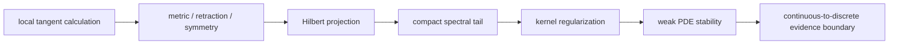

# 实验 - 几何、泛函与算子累计复现门

> [!abstract] 复现目标
> 本门把10.10的八个节点压缩成三条必须手推的证据链：A轨在球面上区分ambient update、retraction、exponential与orthogonal covariance；B轨把Hilbert projection error、compact operator tail和RKHS effective dimension放在同一谱模型中；C轨用Poisson cutoff operator证明“absolute output error很小”可以与“relative error 100%、strong residual不降”同时成立。脚本只核实现有限/解析对象，不替代global geometry或continuum theorem。

先看图回答：三条轨道中的收敛阶分别属于局部几何误差、谱尾误差还是函数空间范数？为什么纵轴都下降也不能推出同一种逼近定理？

![[00-知识库管理/_assets/plots/geometry-functional/plot-geometry-functional-cumulative-gate-v2.svg|880]]

> [!figure] 实验图｜局部几何、Hilbert/RKHS 谱尾与弱 PDE 泛化
> A 中 ambient constraint residual 为二阶、normalization retraction 相对 Exp 为三阶，并单独核对旋转协变；B 中 $c_j=1/j$ 的 Hilbert projection tail 约 $m^{-1/2}$、$\mu_j=j^{-2}$ 的 compact operator tail 约 $m^{-2}$；C 中 cutoff model 对 OOD modes 呈现 $L^2$ 二阶、energy/$H^{-1}$ 一阶和 strong residual 零阶。生成脚本：[[geometry_functional_cumulative_gate.py]]；无随机数，并对局部阶、协变性和模态指数设断言。

**怎样读图。** 每栏先读横轴改变的对象，再读斜率：A 的步长趋零只认证局部 approximation order；B 的截断维数连接系数尾与有效维数；C 必须同时比较三种 norm，不能用很小的 absolute $L^2$ error 遮盖 relative 或 strong residual 的失败。

**适用边界（图没有证明什么）。** 球面更新是局部构造，谱模型使用显式序列，PDE 轨是 Fourier cutoff 反例；图不证明 global chart、紧性定理、RKHS 统计速率或一般 neural operator 的 OOD 泛化。

> [!question] 本实验的判别问题
> 当几何局部阶、谱截断尾和 PDE 弱范数误差都表现为幂律时，必须附带哪些空间、范数、离散化与极限顺序，结论才不会被错误迁移？

## 一、三轨统一合同

| 轨道 | 连续对象 | 脚本核对 | 不可越界 |
|---|---|---|---|
| A 几何—对称 | $S^2$、$T_pS^2$、Exp、retraction、$SO(3)$ action | local order与一个rotation covariance identity | global chart、geodesic completeness、global optimum、data manifold |
| B 泛函—谱—核 | $\ell^2$ projection、compact diagonal、kernel spectrum | 大finite section的tail和effective dimension | 从有限矩阵直接证明continuum compactness或RKHS generalization |
| C 弱PDE—operator | Poisson solution operator、$L^2/H^1/H^{-1}$ norms | spectral cutoff在多个topologies下的exact error | 任意forcing distribution、mesh-independent operator norm与部署泛化 |



## 二、轨道A：球面几何、retraction与rotation covariance

### 2.1 对象

取

$$
p=(1,0,0)^T,
\qquad
c=(1,2,-1)^T,
$$

$$
f_c(x)=c^Tx,
\qquad x\in S^2.
$$

Induced metric下

$$
T_pS^2=p^\perp,
\qquad
\operatorname{grad}f_c(p)
=(I-pp^T)c=(0,2,-1)^T.
$$

令

$$
v=\frac{(0,2,-1)^T}{\sqrt5}.
$$

### 2.2 三个finite-step对象

Ambient Euler point是

$$
x_{\rm amb}(h)=p+hv.
$$

因$p\perp v$且$\|p\|=\|v\|=1$，

$$
\|x_{\rm amb}(h)\|^2-1=h^2.
$$

它不在sphere上，constraint residual精确二阶。Normalization retraction和Riemannian exponential分别为

$$
R_p(hv)=\frac{p+hv}{\sqrt{1+h^2}},
$$

$$
\operatorname{Exp}_p(hv)=\cos h\,p+\sin h\,v.
$$

Taylor展开：

$$
R_p(hv)-\operatorname{Exp}_p(hv)
=-\frac13h^3v+O(h^4).
$$

所以point difference三阶；“两者都可行”不等于“两者相同”。默认$h=2^{-12},\ldots,2^{-2}$得到：

| quantity | log–log slope |
|---|---:|
| ambient constraint residual | 2.000000 |
| $\|R_p(hv)-\operatorname{Exp}_p(hv)\|$ | 2.997004 |

### 2.3 对称门

对绕$z$轴角度$\theta=0.7$的$Q\in SO(3)$，脚本核对

$$
\operatorname{grad}f_{Qc}(Qp)
=Q\operatorname{grad}f_c(p).
$$

默认误差为

$$
3.140\times10^{-16}.
$$

这是一条family-level covariance：point和parameter必须共同变换。若固定$c$只旋转$x$，$f_c$一般不invariant。

> [!warning] A轨边界
> Third-order finite-step curve支持脚本实现与Taylor式一致；它不证明Exp是global diffeomorphism，也不证明任意learned decoder形成manifold。一个rotation的machine-level identity也不替代对所有$Q$的代数证明。

## 三、轨道B：Hilbert projection、compact spectrum与RKHS容量

### 3.1 Projection tail

在$H_N=\mathbb R^N$中使用标准inner product，取

$$
c_j=\frac1j,
\qquad N=131{,}072.
$$

$P_m$投影到前$m$个coordinate axes，故

$$
\|c-P_mc\|_2
=\left(\sum_{j=m+1}^N\frac1{j^2}\right)^{1/2}.
$$

Infinite $\ell^2$中由integral comparison，tail square约$m^{-1}$，因此projection error约$m^{-1/2}$。默认$m=4,8,\ldots,4096$的finite-section slope为

$$
-0.495225.
$$

它接近而不等于$-1/2$，因为窗口有限且tail在$N$截断。

### 3.2 Compact diagonal tail

定义$K:\ell^2\to\ell^2$：

$$
(Kx)_j=\mu_jx_j,
\qquad
\mu_j=j^{-2}.
$$

令$K_m$保留前$m$个eigenmodes，则

$$
\|K-K_m\|
=\sup_{j>m}\mu_j
=\frac1{(m+1)^2}\to0.
$$

因此$K$是finite-rank operators的operator-norm limit，故compact。默认finite-window slope为

$$
-1.951949.
$$

解析式而非回归给真正的$m^{-2}$尾部。

### 3.3 Kernel effective dimension

把同一$\mu_j$解释为positive compact kernel/integral operator的eigenvalues。Regularization $\lambda>0$下定义

$$
N_{\rm eff}(\lambda)
=\operatorname{tr}\bigl(K(K+\lambda I)^{-1}\bigr)
=\sum_j\frac{\mu_j}{\mu_j+\lambda}
=\sum_j\frac1{1+\lambda j^2}.
$$

因为主要贡献来自$j\lesssim\lambda^{-1/2}$，预期

$$
N_{\rm eff}(\lambda)\asymp\lambda^{-1/2}.
$$

默认$\lambda=10^{-1},10^{-1.5},\ldots,10^{-6}$的大finite section得到

$$
\operatorname{slope}
\bigl(\log N_{\rm eff},\log(1/\lambda)\bigr)
=0.506725,
$$

并在$\lambda=10^{-6}$得到$N_{\rm eff}=1562.667109$。

> [!important] 三个指数不是同一对象
> Projection tail取决于target coefficients；operator tail取决于$K$的eigenvalues；effective dimension还取决于regularization。把三条曲线统称“有效秩”会丢失对象、norm与量词。

## 四、轨道C：Poisson smoothing与operator cutoff盲区

### 4.1 Exact solution operator

在$(0,1)$取normalized sine basis

$$
\phi_j(x)=\sqrt2\sin(j\pi x),
\qquad\|\phi_j\|_{L^2}=1.
$$

对zero-Dirichlet Poisson问题

$$
-u''=f,
$$

若$f=\phi_j$，exact solution是

$$
u_j=\frac1{(j\pi)^2}\phi_j.
$$

因此solution operator对高频有二阶smoothing。

### 4.2 一个“训练完美”的cutoff model

定义learned proxy $\widehat G$：

$$
\widehat G\phi_j=
\begin{cases}
G\phi_j,&j\le8,\\
0,&j>8.
\end{cases}
$$

它在training subspace $\operatorname{span}\{\phi_1,\ldots,\phi_8\}$上operator error严格为0。对任意OOD mode $j>8$，error就是$u_j$。

### 4.3 四本误差账

对$j>8$：

$$
\|u_j-\widehat G\phi_j\|_{L^2}
=\frac1{(j\pi)^2},
$$

$$
|u_j-\widehat G\phi_j|_{H_0^1}
=\frac1{j\pi},
$$

$$
\|f+\widehat u_j''\|_{H^{-1}}
=\frac1{j\pi},
$$

而strong forcing residual满足

$$
\|f+\widehat u_j''\|_{L^2}=\|\phi_j\|_{L^2}=1.
$$

同时output-relative $L^2$ error为

$$
\frac{\|u_j-0\|_{L^2}}{\|u_j\|_{L^2}}=1.
$$

默认拟合得到：

| 对象 | slope vs mode $j$ |
|---|---:|
| absolute $L^2$ solution error | -2.000000 |
| energy / $H^{-1}$ residual | -1.000000 |
| strong $L^2$ residual | 0.000000 |

在$j=64$，absolute $L^2$ error只有$2.47366171\times10^{-5}$，但relative error仍100%，strong residual仍1。

> [!experiment] C轨核心结论
> Elliptic smoothing会让遗漏高频mode的absolute output error自然变小。如果benchmark只按un-normalized $L^2$ output average，高频完全失败也可能看起来优秀；必须同时报告relative、energy/weak residual、spectral subgroup与input distribution。

## 五、代码、确定性与canonical产物

- 代码：[geometry_functional_cumulative_gate.py](</Users/tong/Nodes/basic/00-知识库管理/_labs/code/geometry_functional_cumulative_gate.py>)；
- 图形：[plot-geometry-functional-cumulative-gate-v2.svg](</Users/tong/Nodes/basic/00-知识库管理/_assets/plots/geometry-functional/plot-geometry-functional-cumulative-gate-v2.svg>)；
- SVG SHA-256：`d0ff3852b11f8a82af5feff469fa3ef4e1adde7836cf292b4911dec043c59bd1`；
- 仅用Python标准库，无网络和随机数；
- A轨在写图前assert sphere constraint与covariance，B轨使用显式finite sums，C轨assert exact modal exponents；
- canonical SVG已完成XML、不同输出路径双跑比较与实际1440×540 PNG渲染目检。

在仓库根目录运行：

```bash
python3 "00-知识库管理/_labs/code/geometry_functional_cumulative_gate.py"
xmllint --noout \
  "00-知识库管理/_assets/plots/geometry-functional/plot-geometry-functional-cumulative-gate-v2.svg"
shasum -a 256 \
  "00-知识库管理/_assets/plots/geometry-functional/plot-geometry-functional-cumulative-gate-v2.svg"
```

预期关键输出：

```text
geometry constraint_slope=2.000000 retraction_order=2.997004 equivariance_error=3.140e-16
functional projection_slope=-0.495225 compact_tail_slope=-1.951949 effective_dimension_slope=0.506725 neff_at_1e-6=1562.667109
pde train_cutoff=8 max_mode=64 l2_slope=-2.000000 energy_slope=-1.000000 strong_slope=0.000000 last_l2=2.47366171e-05 last_energy=4.97359197e-03
```

确定性复核写到另一个文件：

```bash
python3 "00-知识库管理/_labs/code/geometry_functional_cumulative_gate.py" \
  --output /tmp/geometry-functional-cumulative-check.svg
cmp \
  "00-知识库管理/_assets/plots/geometry-functional/plot-geometry-functional-cumulative-gate-v2.svg" \
  /tmp/geometry-functional-cumulative-check.svg
```

## 六、评分者随机指定的手工复核

### A轨必须完成

1. 从regular level set或curve定义推出$T_pS^2=p^\perp$；
2. 推导ambient constraint residual精确为$h^2$；
3. 不看代码展开$R_p(hv)-\operatorname{Exp}_p(hv)$到leading term；
4. 代数证明对所有$Q\in O(3)$的gradient covariance，并说明固定parameter时为何不是invariance。

### B轨必须完成

1. 用orthogonal projection写出$c_j=1/j$的tail norm；
2. 用integral comparison解释$-1/2$，并区分finite $N$；
3. 证明$\|K-K_m\|=(m+1)^{-2}$和compactness；
4. 从“被regularization保留的modes约$j\lesssim\lambda^{-1/2}$”解释effective-dimension指数。

### C轨必须完成

1. 求sine forcing的Poisson exact multiplier；
2. 分别手算$L^2$、$H_0^1$、$H^{-1}$与strong residual；
3. 解释absolute error趋0与relative error 100%为何不矛盾；
4. 把该反例改写成neural operator benchmark必须增加的三个指标。

## 七、参数干预门

至少完成一个干预；运行前写预测，输出到不同文件。

### 7.1 推荐：扩大training spectral cutoff

```bash
python3 "00-知识库管理/_labs/code/geometry_functional_cumulative_gate.py" \
  --train-cutoff 16 \
  --output /tmp/geo-cum-cutoff16.svg
```

事前预测：

- A、B轨数值不变；
- exact training subspace从modes 1—8扩大到1—16；
- 图中OOD起点移到17，但对每个仍被遗漏的mode，$L^2/H^1/strong$指数仍分别为$-2/-1/0$；
- $j=64$仍被遗漏，所以最后三项数值不变。

### 7.2 其他合规干预

- `--rotation-angle 1.1`：事前预测解析covariance仍成立，只有rounding-level error轻微变化；
- `--spectral-size 65536`：projection tail与$N_{\rm eff}$会受更早finite-section saturation影响，compact analytic tail不变；
- `--max-mode 128`：modal exact slopes仍为$-2/-1/0$，last errors按$1/j^2$和$1/j$缩小。

只换输出路径不算干预；运行后再补预测不通过。

## 八、通过门槛

必须同时满足：

1. canonical三行输出、XML和hash匹配；
2. 随机指定轨道可脱离代码重建核心公式；
3. 完成一个带事前预测的参数干预并解释偏差；
4. 为A/B/C各写一条“能推出”和一条“不能推出”；
5. 能口头区分local/global、finite/compact、absolute/relative和strong/weak四组对象；
6. [[阶段测验 - 几何、泛函分析、核与算子基础（10.10）]]达到总分与各区线；
7. 48小时后重建随机轨道，14天后审计一个新的geometric/operator-learning声明。

```text
日期：
canonical hash：
随机轨道：A / B / C
手推过程：
干预参数与输出：
事前预测：
实际结果：
偏差解释：
A/B/C 能推出：
A/B/C 不能推出：
48小时复测：
14天迁移：
评分者：
状态：not-attempted / attempted / passed / retained
```

## 九、状态边界

本页、题卷、详解、代码和canonical图全部成稿后，`GEO-CUM-01`仍为`composed / not-attempted`。脚本断言证明有限实现与声明的解析对象一致，不证明学习者掌握，也不把finite sections升级成continuum theorem；实际`passed`必须附首次闭卷原稿、随机轨道手推、参数干预和延迟复测。
