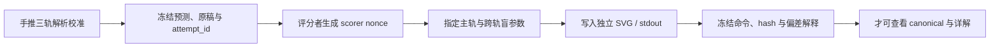

# 实验 - 学习问题、决策与风险累计复现门

> [!abstract] 复现目标
> 本门不是用一张曲线“证明模型会泛化”，而是检查三种经常被混在一起的数学对象能否分账。A 轨在一个完全可枚举的二元学习问题中分离 Bayes risk、类近似误差、有限样本类内超额风险与选择后的泛化间隙；B 轨固定条件分布，只改变 loss/action contract，观察 Bayes action 如何改变；C 轨精确计算查看 $K$ 个验证成绩后选最小者产生的乐观偏差，并把 fresh test 与 simultaneous bound 放回正确位置。评分者随机指定一条主轨和跨轨盲参；学习者必须先推导、冻结预测，再运行新输出。

先看图回答一个问题：**为什么 A 的四根柱、B 的三条条件风险线与 C 的验证选择曲线不能被统称为“泛化误差”？**

![[00-知识库管理/_assets/plots/learning-theory/plot-learning-problem-decision-cumulative-gate-v2.svg|880]]

> [!figure] 实验图｜对象—风险选择、Bayes 动作与验证反馈
> A 对有限样本的全部 count vectors 做精确加权，依次显示 Bayes、类内 oracle、所选 ERM 的期望总体风险与期望训练风险；B 对同一 $\eta=P(Y=1\mid X=x)$ 比较 action $0$、reject、action $1$ 的条件风险；C 在所有候选真实误差都为 $q$ 的对称模型中计算最小验证误差的期望，并与 fresh risk 分离。生成脚本：[[learning_problem_decision_cumulative_gate.py]]；只用 Python 标准库，无 Monte Carlo 随机误差。

**怎样读图。** A 从左到右先读“问题本身允许的最优动作”，再读“限制到 $\mathcal H$ 的代价”，最后比较数据选择后的总体量与训练量；B 必须竖着比较同一个 $\eta$ 下三种 action 的风险，最低线才定义 Bayes action；C 的橙线随候选数下降并不表示世界中的模型变好，而表示从更多带噪估计里挑最小值变得更乐观。

**适用边界（图没有证明什么）。** A 只覆盖指定的二元空间、0–1 loss、确定性 tie-break 与给定 $\mathcal H$；B 只覆盖给定成本和 reject action；C 假设各候选在验证样本上的 error indicator 相互独立且具有相同真实率。图不证明任意 ERM 必定过拟合、不提供真实神经网络的 capacity bound，也不能替代目标分布上的 fresh evaluation。

## 零、执行顺序、答案隔离与 scorer nonce



### 进入实验前的解析校准门

运行任何代码前，学习者须在空白页写出：

1. A 轨四个原子事件的概率、每个 hypothesis 的总体风险、Bayes/class oracle 和 ERM tie-break；
2. A 轨期望量究竟对随机样本 $S$ 的哪种分布取期望，为什么 $R_S(h_S)$ 与 $R_P(h_S)$ 是不同随机变量；
3. B 轨三种动作的条件风险及 binary cost threshold、reject 可优区间；
4. C 轨最小验证错误数的 survival-sum 公式与 simultaneous Hoeffding radius；
5. 每条轨道能推出和不能推出的声明各两条。

缺少这些冻结预测时，脚本输出只能算课堂演示，不能算个人复现证据。

### 评分者随机指定、跨轨盲参与防挑题协议

题卷原稿冻结后，评分者记录 `attempt_id` 与带时间戳的 `scorer nonce`。nonce 用于指定 A/B/C 中一条主手算轨；另给至少横跨两轨的未见参数。学习者不能要求重抽，也不能先试跑若干参数再留下最顺眼的一组。评分者保留参数生成规则与原始消息，学习者的事前预测必须早于第一次运行时间。

### 防止循环认证

- canonical 输出是材料校准锚点，不是未知测验；
- 本页列出的固定盲参 fixture 供独立审计脚本使用，不得提前作为个人盲测；
- 非默认参数若未显式提供 `--output`，脚本会拒绝执行，避免覆盖 canonical 图；
- 个人输出只写入 `artifacts/<attempt_id>/` 或临时目录；
- 打开[[阶段测验解答 - 学习问题、决策与风险（20.1）]]、审计 fixture stdout 或 canonical 数值后，不能再补写“运行前预测”。

## 一、三轨统一对象合同

| 轨道 | 固定对象 | 被干预对象 | 主要证明角色 | 主要覆盖 |
|---|---|---|---|---|
| A 对象—风险—选择 | $\mathcal X=\mathcal Y=\{0,1\}$、0–1 loss、tie-break | $P(X)$、$\eta_0,\eta_1$、$m$、$\mathcal H$ | 有限样本精确枚举与风险分账 | LT-01—05、LT-07 |
| B 条件 Bayes 决策 | 条件概率 $\eta$ | false-positive/false-negative/reject cost | 逐点条件风险最小化 | LT-04、LT-06 |
| C 验证选择反馈 | 每个候选真实 error 为 $q$ | $K,n_{va},q,\delta$ | order statistic 与 simultaneous control | LT-02、LT-03、LT-08 |

三轨共同要求同一条类型链：

$$
P\longrightarrow S\longrightarrow A(S)=h_S
\longrightarrow \ell(h_S(X),Y)
\longrightarrow R_P(h_S),R_S(h_S).
$$

箭头表达的是对象依赖，而不是因果效应。若把 target law 换成 $Q$、把 action space 加入 reject、把验证分数反馈给开发者，右端风险或左端算法已经变成另一个合同，不能沿用原结论。

## 二、轨道 A：有限二元问题中的完整风险账

### 2.1 数据律与四个原子

设 $X,Y\in\{0,1\}$，

$$
P(X=1)=\pi,
\qquad
P(Y=1\mid X=0)=\eta_0,
\qquad
P(Y=1\mid X=1)=\eta_1.
$$

于是按 $(0,0),(0,1),(1,0),(1,1)$ 排列的原子概率为

$$
p=((1-\pi)(1-\eta_0),(1-\pi)\eta_0,
\pi(1-\eta_1),\pi\eta_1).
$$

确定性预测器可写成 $h=(h(0),h(1))$。0–1 总体风险是四个误分类原子概率之和。默认 $\pi=0.4,\eta_0=0.2,\eta_1=0.75$，Bayes predictor 为 $(0,1)$，

$$
R^*=0.6\times0.2+0.4\times0.25=0.22.
$$

默认假设类只含两个常数函数：

$$
\mathcal H=\{(0,0),(1,1)\}.
$$

恒预测 $0$ 的风险为 $P(Y=1)=0.42$，恒预测 $1$ 的风险为 $0.58$，故类内 oracle 风险是 $0.42$，approximation error 为 $0.42-0.22=0.20$。

### 2.2 精确枚举不是 Monte Carlo

对样本量 $m$，用 $N=(N_{00},N_{01},N_{10},N_{11})$ 记录四个原子的出现次数。所有满足 $\sum_zN_z=m$ 的 count vectors 的概率为

$$
P(N)=\frac{m!}{\prod_zN_z!}\prod_zp_z^{N_z}.
$$

脚本对全部 count vectors 加权。对每个 $N$，计算所有 $h\in\mathcal H$ 的 $R_S(h)$，以固定词典序打破并列，再求

$$
\mathbb E_S R_S(\widehat h_S),
\qquad
\mathbb E_S R_P(\widehat h_S).
$$

默认 $m=6$ 的锚点为：

| 量 | 值 | 正确解释 |
|---|---:|---|
| Bayes risk | 0.220000 | 当前 observation/action/loss 下全函数空间最优 |
| class oracle risk | 0.420000 | 限制在常数类后的最优总体风险 |
| expected ERM population risk | 0.453278 | 有限样本选择后，对新样本承担的期望风险 |
| expected ERM training risk | 0.331852 | 同一样本上被最小化的期望经验风险 |
| approximation | 0.200000 | class oracle 减 Bayes |
| finite-sample class excess | 0.033278 | selected population 减 class oracle |
| selection gap | 0.121426 | selected population 减 selected training |

这三笔差不能互换：approximation 属于函数类；class excess 属于有限样本选择；selection gap 比较的是同一随机输出在总体与训练样本上的两个风险对象。

### 2.3 A 轨必须先做的手算

评分者改变 $(\pi,\eta_0,\eta_1,m,\mathcal H)$ 后，学习者必须先：

1. 写出四原子概率并核对和为 1；
2. 列出允许 hypotheses 的总体风险；
3. 得到 Bayes 与 class oracle，并判断 approximation 是否为 0；
4. 至少手算两个 count vectors 的 empirical risks、tie-break 与权重；
5. 预测 $\mathbb E R_S(\widehat h)$ 与 $\mathbb E R_P(\widehat h)$ 的大小关系，但不得把该方向宣称为所有 learner 的定理。

## 三、轨道 B：改变 loss 就改变 Bayes action

### 3.1 条件风险

固定 $x$，令 $\eta=P(Y=1\mid X=x)$。action set 为 $\{0,\bot,1\}$，其中 $\bot$ 表示 reject。false positive、false negative 与 reject cost 分别为 $c_{FP},c_{FN},c_R$，则

$$
r(0\mid x)=c_{FN}\eta,
\qquad
r(1\mid x)=c_{FP}(1-\eta),
\qquad
r(\bot\mid x)=c_R.
$$

Bayes action 是三者的逐点 argmin。若不允许 reject，预测 1 的阈值为

$$
\eta\ge\frac{c_{FP}}{c_{FP}+c_{FN}},
$$

而不是永远 $1/2$。Reject 同时优于 0 和 1 的候选区间是

$$
\frac{c_R}{c_{FN}}<\eta<1-\frac{c_R}{c_{FP}},
$$

但只有左端小于右端时才非空；端点并列还要显式规定 tie-break。

### 3.2 默认决策锚点

默认 $c_{FP}=1,c_{FN}=2,c_R=0.24$，binary threshold 为 $1/3$，reject candidate interval 为 $(0.12,0.76)$。

| $\eta$ | $r(0)$ | $r(\bot)$ | $r(1)$ | Bayes action | 0–1 action |
|---:|---:|---:|---:|---|---|
| 0.12 | 0.24 | 0.24 | 0.88 | 0（按 tie-break） | 0 |
| 0.38 | 0.76 | 0.24 | 0.62 | reject | 0 |
| 0.62 | 1.24 | 0.24 | 0.38 | reject | 1 |
| 0.88 | 1.76 | 0.24 | 0.12 | 1 | 1 |

这不是“posterior 大于某个神秘阈值”的经验技巧，而是对条件风险逐项比较的结果。若 posterior 本身是估计量，还需另记 estimation/calibration error；本轨只研究已知 $\eta$ 时的 oracle action。

### 3.3 B 轨盲参义务

学习者需在画图前给出新的 binary threshold、reject interval、每个 $\eta$ 的三种风险和动作；至少构造一个“0–1 Bayes classifier 在部署成本下不是 Bayes”的点。只报 action 不报条件风险，或把 Bayes decision 说成“带 prior 训练”，均不通过。

## 四、轨道 C：验证集选择与 fresh test

### 4.1 对称候选模型

设有 $K$ 个候选，每个在目标分布上的真实 0–1 error 都是 $q$。在大小 $n$ 的 validation set 上，假设候选间 error indicators 独立，于是每个错误数

$$
B_j\sim\operatorname{Binomial}(n,q).
$$

选择验证错误最小的候选。令 $M=\min_{1\le j\le K}B_j$，对非负整数变量使用 survival sum：

$$
\mathbb E[M]
=\sum_{t=1}^{n}P(M\ge t)
=\sum_{t=1}^{n}P(B_1\ge t)^K.
$$

因此期望报告验证误差为 $\mathbb E[M]/n$。所有候选真实误差仍为 $q$，所以对选中模型重新抽 fresh test 时，其期望 error 仍为 $q$。两者之差是 selection optimism，不是 candidate quality gain。

### 4.2 simultaneous control

对固定的 $K$ 个 non-adaptive candidates，Hoeffding 加 union bound 给出：以至少 $1-\delta$ 的概率，所有候选同时满足

$$
|\widehat R_{va}(h_j)-R(h_j)|
\le
\sqrt{\frac{\log(2K/\delta)}{2n}}.
$$

这解释了为什么选择复杂度进入 $log K$。它不直接覆盖“看一次 leaderboard 后再造新模型”的 adaptive loop，因为后来的候选已依赖旧 holdout feedback。

### 4.3 默认验证锚点

默认 $K=32,n=30,q=0.20,\delta=0.05$：

| 量 | 值 |
|---|---:|
| expected selected validation error | 0.064158 |
| expected fresh error | 0.200000 |
| selection optimism | 0.135842 |
| simultaneous Hoeffding radius | 0.345317 |
| 至少一个候选验证零错的概率 | 0.038863 |

Hoeffding radius 大于观察到的 optimism 不矛盾：前者是一个对全部候选同时成立的高概率上界，不是期望偏差的精确公式。

## 五、运行命令与输出隔离

### 5.1 Canonical 材料校准

```bash
python3 "00-知识库管理/_labs/code/learning_problem_decision_cumulative_gate.py"
```

Canonical SVG 固定写入：

```text
00-知识库管理/_assets/plots/learning-theory/plot-learning-problem-decision-cumulative-gate-v2.svg
```

当前 SHA-256：

```text
7f68d19793f68d525a00efa0151c2e96cee0defe3817e775310fc1861959667d
```

### 5.2 个人盲参数运行模板

```bash
python3 "00-知识库管理/_labs/code/learning_problem_decision_cumulative_gate.py" \
  --px <blind-px> --eta0 <blind-eta0> --eta1 <blind-eta1> \
  --sample-size <blind-m> --class-mode <constant-or-full> \
  --eta-grid <comma-separated-etas> \
  --fp-cost <blind-cfp> --fn-cost <blind-cfn> --reject-cost <blind-cr> \
  --candidate-count <blind-K> --validation-size <blind-n> \
  --base-error <blind-q> --delta <blind-delta> \
  --output "artifacts/<attempt_id>/lt-cum-01-blind.svg"
```

参数改变却不给 `--output` 时程序应失败；这是防覆盖合同的一部分。

## 六、独立审计固定 fixture

下列参数只供[[learning_problem_decision_cumulative_contract_audit.py]]回归，不得作为个人盲测：

```text
px=0.55, eta0=0.28, eta1=0.83, m=7, H=full
eta-grid=0.09,0.31,0.57,0.86
cFP=1.4, cFN=2.3, cR=0.27
K=19, nval=24, q=0.17, delta=0.08
```

固定 fixture 的 stdout 锚点：

```text
TRACK A bayes=0.219500 oracle=0.219500 approximation=0.000000 expected_population=0.288404 expected_train=0.184554 selection_gap=0.103850 class_excess=0.068904 mass=1.000000000000
TRACK B eta=0.090:action=0:risk=0.207000:zero_one=0; eta=0.310:action=reject:risk=0.270000:zero_one=0; eta=0.570:action=reject:risk=0.270000:zero_one=1; eta=0.860:action=1:risk=0.196000:zero_one=1
TRACK C selected_validation=0.045123 fresh=0.170000 optimism=0.124877 radius=0.358333 perfect_any=0.196143
```

固定 SVG SHA-256：

```text
33b5566814bf87829636b2ccdd3920570858defe6f7b0d4591fc99d024a2e171
```

独立审计会在临时目录双跑 canonical 与 fixture、检查 stdout、XML、hash、自描述文字、覆盖保护以及非默认参数无输出路径时的拒绝行为。

## 七、运行前预测表

| 项目 | 运行前手推/预测 | 运行后结果 | 首个偏差 | 是否改变原声明 |
|---|---|---|---|---|
| A 四原子概率与和 |  |  |  |  |
| A Bayes/class oracle |  |  |  |  |
| A 两个 count-vector 手算 |  |  |  |  |
| A 三笔差的方向 |  |  |  |  |
| B threshold/reject interval |  |  |  |  |
| B 每个 $\eta$ 的 Bayes action |  |  |  |  |
| C $\mathbb E[M]/n$ 或可靠数值范围 |  |  |  |  |
| C simultaneous radius |  |  |  |  |
| C adaptive reuse 边界 |  |  |  |  |

预测写成“应当大概下降”不得分；必须给公式、数值区间或明确的偏序关系，并声明概率对谁取。

## 八、能推出与不能推出

| 观察 | 可以推出 | 不能直接推出 |
|---|---|---|
| A 枚举概率质量为 1 | 指定有限问题的期望账计算完整 | 任意分布、任意 learner 都有正 selection gap |
| A full class approximation 为 0 | Bayes rule 属于当前四函数类 | 有限样本 ERM 已找到 Bayes rule |
| B loss 改变使 action 改变 | 决策最优性依赖 action/loss contract | posterior estimator 已校准或有低统计误差 |
| C $K$ 增大而最小验证误差下降 | 对称模型下选择乐观增强 | 候选总体风险真的下降 |
| fresh test 期望回到 $q$ | 在同一目标律且独立时恢复条件无偏评价 | 没有方差、shift、label error 或 subgroup 风险 |

## 九、评分者随机指定的盲手工复核

主轨至少完成：一般式、两个具体手算、程序输出对照与一个 failure boundary。跨轨盲参至少完成两项：

- A：改变 class mode 后先判断 approximation 是否应归零；
- A：改变 $m$ 后解释哪一笔风险可能改变、哪一笔不会；
- B：改变一个 cost 后先画 threshold/reject 区域，再读离散 $\eta$；
- C：分别只改变 $K$ 与只改变 $n$，预测 optimism/radius 的方向；
- C：把 fixed candidates 改成 adaptive candidates，指出原 union bound 合同哪里断裂。

运行后只复述 stdout 不算通过；评分者应追问“概率对谁取”“comparator 是谁”“若换 target law 哪个等号先失效”。

## 十、盲参数干预怎样才算独立

1. 参数在运行前由评分者给出并带时间戳；
2. 学习者未见固定 fixture，也未用脚本反复搜索后挑一组；
3. 事前预测与第一次命令均保留；
4. 输出路径含唯一 `attempt_id`，canonical 资产 hash 未变化；
5. stdout、SVG 与 SHA-256 一起冻结；
6. 若预测错误，保留原预测并指出第一个对象/条件/代数断点；
7. 解释至少一条该实验不能支持的外推。

## 十一、通过标准

- **解析门：** 三轨一般公式均能闭卷写出，主轨推导无对象偷换；
- **随机门：** scorer nonce、主轨与跨轨参数可追踪，未发生自选轨；
- **数值门：** 主轨关键量与脚本在约定精度内一致，A 概率质量为 1；
- **图文门：** 新 SVG 标题/参数/轴/结论与 stdout 自描述，hash 独立；
- **边界门：** 明确 exact finite theorem、oracle decision、high-probability bound 与 adaptive evaluation 的不同证明责任；
- **延迟门：** 48 小时换机制重建和 14 天陌生评价协议迁移均完成。

脚本 `PASS`、canonical hash 匹配或“看懂图”都不等于个人通过。

## 十二、48 小时换机制与 14 天迁移

### 48 小时换机制重建

评分者至少同时改变两类机制，而不是只换小数：例如把 $\mathcal H$ 从 constant 换成 full；加入/移除 reject；把 fixed candidate family 改成两阶段 adaptive search。学习者无提示重写对象合同、风险公式、可用 bound 和失败边界，再生成新的个人输出。若仍沿用旧 comparator 或把 adaptive candidate 当 fixed，延迟门不通过。

### 14 天陌生 AI 评价迁移

选择未在题卷中出现的 AI 场景，如医疗 triage、LLM public benchmark、retrieval reranking 或 human-feedback model selection。提交：target population、sampling protocol、action/loss、candidate-generation information flow、train/validation/test 角色、一个 Bayes/decision ledger、一个 leakage/adaptivity failure case、可执行 fresh-evaluation 方案。必须解释哪部分能由当前三轨类比，哪部分需要新的定理或数据。

## 十三、证据状态机

| 状态 | 必要证据 | 不足以升级的材料 |
|---|---|---|
| `not-attempted` | 尚无个人原稿 | 题卷、脚本和 canonical 图存在 |
| `attempted` | 至少有一次带 ID 的真实手推或运行 | 看过 stdout 后补写预测 |
| `passed` | 口试、闭卷、nonce 主轨、跨轨盲参和订正均过线 | 只有总分或 hash |
| `retained` | `passed` 加 48 小时换机制与 14 天陌生迁移 | 同日原题换数 |

LT-01—08 仍保持 `draft / not-attempted`。本实验材料为 `regression-passed` 只表示它可执行、可复现、边界清楚；个人状态只能由真实证据改变。

## 十四、提交记录

```text
attempt_id：
scorer nonce 与公布时间：
主轨 / 跨轨参数：
运行前预测原稿 SHA-256：
命令：
stdout 路径与 SHA-256：
SVG 路径与 SHA-256：
第一个预测偏差：
能推出：
不能推出：
48 小时记录：
14 天迁移记录：
评分者：
状态：not-attempted / attempted / passed / retained
```
