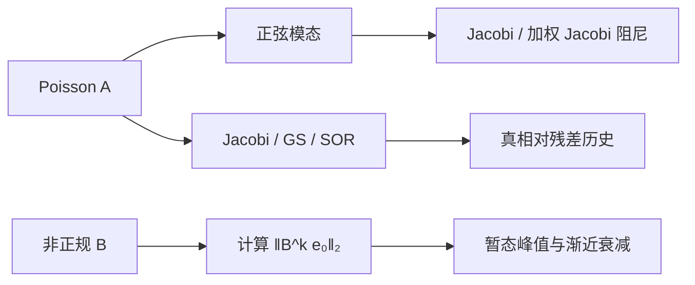

# 实验 - 定常迭代的频率阻尼、谱半径与暂态

> [!question] 本实验的判别问题
> 单步频率阻尼、渐近谱半径与非正规有限步放大分别回答什么问题，为什么三者不能互相替代？

## 研究问题与预注册假设

1. 一维 Poisson 的正弦误差模态是否按理论因子被 Jacobi 阻尼？
2. Jacobi、GS 与 SOR 达到同一真残差的速度是否显著不同？
3. $\rho(B)<1$ 是否仍允许有限步误差先增大？

> [!hypothesis] 假设
> 高频模态比低频模态更容易被合适的 Jacobi 平滑；近最优 SOR 的渐近速度最快；非正规上三角迭代出现暂态峰值。

## 实验对象

面板 A、B 使用 $n=31$ 的一维 Dirichlet Poisson 三对角矩阵

$$
A=\operatorname{tridiag}(-1,2,-1).
$$

面板 C 使用

$$
B=\begin{bmatrix}0.82&4\\0&0.68\end{bmatrix},
\qquad \rho(B)=0.82.
$$

- 代码：[plot_stationary_spectral_radius.py](</Users/tong/Nodes/basic/00-知识库管理/_labs/code/plot_stationary_spectral_radius.py>)；
- 图形：[plot-stationary-spectral-radius-v2.svg](</Users/tong/Nodes/basic/00-知识库管理/_assets/plots/stationary-iterations/plot-stationary-spectral-radius-v2.svg>)；
- 图形 SHA-256：`d36f603e6b5beb91de1b151cc53959556012de0a8ff6f597e71b864a19ac3663`；
- Python：系统 `python3`，仅标准库；
- 数据：无下载、无随机数。

## 方法



面板 A 直接计算每个离散正弦模态一次更新后的范数比。面板 B 从零初值求 $Ax=b$，每轮都用原方程计算相对残差。采用

$$
\omega_{\mathrm{opt}}=
\frac{2}{1+\sin(\pi/(n+1))}\approx1.821465
$$

作为该模型问题的 SOR 参考值，同时加入 $\omega=1.95$ 展示过度激进的振荡。面板 C 直接推进误差而非解。

## 结果

**一个迭代能最终收敛，是否足以说明它能快速平滑误差且中途不会放大？**

![[00-知识库管理/_assets/plots/stationary-iterations/plot-stationary-spectral-radius-v2.svg|880]]

> [!figure] 实验图｜频率选择、渐近收敛与非正规暂态
> A 逐模态测量 Jacobi/加权 Jacobi 的单步阻尼；B 在同一一维 Poisson 方程上比较 Jacobi、GS 与两种 SOR 的真残差；C 对 $\rho(B)=0.82$ 的非正规迭代矩阵比较 $\|B^ke_0\|_2$ 与朴素 $\rho(B)^k$ 参照。生成脚本：[[plot_stationary_spectral_radius.py]]；无随机数，并对解析模态因子、分裂恒等式和暂态峰值设断言。

**怎样读图。** A 沿频率轴比较低频与高频的一步衰减，理解“平滑器”而非“万能快速求解器”；B 先看前期振荡，再读进入渐近区后的斜率；C 检查误差是否先超过初值，再与最终衰减并列理解，从而区分 $\rho(B)<1$ 的渐近判据和有限步范数控制。

**适用边界（图没有证明什么）。** 模态与 SOR 公式针对一维规则 Poisson 问题，墙钟、排序、并行与网格不规则性均未建模；二维非正规矩阵只是最小反例，不是实际 AI Jacobian 的完整数值域或伪谱分析。

### Poisson 收敛代表点

| 方法 | $k=30$ | $k=60$ | $k=120$ |
|---|---:|---:|---:|
| Jacobi | $5.892\times10^{-2}$ | $3.447\times10^{-2}$ | $2.417\times10^{-2}$ |
| Gauss–Seidel | $2.600\times10^{-2}$ | $1.717\times10^{-2}$ | $9.672\times10^{-3}$ |
| SOR，$\omega\approx1.8215$ | $5.233\times10^{-2}$ | $1.230\times10^{-4}$ | $8.205\times10^{-10}$ |
| SOR，$\omega=1.95$ | $5.930\times10^{-1}$ | $1.211\times10^{-1}$ | $5.050\times10^{-3}$ |

### 非正规暂态

误差范数于 $k=4$ 达到约 $6.812$，远大于初值范数；到 $k=60$ 已降至 $1.926\times10^{-4}$。同一点的 $\rho(B)^{60}=6.743\times10^{-6}$，说明谱半径没有给出有限步范数的常数因子。

## 分析

1. 面板 A 验证定常平滑器具有频率选择性；“总体慢”并不代表“对所有误差都慢”。
2. 近最优 SOR 的前几十轮可能不占优，但进入渐近阶段后明显加速；只看很短运行会误判。
3. $\omega=1.95$ 虽仍在 SPD SOR 理论区间 $(0,2)$ 内，却有更强振荡并显著慢于模型最优值。
4. 面板 C 明确分离了最终收敛与早期安全性：前者由谱半径判定，后者必须看 $\|B^k\|$ 等量。

## 失败与边界

- SOR 参数公式只针对该规则 Poisson 模型，不是一般矩阵最优公式；
- 面板 A 使用已知正弦模态，未覆盖不规则网格和非对称离散；
- 迭代次数未等同墙钟时间；GS/SOR 顺序依赖的并行代价没有计入；
- 二阶非正规例子是机制反例，不代表真实 AI Jacobian 的完整谱几何。

## 复现

```bash
python3 "00-知识库管理/_labs/code/plot_stationary_spectral_radius.py"
xmllint --noout "00-知识库管理/_assets/plots/stationary-iterations/plot-stationary-spectral-radius-v2.svg"
```

## 下一步

- [ ] 对二维 Poisson 比较红黑 GS 与自然排序；
- [ ] 把定常平滑器接入两层粗网格校正；
- [ ] 比较谱半径、数值域与随机起点下观测到的峰值。
