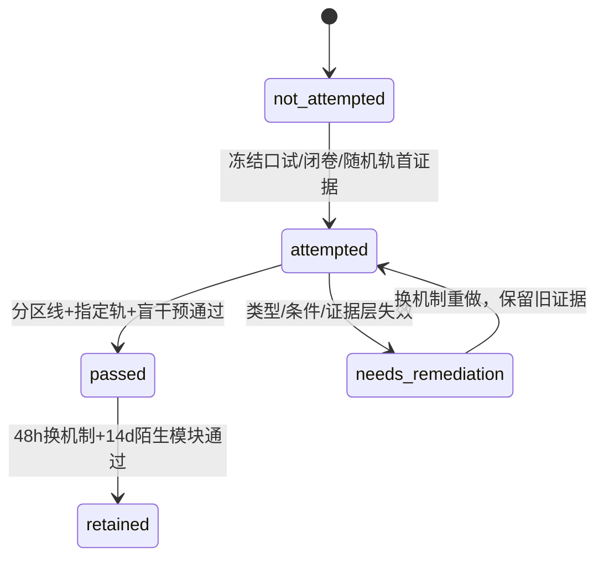

# 实验 - 微积分、矩阵微分与自动微分累计复现门

> [!abstract] 实验定位
> 这是`CALC-CUM-01`的计算复现门。三轨分别检查局部余项、显式计算图传播与隐式/谱对象。实验只验证指定program与directions；它不把finite difference当作数学证明，也不把一个framework返回值当作规范导数。

> [!warning] 材料状态不等于个人状态
> 本页与脚本通过回归，只能记`material_status: regression-passed`。没有独立手推、评分者随机轨、盲参数预测、原始输出和延迟迁移时，个人仍是`learning_status: not-attempted`。

## 零、执行顺序与四波解析校准

### 0.1 完整证据时间线


后一步不能反向替代前一步：看过canonical数字后补写“预测”，或用脚本内部公式充当手推reference，均不计入独立证据。

### 0.2 进入实验前的四波解析校准门

关闭代码、图和结果表，先按`CALC-CUM-01`四个贯穿模型写出最小reference：

| 波次 | 必须手算的reference | 必须区分的边界 |
|---|---|---|
| CALC-01—04 | $\phi'(0)=1/2$、$\phi''(0)=1/4$；当前$f(hv)$的一阶/二阶余项leading order | finite direction不是Fréchet证明；Taylor阶数不是浮点精度保证 |
| CALC-05—08 | $Jp$与$J^Tq$的shape、pairing；$\nabla^2L\,p$的product rule | pairing相容不证明primal正确；HVP不是完整Hessian |
| CALC-09—12 | $A_0x'=b'-A'x_0$、adjoint solve、$d\log\det A=\operatorname{tr}(A^{-1}dA)$ | invertibility、condition与residual分工；共享分支必须累加 |
| CALC-13—16 | simple-gap向量导数$1/g$、重谱projector边界、换元determinant | local/global、basis/subspace、数学函数/程序/AD rule |

校准记录必须写“算子类型—假设—预测—不能推出”，而不只是四个数。任何一波无法口述时，先返回对应正文，不运行本页代码。

### 0.3 评分者随机指定与防挑题协议

1. 学习者先建立`attempt_id`，评分者另给未提前公开的`NONCE`；
2. 轨道由下式唯一决定：

```bash
python3 -c 'import hashlib; s="CALC-CUM-01-YYYYMMDD-A|NONCE"; print("ABC"[int(hashlib.sha256(s.encode()).hexdigest()[:8],16)%3])'
```

3. 记录完整输入串、SHA-256前8位和所得轨道；不得因结果不熟而更换nonce；
4. 指定轨必须完成全部手推、预测、干预与解释；另两轨各写一条“当前证据能推出/不能推出”；
5. scorer不得以本脚本输出为评分答案，解析reference必须来自独立推导或独立审计。

> [!danger] 防止循环认证
> 脚本生成图，独立累计审计验证脚本、解析恒等式和文档合同；学习者再在未知参数上重建。三层证据不能引用同一个输出作为最终根据。

## 一、预注册轨道

### A. 局部线性化与有限差分

沿$v=(1,0.7)$考察
$$
f(x,y)=e^{xy}+\tfrac12x^2+y^3
$$
在原点的linear与quadratic Taylor models。预期
$$
|f(hv)-P_1(hv)|=O(h^2),\qquad
|f(hv)-P_2(hv)|=O(h^3).
$$
另用centered finite difference估计$e^x$在0的导数，预期误差先由truncation下降，随后因floating cancellation上升。

### B. JVP/VJP与HVP

对
$$
F(x)=\big(x_1x_2,\sin(x_1x_2),x_1^2+\sin(x_1x_2)\big)
$$
随机生成100组$x,p,q$，检查
$$
\langle Jp,q\rangle=\langle p,J^Tq\rangle.
$$
再对$L=\tfrac12F_3^2$比较analytic HVP与centered gradient difference。附带记录长度1024 chain的full tape与平方根checkpoint量级。

### C. Implicit与spectral derivative

对原卷第7题的$A(\theta)x(\theta)=b(\theta)$，用centered difference逼近$x'(0)=(-7/9,8/9)^T$。另对
$$
H_g(t)=\begin{bmatrix}1+g&t\\t&1\end{bmatrix}
$$
记录$t=0$时top eigenvector derivative norm；理论值为$1/g$。

> [!hypothesis]
> Implicit difference在roundoff出现前呈二阶收敛；gap趋零时individual eigenvector derivative发散，因此重根处必须改报projector/subspace。

## 二、对象与边界

| 轨道 | 直接证据 | 支持 | 不能推出 |
|---|---|---|---|
| A | log-log remainder、finite-difference sweep | 当前direction的Taylor阶数与差分误差地板 | 所有directions可微；最小$h$最准确 |
| B | adjoint pairing、HVP reference、memory量级 | local JVP/VJP实现相容；HVP无需Hessian | custom rule对所有shape/dtype/control flow正确；checkpoint没有随机语义问题 |
| C | implicit difference、$1/g$曲线 | solve derivative正确；gap控制vector sensitivity | local IFT保证global branch；重根columns可规范比较 |

## 三、关键公式

原点处$\nabla f=0$且
$$
\nabla^2f(0)=\begin{bmatrix}1&1\\1&0\end{bmatrix}.
$$
沿$v=(1,0.7)$，quadratic coefficient为$0.7+0.5=1.2$，而leading cubic remainder为$0.7^3h^3$。

centered difference满足理想truncation $O(h^2)$，floating model还含$O(u/h)$，所以存在中间最优step。

JVP/VJP pairing来自adjoint定义，不依赖物化Jacobian。HVP reference使用
$$
\nabla^2L,p=\nabla w(\nabla w^Tp)+w\nabla^2w,p.
$$

Implicit derivative由
$$
A x'=b'-A'x
$$
得到。simple Hermitian eigenvector derivative含
$$
\dot u=\sum_{j\ne i}u_j\frac{u_j^*\dot H u_i}{\lambda_i-\lambda_j},
$$
故本例norm为$1/g$。

## 四、代码、图形与环境

- 代码：[plot_calculus_ad_cumulative_gate.py](</Users/tong/Nodes/basic/00-知识库管理/_labs/code/plot_calculus_ad_cumulative_gate.py>)；
- 图形：[plot-calculus-ad-cumulative-gate-v2.svg](</Users/tong/Nodes/basic/00-知识库管理/_assets/figures/calculus-ad/plot-calculus-ad-cumulative-gate-v2.svg>)；
- full-run SVG SHA-256：`434dd29d2cc35e189010100365114f58f328682e5d793243da631be848ad6975`；
- Python 3.9.6，仅使用标准库；master seed `20260820`；
- SVG无时间戳，full run应确定性复现。

## 五、结果

先看图判断：局部余项、伴随恒等式和隐式/谱导数各自需要什么验证量？哪一种曲线收敛也仍不能替代解析导数？

![[00-知识库管理/_assets/figures/calculus-ad/plot-calculus-ad-cumulative-gate-v2.svg|880]]

> [!figure] 实验图｜局部模型、AD 传播与隐式/谱导数的计算门
> A 比较一阶、二阶 Taylor 余项并展示有限差分的舍入地板；B 核对 JVP/VJP pairing、matrix-free HVP 与 checkpoint memory；C 比较隐式导数有限差分并展示 eigenvector derivative 的 $1/\mathrm{gap}$ 放大。生成脚本：[[plot_calculus_ad_cumulative_gate.py]]；固定种子，并对伴随恒等式、局部收敛和 gap 敏感性设断言。

**怎样读图。** A 要同时读下降斜率与极小 $h$ 处误差回升；B 的 pairing residual 是算子伴随合同，HVP 误差是另一条验证链；C 左侧确认 solve derivative 的数值逼近，右侧则把 gap 缩小与方向导数增大一一对应。

**适用边界（图没有证明什么）。** 所有对象都是低维光滑程序；有限差分只作数值审计，checkpoint 曲线是内存代理，简单特征值公式在重根处失效。图不证明任意 AD 框架、隐式层或谱层都稳定正确。

> [!question] 本实验的判别问题
> 为什么“程序给出梯度”“有限差分吻合”和“导数对参数连续”是三个不同命题，谱间隙又在哪一步进入可微性与数值稳定性的合同？

### 5.1 Taylor与finite difference

| $h$ | linear error | quadratic error |
|---:|---:|---:|
| $10^{-1}$ | $1.2368\times10^{-2}$ | $3.6756\times10^{-4}$ |
| $10^{-2}$ | $1.2035\times10^{-4}$ | $3.4545\times10^{-7}$ |
| $10^{-3}$ | $1.2003\times10^{-6}$ | $3.4325\times10^{-10}$ |
| $10^{-4}$ | $1.2000\times10^{-8}$ | $3.4328\times10^{-13}$ |

斜率分别对应约2与3。centered $e'(0)$在本环境中最佳测试step约$10^{-5}$、error约$1.21\times10^{-11}$；到$h=10^{-15}$误差反升至0.0547。

### 5.2 AD传播

100次随机adjoint pairing的maximum residual为$4.44\times10^{-16}$。HVP centered check从$h=10^{-1}$的$3.60\times10^{-2}$降至$h=10^{-5}$的$3.97\times10^{-10}$。长度1024的chain若全存约需1024个state；简单平方根checkpoint量级约64个live states，但以recomputation换取。

### 5.3 Implicit与spectral

| $h$ | implicit derivative error |
|---:|---:|
| $10^{-1}$ | $3.8821\times10^{-3}$ |
| $10^{-2}$ | $3.8650\times10^{-5}$ |
| $10^{-3}$ | $3.8648\times10^{-7}$ |
| $10^{-4}$ | $3.8654\times10^{-9}$ |

| gap | $\|\dot u\|$ |
|---:|---:|
| 1 | 1 |
| 0.3 | 3.333 |
| 0.1 | 10 |
| 0.03 | 33.333 |
| 0.01 | 100 |
| 0.003 | 333.333 |

同时核对$\frac d{d\theta}\log\det A(0)=2/3$以及$T=\operatorname{diag}(2,3)$的change-of-variables factor为6。

## 六、复现命令

```bash
python3 "00-知识库管理/_labs/code/plot_calculus_ad_cumulative_gate.py"
xmllint --noout "00-知识库管理/_assets/figures/calculus-ad/plot-calculus-ad-cumulative-gate-v2.svg"
shasum -a 256 "00-知识库管理/_assets/figures/calculus-ad/plot-calculus-ad-cumulative-gate-v2.svg"
```

干预时另写output，不覆盖canonical图。

## 七、评分者随机指定的盲手工复核

指定后先在纸上完成该轨全部reference与预测，再运行代码。若结果冲突，保留原预测和首次stdout，在新段落解释首个错误来自数学推导、program semantics、浮点效应还是记录失误；不得覆盖冲突。

### A轨道

- 手推两个Taylor leading orders；
- 修改direction前预测cubic coefficient；
- 比较forward/centered difference并预注册best-step方向；
- 解释为何单direction test不是Fréchet证明。

### B轨道

- 手算一组$\langle Jp,q\rangle=\langle p,J^Tq\rangle$；
- 用forward-over-reverse重建HVP；
- 改chain length前预测full tape与checkpoint量级；
- 加入shared branch，核对reverse contributions必须相加。

### C轨道

- 从solve方程手推$x'(0)$；
- 用adjoint计算scalar loss derivative；
- gap减半前预测$\|\dot u\|$；
- 把simple eigenvalue改成cluster并改用projector metric。

## 八、盲参数干预门

下面三组参数只用于确认CLI确实能改变机制；正式作答时由评分者在合法区间内另选未公开值。每次必须使用新output，不覆盖canonical SVG。

### A轨：方向、Taylor尾阶与差分地板

```bash
python3 "00-知识库管理/_labs/code/plot_calculus_ad_cumulative_gate.py" \
  --direction-y 0.4 \
  --min-local-step 5e-5 \
  --max-fd-exponent 16 \
  --output "/tmp/calc-cum-a.svg"
```

运行前应写：沿$v=(1,b)$，linear-model error的leading coefficient为$b+1/2$，quadratic-model error的leading coefficient为$b^3$；因此$b=0.4$时分别为$0.9$与$0.064$。把差分扫描延伸到$10^{-16}$只会更明显地暴露roundoff，不应预言单调变好。

### B轨：伴随抽查、HVP方向与checkpoint调度

```bash
python3 "00-知识库管理/_labs/code/plot_calculus_ad_cumulative_gate.py" \
  --pairing-trials 160 \
  --hvp-direction-y -0.5 \
  --chain-length 2304 \
  --min-hvp-step 3e-6 \
  --output "/tmp/calc-cum-b.svg"
```

运行前应写：改变$p$会改变HVP向量与差分曲线，但不改变$langle Jp,q\rangle=\langle p,J^Tq\rangle$的exact合同；当前代理调度给$2\lceil\sqrt{2304}\rceil=96$个live states，而不是2304。更多随机pairing只能扩大测试域，不能证明所有shape/dtype/control flow。

### C轨：右端program、implicit reference与spectral gap

```bash
python3 "00-知识库管理/_labs/code/plot_calculus_ad_cumulative_gate.py" \
  --implicit-rhs-slope 0.5 \
  --min-implicit-step 1e-5 \
  --min-gap 0.001 \
  --output "/tmp/calc-cum-c.svg"
```

运行前应从$A_0x'=b'-A'x_0$算出
$$
x'(0)=\begin{bmatrix}-11/18\\5/9\end{bmatrix},
$$
并预测最小gap处$\|\dot u\|=1000$。右端依赖改变的是implicit program及其导数，不改变当前$A(\theta)$的log-det derivative $2/3$。

### 正式回归用组合干预

```bash
python3 "00-知识库管理/_labs/code/plot_calculus_ad_cumulative_gate.py" \
  --direction-y 0.4 --min-local-step 5e-5 --max-fd-exponent 16 \
  --pairing-trials 160 --hvp-direction-y -0.5 --chain-length 2304 --min-hvp-step 3e-6 \
  --implicit-rhs-slope 0.5 --min-implicit-step 1e-5 --min-gap 0.001 \
  --output "/tmp/calc-cum-intervention.svg"
```

仓库审计只把该组合当作“参数接口不是摆设”的回归证据；正式个人盲测必须换一组未公开参数。

## 九、证据状态机与延迟迁移



### 48小时换机制

评分者改变direction/metric、shared branch或rhs dependence、spectral cluster或program decomposition中的至少一项。学习者关闭本页和代码，重建最早失效条件、两个定量预测、一个pairing/residual证书及一个不能推出的AI结论。

### 14天迁移

对一个未见normalizing flow、implicit layer、spectral layer或custom JVP/VJP写一页报告：primal/type、derivative operator、regularity/condition、程序语义、验证层和失败停止线。只运行同一脚本换seed不算迁移。

## 十、通过记录

| 项目 | 记录 |
|---|---|
| attempt_id / scorer / nonce |  |
| 随机轨道 |  |
| 日期/平台/命令 |  |
| canonical stdout / SVG hash |  |
| intervention stdout / 新SVG hash |  |
| 手工复核1/2 |  |
| 参数干预前预测 |  |
| Taylor/adjoint/implicit证据 |  |
| 数学函数/程序/AD rule/浮点边界 |  |
| 48小时/14天复测 |  |
| 结论 | `passed / needs-remediation / not-attempted` |

当前状态：`not-attempted`。

## 十一、与CALC-01—16的回链

| 实验失败点 | 首要回链 | 不能直接判定 |
|---|---|---|
| Taylor slope或finite difference异常 | [[Taylor 展开与余项]]、[[全微分与 Fréchet 导数]] | 不能仅据一条方向曲线否定/证明全可微 |
| pairing或HVP异常 | [[Jacobian、JVP 与 VJP]]、[[Hessian、二阶微分与曲率]]、[[多元链式法则与计算图]] | 不能只因pairing通过就认定primal与custom rule均正确 |
| implicit/log-det异常 | [[矩阵微分、迹技巧与布局约定]]、[[逆矩阵、线性求解与隐式微分]]、[[行列式、log-det 与迹的导数]] | 不能把小residual直接换成小derivative error |
| gap、basis或换元异常 | [[特征值、特征向量与 SVD 的导数]]、[[逆函数定理与隐函数定理]]、[[多重积分、换元公式与积分变换]] | 不能由local nonsingularity推出global injectivity |
| checkpoint/control-flow异常 | [[自动微分：前向、反向与高阶模式]] | 不能把调度量级当任意stateful程序的语义证明 |

## 十二、状态边界

本页的canonical图、公开组合干预和独立审计通过后，材料可记`regression-passed`；个人没有`attempt_id + scorer nonce + 原始预测 + 新output + 延迟证据`时仍为`not-attempted`。卷级`retained`也只提供逐节点审查候选，不自动修改CALC-01—16正文的`draft`状态。
