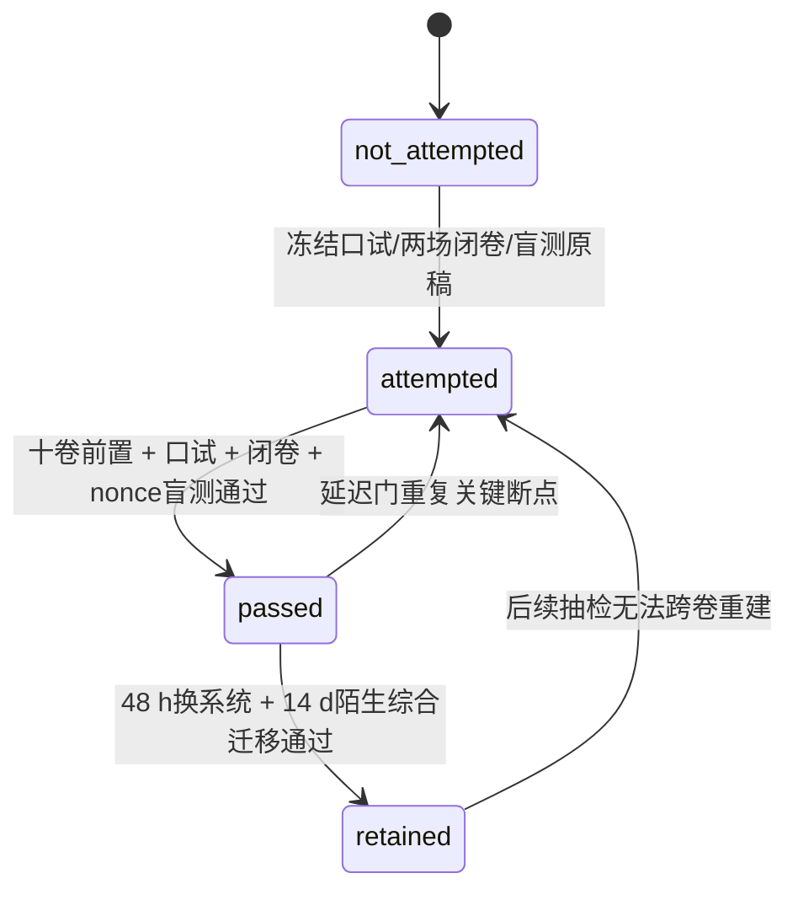

# 实验 - 数学基础十卷跨章累计复现门

> [!abstract] 目的
> 这不是把三个数值例子当作十卷理论的“证明”。A 轨检查 linear map、Gaussian conditioning 与 information 是否共用一致的概率对象；B 轨检查 optimization、continuous dynamics 与 finite-step stability 是否分层；C 轨检查 manifold geometry、finite Gram matrix、kernel approximation 与 numerical conditioning 是否分层。评分者随机指定一轨深入复现，但学习者必须运行整张图并解释另外两轨的证据边界。

先看图回答：信息、优化动力学和几何核方法三轨中，哪些量属于解析对象，哪些属于有限离散化，哪些只是浮点输出？

![[00-知识库管理/_assets/plots/math-foundations/plot-math-foundations-capstone-gate-v2.svg|880]]

> [!figure] 实验图｜信息、优化动力与几何核方法的跨卷证据账本
> A：observation noise 增大时 mutual information 下降，而 posterior covariance 增大。B：同一连续稳定 quadratic flow 经 Euler/GD 离散后，只有步长落在 stability interval 内才收敛。C：圆周 RBF kernel regression 随采样加密而误差下降，但线性系统 condition 上升。生成脚本：[[plot_math_foundations_capstone_gate.py]]；解析/确定性构造，并对信息单调性、离散稳定阈值、旋转不变性和 retraction 阶设断言。

**怎样读图。** A 把噪声、信息与 posterior uncertainty 联读；B 用 $eta=0.20$ 与 $0.24$ 跨过 $2/9$ 的对照区分连续稳定与离散稳定；C 同时读取 RMSE、condition、rotation defect 与 retraction error，不用其中一个量替代另外三个。

**适用边界（图没有证明什么）。** 三轨都是精选的低维解析或有限网格例子；它们验证跨章概念能否在同一账本中保持对象一致，不证明一般信息估计、深度优化收敛或无限维 kernel/operator 定理。

> [!question] 本实验的判别问题
> 面对一个 AI 理论结论，如何依次区分定理对象、算法离散化、数值实现与统计外推，并为每层匹配不同证据？

## 零、执行顺序、答案隔离与 scorer nonce


### 进入实验前的解析校准门

运行任何命令前必须写出：A轨一般 $(\Sigma,c,R)$ 的signal variance、posterior covariance/determinant与MI；B轨一般 $(\mu,L)$ 的flow、Euler multipliers、stability interval、最优步长；C轨一般 $(\rho,\ell,\lambda)$ 的rotation合同、retraction对象、finite Gram/KRR system与continuum边界。没有冻结推导，stdout只能算演示。

### 评分者随机指定、跨轨盲参与防挑题协议

评分者在两场总卷原稿冻结后生成 `scorer nonce`，指定一条主手推轨，并给出至少横跨两轨、总认证建议横跨三轨的未见参数。学习者不得看本页后文固定fixture；评分者不得在看到结果后换参数。nonce、参数给出时间、两场原稿hash必须同证据保存。

### 防止循环认证

- canonical与固定fixture只服务材料回归，不替代个人盲测；
- 非默认参数没有显式`--output`时脚本拒绝运行；
- 个人artifact必须写入`artifacts/<attempt_id>/`或独立临时路径；
- 保存命令、stdout、SVG、hash与偏差解释后，才可打开[[数学基础十卷总验收解答 - 跨卷理论与 AI 迁移]]；
- 材料hash相同只说明字节一致，不说明十卷知识已经掌握。

## 一、三轨的共同证据规则

三轨参数化系统族为：

$$
\text{A: }\Sigma=\operatorname{diag}(s_1,s_2),\quad Z=c^TX+\varepsilon,
$$

$$
\text{B: }H=\operatorname{diag}(\mu,L),\quad e_{k+1}=(I-\eta H)e_k,
$$

$$
\text{C: }S^1_\rho,\quad k_{\ell}(\theta,\phi),\quad (K+\lambda I)\alpha=y.
$$

默认数值只定义canonical anchor；盲参改变的是共同对象与证明义务，而不是单纯给原图换颜色。

每轨都必须按同一顺序回答：

1. **对象**：exact mathematical object、finite discretization 和 floating output 分别是什么？
2. **手推**：不看代码重建至少两个关键量；
3. **预测**：运行参数干预前写出方向和机制；
4. **运行**：保存命令、环境、stdout、SVG 与 hash；
5. **解释**：指出结果支持什么、不支持什么；
6. **反例**：构造一个“曲线看似更好但理论声明更差”的情形。

仅运行脚本或得到相同 hash 不算通过；hash 只证明 artifact bytes 一致，不证明数学解释正确。

## 二、A 轨：linear Gaussian → posterior → information

### 2.1 精确模型

$$
X\sim\mathcal N\!\left(0,
\begin{bmatrix}4&0\\0&1\end{bmatrix}\right),
\qquad Z=(1,1)X+\varepsilon,
\qquad \varepsilon\sim\mathcal N(0,R).
$$

定义 $\Sigma=\operatorname{diag}(4,1)$、$c=(1,1)^T$。则

$$
S_R=c^T\Sigma c+R=5+R,
$$

$$
\mathbb E[X\mid Z=z]=\Sigma cS_R^{-1}z,
\qquad
\Sigma_{X\mid Z}=\Sigma-\Sigma cS_R^{-1}c^T\Sigma,
$$

$$
I(X;Z)=\frac12\log\left(1+\frac5R\right).
$$

脚本扫描 $R\in\{0.1,0.3,1,3,10\}$，不使用 Monte Carlo estimator。因此图中的曲线是解析模型的浮点评估，不含抽样误差。

### 2.2 必须手检

当 $R=1$：

$$
\Sigma c=\begin{bmatrix}4\\1\end{bmatrix},
\qquad
\mathbb E[X\mid Z=z]=\begin{bmatrix}2/3\\1/6\end{bmatrix}z,
$$

$$
\Sigma_{X\mid Z}=
\begin{bmatrix}4/3&-2/3\\-2/3&5/6\end{bmatrix},
\quad
\operatorname{tr}=\frac{13}{6},
\quad
\det=\frac23,
$$

$$
I(X;Z)=\frac12\log6\approx0.8958797346\ \text{nat}.
$$

至少复核 trace、det、MI 中任意两个，并解释 conditional covariance 的 off-diagonal 为负为何不违反 PSD。

### 2.3 预注册干预

任选一个，在改代码前写预测：

- 把 $R=1$ 改为 $R=3$：预测 MI 降到 $\tfrac12\log(8/3)$，posterior trace 升到 $23/8$；
- 把 observation direction 改为 $c=(1,0)^T$：第二坐标 posterior variance 保持 1，不能再声称两个坐标都被直接观测；
- 把 $\Sigma_{11}$ 从 4 降到 1：signal variance 与 anisotropic PCA direction 同时改变，需重算而不能只平移曲线。

### 2.4 证据边界

本轨支持指定 linear-Gaussian model 的 exact conditioning 与 information identity。它不证明：真实 representation 是 Gaussian；某个 neural MI estimator 无偏；降低 $I(X;Z)$ 必然提高泛化；压缩掉的是 nuisance 而不是 task information。

## 三、B 轨：quadratic optimization → flow → Euler stability

### 3.1 精确对象

$$
f(x)=\frac12x^THx-b^Tx,
\qquad H=\operatorname{diag}(1,9),
\qquad b=(1,9)^T.
$$

$x_*=(1,1)^T$。gradient flow error 与 GD/Euler error 分别是

$$
e(t)=e^{-Ht}e(0),
\qquad
e_{k+1}=(I-\eta H)e_k.
$$

脚本取 $e_0=(1,1)^T$，比较 $\eta=0.10,0.20,0.24$，并把 continuous flow 在 $t=0.2k$ 采样。continuous curve 与 discrete curve 位于不同 mathematical process 上；时间节点相同也不意味着状态相同。

### 3.2 必须手检

$$
0<\eta<\frac2{\lambda_{\max}}=\frac29
$$

是 Euler/GD 的精确 asymptotic stability interval。$\eta=0.2$ 时 multipliers 为 $(0.8,-0.8)$，

$$
\|e_{25}\|_2=\sqrt2\,(0.8)^{25}\approx0.0053427478.
$$

$\eta=0.24$ 时 stiff direction multiplier 为 $-1.16$，故虽连续 flow 稳定，离散轨道仍指数发散。至少重算 stability threshold 与一个 $k=25$ 数值。

### 3.3 预注册干预

- 把 $\eta=0.2$ 改为 $0.22$：仍在 stability interval 内，但 stiff multiplier 为 $-0.98$，最坏收缩比变差；
- 把 $H_{22}=99$ 而保持步长：continuous fast mode 更快衰减，Euler stability 却更苛刻；
- 使用 backward Euler：预测任意正步长在此线性负实谱上稳定，但每步需 solve，且精度与稳定性仍不是同一属性。

### 3.4 证据边界

本轨证明/验证的是 diagonal quadratic family 的 exact multiplier。它不证明相同步长适用于非凸网络、随机梯度、非正规 Jacobian 或 momentum；loss 下降也不单独证明 parameter、gradient 或 generalization error 小。

## 四、C 轨：circle geometry → kernel → finite solve

### 4.1 几何与 kernel

令 $S^1\subset\mathbb R^2$，用角度 $\theta$ 参数化。脚本使用 ambient chordal RBF：

$$
k(\theta,\phi)=\exp\!\left(-\frac{2-2\cos(\theta-\phi)}{2\ell^2}\right),
\qquad \ell=0.65.
$$

目标函数为

$$
f_*(\theta)=\cos(2\theta)+0.3\sin(3\theta),
$$

在 $n\in\{8,12,24,48\}$ 个等距训练点上解

$$
(K+\lambda I)\alpha=y,
\qquad \lambda=10^{-3},
$$

再在 360 个错开网格点上计算 RMSE。由于 $K$ circulant，其 eigenvalues 用首行的 real DFT 计算；这是一张 finite Gram matrix 的谱证书，不是对所有点集的 kernel PSD 证明。

### 4.2 几何实现门

共同旋转 $\theta\mapsto\theta+\delta$ 保持角差，因此应有

$$
k(\theta+\delta,\phi+\delta)=k(\theta,\phi).
$$

当前最大浮点 defect 为 $4.9960\times10^{-16}$。对 $p=(1,0)$、$v=(0,1)\in T_pS^1$，比较

$$
R_p(hv)=\frac{p+hv}{\|p+hv\|},
\qquad
\operatorname{Exp}_p(hv)=(\cos h,\sin h).
$$

二者点差为 $O(h^3)$；脚本的 $h=0.1$ 误差约 $3.3135\times10^{-4}$，$h=0.01$ 约 $3.3331\times10^{-7}$，与三阶缩放相符。

### 4.3 结果解释

| $n$ | test RMSE | $\lambda_{\min}(K)$ | $\kappa(K+\lambda I)$ |
|---:|---:|---:|---:|
| 8 | 0.0188038 | 0.161256 | 13.7587 |
| 12 | 0.000759098 | 0.0104630 | 292.060 |
| 24 | 0.000376840 | $7.89\times10^{-8}$ | 6694.26 |
| 48 | 0.000188487 | $-1.58\times10^{-14}$ | 13388.57 |

最后一个轻微负 eigenvalue 是 real-DFT 浮点求和量级，而不是解析 kernel 被反证。随着 $n$ 加大，当前 target 的 approximation 变好，但 near-dependent kernel sections 使 condition 变差；这正是 approximation error 与 numerical sensitivity 必须分账的例子。

### 4.4 预注册干预

- 把 $\lambda$ 从 $10^{-3}$ 提到 $10^{-2}$：预测 condition 显著下降，但 bias 可能使 RMSE 上升；
- 减小 $\ell$：kernel 更局部，Gram spectrum 和有限样本插值行为都会改变；
- 把 chord distance 换为未周期化的 $|\theta-\phi|$：在 $0/2\pi$ seam 附近破坏圆周几何；
- 对输入和 evaluation point 只旋转一方：rotation invariance test 应故意失败。

### 4.5 证据边界

本轨不证明 continuum operator-norm convergence、任意 manifold 上的正定性、population generalization 或坐标无关神经算子。有限网格 refinement 只支持当前 target、kernel、ridge、sample family 和 test grid 下的观察。

## 五、环境、确定性与 canonical 产物

脚本只依赖 Python standard library，不使用随机估计；`seed=20260820` 保留在artifact contract中，避免以后加入Monte Carlo后静默改变接口。默认参数生成canonical；任何非默认参数都必须显式给出`--output`。

- 图形：[plot-math-foundations-capstone-gate-v2.svg](</Users/tong/Nodes/basic/00-知识库管理/_assets/plots/math-foundations/plot-math-foundations-capstone-gate-v2.svg>)；
- 代码：[plot_math_foundations_capstone_gate.py](</Users/tong/Nodes/basic/00-知识库管理/_labs/code/plot_math_foundations_capstone_gate.py>)；
- canonical SHA-256：`d5e79545ee9820bcbf18e1444890e8e462bd186b1720f2d0fd262508404ac18c`；
- SVG为1200 × 480，XML well-formed，已完成实际PNG渲染。

```bash
python3 "00-知识库管理/_labs/code/plot_math_foundations_capstone_gate.py"
xmllint --noout \
  "00-知识库管理/_assets/plots/math-foundations/plot-math-foundations-capstone-gate-v2.svg"
shasum -a 256 \
  "00-知识库管理/_assets/plots/math-foundations/plot-math-foundations-capstone-gate-v2.svg"
```

canonical关键stdout：

```text
A_CONFIG variance_x=4 variance_y=1 observation_x=1 observation_y=1 signal_variance=5 reference_noise=1
A_REFERENCE noise=1 mi=0.8958797346 posterior_trace=2.166666667 posterior_det=0.6666666667
B_CONFIG lambda_min=1 lambda_max=9 stability_threshold=0.2222222222 optimal_eta=0.2 optimal_rho=0.8 flow_dt=0.2
B_LEDGER eta=0.2 multiplier=(0.8,-0.8) error_k25=0.005342747781
B_LEDGER eta=0.24 multiplier=(0.76,-1.16) error_k25=40.87424378
C_CONFIG circle_radius=1 lengthscale=0.65 ridge=0.001 target_cos_frequency=2 target_sin_frequency=3 target_sin_amplitude=0.3 rotation=0.37
C_LEDGER n=48 rmse=0.0001884871635 min_gram_eigenvalue=-1.576516695e-14 condition=13388.5707
C_ROTATION defect=4.996003611e-16
SHA256 d5e79545ee9820bcbf18e1444890e8e462bd186b1720f2d0fd262508404ac18c
```

canonical双跑要输出到两个临时路径，比较忽略`OUTPUT`行后的stdout、hash、两份文件bytes和stored artifact bytes。

## 六、评分者随机指定的盲手工复核

### A 轨必须完成

1. 对给定 $\Sigma,c,R$ 手推signal variance、posterior mean/covariance/determinant与MI；
2. 解释同一joint law如何同时支撑probability、information和condition声明；
3. 区分解析真值、浮点评估与MI estimator；
4. 给出一个“MI下降但任务信息也丢失”的合法边界。

### B 轨必须完成

1. 对给定 $(\mu,L)$ 写flow与Euler/GD multipliers；
2. 推出stability interval、$\eta_*$与$\rho_*$；
3. 预测三组步长的收缩、振荡或发散；
4. 把condition、residual、forward error和task quantity分账。

### C 轨必须完成

1. 写半径、group action、kernel、target、finite sample与KRR solve对象；
2. 证明共同旋转保持kernel，解释normalization retraction与Exp的差别；
3. 预测 $\ell,\lambda$ 或频率改变对RMSE和condition的机制；
4. 区分finite Gram certificate、kernel全量词与continuum operator theorem。

## 七、盲参数干预门

### 盲测干预怎样才算独立

合格盲测在运行前由评分者给出，至少跨两轨，总认证建议三轨全改；并且至少改变一个概率对象、一个稳定域或一个几何/离散机制。只改`--output`或`--seed`、运行后补预测、只移动纵向常数、或看过固定fixture再照录，都不算个人盲测。

脚本参数接口：

```text
--variance-x --variance-y --observation-x --observation-y --reference-noise
--lambda-min --lambda-max --eta-conservative --eta-stable --eta-unstable --flow-dt
--circle-radius --lengthscale --ridge
--target-cos-frequency --target-sin-frequency --target-sin-amplitude --rotation
--seed --output
```

### 审计使用的固定三轨盲测 fixture

下面只供独立材料回归，不得作为个人nonce替代：

```bash
python3 "00-知识库管理/_labs/code/plot_math_foundations_capstone_gate.py" \
  --variance-x 3 --variance-y 1.5 \
  --observation-x 1 --observation-y 0.5 --reference-noise 3 \
  --lambda-min 2 --lambda-max 12 \
  --eta-conservative 0.06 --eta-stable 0.14 --eta-unstable 0.18 --flow-dt 0.14 \
  --circle-radius 1.5 --lengthscale 0.8 --ridge 0.005 \
  --target-cos-frequency 1 --target-sin-frequency 4 \
  --target-sin-amplitude 0.25 --rotation 0.61 \
  --output /tmp/math-foundations-capstone-blind-regression.svg
```

独立解析锚点：A的signal variance为3.375，在$R=3$时MI/trace/det为$0.3768859012/3/2.117647059$；B的稳定阈值、最优步长和最优收缩为$1/6,1/7,5/7$，$\eta=.14/.18$的$k=25$ error为$2.788878486\times10^{-4}/40.87424377$；C在$n=48$时RMSE为$9.451668782\times10^{-4}$、condition为$2134.613179$、rotation defect为$7.21644966\times10^{-16}$。

固定盲测SHA-256：`697c860c0b94fbb7660199ffc1503b862d47ce14b04ea317d39235abc8223e53`。盲图必须直接写出实际Gaussian、谱/步长和circle/kernel参数，不能保留canonical标签。

## 八、通过标准

必须同时满足：

1. 十份分卷个人前置已经核验；
2. canonical stdout、XML、hash、双跑与stored bytes匹配；
3. 非默认参数不带`--output`时覆盖保护生效；
4. nonce主轨可脱离代码重建，未指定两轨能准确说明证据边界；
5. 跨轨盲参含事前预测、命令、environment、stdout、SVG、hash与偏差解释；
6. 能把错误路由到至少四卷，并明确第一个对象或证据断点；
7. [[数学基础十卷总验收 - 跨卷理论与 AI 迁移]]口试、两场闭卷及分区线均通过。

## 九、证据状态机



### 48 小时换系统与 14 天迁移

48小时后至少两轨换机制，并把首次失败题迁移到另一表面系统；14天后审计一个未在总卷出现的AI理论主张，实质调用至少四卷，包含数值/离散层与概率统计或几何算子层。仅换数字、只复述固定fixture或罗列十卷术语，均不通过。

```text
日期：
十份分卷 retained 证据：
attempt_id / 两场原稿 hash：
scorer nonce：
随机主轨：A / B / C
跨轨盲参数与给出时间：
运行前解析预测：
环境 / Python / 命令：
stdout：
SVG SHA-256：
观察与预测偏差：
支持的结论：
不能推出的结论：
跨卷错题回链：
48 小时换系统：
14 天陌生迁移：
评分者：
状态：not-attempted / attempted / passed / retained
```

## 十、状态边界

本页、脚本、图、题卷、详解、状态面与独立审计现为材料`regression-passed`；个人仍为`not-attempted`。脚本assertions只证明指定解析/有限对象与实现一致，不证明十份分卷已经保持，也不证明学习者能在陌生AI问题中跨卷调用。
