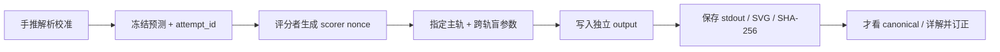
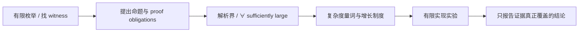
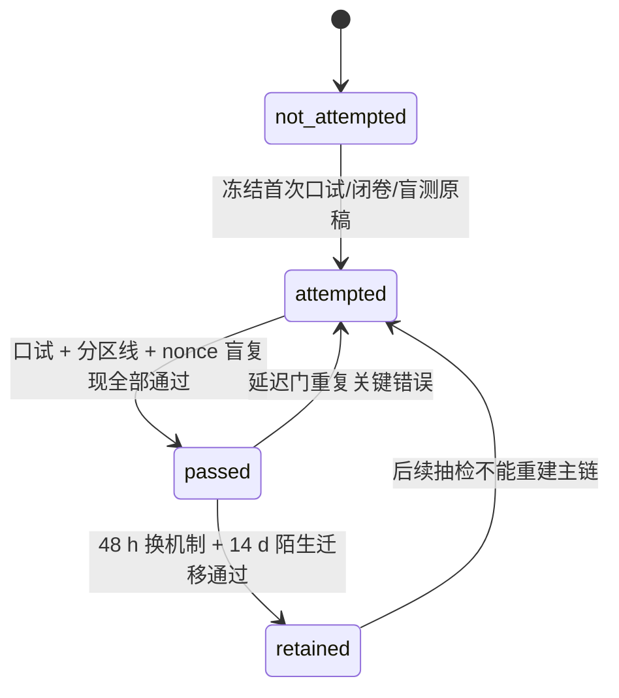

# 实验 - 数学语言、逻辑与证明累计复现门

> [!abstract] 复现目标
> 本门不把“脚本跑通”当数学证明，而检查学习者能否为三种证据分配正确角色：A轨用穷举在有限模型中计数量词换序反例；B轨先解析解递推、证明上界，再把极限量词变成accuracy step certificate；C轨用相同operation ledger展示复杂度指数怎样随$r(T)$制度改变。评分者随机指定一轨，学习者必须先手推、再运行、再解释什么不能推出。

先看图回答：有限穷举、解析递推证书与渐近复杂度分别能承担哪一类证明责任？三者为什么不能仅凭“曲线吻合”互相替代？

![[00-知识库管理/_assets/plots/math-foundations/plot-math-foundations-cumulative-gate-v2.svg|880]]

> [!figure] 实验图｜量词反模型、极限证书与 Attention 复杂度制度
> A 精确枚举全部 $4\times4$ Boolean relations 并给出 identity relation 反例；B 并列递推真值、几何 envelope 与四个 $\varepsilon$ 的证书步数；C 比较 dense work、fixed-rank 重结合、随 $T$ 增长的 rank 和 score 元素数。生成脚本：[[math_foundations_cumulative_gate.py]]；无随机数，并对递推闭式、证书和复杂度斜率设断言。

**怎样读图。** A 的计数只覆盖指定有限域，但其中一个反例已足够否定相应全称蕴含；B 要把“收敛”翻译成给定 $\varepsilon$ 后的最小 $N$；C 先固定 rank 制度再读斜率，因为 $r$ 固定与 $r=T/4$ 对应不同复杂度命题。

**适用边界（图没有证明什么）。** 有限枚举不能证明任意基数上的正命题，递推只覆盖给定线性例子，operation ledger 不是 GPU wall-time。图也不证明现实 attention 总能保持低秩或采用某种重结合就必然更快。

> [!question] 本实验的判别问题
> 一个计算结果何时是完整有限证明、何时只是定理的实例核对、何时只是复杂度模型？应怎样从量词、极限顺序与增长制度上区分？

## 零、执行顺序、答案隔离与 scorer nonce



### 进入实验前的解析校准门

在运行任何命令前，学习者必须独立写出：A 轨一般 $m$ 的 relation 总数、pointwise/uniform 计数式；B 轨一般 $(q,r,c)$ 的闭式系数、geometric envelope 和 strict certificate；C 轨一般 $r(T)=T^\gamma/a$ 的工作指数。未冻结这些预测，后续 stdout 只能算演示，不能算复现证据。

### 评分者随机指定、跨轨盲参与防挑题协议

评分者在题卷原稿冻结后生成 `scorer nonce`，用它指定 A/B/C 一条主手推轨，并给出至少横跨两轨的未见参数。学习者不得接触本页后文的固定回归 fixture；评分者也不得在运行结果出现后替换参数。nonce、参数、给出时间和原稿 hash 必须进入同一证据清单。

### 防止循环认证

- canonical 输出用于材料回归，不是学习者未知题；
- 固定盲参 fixture 用于独立审计，不可提前充当练习答案；
- 学习证据必须写入新的 `artifacts/<attempt_id>/` 或临时文件；
- 非默认参数没有显式 `--output` 时脚本会拒绝运行，避免覆盖 canonical SVG；
- 保存输出后才可打开[[阶段测验解答 - 数学语言、逻辑与证明（10.1）]]。

## 一、三轨统一合同

| 轨道 | 主要对象 | 证明/计算角色 | 主要覆盖 |
|---|---|---|---|
| A 量词反模型 | $R\subseteq X\times Y$ | 有限域完整枚举；反例否定换序 implication | MATH-01—04 |
| B 递推证书 | $e_{k+1}=0.8e_k+0.5(0.6)^k$ | 归纳核闭式；界产生epsilon witness与accuracy complexity | MATH-05—08 |
| C 复杂度制度 | $W(T,d,r)$ 与 $M(T)$ | 解析operation proxy加finite-window slope；制度干预 | MATH-08与AI迁移 |

真正的验收对象是三轨参数化模型族：

$$
\text{A: }|X|=|Y|=m,qquad
\text{B: }e_{k+1}=qe_k+cr^k, 0<r<q<1,
$$

$$
\text{C: }W_{\rm adaptive}=4Td\,r(T),\qquad r(T)=T^\gamma/a.
$$

默认值只负责建立 canonical anchor；盲测必须改变模型参数，并由学习者重推相应 theorem，而不是把默认数字代入另一张图。

三轨不是彼此独立的小实验，而是一条方法链：



## 二、轨道 A：量词换序的有限反模型

### 2.1 对象与两个命题

默认

$$
X=Y=\{0,1,2,3\},
$$

一个 Boolean relation是函数 $R:X\times Y\to\{0,1\}$，共有

$$
2^{|X||Y|}=2^{16}=65{,}536
$$

个。比较：

$$
P(R):\forall x\in X\;\exists y\in Y,\ R(x,y)=1,
$$

$$
U(R):\exists y\in Y\;\forall x\in X,\ R(x,y)=1.
$$

$U(R)\Rightarrow P(R)$，因为同一个 universal witness也可给每一行使用；反向不成立。

### 2.2 手算计数

对 $P$，每一行可以是除全零外的任一 4-bit pattern，四行独立，因此

$$
\#P=(2^4-1)^4=15^4=50{,}625.
$$

对 $U$，要求至少一列全为1。用 inclusion–exclusion：

$$
\begin{aligned}
\#U
&=\binom41 2^{12}
-\binom42 2^8
+\binom43 2^4
-\binom44 2^0\\
&=16{,}384-1{,}536+64-1\\
&=14{,}911.
\end{aligned}
$$

因为 $U\subseteq P$，量词换序的反例数为

$$
\#(P\setminus U)=50{,}625-14{,}911=35{,}714.
$$

最简单的具体 witness是 $R(x,y)\iff x=y$：每行恰有一个1，却没有全1列。

> [!warning] 有限枚举的边界
> 这里的计数是对 $|X|=|Y|=4$ 的完整有限定理；identity relation则足以否定“对所有集合和关系，$P\Rightarrow U$”这个universal claim。计数本身不描述神经网络输入空间，也不证明其他cardinality上的反例比例。

## 三、轨道 B：递推到精度复杂度

### 3.1 递推与闭式

默认

$$
e_0=1,
\qquad
e_{k+1}=0.8e_k+0.5(0.6)^k.
$$

展开线性递推：

$$
e_k=(0.8)^ke_0
+0.5\sum_{j=0}^{k-1}(0.8)^{k-1-j}(0.6)^j.
$$

利用有限几何卷积

$$
\sum_{j=0}^{k-1}q^{k-1-j}r^j=\frac{q^k-r^k}{q-r},
$$

得到

$$
e_k=3.5(0.8)^k-2.5(0.6)^k.
$$

正式验收仍要求用base $k=0$ 和 recurrence step做归纳，不得只引用脚本的浮点一致。

### 3.2 界、极限和certificate

因为 $(0.8)^k\ge(0.6)^k\ge0$，

$$
0\le e_k\le3.5(0.8)^k.
$$

要保证严格 $e_k<\varepsilon$，一个有效而不要求最小的证书是

$$
N(\varepsilon)
=\max\left\{0,
\left\lfloor
\frac{\log(3.5/\varepsilon)}{\log(1.25)}
\right\rfloor+1
\right\}.
$$

默认输出：

| $\varepsilon$ | envelope证书 $N$ | exact recurrence首次低于阈值 |
|---:|---:|---:|
| $10^{-2}$ | 27 | 27 |
| $10^{-4}$ | 47 | 47 |
| $10^{-6}$ | 68 | 68 |
| $10^{-8}$ | 89 | 89 |

本组参数下四点恰好相同是数值事实，不是一般定理。证书来自舍去负项的上界；换参数或阈值后，它可以比exact first hit保守。

固定 $0.8,0.6,0.5,e_0$ 并令 $\varepsilon\downarrow0$，

$$
N(\varepsilon)=O(\log(1/\varepsilon)).
$$

它是iteration certificate；若每步cost依赖数据规模，总work还需乘上per-step cost。

## 四、轨道 C：Attention复杂度随制度改变

### 4.1 三个工作代理与一个内存对象

默认 $d=512$，$T=32,64,\ldots,8192$：

$$
W_{\rm dense}=4Td^2+2T^2d,
$$

$$
W_{\rm fixed}=4Tdr,\qquad r=64,
$$

$$
W_{\rm adaptive}=4Td\left(\frac T4\right)=T^2d,
$$

$$
M_{\rm score}=T^2.
$$

前三个是operation proxies；最后一个是元素数，单位不同。把它们放在同一log–log panel只比较增长形状，不比较“哪个数值更昂贵”。

### 4.2 finite-window OLS slopes

| 对象 | 默认窗口 slope | 解析尾部/制度 |
|---|---:|---|
| dense work | 1.378561 | fixed $d$ 时由projection的一次向pairwise二次过渡 |
| fixed-$r$ work | 1.000000 | fixed $d,r$ 时精确线性于 $T$ |
| $r=T/4$ work | 2.000000 | rank随长度线性增长，故二次 |
| score elements | 2.000000 | dense显式score为二次元素数 |

dense slope不是理论指数1.378561；它只是给定有限窗口跨越两项交叉区后的回归摘要。真正的 fixed-$d$ 尾部是 $\Theta(T^2)$。

> [!important] AI理论接口
> “线性Attention为$O(T)$”必须附带$r,d$制度、normalization/mask、training或inference路径、arithmetic与memory对象。若为了保持精度需要$r=r(T)$，复杂度定理必须重写；经验上$r$够用也不能自动升级成uniform approximation theorem。

## 五、代码、确定性与 canonical 产物

- 代码：[math_foundations_cumulative_gate.py](</Users/tong/Nodes/basic/00-知识库管理/_labs/code/math_foundations_cumulative_gate.py>)；
- 图形：[plot-math-foundations-cumulative-gate-v2.svg](</Users/tong/Nodes/basic/00-知识库管理/_assets/plots/math-foundations/plot-math-foundations-cumulative-gate-v2.svg>)；
- canonical SVG SHA-256：`c635f3c63df194b79e53cd7ccf99f7c523b52158a66dd64df8d0896456960f25`；
- Python 标准库，无网络与随机数；A 轨全枚举，B 轨断言闭式/envelope，C 轨断言解析 slope；
- 默认参数生成 canonical；任何非默认参数都必须显式给 `--output`，否则脚本拒绝执行。

在仓库根目录运行：

```bash
python3 "00-知识库管理/_labs/code/math_foundations_cumulative_gate.py"
xmllint --noout \
  "00-知识库管理/_assets/plots/math-foundations/plot-math-foundations-cumulative-gate-v2.svg"
shasum -a 256 \
  "00-知识库管理/_assets/plots/math-foundations/plot-math-foundations-cumulative-gate-v2.svg"
```

canonical 预期输出：

```text
A_CONFIG domain_size=4
A_COUNTS total=65536 pointwise=50625 uniform=14911 swap_gap=35714
B_CONFIG contraction=0.8 forcing_rate=0.6 forcing=0.5 envelope_coefficient=3.5
B_RECURRENCE max_closed_form_error=2.220e-16 certificates=1e-02:27/27,1e-04:47/47,1e-06:68/68,1e-08:89/89
C_CONFIG dimension=512 feature_rank=64 adaptive_rank_exponent=1 adaptive_rank_divisor=4
C_COMPLEXITY dense_slope=1.378561 fixed_rank_slope=1.000000 adaptive_rank_slope=2.000000 score_slope=2.000000
OUTPUT /Users/tong/Nodes/basic/00-知识库管理/_assets/plots/math-foundations/plot-math-foundations-cumulative-gate-v2.svg
SHA256 c635f3c63df194b79e53cd7ccf99f7c523b52158a66dd64df8d0896456960f25
```

canonical 双跑必须写到两个不同的临时路径，并同时比较 stdout（忽略 `OUTPUT` 行）、hash 和文件 bytes：

```bash
python3 "00-知识库管理/_labs/code/math_foundations_cumulative_gate.py" \
  --output /tmp/math-cum-canonical-a.svg
python3 "00-知识库管理/_labs/code/math_foundations_cumulative_gate.py" \
  --output /tmp/math-cum-canonical-b.svg
cmp /tmp/math-cum-canonical-a.svg /tmp/math-cum-canonical-b.svg
cmp /tmp/math-cum-canonical-a.svg \
  "00-知识库管理/_assets/plots/math-foundations/plot-math-foundations-cumulative-gate-v2.svg"
```

## 六、评分者随机指定的盲手工复核

评分者从 A/B/C 中用 nonce 指定一条主轨；学习者不得先看代码、canonical 数字或固定盲测结果。

### A 轨必须完成

1. 写出 $P(R),U(R)$ 的完整量词；
2. 对评分者给出的 $m$ 推导 $(2^m-1)^m$ 与 inclusion–exclusion 计数；
3. 构造 identity relation 反例并逐层否定交换后的量词；
4. 解释为什么一个反例能否定 universal implication，而有限比例不能外推到真实输入空间。

### B 轨必须完成

1. 对给定 $(q,r,c)$ 展开 recurrence，并用归纳核对闭式；
2. 证明 positivity 与 $Cq^k$ envelope，写出 $C$ 的参数依赖；
3. 从严格不等式推导带 floor $+1$ 的 $N(\varepsilon)$；
4. 区分 certificate、exact first hit、floating-point 停滞与 total arithmetic。

### C 轨必须完成

1. 对四条曲线分别写单位、自由变量和固定/增长参数；
2. 手推 fixed-$r$ 与 $r(T)=T^\gamma/a$ 的指数；
3. 解释 dense finite slope 为何是窗口摘要，并求 fixed-$d$ 尾部；
4. 给出一个 finite benchmark 不能证明的复杂度或 generalization 结论。

## 七、盲参数干预门

### 盲测干预怎样才算独立

合格干预必须在运行前由评分者给出，至少横跨两轨，并改变至少一个 theorem 机制，而不只是曲线截距。建议组合：A 改 $m$；B 同时改 $q,r,c$；C 改 adaptive rank exponent $\gamma$。只改 `--output`、只改 fixed rank、运行后补预测，或看过固定 fixture 再照录，都不算个人盲测。

脚本支持：

```text
--domain-size
--contraction --forcing-rate --forcing
--dimension --feature-rank
--adaptive-rank-exponent --adaptive-rank-divisor
--output
```

### 审计使用的固定多参数盲测 fixture

下面只供材料回归与评分者核验，不得作为学习者随机 nonce 的替代：

```bash
python3 "00-知识库管理/_labs/code/math_foundations_cumulative_gate.py" \
  --domain-size 3 \
  --contraction 0.75 \
  --forcing-rate 0.5 \
  --forcing 0.4 \
  --dimension 384 \
  --feature-rank 96 \
  --adaptive-rank-exponent 0.5 \
  --adaptive-rank-divisor 2 \
  --output /tmp/math-foundations-cumulative-blind-regression.svg
```

独立手推锚点：A 为 $512/343/169/174$；B 的 envelope coefficient 为 $2.6$，四个 certificate/exact first hit 为 $20,36,52,68$；C 的 adaptive slope 为 $1.5$，dense finite-window slope 为 $1.428261$。真实输出：

```text
A_CONFIG domain_size=3
A_COUNTS total=512 pointwise=343 uniform=169 swap_gap=174
B_CONFIG contraction=0.75 forcing_rate=0.5 forcing=0.4 envelope_coefficient=2.6
B_RECURRENCE max_closed_form_error=2.220e-16 certificates=1e-02:20/20,1e-04:36/36,1e-06:52/52,1e-08:68/68
C_CONFIG dimension=384 feature_rank=96 adaptive_rank_exponent=0.5 adaptive_rank_divisor=2
C_COMPLEXITY dense_slope=1.428261 fixed_rank_slope=1.000000 adaptive_rank_slope=1.500000 score_slope=2.000000
OUTPUT /private/tmp/math-foundations-cumulative-blind-regression.svg
SHA256 132a8211dfdbcce391c94f4a2e0ba5b8b8abc318c1eefc5cd030d38ac2d7da03
```

盲图必须自描述实际 $m,q,r,c,d,r_{\rm fixed},\gamma,a$ 与输出 slope；不能保留 canonical 标签来冒充另一组制度。

## 八、通过门槛

必须同时满足：

1. canonical stdout、XML、hash、双跑与 stored bytes 匹配；
2. 非默认参数不带 `--output` 时覆盖保护生效；
3. nonce 指定轨道的核心式子可脱离代码重建；
4. 完成跨轨盲参数干预，含事前预测、命令、stdout、SVG、hash 与偏差解释；
5. 为 A/B/C 各写一条“能推出”和一条“不能推出”；
6. 能解释有限枚举、浮点验证、解析证明和渐近定理的证据层级；
7. 笔试达到[[阶段测验 - 数学语言、逻辑与证明（10.1）]]的总分与分区线。

## 九、证据状态机



### 48 小时换例与 14 天迁移

48 小时后，评分者改变至少两轨机制，学习者不得看代码和旧推导，须重写计数/闭式/证书/增长制度并完成首次错题的同构变式。14 天后选择一条陌生 AI 理论声明，用九层对象账本写出最弱命题、证明依赖、failure case、资源制度与有限证据边界。只换数字、不换机制，或只复述 Attention 第 14 题，均不通过。

```text
日期：
attempt_id：
原稿 SHA-256：
scorer nonce：
随机主轨：A / B / C
盲参数与给出时间：
运行前解析预测：
命令与独立输出路径：
stdout：
SVG SHA-256：
偏差解释：
A/B/C 能推出：
A/B/C 不能推出：
48 小时换机制：
14 天陌生迁移：
评分者：
状态：not-attempted / attempted / passed / retained
```

## 十、状态边界

本页、脚本、图、题卷、详解与独立审计现为材料 `regression-passed`；学习者状态仍是 `not-attempted`。脚本 assertions 只证明实现与声明的有限/解析对象一致，不证明学习者能独立完成；个人 `passed` 必须附冻结原稿、逐项评分、scorer nonce、主轨手推、跨轨盲参数与完整输出，`retained` 还需 48 小时和 14 天证据。
