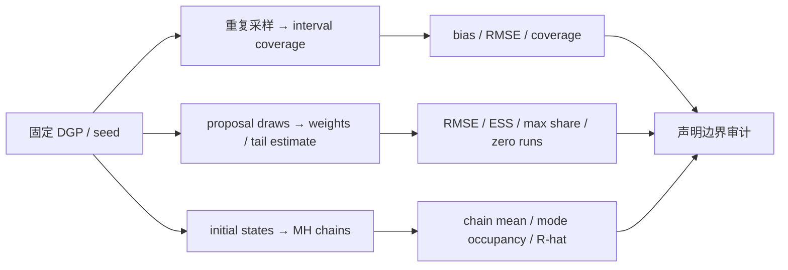

# 实验 - 概率统计累计复现门

> [!abstract] 实验定位
> 这是 `PROB-CUM-01` 的计算复现门，不是用模拟“证明”定理。先用可解析 Bernoulli–Beta 模型校准“数据—参数—计算”三层，再用三条随机轨道分别检验 repeated-sampling coverage、rare-event importance sampling 和 finite-run MCMC diagnosis；评分者随机指定一条深入复现，学习者仍需运行整张图并保留所有输出。

## 零、进入实验前的解析校准门

先运行第五波的解析—数值一致性检查：

```bash
python3 "00-知识库管理/_labs/code/plot_statistical_inference_v2.py"
```

它必须先通过精确分数断言，再报告固定种子四链结果。当前基准为：

```text
mean=0.354778  var=0.015120  tail=0.129792  accept=0.502
split_rhat=1.0003  ess≈8600  mcse≈0.001326
```

手工核对 posterior 真值 $E(Q\mid y)=5/14$、$\operatorname{Var}(Q\mid y)=3/196$ 与 $P(Q>1/2\mid y)=1093/8192$。允许不同 Python 小版本产生最后几位浮点差异，但必须同时满足脚本内 tolerance；这一关检查实现是否能回到解析真值，不能证明一般 MCMC 已收敛。

## 一、研究问题与预注册假设

### A. coverage

当

$$
X_i\stackrel{iid}{\sim}\operatorname{Bernoulli}(0.3),
$$

对 $n\in\{20,50,100,500\}$ 重复生成数据并构造 95% Wald interval：

$$
\widehat p\pm1.96
\sqrt{\frac{\widehat p(1-\widehat p)}n},
$$

经验 coverage 是否随 $n$ 增大靠近 0.95？

> [!hypothesis]
> $n=20$ 时离散性和 plug-in SE 造成可见误差；中等/大 $n$ 下 coverage 接近 0.95。该实验不主张 Wald interval 在 $p$ 靠近 0 或 1 时可靠。

### B. rare-event importance sampling

目标是

$$
\theta=P_{Z\sim N(0,1)}(Z>3)
=\frac12\operatorname{erfc}\left(\frac3{\sqrt2}\right)
\approx0.00134990.
$$

proposal 为 $q_\sigma=N(0,\sigma^2)$，比较

$$
\sigma\in\{0.7,1,2}.
$$

ordinary IS estimator 使用

$$
\widehat\theta
=\frac1N\sum_{i=1}^N
\frac{\phi(X_i)}{q_\sigma(X_i)}
\mathbf1\{X_i>3\},
\qquad X_i\sim q_\sigma.
$$

> [!hypothesis]
> $\sigma=2$ 更常进入右尾，relative RMSE 最小；$\sigma=0.7$ 虽然有完整 real-line support，却会出现大量零命中和不稳定尾部。weight ESS 能显示部分退化，但不能证明 proposal 未漏 mode。

### C. 双峰 MCMC

target 为

$$
\pi(x)=\tfrac12N(-6,1)+\tfrac12N(6,1),
$$

用 random-walk MH、proposal step $1.5$。比较：

1. 四条 chains 都从左峰启动；
2. 两条从左峰、两条从右峰启动。

> [!hypothesis]
> 同左峰 chains 会有 split-$\widehat R\approx1$，但 pooled mean 约为 $-6$，与真值 0 严重冲突；分散启动会使 $\widehat R$ 很大，暴露 chains 未跨峰。第二种 pooled mean 偶然接近 0 也不是混合成功证明。

## 二、对象—证据—不可推出结论

| 轨道 | 直接计算对象 | 可以支持 | 不能推出 |
|---|---|---|---|
| A | 多次 interval 是否覆盖固定 $p$ | 当前生成机制和重复数下的经验 coverage | 某个已观测 interval 有 95% posterior probability；所有 $p,n$ 都覆盖良好 |
| B | estimate distribution、RMSE、weight ESS、max share | 当前 proposals 对该 tail functional 的有限运行表现 | 高 ESS 证明无 support/mode 漏失；一个 seed 证明有限方差 |
| C | chain means、mode occupancy、acceptance、split-$\widehat R$ | 同起点多链可能共同困在 mode；分散链暴露冲突 | $\widehat R$ 低充分证明全局收敛；pooled mean 对就代表 stationary sampling |

## 三、代码、图形与环境

- 代码：[plot_probability_cumulative_gate.py](</Users/tong/Nodes/basic/00-知识库管理/_labs/code/plot_probability_cumulative_gate.py>)；
- 图形：[plot-probability-cumulative-gate-v2.svg](</Users/tong/Nodes/basic/00-知识库管理/_assets/figures/probability/plot-probability-cumulative-gate-v2.svg>)；
- full-run SVG SHA-256：`69ebc90f4b09cc85829b3a642840f0a0dced9d71f7f6b76a755e66b204bea896`；
- 生成环境：Python 3.9.6，仅使用标准库；
- master seed：`20260819`；
- A：每个 $n$ 重复 4,000 次；
- B：每个 proposal 重复 40 次，每次 20,000 draws；
- C：每链 warmup 1,000，保存 4,000 draws，共四链；
- SVG 不写时间戳，便于对 deterministic full run 做 hash 对照。

## 四、方法



### 4.1 coverage 的随机层

固定 $p$，每次重新抽取完整数据并重新构造 interval。coverage estimator 是 Bernoulli indicators 的平均：

$$
\widehat C_R
=\frac1R\sum_{r=1}^R
\mathbf1\{p\in C_r(X^{(r)})\}.
$$

因此它本身也有 simulation SE：

$$
\operatorname{SE}(\widehat C_R)
\approx\sqrt{\frac{C(1-C)}R}.
$$

$R=4000,C\approx0.95$ 时约为 $0.00345$；coverage 结果最后一位不应被过度解释。

### 4.2 Gaussian proposal weight

对 $X\sim N(0,\sigma^2)$：

$$
w(X)=\frac{\phi(X)}{q_\sigma(X)}
=\sigma\exp\left[
\frac{X^2}{2}\left(\frac1{\sigma^2}-1\right)
\right].
$$

weight second moment 满足

$$
E_q[w^2]=\int\frac{p(x)^2}{q_\sigma(x)}dx<\infty
$$

当且仅当

$$
1-\frac1{2\sigma^2}>0
\quad\Longleftrightarrow\quad
\sigma^2>\frac12.
$$

$0.7^2=0.49<1/2$，所以该 proposal 虽 support 正确，ordinary weight 的二阶矩仍发散。这是“support 必要但不充分”的可计算反例。

### 4.3 最小 split-$\widehat R$

脚本为保持仅标准库，报告经典 split-$\widehat R$：先把每条链分为两半，再比较 between-chain 与 within-chain variation。它足以展示“所有 chains 同困左峰”的盲区，但不替代现代 rank-normalized、folded/localized $\widehat R$ 与 bulk/tail ESS。

## 五、结果

先看图回答：coverage、importance-weight diagnostics 与多链 $\widehat R$ 的随机重复单位分别是什么？哪个指标最容易在“看起来正常”时漏掉真正的失败？

![[00-知识库管理/_assets/figures/probability/plot-probability-cumulative-gate-v2.svg|880]]

> [!figure] 实验图｜重复抽样覆盖率、稀有事件权重与多链盲区
> A 用 4,000 次 Bernoulli 重复抽样估计 Wald 95% coverage；B 比较三种 Gaussian proposal 的 relative RMSE、ESS 与零命中；C 对双峰目标比较同峰与分散初始化的 split-$\widehat R$。生成脚本：[[plot_probability_cumulative_gate.py]]；固定种子，并对大样本 coverage 区间、最佳 proposal 与初始化诊断分离设断言。

**怎样读图。** A 的纵轴是 interval procedure 的长期频率，不是某个区间的 posterior probability；B 同时读 RMSE、ESS 与 support/尾部命中，不能只看一个权重摘要；C 把 $\widehat R$ 与真均值、链所在 mode 联读，识别“所有链共同犯错”的情形。

**适用边界（图没有证明什么）。** coverage 只对应固定 $p=0.3$ 的 Wald 区间，IS 只估计一个 Gaussian tail，MCMC 只使用经典 split-$\widehat R$ 和有限双峰例子；图不替代现代 rank-normalized 诊断、一般尾部理论或跨 seed 稳健性研究。

> [!question] 本实验的判别问题
> 为什么 nominal coverage、较高 ESS 和 $\widehat R\approx1$ 都只能在各自协议内解释，不能单独充当有限样本可靠性或全局探索的充分证书？

图注：A 把 95% 声明还原为重复 interval procedure；B 同时报 relative RMSE 和 weight ESS，展示“ESS 高低”与“目标 functional 精度”不完全一致；C 用真均值 0 对照两种初始化，显示低 $\widehat R$ 的共同困峰盲区。

### 5.1 coverage

| $n$ | bias$(\widehat p)$ | RMSE$(\widehat p)$ | Wald 95% coverage |
|---:|---:|---:|---:|
| 20 | +0.001125 | 0.102671 | 0.9425 |
| 50 | +0.000285 | 0.062516 | 0.9457 |
| 100 | -0.000230 | 0.045849 | 0.9503 |
| 500 | +0.000559 | 0.020161 | 0.9535 |

RMSE 按约 $n^{-1/2}$ 下降；coverage 在本组 $p=0.3$ 上靠近 0.95。$n=500$ 的 0.9535 与名义值相差一个 simulation SE 左右，不能解释成真实 coverage 被精确证明为高于 0.95。

### 5.2 rare-event IS

真值为 $0.00134990$。

| $\sigma$ | estimate 中位数 | RMSE | relative RMSE | ESS/$N$ 中位数 | max share 中位数 | 40 次中的零尾命中 |
|---:|---:|---:|---:|---:|---:|---:|
| 0.70 | 0.00000000 | 0.00163561 | 1.2117 | 0.5349 | 0.0026 | 36 |
| 1.00 | 0.00137500 | 0.00030219 | 0.2239 | 1.0000 | 0.0001 | 0 |
| 2.00 | 0.00134855 | 0.00005279 | 0.0391 | 0.6607 | 0.0001 | 0 |

三个关键观察：

1. $\sigma=0.7$ 的 median ESS/$N$ 看上去仍有 0.53，但 90% runs 根本没进入 $x>3$，tail estimate 中位数为 0；
2. $\sigma=1$ 时 weights 全为 1、ESS/$N=1$，但 rare-event plain MC 仍有明显相对误差；
3. $\sigma=2$ 的 ESS 比 1 小，却因更常访问目标尾部而对这个特定 functional 精度最高。

所以 ESS 是诊断，不是目标无关的总成绩。

### 5.3 MCMC 多链

| 初始化 | split-$\widehat R$ | pooled mean | $x>0$ fraction | acceptance | 四条 chain means |
|---|---:|---:|---:|---:|---|
| 全部左峰 | 1.0004 | -5.9912 | 0.0000 | 0.5888 | -5.967, -5.985, -6.007, -6.005 |
| 分散两峰 | 6.6013 | +0.0206 | 0.5000 | 0.5877 | -6.001, -5.974, +6.027, +6.031 |

全部左峰时 acceptance 合理、链均值一致且 $\widehat R$ 接近 1，但没有一个 draw 进入右峰；global mean 错约 6 个单位。分散启动让 $\widehat R$ 报警；pooled mean 偶然接近 0 只是两组未混合局部链的对称抵消，仍不能当作有效 posterior sample。

## 六、复现命令

在仓库根目录运行 full gate：

```bash
python3 "00-知识库管理/_labs/code/plot_probability_cumulative_gate.py"
xmllint --noout "00-知识库管理/_assets/figures/probability/plot-probability-cumulative-gate-v2.svg"
shasum -a 256 "00-知识库管理/_assets/figures/probability/plot-probability-cumulative-gate-v2.svg"
```

`--quick` 只用于检查脚本能运行，会减少 repetitions/draws，输出与 hash 都不满足正式复现门。若要 quick run，必须另给 `--output`，不得覆盖正式图：

```bash
python3 "00-知识库管理/_labs/code/plot_probability_cumulative_gate.py" \
  --quick --output "/tmp/probability-gate-quick.svg"
```

## 七、随机指定轨道的手工复核

### A 轨道

至少完成两项：

1. 手算 $\operatorname{SE}(\bar X)=\sqrt{0.3(0.7)/n}$，与 RMSE 量级比较；
2. 手算 coverage Monte Carlo SE $\sqrt{0.95(0.05)/4000}$；
3. 修改 $p=0.05,n=20$ 前预注册“Wald coverage 将明显恶化”，再运行验证；
4. 比较 Wilson 或 exact interval，但不得在看到结果后选择最有利方法。

### B 轨道

至少完成两项：

1. 从两条 Gaussian densities 手推 $w(x)$；
2. 推导 $E_q[w^2]$ 有限当且仅当 $\sigma^2>1/2$；
3. 把 threshold 从 3 改到 4，运行前预测 $\sigma=1$ 的 relative error 会显著增大；
4. 增加 $\sigma=3$，预测“尾命中更多但 overall weight ESS 进一步变化”，并解释 functional-specific tradeoff。

### C 轨道

至少完成两项：

1. 用四条 chain means 和 within variance 手算经典 $\widehat R$ 的量级；
2. 核对 target 由对称性具有真 mean 0；
3. 把 mode separation 或 proposal step 改变前，预测跨峰概率和诊断方向；
4. 实现 tempered proposal/independence jump 后，不只看 pooled mean，还检查每链 mode occupancy 和 MCSE。

## 八、通过记录

| 项目 | 记录 |
|---|---|
| 随机指定轨道 |  |
| 解析校准 mean/variance/tail |  |
| 解析校准 $\widehat R$/ESS/MCSE |  |
| 日期与用时 |  |
| Python/平台 |  |
| 命令 |  |
| seed / repetitions / draws |  |
| 新 SVG SHA-256 |  |
| 与基准 hash 差异解释 |  |
| 手工复核 1 |  |
| 手工复核 2 |  |
| 参数干预前预测 |  |
| 运行结果与偏差解释 |  |
| theorem / approximation / experiment 边界 |  |
| 结论 | `passed / needs-remediation / not-attempted` |

当前默认状态：`not-attempted`。

## 九、限制与后续升级

- Bernoulli 轨道只检查一个 interior probability；需要加入 near-boundary、Wilson/exact/bootstrap 和 clustered samples；
- IS 轨道是一维解析 target；高维 geometry、多模态和 self-normalized bias 需后续实验；
- MCMC 轨道用经典 split-$\widehat R$ 展示最小反例，正式 Bayesian workflow 应实现 rank-normalized $\widehat R$、bulk/tail ESS、MCSE、energy/divergence、SBC 和 function-space summaries；
- 同一 deterministic seed 便于复现机制，不足以估计跨环境、跨 seed 的完整 failure probability。
