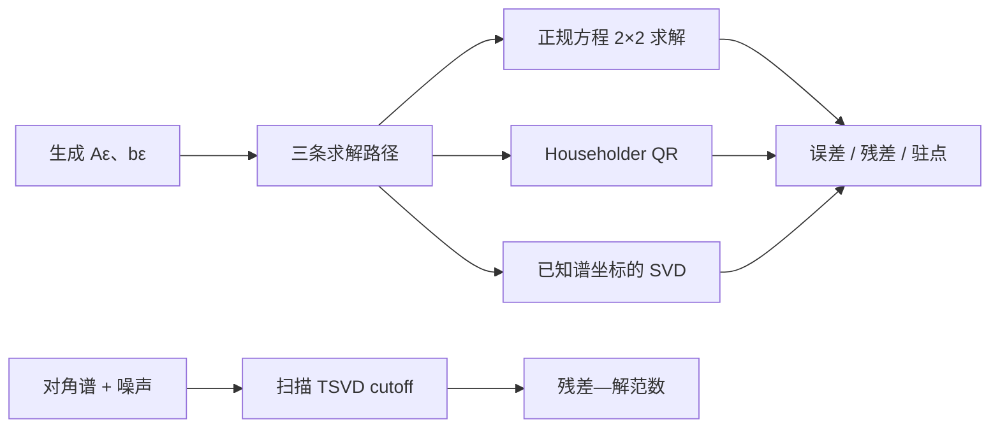

# 实验 - 正规方程、QR 与截断 SVD 的稳定性

> [!question] 本实验的判别问题
> 正规方程何时丢失最小二乘弱方向，为什么小残差不能替代参数误差，截断 SVD 又怎样用偏差换取稳定性？

## 研究问题

本实验分别回答三个可检验问题：

1. 当 $A$ 的两列逐渐共线时，正规方程、Householder QR 与不形成 Gram 矩阵的 SVD 路线分别何时丢失参数弱方向？
2. 三种方法得到相近原始残差时，参数前向误差是否也必然相近？
3. 截断弱奇异值怎样改变残差与解范数？

## 预注册假设

> [!hypothesis] 假设
> 对双精度，正规方程将在 $\kappa_2(A)\approx u^{-1/2}\sim10^8$ 附近因 $1+\varepsilon^2$ 舍入为 $1$ 而丢失弱方向；Householder QR 与结构 SVD 不形成 $A^TA$，参数误差应保持在舍入地板附近。TSVD 会用更大残差换取更小解范数。

## 理论构造

### 构造 A：条件数扫描

$$
A_\varepsilon=
\begin{bmatrix}
1&1\\
\varepsilon&0\\
0&\varepsilon
\end{bmatrix},
\qquad
x_\star=\begin{bmatrix}1\\-1\end{bmatrix}.
$$

其奇异值为

$$
\sigma_1=\sqrt{2+\varepsilon^2},
\qquad
\sigma_2=\varepsilon,
$$

所以

$$
\kappa_2(A_\varepsilon)
=\frac{\sqrt{2+\varepsilon^2}}{\varepsilon}.
$$

加入与列空间精确正交的残差方向

$$
z_\varepsilon=(\varepsilon,-1,-1)^T,
\qquad
A_\varepsilon^Tz_\varepsilon=0,
$$

并令其相对尺度固定在约 $10^{-8}$，这样扫描条件数时不会把噪声比变化混入算法比较。

### 构造 B：TSVD 取舍

使用奇异谱

$$
(1,10^{-2},10^{-4},10^{-6},10^{-8})
$$

的对角矩阵，令真解各坐标均为 $1$，再向弱坐标加入固定噪声。扫描 `rcond`，记录残差与解范数。

## 变量设计

| 类型 | 变量 | 取值 | 说明 |
|---|---|---|---|
| 自变量 | $\varepsilon$ | $10^{-1},\ldots,10^{-12}$ | 控制 $\kappa_2(A)$ |
| 自变量 | 求解路径 | 正规方程、Householder QR、结构 SVD | 同一输入、同一双精度 |
| 自变量 | TSVD `rcond` | $0,10^{-9},\ldots,10^{-1}$ | 控制保留方向 |
| 因变量 | 参数相对误差 | $\|\widehat x-x_\star\|/\|x_\star\|$ | 主要前向指标 |
| 因变量 | 原始残差 | $\|A\widehat x-b\|/\|b\|$ | 拟合指标 |
| 因变量 | 驻点残差 | 归一化 $\|A^Tr\|$ | 最优性指标 |
| 因变量 | 解范数 | $\|\widehat x\|$ | 噪声放大代理 |

## 环境

- 代码：[plot_least_squares_stability.py](</Users/tong/Nodes/basic/00-知识库管理/_labs/code/plot_least_squares_stability.py>)
- Python：系统 `python3`，只使用标准库；
- 硬件：CPU，结果不依赖并行归约；
- 随机种子：无随机性；
- 图形：[[00-知识库管理/_assets/plots/least-squares/plot-least-squares-stability-v2.svg]]。
- 图形 SHA-256：`8b4f15568950bb8f5064effdcf09aab5bc0d53cea5c501ec8958c9326f348555`。

## 方法



结构 SVD 利用该矩阵族已知的左右奇异方向直接计算，目的是隔离“不形成 Gram 矩阵”的路径，不代表通用生产 SVD 实现。

## 结果

先用图回答：**三条求解路径在参数误差、原始残差和驻点残差上何时分叉，TSVD cutoff 又如何移动残差—解范数工作点？**

![[00-知识库管理/_assets/plots/least-squares/plot-least-squares-stability-v2.svg|880]]

> [!figure] 实验图｜最小二乘的三种验收量与 TSVD 取舍
> A 比较正规方程、Householder QR 与不形成 Gram 的结构 SVD 的参数误差；B 在 $\kappa_2(A)\approx1.4\times10^7$ 处分开参数误差、原始残差与驻点残差；C 扫描 TSVD cutoff。生成脚本：[[plot_least_squares_stability.py]]；确定性矩阵族，并对正规方程失效及 residual–solution-norm 取舍设断言。

**怎样读图。** A 中红线先于蓝/绿线失控，显示形成 $A^TA$ 的条件数平方效应；B 不比较单一最低点，而是横向比较同一方法的三类验收量；C 从左上向右下移动表示舍弃弱方向后残差增加、解范数与噪声放大降低。

**适用边界（图没有证明什么）。** 结构 SVD 利用已知奇异方向，只承担“不形成 Gram”的机制对照；图不代表通用 SVD 的成本或误差，也不能从一个 L-curve 形状自动选出生产系统的最优 cutoff。

### 代表性条件点

| $\kappa_2(A)$ | 正规方程参数误差 | QR 参数误差 | SVD 参数误差 | QR 相对残差 |
|---:|---:|---:|---:|---:|
| $1.42\times10^1$ | $3.3\times10^{-16}$ | $3.5\times10^{-16}$ | $2.2\times10^{-16}$ | $1.0\times10^{-8}$ |
| $1.42\times10^4$ | $1.1\times10^{-8}$ | $2.4\times10^{-16}$ | $2.2\times10^{-16}$ | $1.0\times10^{-8}$ |
| $1.42\times10^6$ | $8.9\times10^{-5}$ | $1.8\times10^{-16}$ | $2.2\times10^{-16}$ | $1.0\times10^{-8}$ |
| $1.42\times10^7$ | $8.0\times10^{-4}$ | $5.7\times10^{-16}$ | $2.2\times10^{-16}$ | $1.0\times10^{-8}$ |
| $1.42\times10^8$ | 失败/记为 $1$ | $2.2\times10^{-16}$ | $2.2\times10^{-16}$ | $1.0\times10^{-8}$ |

### TSVD 取舍

| `rcond` | 残差范数 | 解范数 |
|---:|---:|---:|
| 无截断 | $0$ | $4.48$ |
| $10^{-7}$ | $4.0\times10^{-8}$ | $2.02$ |
| $10^{-5}$ | $1.0\times10^{-6}$ | $1.73$ |
| $10^{-3}$ | $1.0\times10^{-4}$ | $1.41$ |
| $10^{-1}$ | $1.0\times10^{-2}$ | $1.00$ |

## 分析

### 1. 支持条件数平方假设

正规方程误差远早于 QR/SVD 上升，并在 $\kappa(A)$ 到 $10^8$ 量级时完全丢失弱方向。这与

$$
u\kappa(A)^2\approx1
$$

的边界一致。

### 2. 小残差无法替代参数误差

QR 与 SVD 的残差保持在固定噪声地板。正规方程在失效前也可能给出看似不大的残差，但参数误差已经大许多。弱奇异方向把参数变化压缩到预测空间中。

### 3. TSVD 不是免费稳定化

阈值越高，解范数越小，但残差单调增加。若只展示解范数会掩盖偏差；若只展示训练残差又会偏好过度拟合弱噪声方向。

## 失败与异常记录

- 当 Gram 行列式舍入为零时，正规方程函数返回失败；绘图将参数误差记为 $1$，而不是伪造一个有限解；
- 某些条件点的误差不严格单调，这是具体舍入路径的结果，未做平滑；
- 驻点残差在极小原始残差附近会受归一化分母影响，因此图中同时保留原始量和参数量；
- TSVD 对角构造在某些 cutoff 区间给出相同秩，重复点没有删除。

## 结论边界

> [!warning] 不可外推之处
> 本实验没有证明任意矩阵上 QR 一定产生机器精度参数误差，也没有比较真实 LAPACK 性能。矩阵族的奇异向量已知，结构 SVD 比通用 SVD 简单。一般结论仍需后向稳定性理论、条件数与实际库诊断。

## 复现

在仓库根目录运行：

```bash
python3 "00-知识库管理/_labs/code/plot_least_squares_stability.py"
```

脚本同时输出 CSV 风格数值摘要并重建 SVG。

## 下一步

- [ ] 在可用 LAPACK/NumPy 环境中对比 `gels/gelsy/gelsd` 的数值秩与耗时；
- [ ] 加入列尺度失衡和异方差权重；
- [ ] 在大规模阶段加入 LSQR/LSMR 的停止准则实验。
