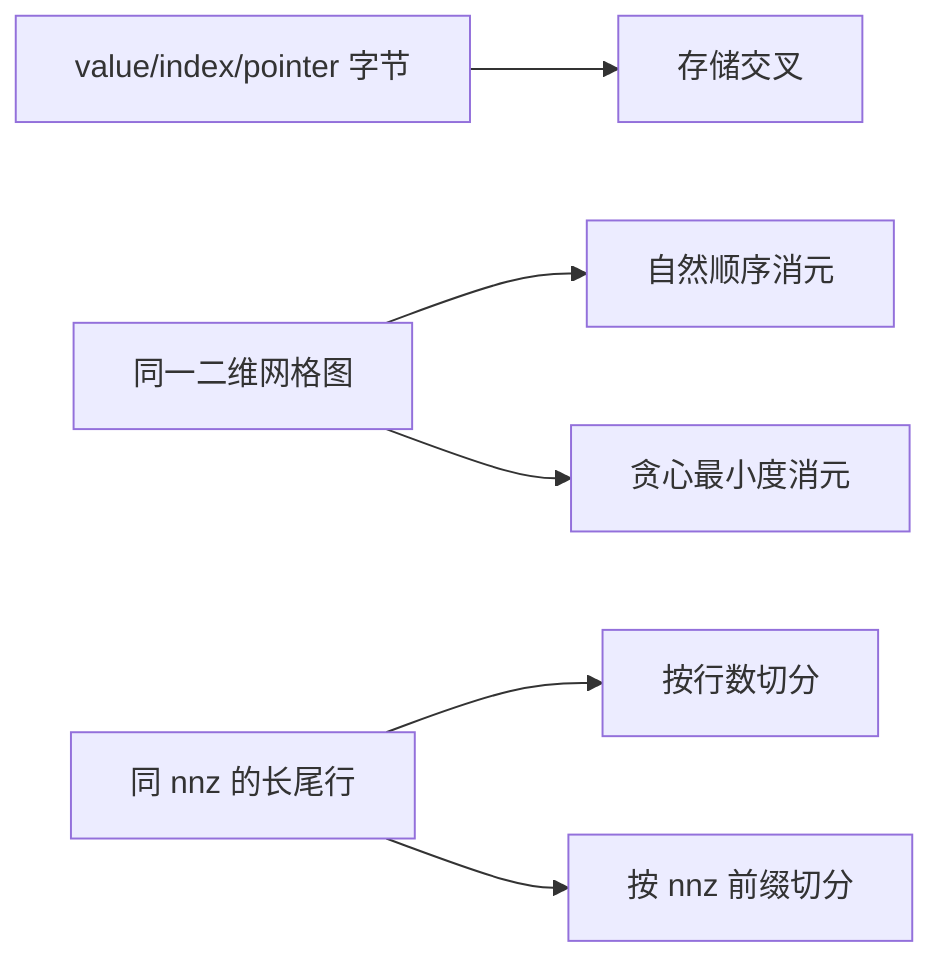

# 实验 - 稀疏存储、消元填充与并行负载

> [!question] 本实验的判别问题
> “稀疏”这一标签为何不足以决定内存、因子填充和并行时间；三类成本需要哪些独立结构信息？

## 研究问题与预注册假设

1. value 为 float64、索引为 int32 时，CSR 与稠密存储的字节交叉点在哪里？
2. 同一个二维网格 SPD 模式，natural ordering 与贪心最小度的 Cholesky 结构填充相差多少？
3. 总 \(\operatorname{nnz}\) 不变时，按行数平均分区是否可能严重失衡？

> [!hypothesis] 假设
> 大 \(n\) 时交叉密度接近 \(2/3\)；最小度减少网格因子非零；按非零前缀切分显著优于按行数切分。

## 实验对象

### 存储模型

固定 \(n=10^4\)，比较：

$$
S_{\mathrm{dense}}=8n^2,
$$

$$
S_{\mathrm{CSR}}=12\operatorname{nnz}+4(n+1),
$$

以及 COO 的 value + row + col 三数组成本。

### 填充模型

对 \(m\times m\) 二维五点网格的对称图，\(m\in\{4,8,12,16\}\)。用纯结构消元模拟：

- natural ordering；
- 每步选择当前最小度顶点的确定性 greedy ordering。

把因子结构非零数除以原三角部分非零数作为 fill ratio。

### 负载模型

构造相同总 \(\operatorname{nnz}\) 的长尾行长，分给 8 个 worker：

- 等行数连续分区；
- 按非零前缀近似平衡。

- 代码：[plot_sparse_storage_fill_parallel.py](</Users/tong/Nodes/basic/00-知识库管理/_labs/code/plot_sparse_storage_fill_parallel.py>)；
- 图形：[plot-sparse-storage-fill-parallel-v2.svg](</Users/tong/Nodes/basic/00-知识库管理/_assets/plots/sparse-computing/plot-sparse-storage-fill-parallel-v2.svg>)；
- 图形 SHA-256：`6b09147e50cfb4214b61827c808291aaa3d5a3a3fc364e9aeb6da194c0f70f2b`；
- Python：系统 `python3`，仅标准库；
- 随机性：无；模式、排序 tie-break 与负载均确定。

## 方法



消元一步把当前顶点尚存邻居补成 clique，再删除该顶点；这只模拟结构 fill，不计算数值 pivot。

负载效率定义为

$$
E_{\mathrm{load}}
=\frac{\sum_t w_t}{8\max_t w_t}.
$$

## 结果

**为什么相同密度、相同线性系统或相同总 nnz，仍可能对应完全不同的真实成本？**

![[00-知识库管理/_assets/plots/sparse-computing/plot-sparse-storage-fill-parallel-v2.svg|880]]

> [!figure] 实验图｜稀疏格式、消元图与负载的三重成本
> A 对 $n=10^4$、float64 value/int32 index 比较 dense、CSR、COO 字节；B 对同一二维网格 SPD 图比较 natural 与确定性 greedy min-degree 的 symbolic Cholesky fill；C 对同一长尾行长比较等行数和 nnz-balanced 的 8-worker 负载。生成脚本：[[plot_sparse_storage_fill_parallel.py]]；无随机数，并对存储交叉、排序降 fill 与负载修复设断言。

**怎样读图。** A 找到 CSR 与 dense 的字节交叉点并注意 COO 额外行索引；B 固定同一图，只把红绿差异归因于消元顺序；C 比较最大柱而非平均柱，因为并行时间由最慢 worker 决定。三个面板分别对应格式、图结构和任务划分。

**适用边界（图没有证明什么）。** $2/3$ 是给定 value/index 位宽下的纯字节交叉，不是速度交叉；greedy min-degree 不是工业 AMD，symbolic SPD 消元也不含 pivot/supernode；负载模型忽略缓存、通信、原子归约与网络拓扑。

### 存储交叉

在 \(n=10^4\) 时，

$$
d_{\mathrm{cross}}=0.666633.
$$

它接近渐近值 \(8/(8+4)=2/3\)。COO 还需额外 row index，所以相同 canonical 非零下字节更多。

### 填充比

| 网格边长 \(m\) | natural | greedy min-degree |
|---:|---:|---:|
| 4 | 1.675 | 1.450 |
| 8 | 2.949 | 2.040 |
| 12 | 4.262 | 2.515 |
| 16 | 5.586 | 2.961 |

随着网格增大，自然顺序填充增长更快；确定性贪心最小度在所有样本上减少因子非零。

### 负载

等行数分区的最大 worker 工作量为平均值的

$$
3.402
$$

倍，负载效率仅

$$
0.294.
$$

按 \(\operatorname{nnz}\) 前缀分区后，最大/平均为 \(1.013\)，效率为 \(0.987\)。

## 分析

1. CSR 的压缩收益必须扣除 index 与 row pointer；低精度 value 下索引占比会更高。
2. 同一线性方程只做对称置换，数值解不变，但消元邻居 clique 的形成次序改变，因子存储随之改变。
3. \(\operatorname{nnz}/m\) 只是平均行长；长尾行会决定 kernel 尾延迟。按非零数切分能修复计算负载，却未必同时最小化跨分区 \(x_j\) 通信。

## 失败与边界

- 图中 \(2/3\) 是纯存储字节交叉，不是运行时间交叉；
- greedy min-degree 只是教学实现，不等于工业 AMD 的 quotient graph 与 dense-row 处理；
- 结构消元假定 SPD Cholesky，不模拟数值不定、pivoting 或 supernode；
- 负载模型不含缓存、原子归约、网络拓扑和通信；
- BSR、SELL、DIA 与真实 GPU kernel 尚未加入。

## 复现

```bash
python3 "00-知识库管理/_labs/code/plot_sparse_storage_fill_parallel.py"
xmllint --noout "00-知识库管理/_assets/plots/sparse-computing/plot-sparse-storage-fill-parallel-v2.svg"
```

## 下一步

- [ ] 用 SuiteSparse 矩阵比较 AMD、nested dissection 与真实 fill/time；
- [ ] 加入 float16 value、int32/int64 index 的字节和带宽交叉；
- [ ] 比较 CSR、BSR、SELL 的 GPU SpMV/SpMM；
- [ ] 同时优化负载与通信割边，形成二维验收。
