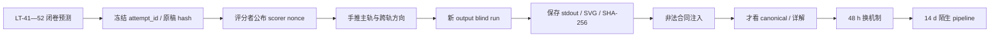

# 实验 - 经典模型与模型选择累计复现门

> [!abstract] 实验目的
> 本实验不比较“哪个经典算法最好”。它用三个小而精确的模型族检查：预测 estimand、训练 objective、算法输出、validation selection 和 deployment statement 是否始终是同一个对象。A 轨连接 ridge/KRR/GP 与选择偏差；B 轨连接 logistic/SVM/tree/bagging/boosting；C 轨连接 PCA/K-Means/EM/可辨识性与选择准则。

先看图回答：为什么 A 轨 expected risk 最小的 $\lambda$ 与某次 validation 选中的 $\lambda$ 可以不同？为什么 B 轨同一标签产生的 SVM margin、bagged probability 和 Boosting weight 不在同一坐标系？为什么 C 轨更小的 AIC/BIC 不等于“发现了真实类别”？

![[00-知识库管理/_assets/plots/learning-theory/plot-classical-models-cumulative-gate-v2.svg|920]]

> [!figure] 实验图｜三个 estimand、三个算法族、一本选择账
> A 轨以 diagonal fixed-design model 精确计算 ridge bias/variance/df，并枚举全部验证噪声；B 轨在六点分类问题上计算 separation、最大间隔、Gini split、全部 $6^6$ bootstrap 与一轮 AdaBoost；C 轨手算 covariance spectrum、K-Means distortion、对称 mixture EM 和声明清楚的 AIC/BIC arithmetic。生成脚本：[[classical_models_cumulative_gate.py]]；确定性生成，无 Monte Carlo、无第三方依赖。

**怎样读图。** 先读每轨标题下的 predictor/object，再读数值。蓝/黄 ridge bar 是 training-sample expectation；selection ledger 是另一份 validation randomness。B 轨的五行不是 leaderboard。C 轨的 score 只比较两个明确 candidate families。

**图没有证明什么。** 它不证明经典模型在真实任务中的普遍优劣，不证明 CV 对自适应搜索无偏，不证明 bootstrap members 在真实 forest 中独立，也不证明有限 mixture 的 regular asymptotics 或 semantic identifiability。

## 零、执行顺序与防循环认证



### 0.1 运行前 prediction sheet

必须先冻结：

1. A 轨四个 $\lambda$ 的 bias、variance、expected excess 与 df；
2. 哪个 singular direction 主导 OLS variance；
3. validation selection frequency 的总和、selected true/min-validation 大小关系；
4. B 轨的 support vectors、最佳 split、bagged query probability 范围、$B/\rho$ 单调性；
5. C 轨的 covariance、eigengap、K-Means centers、EM 一步方向与 likelihood方向；
6. 至少三条“数值相同/更小但不能推出”的证据边界；
7. `attempt_id`、题卷 commit、开始时间和 prediction hash。

若先运行 canonical，数值轨只能记演示，不能记 blind。

### 0.2 scorer nonce

- 第一字节模 3 指定 A/B/C 主轨；
- 第二字节指定跨至少两轨的参数组；
- 第三字节指定一个非法合同；
- 评分者不得在看到结果后重抽参数；
- canonical 和本页固定 blind fixture 只供材料审计。

## 一、六层共同合同

| 层 | A spectral | B boundary/ensemble | C latent/geometry |
|---|---|---|---|
| estimand | linear/RKHS prediction | probability、margin、partition action | subspace、center set、observed density |
| objective | squared loss + ridge | log/hinge/Gini/exponential | variance/distortion/likelihood |
| algorithm | spectral filter | convex path、greedy split、bootstrap、coordinate step | eigensolve、Lloyd、EM |
| selection | $\lambda$ validation | threshold/model/$B$/seed | rank/$K$/components/criterion |
| identity | deterministic coefficient predictor | score/class/vote/probability | projector/set/density quotient |
| evidence | exact expectation + enumeration | exact finite dataset/enumeration | exact covariance + deterministic iterations |

任何一轨都按“estimand → procedure → selection → refit → deployment”解释。只报告 objective 最小值不通过。

## 二、A 轨：谱正则化与 validation selection

### 2.1 fixed-design ridge 对象

在 $X^TX$ 的 eigenbasis 中，canonical 参数是

$$
s=(4,1,0.25),\quad \beta=(1,0.8,0.4),\quad \sigma=0.5,
$$

$$
\lambda\in(0,0.25,1,4).
$$

test covariance 取 $I$。ridge filter、bias、variance 与 df：

$$
g_j=\frac{s_j^2}{s_j^2+\lambda},
$$

$$
B^2(\lambda)=\sum_j(1-g_j)^2\beta_j^2,
\qquad
V(\lambda)=\sum_j\frac{\sigma^2s_j^2}{(s_j^2+\lambda)^2},
$$

$$
df(\lambda)=\sum_jg_j.
$$

运行前必须手算 $\lambda=0$ 和 1。OLS 第三个方向贡献 4 的 variance；$\lambda=1$ 时总 expected excess 约 0.395，df 为 1.5。

### 2.2 frozen training realization

训练 sufficient statistic 是

$$
z_j=\beta_j+\frac\sigma{s_j}e_j,\qquad e=(-1,1,-1),
$$

所以 $z=(0.875,1.3,-1.6)$。候选 prediction 在 validation 抽样前冻结：

$$
a_{\lambda,j}=g_j(\lambda)z_j.
$$

这一步把“训练算法随机性”和“验证集随机性”分开；否则无法解释 selection optimism。

### 2.3 exact validation enumeration

validation response

$$
Y_j^{val}=\beta_j+0.5\xi_j,\qquad \xi_j\overset{iid}\sim\operatorname{Unif}\{-1,1\}.
$$

脚本枚举 $2^d$ 个 sign vectors，对每个 response：

1. 计算全部 frozen candidates 的平均 squared validation loss；
2. 以 `(loss, candidate index)` tie-break；
3. 累计选择频率、该 candidate 的 fresh-response risk 和 minimum validation score；
4. 报告二者期望差。

candidate 数固定不等于 selected minimum 无偏。canonical 中 optimism 为 0.108117。

### 2.4 KRR/GP 接口

脚本没有假装拟合一个 GP posterior；它只展示 shared spectral filter。KRR 与 GP mean 对应前必须对齐：

- 同一 Gram/kernel matrix；
- empirical loss 是否除以 $n$；
- KRR regularization constant 与 GP noise variance；
- GP prior mean；
- 相同 observation set。

即使 mean 字节相同，posterior covariance、credible interval、frequentist coverage和 prior sample-path statement仍是额外对象。

### 2.5 A 轨干预预测

- 增大最小 singular value：OLS variance 应下降；
- 增大 $\sigma$：variance 和 selection noise通常上升，但最佳 grid point需重算；
- 增大 $\lambda$：df 单调不升，bias并非逐任务都严格升；
- 改 training signs：expected ridge risk不变，但 frozen candidate与选择频率可变；
- 增加 candidate grid：可能改善 oracle grid approximation，也可能增加 minimum-score optimism。

## 三、B 轨：边界、partition 与 ensemble

### 3.1 六点分类问题

$$
x=(-3,-2,-1,1,2,3),\qquad y=(0,0,1,1,1,1).
$$

同一标签被不同方法读取为不同对象：

- logistic：proper composite loss 下的概率 model；
- SVM：hard/soft margin score；
- tree：axis-aligned partition 与 leaf action；
- bagging：bootstrap algorithm output 的聚合；
- AdaBoost：exponential-loss stagewise path。

### 3.2 separation 与最大间隔

在 normalization $y_i'(wx_i+b)\ge1$ 下，closest opposite labels 为 $-2,-1$，所以 $w=2,b=3$、geometric margin $1/2$。沿 $c(w,b)$，所有 signed margins为正，logistic loss随 $c$ 增大而趋近 0；这验证“convex但没有 finite minimizer”的 finite fixture。

### 3.3 tree split

threshold candidates 固定为

$$
(-4,-2.5,-1.5,0,1.5,2.5,4).
$$

parent Gini 为 $4/9$；$-1.5$ 产生纯 children，gain 为 $4/9$。这只是当前一层的 empirical optimal split，不证明深树的 global/population optimum。

### 3.4 exact bootstrap aggregation

脚本枚举全部 $6^6=46656$ 个 ordered bootstrap samples。每个 bootstrap 上：

1. 在固定 threshold class 中计算 empirical errors；
2. 以 `(error, threshold index)` 固定 learner；
3. 在 blind query 上记录 class prediction；
4. 对全部 outputs精确平均。

canonical query $-2.25$ 的 class-1 probability 是 $15625/46656\approx0.334898$。这是对给定 empirical dataset 的 bootstrap distribution，不是 population class probability。

### 3.5 forest correlation ledger

成员 variance 为 $v=p(1-p)$。若 $B$ 个成员有相同 pairwise correlation $\rho$：

$$
\operatorname{Var}(\bar T_B)
=v\left(\rho+\frac{1-\rho}{B}\right).
$$

脚本同时报告 `independent_var` 与 `correlated_var`，迫使解释 feature subsampling/algorithmic dependence，而不是只写“更多树 variance 趋零”。

### 3.6 一轮 Boosting

固定 $h_0(x)=\mathbf1\{x\ge0\}$，只错 $x=-1$：

$$
\varepsilon=1/6,quad
\alpha=\tfrac12\log5,quad
Z=\sqrt5/3.
$$

更新后错例权重为 0.5，其余每个 0.1。它检查 exponential reweighting，不证明 test error 必降，也不等同于 best tree split。

### 3.7 B 轨干预预测

- query 跨过一个可能的 bootstrap threshold时，bagged probability跳变；
- $B$ 增大只消去 $(1-\rho)/B$ 部分；
- $\rho$ 增大使 ensemble variance不降；
- 翻转标签可使 hard-margin infeasible、logistic finite MLE重新出现或不出现，需重审而不能沿用数字；
- 允许更多 tree thresholds改变 learner output law与 tie-break。

## 四、C 轨：PCA、K-Means、EM 与可辨识性

### 4.1 共享数据、不同对象

二维点为

$$
(-3,-1),(-2,-1),(-1,-1),(1,1),(2,1),(3,1).
$$

PCA使用完整二维 covariance；K-Means使用二维 Euclidean distortion；mixture EM只使用第一坐标并声明等权、单位方差、对称均值。共享 observations不表示三者在估计同一个 target。

### 4.2 PCA 精确锚点

$$
\widehat\Sigma=\begin{bmatrix}14/3&2\\2&1\end{bmatrix},
$$

$$
\lambda_{1,2}=\frac{17\pm\sqrt{265}}6,qquad
\gamma=\frac{\sqrt{265}}3.
$$

脚本报告 unit top vector，但其整体符号不应参与 error；统计对象是 projector/subspace。改变数据后，必须同时看 covariance perturbation和 population eigengap。

### 4.3 K-Means quotient

左右 assignments 的 centers 是 $(-2,-1)$ 和 $(2,1)$，平均 distortion $2/3$。center tuple交换顺序后参数坐标不同，但 center set、partition和 risk相同。正式比较需 permutation matching或set/projector metric。

### 4.4 symmetric mixture EM

对第一坐标 $x_i$，right-component responsibility：

$$
r_i(\mu)=\frac1{1+e^{-2\mu x_i}},
$$

M-step：

$$
\mu^+=\frac{\sum_ir_i x_i}{\sum_ir_i}.
$$

canonical 从 $\mu_0=1$ 一步到 1.891605，最终到 1.987221；observed likelihood 增加 2.742353。把均值符号翻转只交换 labels，likelihood defect 为 0。

### 4.5 AIC/BIC arithmetic 的边界

脚本比较：

1. 自由 mean/variance 的 single Gaussian，$k=2$；
2. **受限** equal-weight、unit-variance、symmetric mixture，$k=1$。

它按 $-2\ell+2k$ 与 $-2\ell+k\log n$ 算 score。它不把 full mixture错误地算成一个参数，也不声称 regular BIC自动适用于 mixture singularity。若改变 candidate family，参数账和 theorem hypotheses必须一起改变。

### 4.6 C 轨干预预测

- 改 EM initial mean只改变 path/iterations和初始 gain，symmetric positive basin内 fixed point可相同；
- initial mean接近0时进入弱分离/slow region；
- 放开 variance而无 floor/prior，可能发生 variance collapse；
- 把二维第二坐标缩放会改变 PCA与K-Means geometry，却不改变当前一维 EM；
- rank/$K$/component count若看同一 validation反复选择，必须纳入选择账。

## 五、canonical 执行与锚点

在仓库根目录执行：

```bash
python3 00-知识库管理/_labs/code/classical_models_cumulative_gate.py
```

核心 stdout：

```text
TRACK A dim=3 sigma=0.500000 ols_expected=4.265625 best_lambda=1.000000 best_expected=0.395372 df=1.500000 selection=0:0.000000,0.25:0.250000,1:0.375000,4:0.375000 selected_true=0.407059 selected_val=0.298943 optimism=0.108117
TRACK B tree_threshold=-1.500000 gini_gain=0.444444 svm_w=2.000000 svm_b=3.000000 margin=0.500000 logistic_c1=0.113810 logistic_c4=0.006051 bootstrap=46656 query=-2.250000 bag_prob=0.334898 member_var=0.222741 independent_var=0.008910 correlated_var=0.051676 boost_error=0.166667 alpha=0.804719 boost_z=0.745356 hard_weight=0.500000
TRACK C pca_top=5.546470 pca_second=0.120197 eigengap=5.426274 top_vector=0.915348,0.402663 kmeans=0.666667 em_one=1.891605 em_final=1.987221 em_iterations=9 em_gain=2.742353 single_aic=30.269933 mix_aic=25.270108 single_bic=29.853452 mix_bic=25.061868 label_swap=0.000000
```

canonical artifact：

```text
00-知识库管理/_assets/plots/learning-theory/plot-classical-models-cumulative-gate-v2.svg
SHA-256 52ef4fd81480840c81a20949b5e2e8445e9961d8d334cae9d9ce35c99d8be903
```

### 5.1 至少六个 sanity checks

1. 每个 $\lambda$ 的 bias/variance均非负；
2. $df(\lambda)$ 随 $\lambda$ 不升；
3. selection frequencies和为 1；
4. selected true risk不小于 reported minimum validation risk；
5. correlated ensemble variance不小于 independent variance；
6. EM final likelihood不小于 initial，label swap defect为 0。

相同 hash只说明 artifact bytes一致，不说明学习者能手推或迁移。

## 六、固定三轨 blind fixture

本 fixture 只用于独立材料回归：

```bash
python3 00-知识库管理/_labs/code/classical_models_cumulative_gate.py \
  --singular-values '3,1,0.5' \
  --beta '1.2,0.6,0.3' \
  --train-signs '1,-1,1' \
  --lambdas '0,0.2,0.8,3' \
  --sigma 0.4 \
  --query -2.75 \
  --ensemble-members 40 \
  --member-correlation 0.1 \
  --em-initial-mean 0.7 \
  --output /tmp/model-cum-blind.svg
```

固定锚点：

```text
TRACK A dim=3 sigma=0.400000 ols_expected=0.817778 best_lambda=0.800000 best_expected=0.233610 df=1.712018 selection=0:0.000000,0.2:0.500000,0.8:0.250000,3:0.250000 selected_true=0.261739 selected_val=0.188393 optimism=0.073346
TRACK B tree_threshold=-1.500000 gini_gain=0.444444 svm_w=2.000000 svm_b=3.000000 margin=0.500000 logistic_c1=0.113810 logistic_c4=0.006051 bootstrap=46656 query=-2.750000 bag_prob=0.087791 member_var=0.080084 independent_var=0.002002 correlated_var=0.009810 boost_error=0.166667 alpha=0.804719 boost_z=0.745356 hard_weight=0.500000
TRACK C pca_top=5.546470 pca_second=0.120197 eigengap=5.426274 top_vector=0.915348,0.402663 kmeans=0.666667 em_one=1.762142 em_final=1.987221 em_iterations=10 em_gain=4.518791 single_aic=30.269933 mix_aic=25.270108 single_bic=29.853452 mix_bic=25.061868 label_swap=0.000000
SHA-256 52fc707c402d51c5d40050b535f397dc4ed4607face58eac1df5c36843175f6f
```

它同时改变 spectral design/noise/grid、ensemble query/$B/\rho$ 和 EM initialization，防止脚本只在 default 常数上自证。

## 七、非法合同注入

正式 blind 至少执行 scorer 指定的一项：

| 非法合同 | 示例 | 拒绝原因 |
|---|---|---|
| 维度不匹配 | 三个 spectral lists长度不同 | estimator未定义 |
| 非正 singular value | `--singular-values '4,1,0'` | OLS sufficient statistic含除零，rank合同改变 |
| 负/重复 $\lambda$ | `--lambdas '0,1,1'` | 非法 penalty或候选身份不唯一 |
| 非法 correlation | `--member-correlation 1.2` | 不在声明的 correlation domain |
| validation budget超限 | spectral dimension > 10 | 拒绝伪装成已做 exhaustive enumeration |
| EM 未收敛 | 太少 iterations与严格 tolerance | 不得输出伪 fixed point |
| 非 canonical 无 output | 改参数但省略 `--output` | 防止覆盖 canonical |
| blind 指向 canonical | 改参数并把 output设成正式 SVG | 保护材料锚点 |

拒绝必须是非零 exit、具有 stderr，且目标 artifact不存在或 canonical hash不变。

## 八、个人 blind artifact

建议结构：

```text
artifacts/<attempt_id>/
  protocol.md
  prediction.md
  oral.md
  closed-book.pdf
  command.txt
  stdout.txt
  invalid-stderr.txt
  model-cum-blind.svg
  sha256.txt
  interpretation.md
```

`interpretation.md` 必须回答：

1. 哪个输出是 exact identity、哪一个只是 finite fixture；
2. 哪个 selection score最乐观，选择成本在哪里；
3. 哪两个结果数值可比但 predictor/estimand不可比；
4. 哪个算法 objective下降却没有 population/semantic保证；
5. 换到真实 AI pipeline时最先失效的三个 hypotheses。

## 九、48 小时与 14 天复测

### 9.1 48 小时换机制

评分者抽一项：

- correlated test covariance：不能再逐坐标直接求和，需写 quadratic form；
- 一个 label flip：审计 separability、soft margin、tree/boost outputs；
- unequal unknown mixture variances：展示 collapse或加入 variance floor/prior。

先写哪些对象/证明仍成立，再修改实验。只改数字不算换机制。

### 9.2 14 天陌生 AI pipeline

为 probe/reranker/router/anomaly detector之一建立十层账本，至少有 nested split、选择 transcript、predictor identity、一个 theorem interface、一个 finite falsifier、一个 numerical issue、一个 shift failure state和来源等级。

## 十、通过标准与证据边界

- [ ] `LT-QUAL-01` 个人状态已 retained；
- [ ] LT-41—52 闭卷与口试达线；
- [ ] scorer nonce跨轨 blind；
- [ ] command/stdout/SVG/hash齐全；
- [ ] 非法合同被拒绝；
- [ ] 能解释 KRR/GP mean equality、ensemble correlation floor、EM monotonicity边界；
- [ ] 48 小时与 14 天复测通过。

材料审计通过后，本页可记 `regression-passed`；个人仍从 `not-attempted` 开始。自动化只能验证结构、有限数学锚点与生成确定性，不能代替口试、闭卷、选择判断与迁移。
