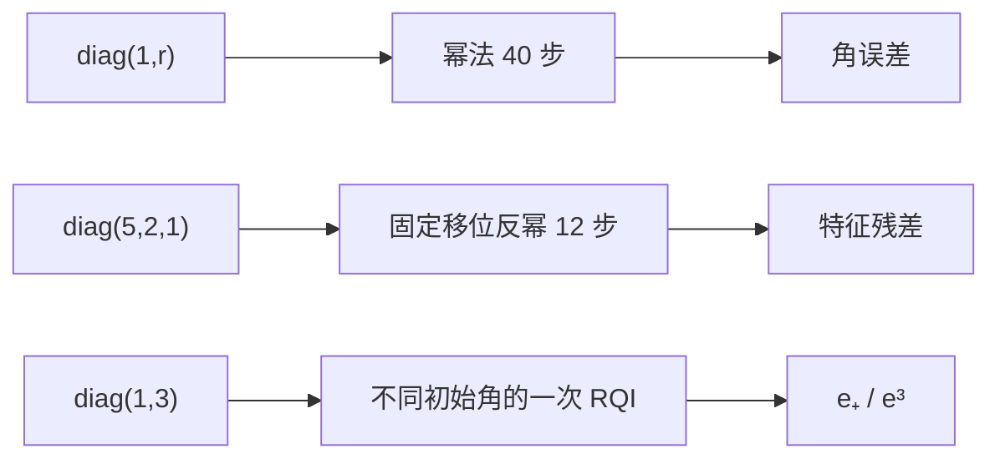

# 实验 - 谱间隙、移位与 Rayleigh 商迭代收敛

> [!question] 本实验的判别问题
> 谱比、移位相对距离和对称性分别怎样控制幂法、反幂法与 RQI 的收敛阶；等距移位又为什么会停滞？

## 研究问题

1. 幂法的实测角误差是否由 $|\lambda_2/\lambda_1|^k$ 控制？
2. 固定移位反幂法的速度是否由目标移位距离相对第二近距离决定？
3. 当移位与两个特征值等距时，唯一目标条件删除后会发生什么？
4. 对称二维 RQI 是否展示 $e_{k+1}\approx e_k^3$？

## 预注册假设

> [!hypothesis] 假设
> 谱比 $0.2$ 将快速收敛，$0.98$ 在 40 步后仍有显著角误差；目标 $\lambda=2$ 时，$\sigma=1.99$ 比 $1.9$ 快，而 $\sigma=1.5$ 因与 $1,2$ 等距而停在二维混合；对 $\operatorname{diag}(1,3)$，足够小角度下 $e_{k+1}/e_k^3\to1$。

## 变量设计

| 类型 | 变量 | 取值 | 指标 |
|---|---|---|---|
| 自变量 | 幂法谱比 | $0.2,0.8,0.98$ | $\sin\angle(x_k,q_1)$ |
| 自变量 | 反幂移位 | $1.5,1.9,1.99$ | $\|Ax_k-\rho_kx_k\|$ |
| 自变量 | RQI 当前角误差 | $10^{-4}$ 到约 $0.56$ | 下一步角误差 |
| 控制 | 算术与归一化 | Python `float`、二范数 | 所有方法一致 |

## 环境

- 代码：[plot_power_inverse_rqi.py](</Users/tong/Nodes/basic/00-知识库管理/_labs/code/plot_power_inverse_rqi.py>)
- Python：系统 `python3`，仅标准库；
- 硬件：CPU；
- 随机种子：无随机性；
- 图形：[plot-power-inverse-rqi-v2.svg](</Users/tong/Nodes/basic/00-知识库管理/_assets/plots/power-iteration/plot-power-inverse-rqi-v2.svg>)。
- 图形 SHA-256：`3904e79739b0b5fcfd92493df586a7655637f39774b43c3e1f0a3450f4af1b84`。

## 方法



反幂步骤直接逐坐标求解对角系统，但算法逻辑等同于解 $(A-\sigma I)y=x$，没有形成显式逆矩阵。

## 结果

**三种方法的速度差异究竟来自谱间隙、移位选择，还是局部收敛阶？**

![[00-知识库管理/_assets/plots/power-iteration/plot-power-inverse-rqi-v2.svg|880]]

> [!figure] 实验图｜谱比、移位距离与 RQI 局部三次律
> A 在 $\operatorname{diag}(1,r)$ 上比较三种谱比的幂法角误差；B 在 $\operatorname{diag}(5,2,1)$ 上比较三个固定移位的特征残差；C 对 $\operatorname{diag}(1,3)$ 比较一次 RQI 后角误差与三次参考线。生成脚本：[[plot_power_inverse_rqi.py]]；无随机数，并对谱比排序、移位距离排序和小角度三次比例设断言。

**怎样读图。** A 固定迭代数横向比较谱比，避免只看每条曲线是否下降；B 把 $\sigma=1.5$ 的平台解释为变换后最大模特征值并列，而不是实现错误；C 只在小角误差区比较实际线与三次参考线，大角度偏离正是“局部”二字的证据。

**适用边界（图没有证明什么）。** 对角矩阵刻意消除了非正规性、特征向量条件数和内层线性求解误差；图不证明一般矩阵轨迹单调，也不说明 inexact inverse iteration、动态算子或任意初值 RQI 都保持这些曲线。

### 幂法代表点

| $|\lambda_2/\lambda_1|$ | $k=10$ | $k=20$ | $k=40$ |
|---:|---:|---:|---:|
| $0.2$ | $1.02\times10^{-7}$ | $1.05\times10^{-14}$ | $1.10\times10^{-28}$ |
| $0.8$ | $1.07\times10^{-1}$ | $1.15\times10^{-2}$ | $1.33\times10^{-4}$ |
| $0.98$ | $6.33\times10^{-1}$ | $5.55\times10^{-1}$ | $4.07\times10^{-1}$ |

### 反幂法代表点

| $\sigma$ | $k=2$ 残差 | $k=5$ 残差 | $k=10$ 残差 |
|---:|---:|---:|---:|
| $1.5$ | $3.45\times10^{-1}$ | $3.45\times10^{-1}$ | $3.45\times10^{-1}$ |
| $1.9$ | $4.98\times10^{-3}$ | $6.77\times10^{-6}$ | $1.15\times10^{-10}$ |
| $1.99$ | $4.14\times10^{-5}$ | $4.21\times10^{-11}$ | 数值地板 |

### RQI 局部比例

| $e_k$ | $e_{k+1}$ | $e_{k+1}/e_k^3$ |
|---:|---:|---:|
| $5.62\times10^{-1}$ | $2.45\times10^{-1}$ | $1.38$ |
| $5.62\times10^{-2}$ | $1.78\times10^{-4}$ | $1.003$ |
| $5.62\times10^{-3}$ | $1.78\times10^{-7}$ | $1.000$ |
| $5.62\times10^{-4}$ | $1.78\times10^{-10}$ | $1.000$ |

## 分析

### 1. 谱比准确预测线性收敛难度

$r=0.2$ 很快触及绘图地板，$r=0.98$ 在 40 步后仍保留约 $0.4$ 的角误差。谱间隙小不是“多做几步就差不多”的轻微影响，而可能改变两个数量级以上的迭代预算。

### 2. 移位既能加速，也能删除唯一性

$\sigma=1.99$ 与目标 $2$ 的距离仅 $0.01$，相对其他距离很小，因此收敛最快。$\sigma=1.5$ 与 $1$、$2$ 等距，变换后的两个最大模特征值并列；迭代保留混合方向，残差平台不是实现 bug。

### 3. 三次律是局部结论

当角误差降到 $10^{-2}$ 以下，$e_{k+1}/e_k^3$ 接近 $1$；较大初始角时常数偏离。实验支持“局部三次”，不支持“任意初值一步立方”。

## 失败与异常记录

- 幂法 $r=0.2$ 的角误差低于 $10^{-16}$ 后绘图钳制到地板，但原始打印保留更小理论数；
- 反幂残差低于浮点地板时记为 $10^{-18}$ 以便对数绘图；
- $\sigma=1.5$ 的平台故意保留，未从图中删除；
- RQI 大角度点明显偏离三次参考线，作为局部性证据保留。

## 结论边界

> [!warning] 不可外推之处
> 对角矩阵消除了非正规性、特征向量条件数和线性求解误差。一般矩阵的收敛轨迹可能非单调；inexact inverse iteration 还需内层残差控制；真实 AI 训练中的算子随时间变化，不能直接套用静态谱曲线。

## 复现

```bash
python3 "00-知识库管理/_labs/code/plot_power_inverse_rqi.py"
```

## 下一步

- [ ] 加入近缺陷矩阵，比较谱比预测与暂态；
- [ ] 加入不精确线性求解 forcing rule；
- [ ] 在后续 Lanczos/Arnoldi 节点比较单向量与 Krylov 子空间方法。
