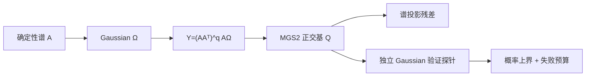

# 实验 - 随机 SVD 的过采样、幂步与概率证书

> [!question] 本实验的判别问题
> 过采样、幂步与独立后验证书能否分别控制 seed 长尾、慢谱分离和单次随机输出的可信度，并把代价显式记账？

## 研究问题与预注册假设

1. 固定 \(k=8,q=0\)，增大 \(p\) 是否降低 30 个 seed 的谱误差分布尾部？
2. 对慢/快衰减谱，\(q=0,1,2,3\) 的收益和 range pass 成本如何变化？
3. 对固定近似，用独立 Gaussian 探针构造的后验上界能否覆盖真实投影残差？

> [!hypothesis] 假设
> \(p\) 同时改善中位数与最坏 seed；慢谱在 \(q=1\) 后明显接近最优，快谱更早饱和；\(\alpha=10,r=5\) 的证书全部覆盖真实值但较保守。

## 实验对象

构造 \(n=60\) 的确定性矩阵，左右奇异向量由确定性正交变换给出，目标秩 \(k=8\)。误差均报告为

$$
\frac{\|(I-QQ^T)A\|_2}{\sigma_{k+1}},
$$

所以最优 rank-\(k\) 谱误差基线为 \(1\)。

### 过采样扫描

$$
p\in\{0,2,5,10\},\qquad q=0,
$$

每个 \(p\) 使用 30 个近似 seed，报告 10%、50%、90% 分位数与最坏值。

### 幂步扫描

固定 \(p=5\)，比较慢衰减与快衰减谱，

$$
q\in\{0,1,2,3\},
$$

range pass 计数为 \(2q+1\)，另形成 \(B=Q^TA\) 还需一次 pass。

### 后验证书

固定 16 个近似输出，令

$$
R=(I-QQ^T)A.
$$

对每个输出另取 \(r=5\) 个独立 Gaussian 探针，并计算

$$
10\sqrt{\frac2\pi}\max_i\|R\omega_i\|_2.
$$

名义失败概率上界为 \(10^{-5}\)。

- 代码：[plot_randomized_svd_probability.py](</Users/tong/Nodes/basic/00-知识库管理/_labs/code/plot_randomized_svd_probability.py>)；
- 图形：[plot-randomized-svd-probability-v2.svg](</Users/tong/Nodes/basic/00-知识库管理/_assets/plots/randomized-low-rank/plot-randomized-svd-probability-v2.svg>)；
- 图形 SHA-256：`853ee057bc5bd913408d4f65dcc51058dd5bd0e4fcd9c670a64c6abd5f9f72df`；
- Python：系统 `python3`，仅标准库；
- 随机性：伪随机 Gaussian；近似与认证 seed 分离。

## 方法



小型对称特征问题用确定性 Jacobi 旋转求解；谱残差由多起点幂估计。所有对比使用相同的矩阵构造和归一化基线。

## 结果

**随机低秩结果的“平均更好”“访问更多”和“本次可验证”分别应从哪一幅面板读取？**

![[00-知识库管理/_assets/plots/randomized-low-rank/plot-randomized-svd-probability-v2.svg|880]]

> [!figure] 实验图｜随机 SVD 的 seed 尾部、数据 pass 与后验证书
> A 对每个过采样 $p$ 汇总 30 个 seed 的 10%—90% 区间、中位数与最坏值；B 在慢/快谱上把幂步 $q$ 映射为 $2q+1$ 次 range pass；C 对 16 个独立近似比较真实投影残差与 Gaussian 探针证书。生成脚本：[[plot_randomized_svd_probability.py]]；近似/认证 seed 分离，并对过采样尾部、幂步收益和证书覆盖设断言。

**怎样读图。** A 不只看中位线，还要看 90% 区间和最坏 seed 是否收紧；B 把纵向误差改善与横轴 $2q+1$ 次访问一起读，识别收益递减；C 检查每个紫色证书是否覆盖蓝色真实值，再从两者间距判断保守程度，不能用 16 次成功实证 $10^{-5}$ 失败率。

**适用边界（图没有证明什么）。** 这是 $n=60$ 的 Gaussian sketch 机制实验，谱范数本身由充分迭代的数值估计获得；未覆盖高 coherence、SRHT/CountSketch、分布式 I/O 或自适应多次停止的联合失败预算。

### 过采样

| \(p\) | 10% | 中位数 | 90% | 最坏 |
|---:|---:|---:|---:|---:|
| 0 | 1.373 | 1.479 | 1.596 | 1.650 |
| 2 | 1.268 | 1.426 | 1.549 | 1.646 |
| 5 | 1.144 | 1.299 | 1.451 | 1.511 |
| 10 | 1.031 | 1.100 | 1.205 | 1.233 |

\(p=10\) 把本实验的中位误差从最优值的 \(1.479\) 倍降到 \(1.100\) 倍，并显著收紧最坏 seed。

### 幂步与 pass

| \(q\) | range pass | 慢谱中位误差 | 快谱中位误差 |
|---:|---:|---:|---:|
| 0 | 1 | 1.307482 | 1.047215 |
| 1 | 3 | 1.006858 | 1.000000 |
| 2 | 5 | 1.000247 | 1.000000 |
| 3 | 7 | 1.000005 | 1.000000 |

慢谱从 \(q=0\) 到 \(q=1\) 收益最大，之后迅速递减；快谱几乎在一个幂步后达到数值基线。

### 后验证书

16 个输出中，证书/真实残差比：

$$
\min=20.073,\quad
\operatorname{median}=25.193,\quad
\max=30.001.
$$

所有证书均覆盖真实值；这与 \(10^{-5}\) 名义失败上界相容，但 16 次成功并不能实证如此小的尾概率。

## 分析

1. \(p\) 不是为了提高最终 rank，而是让主子空间随机坐标更良态、降低漏方向长尾。
2. \(q\) 把奇异值变为 \(\sigma^{2q+1}\)，因此慢谱得到更清晰分离；收益必须与 \(2q+1\) 次 range pass 和重正交成本一起看。
3. 后验界故意保守：它用有限随机方向的最大响应控制整个球面最坏方向，并乘以 \(\alpha\) 购买失败概率。
4. 构造 seed 与验证 seed 分离，避免算法对验证方向的适应性偏差。

## 失败与边界

- \(n=60\) 是机制实验，未计真实大矩阵的 I/O、通信与 cache；
- 谱范数用多起点幂迭代估计，虽经充足迭代，仍不是符号精确值；
- 只考察 Gaussian sketch，不能把结果直接外推到 SRHT/CountSketch；
- 固定谱和正交向量构造不能覆盖高 coherence、稀疏输入与恶意结构；
- 证书很保守，若用于 fixed-tolerance 自适应还需管理多次停止检验的总失败预算。

## 复现

```bash
python3 "00-知识库管理/_labs/code/plot_randomized_svd_probability.py"
xmllint --noout "00-知识库管理/_assets/plots/randomized-low-rank/plot-randomized-svd-probability-v2.svg"
```

## 下一步

- [ ] 与确定性 Lanczos/Golub–Kahan 的 matvec、时间和误差比较；
- [ ] 加入 SRHT、Rademacher 与 CountSketch；
- [ ] 做 block adaptive fixed-tolerance，并累计停止概率预算；
- [ ] 在稀疏/分布式矩阵上记录 pass、通信和正交成本。
