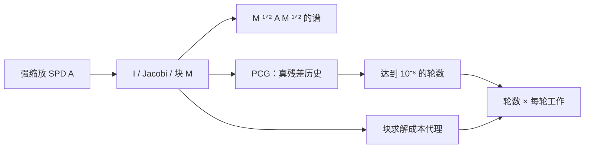

# 实验 - 预条件的谱重塑、PCG 收敛与成本权衡

> [!question] 本实验的判别问题
> 预条件器压缩谱、减少 PCG 轮数与降低端到端工作是否必然同步；若不同步，选择依据应是什么？

## 研究问题与预注册假设

1. 对角/块预条件是否压缩 $M^{-1/2}AM^{-1/2}$ 的谱？
2. 谱改善是否对应达到 $10^{-8}$ 真相对残差所需 PCG 轮数下降？
3. 块不断增大时，一个含应用成本的工作代理是否单调下降？

> [!hypothesis] 假设
> 前两者总体同步；第三者不单调，因为强预条件每次更贵。

## 实验对象

取 $n=32$，先构造一维 Poisson 矩阵 $T$，再令对角尺度 $D$ 跨越多个数量级：

$$
A=D^{1/2}TD^{1/2}.
$$

$A$ 保持 SPD，但原坐标严重失衡。比较：

- 无预条件；
- Jacobi $M=\operatorname{diag}(A)$；
- 连续块大小 $2,4,8,16,32$ 的块 Jacobi。

- 代码：[plot_krylov_preconditioning.py](</Users/tong/Nodes/basic/00-知识库管理/_labs/code/plot_krylov_preconditioning.py>)；
- 图形：[plot-krylov-preconditioning-v2.svg](</Users/tong/Nodes/basic/00-知识库管理/_assets/plots/preconditioning/plot-krylov-preconditioning-v2.svg>)；
- 图形 SHA-256：`21aece6d7aa67266b78fe03ed8330ddaf7abe38748b3f469851060eeb3aa3e2a`；
- Python：系统 `python3`，仅标准库；
- 右端与初值：确定性生成，无随机数。

## 方法



谱通过小规模对称 Jacobi 特征值算法计算。PCG 每轮按 $z=M^{-1}r$ 使用块 Cholesky 求解，并显式重算/记录原方程相对残差。工作代理计入一次稠密块三角求解的规模效应；它只用于机制比较，不代替硬件计时。

## 结果

**为何“条件数更小”和“迭代更少”仍不足以选出更好的预条件器？**

![[00-知识库管理/_assets/plots/preconditioning/plot-krylov-preconditioning-v2.svg|880]]

> [!figure] 实验图｜预条件的谱、迭代与工作三重验收
> A 比较无预条件、Jacobi 与块 Jacobi 后 $M^{-1/2}AM^{-1/2}$ 的谱；B 用原方程真残差比较 PCG 收敛；C 把块求解应用成本纳入工作代理，扫描块大小。生成脚本：[[plot_krylov_preconditioning.py]]；确定性 $n=32$ 强缩放 SPD 三对角矩阵，并对谱压缩、迭代减少与工作非单调性设断言。

**怎样读图。** A 既看端点条件数，也看特征值是否形成更有利的簇；B 固定同一真残差容差读取迭代数；C 再把迭代数与每轮代价合并，观察最少迭代的精确块为何不是最低工作点。三幅图依次回答机制、算法与成本，不能只选其中一幅下结论。

**适用边界（图没有证明什么）。** 这是 $n=32$ 的连续分块 SPD 模型，工作量是解析代理而非 CPU/GPU 墙钟；未计 setup、多右端摊销、缓存、通信和不完全分解，因此块 8 的最优点只属于当前代理，不是通用调参结论。

### 谱改善

| 预条件 | 广义条件数 |
|---|---:|
| 无 | $1.9281\times10^5$ |
| Jacobi | $440.689$ |
| 块 8 | $57.496$ |

### 达到 $10^{-8}$ 的轮数与工作代理

| 块大小 | 轮数 | 工作代理 |
|---:|---:|---:|
| 无 | 78 | 7488 |
| 1（Jacobi） | 32 | 5131 |
| 2 | 30 | 6763 |
| 4 | 15 | 5451 |
| 8 | 7 | **4939** |
| 16 | 3 | 6091 |
| 32（精确块） | 1 | 13070 |

## 分析

1. 对角缩放先消除了纯单位/尺度失衡，使条件数下降约三数量级；这说明最简单预条件也可能非常关键。
2. 块 8 继续捕获邻近耦合，条件数与轮数明显下降。
3. 精确块 32 一步收敛，却在所设成本代理下最贵；“最少迭代”不是“最少工作”。
4. 块 2 比 Jacobi 少两轮，却因应用更贵而工作代理更高，展示离散选择中常见的非单调性。

## 失败与边界

- 成本代理不是实际 CPU/GPU 时间，未建模缓存、并行和通信；
- 块按连续索引划分，真实问题应使用物理/模型结构；
- 维数很小，谱可完整计算；大规模只能估计；
- 矩阵是 SPD，结论不能直接外推到非正规一般矩阵；
- 未计入预条件设置成本和多右端摊销，实际选择可能改变。

## 复现

```bash
python3 "00-知识库管理/_labs/code/plot_krylov_preconditioning.py"
xmllint --noout "00-知识库管理/_assets/plots/preconditioning/plot-krylov-preconditioning-v2.svg"
```

## 下一步

- [ ] 在真实硬件上拆分 setup、apply、matvec 与归约时间；
- [ ] 加入不完全 Cholesky 与两层粗空间；
- [ ] 多右端实验中研究设置成本摊销；
- [ ] 对可变块求解改用 flexible 外层并比较真残差。
