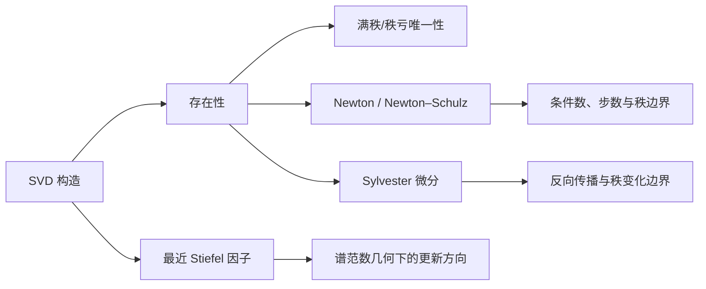

# 解答 - 极分解

> [!warning] 使用边界
> 请先独立完成[[习题 - 极分解]]并记录卡点。能跟随一次 SVD 构造，不等于能独立证明唯一性、最近点定理、秩亏自由度与 Sylvester 微分。尤其不要把“看懂 $U=LR^*$”误当成已经掌握了数值算法或 Muon 的有限步近似。

## A. 识别、形状与边界

## LA-POLAR-A01

### 1. 每个复方阵是否都有右极分解

**正确。** 若 $A=L\Sigma R^*$，取

$$
U=LR^*,
\qquad
H=R\Sigma R^*=(A^*A)^{1/2},
$$

即可得到 $A=UH$ 与 $H\succeq0$。

### 2. 高矩阵右伸缩因子的形状

**错误。** $A\in\mathbb F^{m\times n}$ 时，$A^*A\in\mathbb F^{n\times n}$，故右伸缩因子 $H$ 是 $n\times n$。方向因子 $U$ 才是 $m\times n$。

### 3. $H$ 是否总唯一

**正确。** 任何合法分解都满足

$$
A^*A=H U^*UH=H^2.
$$

PSD 平方根唯一，故 $H=(A^*A)^{1/2}$ 唯一；这里不要求 $A$ 满秩。

### 4. $H$ 唯一是否推出 $U$ 唯一

**错误。** 对 $A=\operatorname{diag}(2,0)$，$H=\operatorname{diag}(2,0)$ 唯一，但

$$
U_1=I_2,
\qquad
U_2=\operatorname{diag}(1,-1)
$$

都满足 $A=U_iH$。$H$ 的零空间抹掉了 $U$ 在第二个方向的选择。

### 5. 满列秩公式

**正确。** 满列秩使 $H\succ0$ 可逆，所以从 $A=UH$ 右乘 $H^{-1}$ 得

$$
U=AH^{-1}.
$$

### 6. 规范偏等距因子

**正确。** $U_0=AH^\dagger$ 在 $\mathcal R(H)$ 上与 $A$ 的方向作用一致，并在 $\mathcal N(H)$ 上取零。秩亏时

$$
U_0^*U_0=P_{\mathcal R(H)}\ne I,
$$

所以它通常不是半酉补全。

### 7. $H$ 是否必在标准坐标中对角

**错误。** $H$ 是 Hermitian PSD，故**可被酉对角化**，但不必已经对角。若

$$
A=
\begin{bmatrix}1&1\\0&1\end{bmatrix},
$$

则

$$
A^{\mathsf T}A=
\begin{bmatrix}1&1\\1&2\end{bmatrix}
$$

不是对角矩阵，其 PSD 平方根也一般不是标准基对角矩阵。

### 8. $H$ 的谱

**正确。** 由 SVD，$H=R\Sigma R^*$。因此 $H$ 的特征值就是 $\Sigma$ 的非负对角元，即 $A$ 的奇异值，包括零与重数。

### 9. 半酉矩阵的极分解

**正确。** 若 $A^*A=I$，则 $H=(A^*A)^{1/2}=I$，从而 $A=A I$。此时 $A$ 满列秩，方向因子唯一。

### 10. Frobenius 最近 Stiefel 因子

**正确。** 满列秩时所有奇异值均为正，trace 最大化的等号条件迫使 $Q=LR^*=U$，因此唯一。

### 11. 最近点是否只对 Frobenius 范数成立

**错误。** 极因子也在谱范数以及更一般的酉不变范数下给出最近半酉因子；不同范数下的最小距离公式不同，秩亏时最优解也可能不唯一。

### 12. 形成 Gram 矩阵是否默认最稳定

**错误。** 该路线在精确算术中正确，但

$$
\kappa_2(A^*A)=\kappa_2(A)^2.
$$

形成 Gram 矩阵会损失小奇异值的相对信息。通用稳健基线通常是 SVD；特定规模和硬件可用 QR、Newton 或 QDWH 路线。

### 13. 固定五步 Newton–Schulz

**错误。** 收敛依赖缩放、初始奇异值区间与条件数；固定步数只是计算预算，不是精度保证。[[实验 - Newton-Schulz 极分解的条件数效应]]中 $\kappa=1000$ 的五步缺陷仍约为 $0.999942$。

### 14. 多项式迭代能否恢复秩

**错误。** 因为

$$
\operatorname{rank}\bigl(X_kp(X_k^*X_k)\bigr)
\le\operatorname{rank}(X_k),
$$

秩只可能保持或降低，不能增加。

### 15. 三种 sign 是否相同

**错误。** 逐元素 sign 忽略矩阵乘法；经典矩阵符号函数通常针对谱避开虚轴的方阵；SVD 型 $LR^*$ 是极因子，可定义于矩形矩阵。三者只在很特殊的标量或结构化情形重合。

### 16. Hermitian 正部是否为 PSD 投影

**正确。** 在特征基中，它把负特征值截为零而保留非负特征值；这逐坐标最小化 Frobenius 距离。

### 17. 满秩点的方向导数

**正确。** $H\succ0$ 时，$H\dot H+\dot HH=A^*E+E^*A$ 的 Sylvester 算子可逆，由此可恢复 $\dot H$ 与 $\dot U$。

### 18. 重构残差是否足够

**错误。** 取 $U=A,H=I$，重构残差恒为零，但一般 $U^*U\ne I$。还必须检查半酉性、$H$ 的 Hermitian/PSD 性，并根据任务检查最近点、迭代或导数残差。

### A 题压缩表

| 对象 | 无条件唯一？ | 关键边界 |
|---|---:|---|
| $H=(A^*A)^{1/2}$ | 是 | PSD 平方根唯一 |
| 半酉补全 $U$ | 否 | 满列秩时唯一 |
| 规范偏等距 $U_0=AH^\dagger$ | 是 | 秩亏时通常不半酉 |
| 精确极因子 | 数学对象 | 不等于固定步多项式输出 |
| 重构残差 | 必要 | 不足以单独验收结构 |

## B. 手算、构造与数值验收

## LA-POLAR-B01：旋转与非均匀伸缩

### 1. 求 $H$

$$
A^{\mathsf T}A
=
\begin{bmatrix}
1&0\\0&4
\end{bmatrix},
$$

所以唯一 PSD 平方根为

$$
\boxed{H=\operatorname{diag}(1,2)}.
$$

### 2. 求 $U$

$H$ 可逆，故

$$
U=AH^{-1}
=
\begin{bmatrix}
0&-2\\1&0
\end{bmatrix}
\begin{bmatrix}
1&0\\0&1/2
\end{bmatrix}
=
\boxed{
\begin{bmatrix}
0&-1\\1&0
\end{bmatrix}
}.
$$

### 3. 结构验收

直接计算：

$$
UH=A,
\qquad
U^{\mathsf T}U=I,
\qquad
H^{\mathsf T}=H,
\qquad
\lambda(H)=\{1,2\}\subset[0,\infty).
$$

四项分别检查重构、正交、对称和 PSD，缺一不可。

### 4. 最近正交距离

$A$ 的奇异值为 $2,1$，所以

$$
\min_{Q\in O(2)}\|A-Q\|_F
=\sqrt{(2-1)^2+(1-1)^2}
=\boxed{1}.
$$

### 5. 几何解释

$U$ 是逆时针 $90^\circ$ 旋转，只改变方向而不改变长度；$H$ 沿第二坐标方向伸长两倍，沿第一坐标方向保持不变。先由 $H$ 伸缩，再由 $U$ 旋转，就得到 $A$。

## LA-POLAR-B02：高矩阵与 Stiefel 因子

### 1. 求 $H$

两列正交且长度均为 $\sqrt2$：

$$
A^{\mathsf T}A=2I_2,
\qquad
\boxed{H=\sqrt2I_2}.
$$

### 2. 求 $U$

$$
\boxed{
U=AH^{-1}
=\frac1{\sqrt2}
\begin{bmatrix}
1&1\\1&-1\\0&0
\end{bmatrix}
}.
$$

于是

$$
U^{\mathsf T}U
=\frac12A^{\mathsf T}A
=I_2.
$$

### 3. 奇异值

$H$ 的两个特征值均为 $\sqrt2$，故

$$
\sigma_1(A)=\sigma_2(A)=\sqrt2.
$$

### 4. 最近 Stiefel 距离

$$
\begin{aligned}
\min_{Q^{\mathsf T}Q=I_2}\|A-Q\|_F
&=\sqrt{2(\sqrt2-1)^2}\\
&=\sqrt2(\sqrt2-1)\\
&=\boxed{2-\sqrt2}.
\end{aligned}
$$

### 5. 为什么不要求方阵

$U\in\mathbb R^{3\times2}$ 有两列标准正交向量，故是 Stiefel 元素。它满足 $U^{\mathsf T}U=I_2$，但 $UU^{\mathsf T}$ 只是 $\mathbb R^3$ 中二维列空间上的投影，不等于 $I_3$。矩形半酉与方阵正交不能混用。

## LA-POLAR-B03：秩亏与两种“规范性”

### 1–2. 唯一 $H$ 与非唯一补全

$$
\boxed{H=\operatorname{diag}(2,0)}.
$$

可以取

$$
U_1=I_2,
\qquad
U_2=\operatorname{diag}(1,-1).
$$

二者都正交，且

$$
U_1H=U_2H=A.
$$

### 3–4. 规范偏等距

$$
H^\dagger=\operatorname{diag}(1/2,0),
$$

所以

$$
\boxed{U_0=AH^\dagger=\operatorname{diag}(1,0)}.
$$

比较可得

$$
U_i^{\mathsf T}U_i=I_2,
\qquad
U_0^{\mathsf T}U_0=\operatorname{diag}(1,0).
$$

$U_0$ 只保留 $A$ 真正作用的方向，并把核方向送到零。

### 5. 最近正交距离与非唯一性

奇异值为 $2,0$，故

$$
\min_{Q\in O(2)}\|A-Q\|_F
=\sqrt{(2-1)^2+(0-1)^2}
=\boxed{\sqrt2}.
$$

$U_1,U_2$ 都达到这个距离，所以最近正交矩阵不唯一。

### 6. 三句话的逻辑关系

- $H$ 由 $A^*A$ 的唯一 PSD 平方根决定；
- $UH$ 只读取 $U$ 在 $\mathcal R(H)$ 上的作用，核上的半酉补全不会影响乘积；
- $U_0$ 额外规定核上取零，因此消除了补全自由度，但也离开了 $O(2)$。

## LA-POLAR-B04：Hermitian 矩阵的绝对值与 PSD 投影

### 1. 谱分解

取

$$
q_+=\frac1{\sqrt2}\begin{bmatrix}1\\1\end{bmatrix},
\qquad
q_-=\frac1{\sqrt2}\begin{bmatrix}1\\-1\end{bmatrix}.
$$

则

$$
Aq_+=3q_+,
\qquad
Aq_-=-q_-.
$$

故特征值为 $3,-1$。

### 2. 矩阵绝对值

把特征值改成绝对值：

$$
|A|=3q_+q_+^{\mathsf T}+q_-q_-^{\mathsf T}
=\boxed{
\begin{bmatrix}
2&1\\1&2
\end{bmatrix}
}.
$$

### 3–4. 正部、PSD 与距离

$$
A_+=\frac{A+|A|}{2}
=\boxed{
\begin{bmatrix}
3/2&3/2\\3/2&3/2
\end{bmatrix}
}
=3q_+q_+^{\mathsf T}.
$$

其特征值为 $3,0$，所以 $A_+\succeq0$。被删去的只是 $-1$ 特征方向：

$$
\|A-A_+\|_F=|-1|=\boxed{1}.
$$

### 5. 为什么不是逐元素截断

PSD 是关于所有二次型 $x^{\mathsf T}Ax$ 或特征值的条件，不是元素逐个非负。原矩阵所有元素已经都是正数，却仍有负特征值 $-1$；逐元素截断什么也不会改变，因而不可能得到 PSD 投影。

## LA-POLAR-B05：两步 Newton–Schulz

### 1. 两步精确值

$$
x_1
=\frac12\cdot\frac12\left(3-\frac14\right)
=\boxed{\frac{11}{16}}.
$$

再算

$$
x_2
=\frac12\cdot\frac{11}{16}
\left(3-\frac{121}{256}\right)
=\boxed{\frac{7117}{8192}}
\approx0.868774.
$$

### 2. 正交性标量缺陷

$$
1-x_0^2=\frac34,
$$

$$
1-x_1^2=1-\frac{121}{256}=\frac{135}{256}\approx0.527344,
$$

$$
1-x_2^2
=\frac{16457175}{67108864}
\approx0.245231.
$$

两步后方向正确地向 $1$ 移动，但还远非机器精度。

### 3. 单调抬升

$$
\phi(x)-x
=\frac12x(3-x^2)-x
=\frac12x(1-x^2)>0
$$

对 $0<x<1$ 成立。

同时

$$
1-\phi(x)
=\frac12(x-1)^2(x+2)>0,
$$

故 $\phi(x)<1$。所以序列在 $(0,1)$ 内单调上升且不越过 $1$。

### 4. 二次局部收敛

令 $x=1-e$，则

$$
\phi(1-e)=1-\frac32e^2+\frac12e^3.
$$

所以

$$
e_{k+1}=\frac32e_k^2-\frac12e_k^3=O(e_k^2).
$$

### 5. 零奇异值

$\phi(0)=0$。归纳立即得到：若 $x_0=0$，则 $x_k=0$ 对所有 $k$ 成立。

## C. 推导与证明

## LA-POLAR-C01：存在性、唯一性与左右极分解

### 1. SVD 构造

对 $m\ge n$，使用包含零奇异值的薄 SVD：

$$
A=L\Sigma R^*,
\qquad
L\in\mathbb F^{m\times n},
\quad
L^*L=I_n,
\quad
R^*R=RR^*=I_n.
$$

定义

$$
U=LR^*,
\qquad
H=R\Sigma R^*.
$$

则

$$
UH=LR^*R\Sigma R^*=L\Sigma R^*=A,
$$

$$
U^*U=RL^*LR^*=I_n.
$$

又因 $\Sigma$ 是非负对角矩阵，

$$
H^*=H,
\qquad
x^*Hx=(R^*x)^*\Sigma(R^*x)\ge0.
$$

故 $H\succeq0$。

### 2. $H$ 的无条件唯一性

若另有 $A=\widetilde U\widetilde H$，其中 $\widetilde U^*\widetilde U=I$、$\widetilde H\succeq0$，则

$$
A^*A
=\widetilde H\widetilde U^*\widetilde U\widetilde H
=\widetilde H^2.
$$

PSD 平方根定理给出

$$
\boxed{\widetilde H=(A^*A)^{1/2}=H}.
$$

注意：这里的唯一性来自“PSD 平方根唯一”，不是来自 $H$ 可逆。

### 3. 满列秩时 $U$ 唯一

若 $\operatorname{rank}(A)=n$，则 $A^*A\succ0$，所以 $H\succ0$ 可逆。任一合法方向因子都必须满足

$$
\boxed{U=AH^{-1}},
$$

故唯一。

### 4. 秩亏时的自由度

若 $U_1H=U_2H=A$，则

$$
(U_1-U_2)H=0.
$$

因此 $U_1$ 与 $U_2$ 在 $\mathcal R(H)$ 上作用相同，差异只能出现在 $\mathcal N(H)$。反过来，只要在 $\mathcal N(H)$ 上选择与既有像空间正交的等距补全，就仍有 $U^*U=I$，而 $UH$ 不变。

所以非唯一自由度并非任意发生；它恰好被 $H$ 的核支撑。

### 5. 宽矩阵的左极分解

若 $m\le n$，写薄 SVD

$$
A=L\Sigma R^*,
$$

其中 $L\in\mathbb F^{m\times m}$ 酉，$R\in\mathbb F^{n\times m}$ 列半酉。定义

$$
K=L\Sigma L^*=(AA^*)^{1/2}\in\mathbb F^{m\times m},
$$

$$
U=LR^*\in\mathbb F^{m\times n}.
$$

于是

$$
A=KU,
\qquad
UU^*=I_m.
$$

这时是**行半酉**，不能误写成 $U^*U=I_n$。

## LA-POLAR-C02：最近 Stiefel 因子

### 1. 把距离变成 trace 最大化

利用 Frobenius 内积：

$$
\begin{aligned}
\|A-Q\|_F^2
&=\operatorname{tr}\bigl((A-Q)^*(A-Q)\bigr)\\
&=\|A\|_F^2+\|Q\|_F^2
-2\operatorname{Re}\operatorname{tr}(Q^*A).
\end{aligned}
$$

因为 $Q^*Q=I_n$，

$$
\|Q\|_F^2=\operatorname{tr}(I_n)=n.
$$

故

$$
\boxed{
\|A-Q\|_F^2
=\|A\|_F^2+n
-2\operatorname{Re}\operatorname{tr}(Q^*A)
}.
$$

### 2. SVD 上界

令 $A=L\Sigma R^*$，并定义

$$
W=L^*QR.
$$

因为 $L$ 与 $Q$ 都列半酉，

$$
\|W\|_2\le\|L^*\|_2\|Q\|_2\|R\|_2\le1.
$$

于是每个对角元满足 $\operatorname{Re}w_{ii}\le|w_{ii}|\le1$。再用 trace 循环性：

$$
\begin{aligned}
\operatorname{Re}\operatorname{tr}(Q^*A)
&=\operatorname{Re}\operatorname{tr}(Q^*L\Sigma R^*)\\
&=\operatorname{Re}\operatorname{tr}(L^*QR\Sigma)\\
&=\sum_{i=1}^n\sigma_i\operatorname{Re}w_{ii}\\
&\le\sum_{i=1}^n\sigma_i.
\end{aligned}
$$

### 3. 极因子达到上界

取 $Q=U=LR^*$，则

$$
W=L^*(LR^*)R=I_n,
$$

所以

$$
\operatorname{Re}\operatorname{tr}(U^*A)=\sum_i\sigma_i.
$$

因此极因子是最近 Stiefel 因子。

### 4. 距离公式

把最大 trace 代回：

$$
\begin{aligned}
\min_{Q^*Q=I}\|A-Q\|_F^2
&=\sum_i\sigma_i^2+n-2\sum_i\sigma_i\\
&=\boxed{\sum_{i=1}^n(\sigma_i-1)^2}.
\end{aligned}
$$

### 5. 唯一性

若所有 $\sigma_i>0$，等号要求每个 $\operatorname{Re}w_{ii}=1$。结合 $\|W\|_2\le1$，得到 $W=I$；此时 Frobenius 内积达到两个 Stiefel 矩阵之间的 Cauchy–Schwarz 等号，从而 $Q=LR^*=U$。

若某些 $\sigma_i=0$，相应 $w_{ii}$ 不进入目标函数。$Q$ 在零奇异值对应输入子空间上的等距补全可以变化，故最近点一般不唯一。

## LA-POLAR-C03：Hermitian 矩阵到 PSD 锥的投影

### 1–2. 正部与绝对值

定义

$$
A_+=Q\operatorname{diag}(\lambda_i^+)Q^*,
\qquad
\lambda_i^+=\max(\lambda_i,0).
$$

其特征值均非负，所以 $A_+\succeq0$。又

$$
|A|=Q\operatorname{diag}(|\lambda_i|)Q^*.
$$

标量恒等式

$$
\max(\lambda,0)=\frac{\lambda+|\lambda|}{2}
$$

逐特征值成立，故

$$
\boxed{A_+=\frac{A+|A|}{2}}.
$$

### 3. 最近 PSD 证明

任取 $B\succeq0$，令 $C=Q^*BQ\succeq0$。酉不变性给出

$$
\|A-B\|_F^2
=\|\operatorname{diag}(\lambda_i)-C\|_F^2.
$$

展开为

$$
\sum_i(\lambda_i-c_{ii})^2
+\sum_{i\ne j}|c_{ij}|^2.
$$

PSD 性保证 $c_{ii}\ge0$。对每个 $i$：

- 若 $\lambda_i\ge0$，最小选择是 $c_{ii}=\lambda_i$；
- 若 $\lambda_i<0$，在约束 $c_{ii}\ge0$ 下最小选择是 $c_{ii}=0$。

非对角项的最小选择是零。因此

$$
\|A-B\|_F^2
\ge\sum_{\lambda_i<0}\lambda_i^2,
$$

且 $C=\operatorname{diag}(\lambda_i^+)$，即 $B=A_+$ 时取等号。

### 4. 非 Hermitian 边界

一般非 Hermitian 矩阵没有实数有序特征值，也不属于 PSD 锥所在的 Hermitian 线性空间。若要投影到 PSD 锥，必须先明确距离定义；在 Frobenius 范数下，可先取 Hermitian 部分 $(A+A^*)/2$，再对其负特征值截断，但这已经是另一个带空间分解的命题。

## LA-POLAR-C04：Newton 与 Newton–Schulz 的谱映射

### 1. Newton 的奇异值递推

若

$$
X_k=L\operatorname{diag}(x_{i,k})R^*,
$$

则满秩时

$$
X_k^{-*}=L\operatorname{diag}(x_{i,k}^{-1})R^*.
$$

所以奇异向量不变，每个奇异值独立满足

$$
\boxed{x_{k+1}=\frac12(x_k+x_k^{-1})}.
$$

### 2. Newton 的不动点与误差

对正数 $x$，不动点方程

$$
x=\frac12(x+x^{-1})
$$

给出 $x^2=1$，故正不动点为 $1$。令 $x=1+e$，则

$$
\frac12\left(x+x^{-1}\right)-1
=\frac{e^2}{2(1+e)}
=O(e^2).
$$

因此局部二次收敛。

### 3. Newton–Schulz 的谱映射

由

$$
X_k^*X_k
=R\operatorname{diag}(x_{i,k}^2)R^*,
$$

可得

$$
X_{k+1}
=L\operatorname{diag}\left(
\frac12x_{i,k}(3-x_{i,k}^2)
\right)R^*.
$$

故

$$
\boxed{\phi(x)=\frac12x(3-x^2)}.
$$

### 4. $(0,1)$ 上的单调性与不越界

$$
\phi(x)-x=\frac12x(1-x^2)>0,
$$

$$
1-\phi(x)=\frac12(x-1)^2(x+2)>0.
$$

所以 $0<x<\phi(x)<1$。

### 5. 秩不增加

对任意相容矩阵 $M,N$，$\operatorname{rank}(MN)\le\operatorname{rank}(M)$。于是

$$
\operatorname{rank}(X_{k+1})
=\operatorname{rank}\bigl(X_kp(X_k^*X_k)\bigr)
\le\operatorname{rank}(X_k).
$$

这给出比“$\phi(0)=0$”更一般的矩阵证明。

## LA-POLAR-C05：极因子的一阶微分

### 1. $H$ 的 Sylvester 方程

从

$$
H^2=A^*A
$$

对方向 $E$ 求微分。矩阵乘法不能交换，所以左侧必须用乘积法则：

$$
d(H^2)=H\dot H+\dot HH.
$$

右侧为

$$
d(A^*A)=E^*A+A^*E.
$$

故

$$
\boxed{H\dot H+\dot HH=A^*E+E^*A}.
$$

### 2. 为什么解唯一

在 $H$ 的特征基中，令 $H=R\operatorname{diag}(h_i)R^*$，其中 $h_i>0$。Sylvester 算子

$$
\mathcal S_H(Z)=HZ+ZH
$$

逐元素变成

$$
(\mathcal S_H(Z))_{ij}=(h_i+h_j)z_{ij}.
$$

因为 $h_i+h_j>0$，每个分量都可唯一恢复，所以 $\mathcal S_H$ 可逆。

### 3. 恢复 $\dot U$

对 $A=UH$ 求微分：

$$
E=\dot UH+U\dot H.
$$

右乘 $H^{-1}$：

$$
\boxed{\dot U=(E-U\dot H)H^{-1}}.
$$

### 4. 切空间条件

对 $U^*U=I$ 求微分：

$$
\dot U^*U+U^*\dot U=0.
$$

所以

$$
(U^*\dot U)^*=-U^*\dot U,
$$

即 $U^*\dot U$ 反 Hermitian。它正是 Stiefel 切向条件。

### 5. $\Omega$ 方程

令 $\Omega=U^*\dot U$。左乘 $U^*$ 得

$$
U^*E=\Omega H+\dot H.
$$

取 $E=\dot UH+U\dot H$ 的伴随后右乘 $U$：

$$
E^*U=H\dot U^*U+\dot H=-H\Omega+\dot H.
$$

两式相减：

$$
\boxed{H\Omega+\Omega H=U^*E-E^*U}.
$$

### 6. 秩变化边界

若最小奇异值趋于零，$H^{-1}$ 不存在或爆炸，且 $h_i+h_j$ 的下界消失。半酉补全也可能从唯一变成不唯一。因此秩变化处不能把满秩公式当作无条件普通导数；应改用子空间、广义导数、正则化或明确的软件分支约定。

## D. 边界、反例与纠错

## LA-POLAR-D01

### 1. 两个因子总唯一

**错误。** $A=\operatorname{diag}(2,0)$ 的 $H$ 唯一，但 $U=I_2$ 与 $U=\operatorname{diag}(1,-1)$ 都合法。断裂点是 $H$ 不可逆。最小修正：$H$ 总唯一；半酉 $U$ 在满列秩时唯一。

### 2. PSD 就必对角

**错误。** 对

$$
A=\begin{bmatrix}1&1\\0&1\end{bmatrix},
$$

$A^{\mathsf T}A$ 非对角，$H=(A^{\mathsf T}A)^{1/2}$ 也非对角。断裂点是把“酉可对角化”误成“当前基已经对角”。

### 3. 逐列归一化就是最近 Stiefel 因子

**错误。** 对上述三角矩阵，两列分别归一化后仍不正交，因此甚至不在 Stiefel 集合中。只有列本来正交时才成立。例如

$$
\begin{bmatrix}1&1\\1&-1\\0&0\end{bmatrix}
$$

的列正交等长，逐列归一化恰好等于极因子；这是特例，不是一般算法。

### 4. 形成 $A^*A$ 不改变条件性

**错误。** 对 $A=\operatorname{diag}(1,\varepsilon)$，

$$
\kappa_2(A)=\varepsilon^{-1},
\qquad
\kappa_2(A^*A)=\varepsilon^{-2}.
$$

精确公式正确只说明代数等价，不说明浮点误差等价。最小修正：证明可用 Gram，通用计算优先稳定分解或结构迭代。

### 5. 收敛迭代意味着任意初值、固定步数可靠

**错误。** 仍取 $A=\operatorname{diag}(1,\varepsilon)$。若缩放后最小奇异值极小，前几步近似只乘 $3/2$，固定五步远未接近 $1$；某些区间外初值还可能发散。必须声明缩放、收敛域、条件数、步数和最终残差。

### 6. 多做几步可以恢复秩

**错误。** 对 $X_0=\operatorname{diag}(1,0)$，第二奇异值永远满足 $\phi(0)=0$。更一般地，右乘任何 $p(X_k^*X_k)$ 都不能增加秩。若任务要求满秩补全，必须显式引入新方向、正则化或 SVD/QR 补全约定。

### 7. SVD 型极因子就是经典矩阵 sign

**错误。** 高矩阵

$$
A=\begin{bmatrix}1&1\\1&-1\\0&0\end{bmatrix}
$$

有清楚的矩形极因子，但经典矩阵符号函数通常定义于谱避开虚轴的**方阵**。即使对方阵，经典 sign 按特征值半平面分类，极因子按奇异值分解构造，也不是一般同一对象。

### 8. 自动微分可运行就等于数学上光滑

**错误。** 在 $A=\operatorname{diag}(1,0)$ 附近，任意小扰动都可改变秩，并使半酉补全选择发生跳变。软件可能返回某个约定的梯度、零、NaN 或报错；运行行为不能替代可微性定理。最小修正：检查满秩/谱隙条件，并用有限差分验证所选分支。

### 9. 重构小就够了

**错误。** 对三角矩阵 $A$，取 $U=A,H=I$，则 $A-UH=0$，但 $U^{\mathsf T}U\ne I$。至少还要检查：

$$
\|U^*U-I\|,
\quad
\|H-H^*\|,
\quad
\lambda_{\min}(H),
\quad
\|H^2-A^*A\|.
$$

## E. AI 迁移：矩阵值最速下降与 Stiefel 更新

## AI-POLAR-E01

### 1. 最优值

谱范数与核范数对偶给出

$$
|\langle G,\Delta\rangle_F|
\le\|G\|_*\|\Delta\|_2.
$$

在 $\|\Delta\|_2\le\eta$ 下，

$$
\langle G,\Delta\rangle_F\ge-\eta\|G\|_*.
$$

本题 $\|G\|_*=3+1=4$，故最优值至少为 $-4\eta$；下面构造达到者，因而

$$
\boxed{\min=-4\eta}.
$$

### 2. 极方向与归一化 SGD

$G$ 已经是正定对角矩阵，其极因子为 $I_2$。取

$$
\boxed{\Delta_\star=-\eta I_2},
$$

则 $\|\Delta_\star\|_2=\eta$，并且

$$
\langle G,\Delta_\star\rangle_F=-\eta\operatorname{tr}(G)=-4\eta.
$$

若把 SGD 方向缩放到相同谱范数预算，得到

$$
-\eta\frac{G}{\|G\|_2}
=-\eta
\begin{bmatrix}
1&0\\0&1/3
\end{bmatrix}.
$$

比较可见：

- 两者在第一奇异方向都走 $\eta$；
- 极方向在第二方向也走 $\eta$；
- 归一化 SGD 在第二方向只走 $\eta/3$。

极方向把正奇异值都规整为 $1$，这正是谱范数几何下的最速下降结构。

### 3. 一般满秩证明

若 $G=L\Sigma R^*$，取

$$
\Delta_\star=-\eta LR^*.
$$

因为 $LR^*$ 半酉，$\|\Delta_\star\|_2=\eta$。同时

$$
\begin{aligned}
\langle G,\Delta_\star\rangle_F
&=-\eta\operatorname{Re}\operatorname{tr}
\bigl((L\Sigma R^*)^*LR^*\bigr)\\
&=-\eta\operatorname{tr}(R\Sigma R^*)\\
&=-\eta\sum_i\sigma_i\\
&=-\eta\|G\|_*.
\end{aligned}
$$

因此达到对偶下界：

$$
\boxed{\Delta_\star=-\eta\operatorname{polar}(G)}.
$$

### 4. 秩亏时的集合值边界

若 $G$ 秩亏，目标只读取正奇异值对应的左右子空间。可以取规范偏等距方向

$$
-\eta L_rR_r^*,
$$

也可以在零奇异值子空间上补成谱范数不超过 $\eta$ 的半酉方向；这些选择都可能达到同一最优值。因此 `argmin` 一般是集合。写成单值 $-\eta\operatorname{polar}(G)$ 时必须声明补全约定或假设满秩。

### 5. 两步标准 Newton–Schulz

因为

$$
\|G\|_F=\sqrt{10},
$$

初始奇异值为

$$
x_{1,0}=\frac3{\sqrt{10}}\approx0.948683,
\qquad
x_{2,0}=\frac1{\sqrt{10}}\approx0.316228.
$$

一步后：

$$
x_{1,1}=\frac{63}{20\sqrt{10}}\approx0.996117,
\qquad
x_{2,1}=\frac{29}{20\sqrt{10}}\approx0.458530.
$$

两步后：

$$
x_{1,2}=\frac{505953}{160000\sqrt{10}}\approx0.999977,
$$

$$
x_{2,2}=\frac{323611}{160000\sqrt{10}}\approx0.639592.
$$

于是

$$
\|X_2^{\mathsf T}X_2-I\|_2
=\max_i|x_{i,2}^2-1|
\approx\boxed{0.590922}.
$$

最大奇异方向几乎已经到 $1$，但小奇异方向仍明显不足。

### 6. 为什么只能称为近似

精确极因子的两个奇异值均为 $1$；两步输出的第二奇异值约为 $0.64$。它保留了正确奇异向量并改善了谱，但没有满足高精度半酉条件。因此“极方向近似”是准确表述，“已经求出极分解”则过强。

### 7. 参数 retraction 与梯度方向变换

$$
W_+=\operatorname{polar}(W-\eta G)
$$

先在环境空间做候选参数步，再把**参数**投回 $O(2)$；它服务于正交约束优化。

$$
-\operatorname{polar}(G)
$$

则把**梯度或动量块**的奇异值规整后作为更新方向；参数本身不因此自动保持正交。二者输入对象、约束语义和验收量都不同。

### 8. 实际实现的验收记录

至少记录：

1. 输入形状以及使用右极分解还是左极分解；
2. 实数/复数 dtype、设备与累积精度；
3. 初始缩放规则及缩放后的最大奇异值估计；
4. 数值秩、最小奇异值估计或条件数代理；
5. 多项式系数、迭代步数与是否动态停止；
6. 重构残差 $\|A-UH\|/\|A\|$；
7. 半酉残差 $\|U^*U-I\|$ 或 $\|UU^*-I\|$；
8. $H$ 的 Hermitian 残差与最小特征值；
9. 若只求方向，报告最终奇异值区间或正交性缺陷；
10. 与 SVD 高精度参考的偏差，以及这个偏差对训练指标的影响。

## 本组题的知识闭环

如果仍不能独立说明“为什么 $H$ 总唯一而 $U$ 未必唯一”，或不能从 trace 最大化恢复最近点定理，应返回[[极分解]]的第二、七与十八节，而不是继续记忆更多算法名称。
