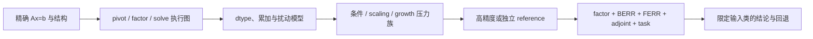

# 解答 - 稳定求解线性方程组

> [!warning] 使用建议
> 先独立作答。若只得到正确数值，却没有说明 pivoting、舍入路径、后向误差和条件性，仍未达到本章目标。

## A. 定义、对象与边界

### NLA-SOLVE-A01

1. **错误。** 可逆只保证精确唯一解；当前顺序可有零/极小 pivot，导致无主元 LU 失败或不稳。
2. **错误。** tiny pivot 会产生巨大 multiplier 和中间量，即使不等于零也可严重放大舍入。
3. **正确。** 搜索范围是当前列第 $k$ 行及以下。
4. **正确。** 因 pivot 是该列候选最大绝对值，分子不超过分母。
5. **错误。** $U$ 的尾随更新仍可能增长，经典最坏可达 $2^{n-1}$。
6. **正确。** 这是 GEPP 的构造性 worst-case 元素增长界。
7. **错误。** 上界去掉了舍入抵消；大 growth 是风险，不等于每次实际误差都大。
8. **错误。** $\kappa(A)$ 属于精确问题；growth 属于消元路径和 pivot 策略。
9. **正确。** 标准前/回代可解释为对同三角结构系数的小分量扰动。
10. **错误。** 病态 $T$ 会把小后向误差放大成大前向误差。
11. **错误。** 还需三角求解质量、原问题 residual 和条件数。
12. **正确。** 否则可能只验证被缩放或覆盖后的内部问题。
13. **错误。** 大行可能掩盖小行；componentwise 指标才逐行归一化。
14. **正确。** 零/极小分母在软件中需安全处理。
15. **正确。** 前向误差解释需要 $A^{-1}$ 的放大信息或估计。
16. **正确。** 若 `RCOND≈u`，工作精度相对数字可能基本耗尽。
17. **错误。** 对角缩放不保证消除近线性相关或把条件数变为 1。
18. **正确。** 列缩放改变未知量坐标，必须反变换。
19. **正确。** 精确校正 $d=A^{-1}(b-Ax_k)=x-x_k$。
20. **错误。** 低精度因子可能数值奇异；典型充分条件涉及 $\kappa(A)u_f<1$。
21. **错误。** 应停止、升级精度或换算法；无限迭代只浪费资源。
22. **错误。** $A+\lambda I$ 定义了正则化新问题。
23. **正确。** SPD 应优先 Cholesky/结构专用方法。
24. **错误。** 单次 solve 应用分解和三角求解；显式逆多做工作。
25. **正确。** 反向模式解伴随系统并可复用因子。
26. **错误。** adjoint 右端可沿更敏感方向，且反向求解自身也有 residual/停止误差。

### NLA-SOLVE-A02：流水线归类

| 量 | 主层次 | 说明 |
|---|---|---|
| $\kappa(A)$ | 问题 | 精确映射敏感性 |
| $\|PA-LU\|$ | 分解 | 因子重构质量 |
| $\rho$ | 分解/实现 | 消元过程内部增长 |
| $\|b-A\widehat x\|$ | 最终解 | 原系统满足程度 |
| `BERR` | 最终解 | 归一化邻近问题误差 |
| `FERR` | 最终解 + 问题 | 需结合条件性 |
| fill-in | 实现/性能 | 也受重排序/pivot 影响 |
| pivot communication | 实现/性能 | 会反过来限制 pivot 策略 |
| $\|I-A^{-1}A\|$ | 不推荐验收 | 显式逆引入额外问题；通常无需计算 |
| refinement 轮数 | 实现 + 最终解 | 反映收敛、条件和精度组合 |

## B. 手算、构造与数值追踪

### NLA-SOLVE-B01：无主元三位手算

乘子

$$
\ell_{21}=10^4.
$$

三位舍入：

$$
U=
\begin{bmatrix}
10^{-4}&1\\
0&-1.00\times10^4
\end{bmatrix},
\qquad
L=
\begin{bmatrix}
1&0\\
10^4&1
\end{bmatrix}.
$$

前代：

$$
y_1=1,
\qquad
y_2=\operatorname{fl}(2-10^4)=-1.00\times10^4.
$$

回代：

$$
\widehat x_2=1,
\qquad
\widehat x_1=\frac{1-1}{10^{-4}}=0.
$$

精确解

$$
x=
\begin{bmatrix}
1/(1-10^{-4})\\
(1-2\times10^{-4})/(1-10^{-4})
\end{bmatrix}
\approx
\begin{bmatrix}1.0001\\0.9999\end{bmatrix}.
$$

residual

$$
r=b-A\widehat x
=\begin{bmatrix}0\\1\end{bmatrix}.
$$

无穷范数相对前向误差约

$$
\frac{\max(1.0001,0.0001)}{1.0001}\approx1.
$$

而 $\kappa_\infty(A)\approx4$，所以失败主要来自无主元算法路径。

### NLA-SOLVE-B02：部分选主元手算

$$
P=\begin{bmatrix}0&1\\1&0\end{bmatrix},
\qquad
PA=
\begin{bmatrix}1&1\\10^{-4}&1\end{bmatrix}.
$$

$$
L=
\begin{bmatrix}1&0\\10^{-4}&1\end{bmatrix},
\qquad
U=
\begin{bmatrix}1&1\\0&0.9999\end{bmatrix}.
$$

$Pb=(2,1)^T$。前代得 $y_1=2$、$y_2=0.9998$；回代得 $x_2\approx0.9999$、$x_1\approx1.0001$，三位时约为 $(1,1)^T$。

无主元最大 multiplier 为 $10^4$，中间量约 $10^4$；GEPP multiplier 为 $10^{-4}$，中间量保持约 1。问题完全相同，只有执行图改变，因此质量差异属于稳定性。

### NLA-SOLVE-B03：条件数、growth 与精度预算

基准因子

$$
3 n u=3\times1000\times1.11\times10^{-16}
=3.33\times10^{-13}.
$$

| $g$ | 后向上界 |
|---:|---:|
| $10$ | $3.33\times10^{-12}$ |
| $10^6$ | $3.33\times10^{-7}$ |
| $10^{12}$ | $0.333$ |

再乘条件数：

| $g$ | $\kappa=10^2$ | $\kappa=10^8$ |
|---:|---:|---:|
| $10$ | $3.33\times10^{-10}$ | $3.33\times10^{-4}$ |
| $10^6$ | $3.33\times10^{-5}$ | $33.3$ |
| $10^{12}$ | $33.3$ | $3.33\times10^7$ |

大于或接近 1 的组合不能由一阶界保证有效相对数字。上界大只表示理论保证弱/风险高，不证明本次观测必大；仍需 residual、BERR 和 reference。

### NLA-SOLVE-B04：normwise 与 componentwise BERR

$$
r=b-A\widehat x
=\begin{bmatrix}0\\10^{-8}\end{bmatrix}.
$$

$\|A\|_2=1$、$\|\widehat x\|_2=1$、$\|b\|_2\approx1$，故

$$
\eta_{\rm norm}
\approx\frac{10^{-8}}2=5\times10^{-9}.
$$

逐行分母

$$
|A||\widehat x|+|b|
=\begin{bmatrix}2\\10^{-8}\end{bmatrix}.
$$

因此

$$
\eta_{\rm comp}=\max(0,1)=1.
$$

总体范数被第一行主导，掩盖了第二个小尺度方程 $100\%$ 的相对不满足。

### NLA-SOLVE-B05：从 BERR 到 FERR

| $\kappa$ | $\kappa\eta$ | 有限界 |
|---:|---:|---:|
| $10^3$ | $10^{-9}$ | $\approx10^{-9}$ |
| $10^9$ | $10^{-3}$ | $10^{-3}/0.999\approx1.001\times10^{-3}$ |
| $2\times10^{12}$ | $2$ | 条件失败，分母为负 |

第三种不能使用该界；第二种一阶仍很接近，第一种更安全。

### NLA-SOLVE-B06：equilibration

取

$$
D_r=\operatorname{diag}(10^{-8},1).
$$

则

$$
\widetilde A=D_rA
=\begin{bmatrix}1&10^{-8}\\1&10^{-8}\end{bmatrix},
\qquad
\widetilde b=D_rb
=\begin{bmatrix}1+10^{-8}\\1+10^{-8}\end{bmatrix}.
$$

只做行缩放不改变未知量，无需反缩放 $x$。但两行完全相同，原矩阵行列式 $10^8\cdot10^{-8}-1=0$，缩放后仍奇异。缩放改善量级，不恢复线性独立。

### NLA-SOLVE-B07：两步 iterative refinement

$$
Ax_0=
\begin{bmatrix}1.0\\1.9\end{bmatrix},
\qquad
r_0=
\begin{bmatrix}0\\0.1\end{bmatrix}.
$$

解

$$
\begin{bmatrix}4&1\\1&3\end{bmatrix}d_0
=\begin{bmatrix}0\\0.1\end{bmatrix}
$$

得

$$
d_0=
\begin{bmatrix}-1/110\\4/110\end{bmatrix}
\approx
\begin{bmatrix}-0.0090909\\0.0363636\end{bmatrix}.
$$

故

$$
x_1=x_0+d_0
=\begin{bmatrix}1/11\\7/11\end{bmatrix},
$$

正是真解。若 $\widehat d_0=d_0+e_d$，则

$$
x-x_1=-e_d.
$$

校正求解误差直接成为新解误差。

### NLA-SOLVE-B08：pivoting 策略选择

1. 小型一般稠密：GEPP；
2. SPD 协方差：Cholesky，失败时检查对称/正定/缩放而非盲目 pivot；
3. 稀疏 fill-in 昂贵：稀疏 direct + threshold pivoting/重排序；
4. 已知 GEPP 对抗：complete/rook、更高精度或专用验证；
5. 百万维仅 $Av$：Krylov + 预条件，不形成稠密 LU；
6. 大量小 GPU batch：batched GEPP 或结构专用分解，同时逐块 singular/growth/BERR 监控，不能只看平均。

### NLA-SOLVE-B09：自动微分

微分

$$
A\,dx=db-(dA)x.
$$

令 $v$ 解

$$
A^Tv=g,
$$

则

$$
d\mathcal L
=g^Tdx
=v^Tdb-v^T(dA)x.
$$

因此

$$
\frac{\partial\mathcal L}{\partial b}=v,
\qquad
\frac{\partial\mathcal L}{\partial A}=-vx^T.
$$

primal residual 为 $b-A\widehat x$，adjoint residual 为 $g-A^T\widehat v$。$A^T=U^TL^TP$，可复用 LU 因子和 pivot 信息，无需重新分解 $A^T$。

## C. 推导与证明

### NLA-SOLVE-C01：GEPP 限制 multiplier

第 $k$ 步 GEPP 选择

$$
|a_{kk}^{(k)}|
=\max_{i\ge k}|a_{ik}^{(k)}|.
$$

因此对 $i>k$，

$$
|\ell_{ik}|
=\frac{|a_{ik}^{(k)}|}{|a_{kk}^{(k)}|}
\le1.
$$

但更新

$$
a_{ij}^{(k+1)}
=a_{ij}^{(k)}-\ell_{ik}a_{kj}^{(k)}
$$

可把两个同号/异号量叠加，反复步骤后 $U$ 元素仍可能增长；$|\ell|\le1$ 只控制乘子，不控制所有 Schur complement 元素。

### NLA-SOLVE-C02：三角求解后向解释

令

$$
T=\begin{bmatrix}t_{11}&t_{12}\\0&t_{22}\end{bmatrix}.
$$

浮点回代可写

$$
\widehat x_2
=\frac{b_2(1+\delta_1)}{t_{22}},
$$

$$
\widehat x_1
=\frac{[b_1-t_{12}\widehat x_2(1+\delta_2)](1+\delta_3)}{t_{11}},
$$

把除法与乘减舍入重新分配到 $t_{22},t_{12},t_{11}$，可构造

$$
(T+\Delta T)\widehat x=b,
$$

其中每个非零位置的相对扰动由不超过两三次舍入乘积构成，一阶为 $O(u)$，统一可写

$$
|\Delta T|\le\gamma_2|T|
$$

或带略不同常数的 $\gamma_c$。零下三角结构不被破坏。

### NLA-SOLVE-C03：整个 LU solve 的后向误差

由两次三角求解，

$$
Pb=(\widehat L+\Delta L)
(\widehat U+\Delta U)\widehat x.
$$

展开：

$$
Pb=
(\widehat L\widehat U
+\Delta L\widehat U
+\widehat L\Delta U
+\Delta L\Delta U)\widehat x.
$$

再用 $\widehat L\widehat U=PA+E$：

$$
b=
\left[A+P^T(E+\Delta L\widehat U
+\widehat L\Delta U
+\Delta L\Delta U)
\right]\widehat x.
$$

故可取

$$
F=P^T(E+\Delta L\widehat U
+\widehat L\Delta U
+\Delta L\Delta U).
$$

若

$$
|E|\lesssim\gamma_n|\widehat L||\widehat U|,
\quad
|\Delta L|\lesssim\gamma_n|\widehat L|,
\quad
|\Delta U|\lesssim\gamma_n|\widehat U|,
$$

则一阶

$$
|F|
\lesssim
3\gamma_nP^T|\widehat L||\widehat U|,
$$

忽略 $O(u^2)$ 项。

### NLA-SOLVE-C04：有限扰动前向界

由

$$
(A+\Delta A)\widehat x=Ax
$$

得

$$
A(x-\widehat x)=\Delta A\widehat x.
$$

所以

$$
\|x-\widehat x\|
\le\|A^{-1}\|\|\Delta A\|\|\widehat x\|
=\kappa(A)\eta\|\widehat x\|.
$$

又

$$
\|\widehat x\|
\le\|x\|+\|\widehat x-x\|.
$$

记 $q=\|\widehat x-x\|/\|x\|$，得到

$$
q\le\kappa\eta(1+q).
$$

若 $\kappa\eta<1$，移项：

$$
q\le\frac{\kappa\eta}{1-\kappa\eta}.
$$

当 $\kappa\eta\ll1$ 才可近似为 $\kappa\eta$。

### NLA-SOLVE-C05：componentwise BERR 公式

扰动方程等价于

$$
r=b-A\widehat x
=\Delta A\widehat x-\Delta b.
$$

由允许扰动，逐行有必要条件

$$
|r_i|
\le
\sum_j|\Delta a_{ij}||\widehat x_j|
+|\Delta b_i|
\le
\eta\left[(|A||\widehat x|)_i+|b_i|\right].
$$

所以任何可行 $\eta$ 至少为比值最大值。反过来，对每一行可按 $a_{ij}\widehat x_j$ 和 $b_i$ 的绝对贡献比例分配 $r_i$，构造满足相同界的 $\Delta A,\Delta b$，达到该最大值。因此最小值就是

$$
\eta_*=\max_i
\frac{|r_i|}{(|A||\widehat x|+|b|)_i}.
$$

若分母为零而 $r_i\ne0$，该扰动模型下不可达；若二者都零，该行不限制 $\eta$。

### NLA-SOLVE-C06：iterative refinement 递推

$$
(A+E_k)\widehat d_k=r_k=Ae_k,
$$

所以

$$
\widehat d_k=(A+E_k)^{-1}Ae_k.
$$

$$
e_{k+1}=x-(x_k+\widehat d_k)
=e_k-(A+E_k)^{-1}Ae_k.
$$

利用

$$
I-(A+E)^{-1}A
=(A+E)^{-1}E,
$$

得

$$
e_{k+1}=(A+E_k)^{-1}E_k e_k.
$$

充分收缩条件是

$$
\|(A+E_k)^{-1}E_k\|<1.
$$

粗略可由 $\kappa(A)\|E_k\|/\|A\|<1$ 保证。若 residual 有误差 $\delta r_k$，递推多出

$$
-(A+E_k)^{-1}\delta r_k
$$

型驱动项，形成精度地板。

### NLA-SOLVE-C07：Wilkinson growth 小矩阵

第一列用第 1 行消元，最后一列更新为

$$
(1,2,2,2)^T.
$$

第二列消元后变为

$$
(1,2,4,4)^T,
$$

第三列后为

$$
(1,2,4,8)^T.
$$

因此 $U$ 的最后一列是 $(1,2,4,8)^T$，原最大元素为 1，$\rho=8=2^3$。这只说明中间尺度和 worst-case bound；若这些整数/二进制幂在工作格式中恰好精确，某次 factor residual 可以为零。

### NLA-SOLVE-C08：solve 的反向梯度

$$
A\,dx=db-(dA)x.
$$

设 $A^Tv=g$，则

$$
d\mathcal L
=g^Tdx
=v^TA\,dx
=v^Tdb-v^T(dA)x.
$$

用 Frobenius 内积

$$
v^T(dA)x
=\operatorname{tr}(xv^T dA)
=\langle vx^T,dA\rangle_F.
$$

所以

$$
\frac{\partial\mathcal L}{\partial b}=v,
\qquad
\frac{\partial\mathcal L}{\partial A}=-vx^T.
$$

## D. 反例、诊断与边界

### NLA-SOLVE-D01：条件良好、无主元失败

取 B01 的 $A_\varepsilon$。$\kappa_\infty=4/(1-\varepsilon)\approx4$；三位无主元返回 $(0,1)$，相对 forward error 约 1，residual 为 $(0,1)$，componentwise BERR 也为常数量级。GEPP 返回自然精度。条件良好而算法失败成立。

### NLA-SOLVE-D02：GEPP growth 大但本次误差小

$W_n$ 消元产生最后列 $1,2,4,\ldots,2^{n-1}$。binary 浮点能精确表示适用范围内的这些幂和许多加减，因而特定 $n$ 上 $PA-LU$ 可恰为零。growth 定义的是内部放大并进入对所有允许舍入的上界；实际 residual 是这一次具体舍入的观测，两者量词不同。

### NLA-SOLVE-D03：小 BERR、大 FERR

令

$$
A_\epsilon=
\begin{bmatrix}1&1\\1&1+\epsilon\end{bmatrix}.
$$

$\kappa(A)=O(1/\epsilon)$。取后向扰动 $O(u)$ 沿最小奇异方向；稳定求解器仍可得到 $O(u)$ BERR，但 forward error 可达 $O(u/\epsilon)$。当 $\epsilon\approx u$ 时是 $O(1)$。

### NLA-SOLVE-D04：normwise 掩盖小行

B04 已给最小例子：$A=\operatorname{diag}(1,\alpha)$、$b=(1,\alpha)$、$\widehat x=(1,0)$。normwise BERR $\approx\alpha/2\to0$，第二行 componentwise 比值为 1。

### NLA-SOLVE-D05：缩放后仍奇异

$$
A=\begin{bmatrix}10^{12}&10^{12}\\1&1\end{bmatrix}.
$$

第二行乘 $10^{12}$ 后两行相同，秩仍为 1。缩放改变单位，不改变精确线性依赖。

### NLA-SOLVE-D06：refinement 不收敛

取旋转后的 $\operatorname{diag}(1,10^{-10})$，在 float32 中小方向可能被舍入消失，使低精度因子奇异或 correction solve 极不可靠。即使 residual 用 float64 精确计算，校正方程仍通过丢失该方向的因子求解，递推矩阵不收缩。

### NLA-SOLVE-D07：jitter 改变问题

取 $A=\operatorname{diag}(1,\epsilon)$、$b=(1,1)$，$\lambda\gg\epsilon$。正则化解第二分量约 $1/\lambda$，对 $(A+\lambda I)x=b$ residual 为零，但原系统第二行 residual

$$
1-\epsilon/\lambda\approx1.
$$

不能称为原系统高精度解。

### NLA-SOLVE-D08：forward 好、adjoint 坏

令 $A=\operatorname{diag}(1,\epsilon)$，primal 右端 $b=(1,0)$，则 $x=(1,0)$ 对小方向不敏感，容易算好。若损失梯度 $g=(0,1)$，伴随解 $v=(0,1/\epsilon)$，对小奇异方向极敏感；forward 特例成功不保证 gradient 可靠。

## E. AI 迁移与综合设计

E 层没有唯一答案；下列是完整答案的最低构件。

### NLA-SOLVE-E01：隐式层双向验收

应至少报告：

- $M=I-J_F$ 的维度、结构、dtype 和条件估计；
- primal residual $b-M\widehat z$ 与 componentwise/normwise BERR；
- adjoint residual $g-M^T\widehat v$ 与 BERR；
- forward state error/固定点 residual、gradient 与高精度/展开参考差异；
- 两个求解器的停止阈值、预条件、迭代/分解复用；
- $\|J_F\|$ 或收缩信息，解释 residual 到状态误差的放大；
- 最坏样本而非只报 batch 平均。

### NLA-SOLVE-E02：K-FAC/Shampoo 批量小块

测试矩阵应覆盖：SPD、最小 eigenvalue 扫描、重复特征值、尺度失衡、轻微非对称、近奇异和含异常值。比较 FP32/BF16、Cholesky 与 fallback、不同 jitter。指标包括 factor failure、最小 pivot、原/正则化 residual、BERR、RCOND、更新方向夹角/相对误差、batch 分位数与最坏块、吞吐和内存。

### NLA-SOLVE-E03：mixed-precision LU

误差账本：原数据转低精度、low-precision pivot 比较、panel/update 累加、三角 solve、high-precision residual、correction cast、high-precision update。适用检查包括 $\kappa u_f$、low factor singularity 和 growth。回退策略：equilibrate、升级 factor 精度、改用更强 pivot/QR/SVD、使用 GMRES-based refinement 或返回不可靠状态。

### NLA-SOLVE-E04：GPU batched solve

至少报告：每块 BERR/FERR/RCOND、singular 数、pivot growth、row-swap 数与分歧、dtype/accumulator、最坏 forward error、吞吐、kernel launch/同步、重复运行差异。实现需避免用 batch 平均掩盖少量灾难性矩阵，并定义近奇异块的回退路径。

### NLA-SOLVE-E05：分布式稀疏直接法

比较表应包含：pivot 可接受阈值、growth/BERR、fill-in、内存峰值、消息数/字节数、同步深度、行列重排序、重复性和失败矩阵。partial 更重稳定搜索，threshold 保稀疏，communication-avoiding 减同步但改变 pivot 质量；结论必须限定矩阵族和机器拓扑。

### NLA-SOLVE-E06：Gaussian process covariance

证据链分四层：

1. 原 kernel $K$ 的 PSD/condition；
2. $K+\lambda I$ 的正则化偏差；
3. pivoted Cholesky/低秩近似误差；
4. 数值 solve/log-det 与预测均值方差误差。

分别报告原/正则化 residual、factor residual、RCOND、rank tolerance、预测与高精度 reference；不能把 jitter 或截断误差归入舍入误差。

### NLA-SOLVE-E07：错误报告审稿

核心问题：

1. 单次无异常返回不是稳定性全称证据；
2. 未说明矩阵结构、条件数、dtype、pivoting、硬件和库版本；
3. training loss 对局部 solve 误差可能不敏感；
4. 未报告 primal/adjoint residual、BERR/FERR/RCOND、最坏样本；
5. 未测试尺度、近奇异、growth、batch 极端块和 mixed precision；
6. 未区分 damping/regularization 与实现误差。

最小补实验：解析 $2\times2$ pivot 反例、可控条件矩阵族、高精度 reference、primal/adjoint 双向误差、dtype/pivot/refinement 消融、异常与性能报告。

### NLA-SOLVE-E08：陌生 solve 内核审计

满分报告应形成：

只给运行时间支持性能结论；加入任务曲线支持经验可用性；加入系统数值测试支持经验稳定区；只有明确输入类和算术下的统一界，才能称稳定性定理。

## 复盘标准

- A 层：26 个判断至少 24 个正确，且能修正错误陈述；
- B 层：闭卷完成 B01–B05、B07、B09；
- C 层：能重建 C03–C06 和 C08；
- D 层：现场构造 D01、D03、D04 三种不同失败；
- E 层：任选一题形成“结构—pivot—dtype—BERR/FERR—task—回退”完整审计；
- 未达到时回到[[稳定求解线性方程组]]对应小节并重新闭卷，不以阅读本解答替代训练。
