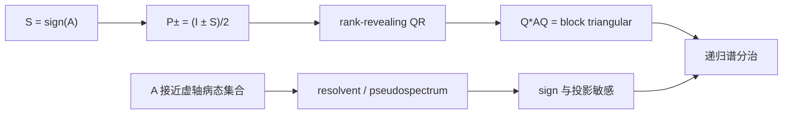

# Using the Matrix Sign Function to Compute Invariant Subspaces

> [!abstract] 来源定位
> 这篇论文把 matrix sign 从函数公式推进到谱分治算法：用 $P_\pm=(I\pm S)/2$ 提取左右半平面不变子空间，再递归求谱。更重要的是，它明确研究了虚轴伪谱距离、非正规条件性、Newton 中间矩阵和计算不变子空间的后向误差，是本章“点谱不够”的主要原始来源。

## 元数据

- Zhaojun Bai and James Demmel, 1998。
- *SIAM Journal on Matrix Analysis and Applications*, 19(1), 205–225。
- 公开 PDF：[UC Davis 作者页](https://www.cs.ucdavis.edu/~bai/publications/baidemmel98.pdf)。

## 问题链

## 核心断言

| ID | 断言 | 类型 | 边界 | 纳入位置 |
|---|---|---|---|---|
| BD1 | $P_\pm=(I\pm\operatorname{sign}(A))/2$ | 经典结构 | 无虚轴谱 | 正文第七节 |
| BD2 | $P_+$ 的像可经 QR 得到右半平面不变子空间基 | 算法 | 投影需足够准确 | 第八节 |
| BD3 | Newton sign 全球且最终二次 | 算法定理 | 精确算术、定义域 | 第十五节 |
| BD4 | 迭代中求逆病态可破坏有限精度行为 | 数值风险 | 高非正规/近边界 | 第十六/二十三节 |
| BD5 | 病态集合是具有虚轴特征值的矩阵 | 条件性定义 | 标准 sign | 第二十二节 |
| BD6 | $d_A=\min_\tau\sigma_{\min}(\mathrm i\tau I-A)$ | 距离刻画 | 2-范数 | 第二十二节 |
| BD7 | 投影条件性还受 Sylvester separation 和斜度影响 | 扰动理论 | 非正规谱块 | 第二十节 |

## 最重要的解释

### 点谱距离与矩阵距离不同

对正规矩阵，虚轴 resolvent 距离等于最小 $|\operatorname{Re}\lambda_i|$。对非正规矩阵，

$$
d_A
=\min_{\tau\in\mathbb R}\sigma_{\min}(\mathrm i\tau I-A)
$$

可能远小于点谱几何距离；即很小扰动即可使伪谱碰到虚轴。

### 投影才是谱分治的数值核心

即使 $S^2\approx I$，若得到的 $P_+$ 误差大或秩判断错误，提取的子空间也可能不稳定。验收应落到

$$
(I-Q_+Q_+^*)AQ_+
$$

的后向残差，而不能只看 sign 迭代变化。

## 与本章实验的关系

[[实验 - 矩阵符号函数的谱分割与非正规敏感性]]使用

$$
A_{\delta,t}=\begin{bmatrix}\delta&t\\0&-\delta\end{bmatrix}
$$

给出一个比论文一般界更初学者友好的闭式族：点谱固定，斜投影、sign 范数和方向导数仍无界。实验不是复刻论文数值表，而是验证其条件性主旨。

## 限制与使用纪律

- 论文面向并行非对称特征问题，其具体硬件讨论有年代背景；谱投影和条件性结论仍是基础理论。
- 最坏情况界可很悲观；不能把“存在病态例子”写成“所有实际矩阵都病态”。
- 论文自身也区分 Newton sign 的函数值精度和最终不变子空间后向稳定性；知识节点保持这一区分。
- 当前课程不展开 regular matrix pencil 的 deflating-subspace 扩展，只在开放问题中保留入口。

## 视觉与文本核验

- 已检查定义、谱投影、Newton、虚轴距离、Sylvester separation 与后向稳定性关键页；
- PDF 关键页已渲染目视核验；
- 论文只用于定理和算法证据，不把历史性能结果外推到现代 GPU。

## 生成节点

- [x] [[矩阵符号函数]]
- [x] [[实验 - 矩阵符号函数的谱分割与非正规敏感性]]
- [ ] 数值秩与伪谱专题
- [ ] 大规模 rational/contour spectral projector 实验

