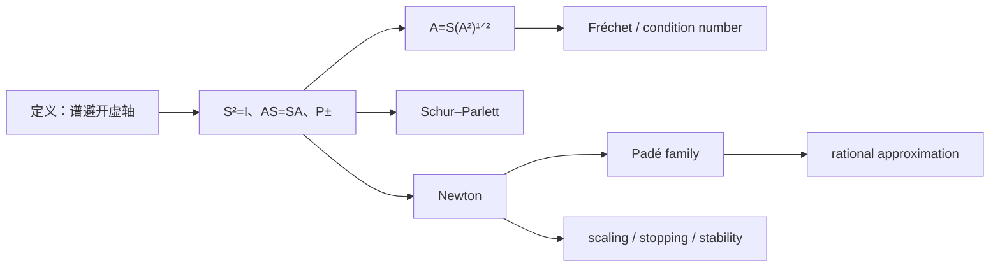

# Functions of Matrices 第 5 章：Matrix Sign Function

> [!abstract] 来源定位
> 这是本知识库经典矩阵 sign 的规范主来源。章节从虚轴外的复标量 sign 出发，给出 Jordan、主平方根和积分表示，继而系统处理 sign 分解、Fréchet 条件数、Schur 方法、Newton/Padé 迭代、缩放、停止准则、稳定性与 rational approximation。正文中的标准定义与经典定理以此为准。

## 元数据

- 作者：Nicholas J. Higham。
- 书名：*Functions of Matrices: Theory and Computation*。
- 出版：SIAM，2008。
- 章节：Chapter 5, Matrix Sign Function。
- 公开副本：[MIMS EPrint PDF](https://eprints.maths.manchester.ac.uk/1067/1/OT104HighamChapter5.pdf)。

## 结构摘要

## 核心断言

| ID | 断言 | 类型 | 条件 | 纳入位置 |
|---|---|---|---|---|
| H1 | $\operatorname{sign}(A)=A(A^2)^{-1/2}$ | 经典定理 | $A$ 无虚轴谱 | [[矩阵符号函数]]第四节 |
| H2 | $S^2=I$、$AS=SA$ | 经典定理 | 同上 | 第五节 |
| H3 | $(I\pm S)/2$ 为半平面谱投影 | 经典定理 | 同上 | 第七节 |
| H4 | block sign 可产生平方根 | 经典定理 | 相关乘积避开闭负实轴 | 第十节 |
| H5 | $A=S(A^2)^{1/2}$ | 经典分解 | 同上 | 第九节 |
| H6 | $NL+LN=E-SES$ | Fréchet 定理 | 同上 | 第十九节 |
| H7 | Schur 方法稳定但昂贵 | 数值方法 | 稠密方阵 | 第十八/二十三节 |
| H8 | Newton 全球且最终二次收敛 | 数值定理 | 无虚轴谱 | 第十五节 |
| H9 | Cayley 矩阵误差每步平方 | 收敛恒等式 | Newton 迭代 | 第十五节 |
| H10 | sign Newton–Schulz 用 $X^2$ | 算法区分 | 局部吸引域 | 第十七节 |

## 独立核验重点

### Jordan 导数为零

sign 在每个开半平面内是常数，因此 Jordan 块公式中的高阶导数全部消失。这一事实同时解释：

- 同半平面 Jordan 块映成 $\pm I$；
- $S$ 即使来自缺陷矩阵也可对角化；
- 全部谱在同侧时 Fréchet 导数为零。

### 导数的两种形式

来源给出

$$
NL+LN=E-SES,
\qquad N=(A^2)^{1/2}.
$$

知识节点还从 $S^2=I$、$AS=SA$ 独立推导

$$
SL+LS=0,
\qquad
AL-LA=SE-ES,
$$

并在谱分割坐标中化成跨块 Sylvester 方程。

### Newton 的分支

来源使用

$$
X_{k+1}=\frac12(X_k+X_k^{-1}),
$$

而 polar factor 使用 $X_k^{-*}$。知识节点将这一星号差异作为强制边界。

## 限制与使用纪律

- 章节默认标准经典 sign，不包含“零映到零”的伪逆扩展。
- 书中部分算法细节面向稠密矩阵；大规模稀疏 action 需要其他来源补充。
- Zolotarev 逼近主要服务 Hermitian sign 和特定谱区间，本轮只保留地图。
- “sign iteration 稳定”必须连同问题条件性理解；若 $\|S\|$ 或 Fréchet 导数巨大，任何算法的可达相对精度都受限。

## 视觉与文本核验

- 已抽取全章文本并检查定义、block theorem、Fréchet、Schur、Newton、Padé、停止准则关键页；
- 已渲染并目视检查原 PDF 关键页，公式排版无错位；
- 未复制章节长段落，知识节点只保存独立重写、推导和少量公式。

## 生成节点

- [x] [[矩阵符号函数]]
- [x] [[习题 - 矩阵符号函数]]
- [x] [[解答 - 矩阵符号函数]]
- [x] [[实验 - 矩阵符号函数的谱分割与非正规敏感性]]
