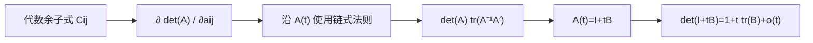

# 行列式的导数

> [!abstract] 来源定位
> 文章以行列式对单个元素的代数余子式偏导为起点，把元素级链式法则整理为迹表达，并得到 $\det(I+tA)=1+t\operatorname{tr}(A)+o(t)$。它适合作为“trace 是单位阵处体积的一阶变化”的直观入口；一般 Fréchet 导数、奇异矩阵、log-det、数值稳定性和 AI 概率模型需要由教材与原始论文补齐。

## 纳入判定

- 范围角色：`bridge`；
- 年代角色：`classical-exposition`；
- 纳入理由：直接连接行列式、代数余子式、矩阵微分与 trace，一步通向 Gaussian、变量换元和正规化流中的 log-det；
- 核心调用者：[[全微分与 Fréchet 导数]]、[[行列式、log-det 与迹的导数]]。

## 元数据

- 正式引用：苏剑林，2014-02-28，《行列式的导数》；
- 原始页面：[https://spaces.ac.cn/archives/2383](https://spaces.ac.cn/archives/2383)；
- 页面主题：矩阵元素随标量变化时的行列式导数、迹表示与单位阵附近的一阶展开；
- 本地保存范围：只保存独立结构摘要、公式核验与证据边界，不复制原文。

## 结构摘要

## 核心断言与核验

| ID | 断言 | 隐含条件 | 课程判断 |
|---|---|---|---|
| C1 | $\partial\det A/\partial a_{ij}=C_{ij}$ | 方阵；$C_{ij}$ 是代数余子式 | 成立，来自行列式对行/列的多线性 |
| C2 | 沿曲线 $A(t)$，导数是各余子式与 $a'_{ij}(t)$ 的求和 | $A(t)$ 元素可微 | 成立，是有限维链式法则 |
| C3 | $\frac d{dt}\det A=\det A\operatorname{tr}(A^{-1}A')$ | $A(t)$ 在该点可逆 | 有条件成立；奇异点应用 adjugate 通式 |
| C4 | $\left.\frac d{dt}\det(I+tB)\right|_{t=0}=\operatorname{tr}B$ | 任意方阵 $B$ | 成立，不要求 $B$ 可逆 |
| C5 | $\det(I+tB)\approx1+t\operatorname{tr}B$ | $t\to0$；只是一阶近似 | 成立；误差阶和邻域需另行量化 |

## 课程采用的统一推导

记余子式矩阵为 $C=(C_{ij})$，adjugate 为

$$
\operatorname{adj}(A)=C^\top.
$$

对任意方向 $E$：

$$
\begin{aligned}
D\det(A)[E]
&=\sum_{i,j}C_{ij}E_{ij}\\
&=\operatorname{tr}(C^\top E)\\
&=\operatorname{tr}(\operatorname{adj}(A)E).
\end{aligned}
$$

这条 adjugate 形式对奇异矩阵仍成立。只有当 $A$ 可逆时，才继续用

$$
\operatorname{adj}(A)=\det(A)A^{-1}
$$

得到

$$
D\det(A)[E]
=\det(A)\operatorname{tr}(A^{-1}E).
$$

再取 $A=I$ 即得

$$
D\det(I)[E]=\operatorname{tr}E.
$$

## 需要补齐的四层内容

### 1. 类型层

原问题沿标量曲线 $A(t)$ 讨论；课程进一步把导数写成从矩阵方向 $E$ 到标量的 Fréchet 线性泛函，并由 Frobenius 配对识别梯度：

$$
\nabla_A\det A=\operatorname{adj}(A)^\top.
$$

### 2. 奇异层

det 是元素多项式，所以奇异矩阵处仍光滑；只是 $A^{-1}$ 不存在。若 $\operatorname{rank}(A)\le n-2$，则所有 $(n-1)$ 阶余子式为零，一阶导数整体为零。

### 3. 数值层

AI 与统计计算通常需要 $\log|\det A|$，应通过 Cholesky 或带主元 LU 的对角对数计算，不能先形成 det 再取 log，也不能为了公式中的 $A^{-1}$ 显式求逆。

### 4. AI 层

- Gaussian：$\frac12\log\det\Sigma+\frac12r^\top\Sigma^{-1}r$；
- 正规化流：$\log p_X=\log p_Z+\log|\det J_f|$；
- 连续流/大规模模型：Jacobian trace 与随机迹估计；
- 正定优化：$-\log\det X$ 是正定锥的 barrier。

## 限制与保留意见

- 含 $A^{-1}$ 的 Jacobi 公式必须附可逆条件；不能用它判断奇异点“不可微”；
- 一阶近似中的“充分小”需要由余项、矩阵范数和问题尺度量化；
- $\log\det A$、$\log|\det A|$ 与复对数不是同一对象；
- 文章是优秀的问题入口，但不承担数值稳定性、隐函数正则性或概率换元定理的全部证据；
- 评论区未作为定理证据。

## 交叉验证方向

- Magnus & Neudecker, *Matrix Differential Calculus*：矩阵微分与统计应用；
- Petersen & Pedersen, *The Matrix Cookbook*：公式核对；
- Higham, *Functions of Matrices*：矩阵对数和 Fréchet 导数；
- [[Cholesky 分解]]与[[逆矩阵、线性求解与隐式微分]]：稳定计算与 inverse/solve 的区别。

## 已生成与后续调用

- [x] [[全微分与 Fréchet 导数]]：矩阵方向与一阶线性化；
- [x] [[矩阵微分、迹技巧与布局约定]]：Frobenius 配对与迹技巧；
- [x] [[行列式、log-det 与迹的导数]]：Jacobi、奇异边界、Gaussian 与 flow；
- [ ] [[多重积分、换元公式与积分变换]]：体积因子和密度换元的完整证明。
