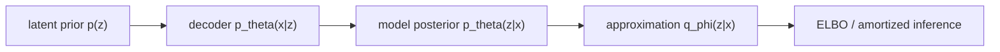

# 变分自编码器（二）：从贝叶斯观点出发

> [!abstract] 来源定位
> 文章从 Bayesian latent-variable model 重新解释 VAE 的编码分布、生成分布与参数学习。课程采用它连接 posterior inference、近似 posterior 和 AI 生成模型，但不把 VAE 的变分分布误称为精确 posterior，也不把参数点估计误称为 Bayesian neural-network weight posterior。

## 元数据与纳入

- 正式引用：苏剑林，2018-03-28，《变分自编码器（二）：从贝叶斯观点出发》；
- 页面：[https://spaces.ac.cn/archives/5343](https://spaces.ac.cn/archives/5343)；
- 范围角色：`core`，年代角色：`classical-exposition`；
- 当前调用者：[[Bayesian 推断与后验预测]]；后续调用者：10.6 的 KL、ELBO 与变分推断节点。

## 课程采用的对象图

对 latent-variable model：

$$
p_\theta(x,z)=p(z)p_\theta(x\mid z),
$$

$$
p_\theta(z\mid x)
=\frac{p_\theta(x\mid z)p(z)}{p_\theta(x)}.
$$

当 evidence $p_\theta(x)$ 难算时，引入 $q_\phi(z\mid x)$ 做 approximate/amortized inference。课程始终按对象角色辨认 prior、likelihood、model posterior 与 inference network，不依赖某篇文章采用的字母习惯。

## 核心断言与课程判断

| ID | 断言 | 条件/边界 | 当前判断 |
|---|---|---|---|
| C1 | VAE 可以放进 latent-variable Bayesian 条件化框架 | 必须写清 $p(z),p_\theta(x\mid z)$ | 成立 |
| C2 | 编码器分布承担难算 model posterior 的近似 | variational family 与 optimization 会引入 gap | 成立，须保留 approximate 一词 |
| C3 | 随机潜变量把不确定性传播到生成结果 | 只覆盖已声明模型/近似中的不确定性 | 成立 |
| C4 | 训练出的 decoder/encoder 就构成完整 Bayesian parameter inference | 常规 VAE 多对 $\theta,\phi$ 做点估计 | 不成立，需与 BNN 分层 |

## 与本课程 Bayesian 章的接口

- 用 joint–evidence–posterior–predictive 五对象检查 VAE 记号；
- 说明 latent posterior uncertainty 与 global weight uncertainty 不同；
- 用 prior predictive 检查 latent scale，用 posterior predictive 检查 reconstruction/generation discrepancy；
- 将 ELBO、amortization gap、posterior collapse 留在信息论/变分推断节点详细闭环；
- 任何 VAE 的校准结论都还要经过 held-out evaluation，不能由 ELBO 单独推出。

## 限制与正式证据

- conjugacy、Bayes decision、credible interval、Bernstein–von Mises 和 posterior predictive checking 的正式结论由统计教材、MIT 18.655、Gelman 等来源承担；
- ELBO 的恒等分解、重参数梯度与原始方法归属回到 Kingma–Welling、Rezende 等论文；
- 博客负责 AI 问题入口和解释桥梁，不承担一般 Bayesian theorem 的唯一证据。

## 已生成与后续调用

- [x] [[Bayesian 推断与后验预测]]：VAE latent posterior、近似层与 weight uncertainty 边界；
- [x] [[变分推断、ELBO 与证据分解]]：posterior approximation、ELBO identity 与 amortization gap；
- [ ] 生成模型专题：posterior collapse、amortization 与 hierarchical latent models。
