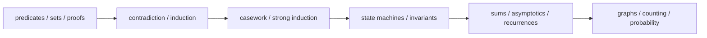

# Mathematics for Computer Science：Predicates、Sets 与 Proofs

> [!abstract] 来源定位
> MIT 6.1200J 是10.1的正式课程骨架。2024课程把predicates、sets与proofs放在Lecture 01，把contradiction/induction、casework/strong induction、sums/asymptotics和recurrences依次展开；配套Lehman–Leighton–Meyer教材、lecture notes、warm-up和problem sets。它承担定义、证明训练与课程顺序，不直接承担本库的AI迁移结论。

## 纳入判定

- 范围角色：`core`
- 年代角色：`foundational`
- 判定理由：与MATH-01—05/08范围高度重合，且提供正式课程、开放教材、讲义与题目链；适合作为初学者proof课程主干。

## 元数据

- 课程主页：[MIT 6.1200J, Spring 2024](https://ocw.mit.edu/courses/6-1200j-mathematics-for-computer-science-spring-2024/)
- 阅读顺序：[Readings](https://ocw.mit.edu/courses/6-1200j-mathematics-for-computer-science-spring-2024/pages/readings/)
- 教材：Eric Lehman, F. Thomson Leighton, Albert Meyer, *Mathematics for Computer Science*
- 课程教师：Erik Demaine、Zachary Abel、Brynmor Chapman
- 许可：课程页说明教材以CC BY-SA提供；具体附件遵循各自声明。

## 结构摘要

Unit 1先建立proposition、predicate、set和proof；Unit 2把sums、asymptotics和recurrences用于algorithm analysis；后续再进入number theory、graphs、counting与probability。本库10.1提取所有AI数学卷共同需要的语言，不照搬完整离散数学范围。

## 核心断言

| ID | 断言 | 类型 | 证据位置 | 当前用途 |
|---|---|---|---|---|
| C1 | Predicates、sets与proofs应在同一初始单元训练 | 课程结构 | Readings Lecture 01 | MATH-01/02/03依赖顺序 |
| C2 | Contradiction与induction建立在逻辑/证明语言之后 | 课程结构 | Readings Lecture 02 | MATH-03/05 |
| C3 | Ordinary/strong induction、state machines、sums与recurrences构成algorithm correctness/analysis基础 | Lecture 2–7 | Lecture notes | MATH-05/08 |
| C4 | Relation是Cartesian product的subset；total function、injective/surjective与equivalence relation可由箭头性质组织 | Lecture 15 | Lecture 15 pp. 1–4 | MATH-04 |
| C5 | Counting与probability建立在sets/relations/proof之上 | 课程结构 | Readings Unit 5/6 | 10.1到概率卷的接口 |
| C6 | $O,\Omega,\Theta$用统一常数与充分大阈值比较函数增长 | 正式定义 | Lecture 06 | MATH-08 |
| C7 | Divide-and-conquer recurrence可由展开、递归树与Master theorem分析 | 正式方法 | Lecture 07 | MATH-08 |

## 值得保留的方法

1. 先把natural-language claim翻成predicate与quantifier；
2. 以membership condition证明set identity；
3. 将proof拆成assumptions、goal与legal inference；
4. 用warm-up/problem set反复诊断，而非只阅读范例；
5. 把induction、invariant与recurrence连接到algorithm/state evolution。

## 限制与保留意见

- 课程覆盖graph theory、number theory与discrete probability，但本库不把这些全部纳入10.1核心；
- 本库增加dataset、tensor index、hypothesis class和data leakage等AI对象审计，它们是课程知识的迁移，不是MIT原课程的直接结论；
- Finite examples帮助发现错误，不能替代对任意set/domain的proof；
- 教材/课程的符号约定可能与其他数学卷不同，例如 $\mathbb N$ 起点和proper-subset记号，使用时必须局部声明。

## 需要生成或更新的节点

- [x] MOC：[[数学语言、逻辑与证明 MOC]]
- [x] 概念：[[集合、元素与集合运算]]
- [x] 概念：[[命题、量词与逻辑等价]]
- [x] 概念：[[必要条件、充分条件与证明方法]]
- [x] 概念：[[函数、映射、关系与等价类]]
- [x] 概念：[[数学归纳、递归与组合计数]]
- [x] 概念：[[渐近记号、增长率与复杂度]]
