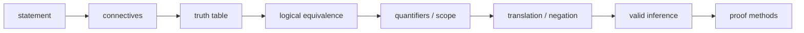

# Book of Proof：Logic

> [!abstract] 来源定位
> Richard Hammack的开放证明教材把sets、logic、proof methods、disproof、induction、relations与functions组成连续的初学者课程。其Logic章依次覆盖statements、connectives、conditional/biconditional、truth tables、logical equivalence、quantifiers、自然语言翻译、negation与inference，适合作为MATH-02的细粒度书写骨架。

## 纳入判定

- 范围角色：`core`
- 年代角色：`foundational`
- 判定理由：章节粒度与本库“从零起步、定义—翻译—反例—证明义务”要求高度一致；作者提供免费PDF并持续勘误。

## 元数据

- 作者主页：[Book of Proof](https://richardhammack.github.io/BookOfProof/index.html)
- 免费PDF：[Main.pdf](https://richardhammack.github.io/BookOfProof/Main.pdf)
- 当前页面标注版本：Edition 3.4，2025-02-05修订
- Logic章节：2.1 statements到2.12 logical inference/note
- 许可：作者页标注Creative Commons BY-NC-ND；本库只做摘要、转述与短公式引用，不复制大段正文。

## 结构摘要

## 核心断言

| ID | 断言 | 类型 | 证据位置 | 当前用途 |
|---|---|---|---|---|
| H1 | Statement与open sentence/predicate必须区分 | 教材定义 | §2.1、§2.7 | MATH-02对象合同 |
| H2 | Connectives由truth conditions定义，logical equivalence可用truth table核对 | 教材定义/方法 | §2.2—2.6 | implication、De Morgan、contrapositive |
| H3 | Universal/existential quantifiers绑定变量并具有明确scope | 教材定义 | §2.7 | free/bound变量与restricted quantifier |
| H4 | 英语到符号、符号到英语和negation应分开训练 | 教学方法 | §2.9—2.10 | 量词否定与条件句纠错 |
| H5 | Truth-preserving inference pattern是proof writing的局部合法性基础 | 教材方法 | §2.11 | entailment与fallacy入口 |

## 本库采用的教学动作

1. 每个symbol先声明domain，再判断formula是否closed；
2. 先用truth table确认有限propositional equivalence，再给algebraic rewrite；
3. 把restricted quantifier展开成implication/conjunction，显式处理empty domain；
4. 用quantifier negation生成counterexample obligation；
5. 将mixed quantifiers解释成witness依赖/game order；
6. 将自然语言中的“if / only if / unless / not all”逐一形式化。

## 限制与保留意见

- 本书是proof入门教材，不承担AI generalization、robustness或randomized algorithm结论；这些是本库的迁移层；
- 本章采用classical bivalent semantics，不把fuzzy truth、probability、modal/temporal logic混入基础定义；
- Truth-table verification只直接处理finite propositional variables；含infinite domain的first-order statement仍需一般证明；
- 本库的uniform/pointwise quantifier接口还需由分析、概率和学习理论节点补全条件。

## 需要生成或更新的节点

- [x] 概念：[[命题、量词与逻辑等价]]
- [ ] 概念：[[必要条件、充分条件与证明方法]]
- [ ] 概念：[[函数、映射、关系与等价类]]

## 版权与引用边界

本卡只记录章节结构、定义角色与教学用途；正文使用本库自行构造的例子、AI迁移与图示。若需要逐字引用，必须回到作者PDF核对版本和页码，并遵守单一来源短引文限制。
